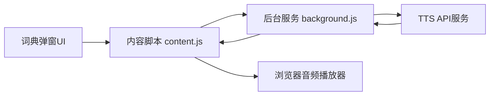
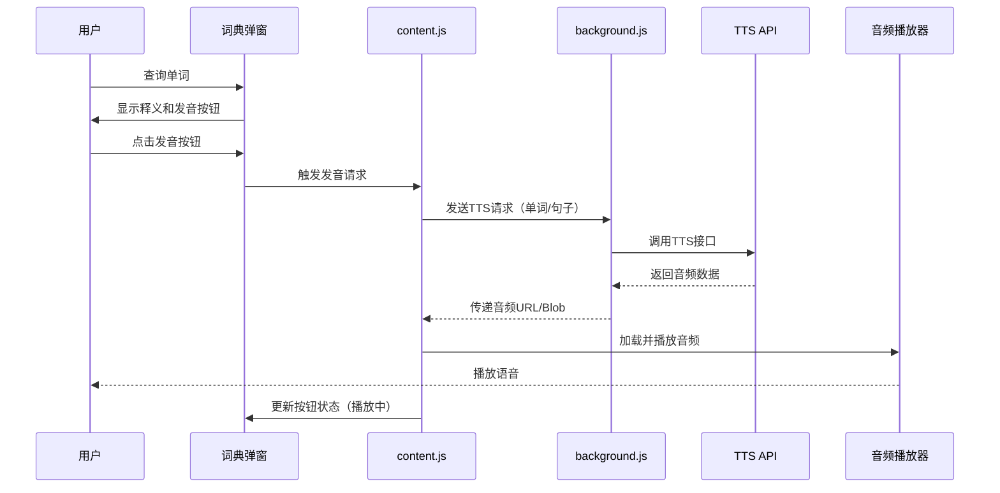
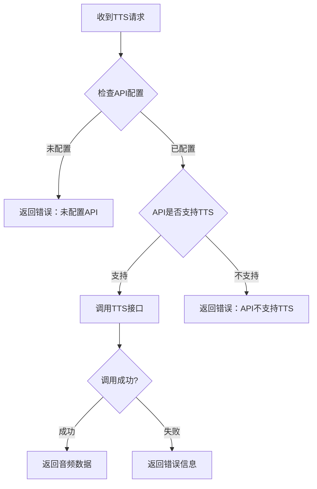
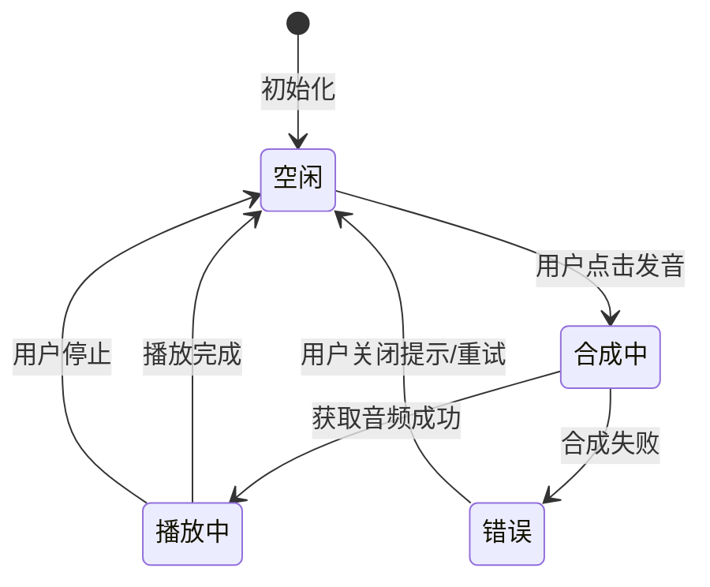

# 词典模式语音合成功能设计文档

## 一、功能概述

在词典模式下为单词和上下文句子添加语音朗读功能，使用大模型的TTS（Text-to-Speech）服务进行语音合成。该功能采用手动触发机制，仅在用户主动点击发音按钮后执行语音合成。

## 二、设计目标

### 2.1 核心目标

- 为词典模式添加单词和句子的语音播放能力
- 采用大模型TTS服务实现高质量语音合成
- 支持单词发音和上下文句子发音
- 用户主动触发，避免自动播放干扰

### 2.2 用户价值

- 提升词典查询体验，帮助用户掌握正确发音
- 通过上下文句子朗读，辅助理解单词在句子中的实际应用
- 支持听力学习场景，增强多感官学习效果

## 三、功能边界

### 3.1 范围内

- 词典模式下的单词发音
- 词典模式下的上下文句子发音（若存在上下文）
- 手动触发语音合成
- 使用大模型TTS API生成语音
- 语音播放控制（播放/停止）
- 语音合成加载状态反馈

### 3.2 范围外

- 翻译模式不支持语音播放
- 不提供离线语音合成能力
- 不支持语音速度、音调调节（由TTS服务能力决定）
- 不提供语音文件下载功能
- 不缓存已生成的语音数据

## 四、系统架构

### 4.1 整体架构



### 4.2 组件职责

| 组件 | 职责 |
|-----|------|
| 词典弹窗UI | 展示发音按钮，提供交互入口，显示播放状态 |
| content.js | 处理用户点击事件，管理音频播放状态，控制UI状态更新 |
| background.js | 调用TTS API，处理音频数据流，管理API配置 |
| TTS API服务 | 执行文本转语音合成，返回音频数据流 |
| 浏览器音频播放器 | 播放合成的语音音频 |

## 五、详细设计

### 5.1 用户交互流程



### 5.2 UI设计

#### 5.2.1 发音按钮布局

在词典弹窗中添加发音控制区域：

| 位置 | 组件 | 说明 |
|-----|------|------|
| 单词展示区右侧 | 单词发音按钮 | 用于播放当前查询单词的发音 |
| 上下文区域右侧 | 句子发音按钮 | 用于播放上下文句子的发音（仅在有上下文时显示） |

#### 5.2.2 按钮状态

| 状态 | 视觉呈现 | 说明 |
|-----|---------|------|
| 默认状态 | 显示扬声器图标 | 未播放，可点击 |
| 加载状态 | 显示加载动画 | 正在合成语音 |
| 播放状态 | 显示暂停图标或波形动画 | 正在播放语音 |
| 错误状态 | 显示错误提示 | 合成失败，显示错误图标 |

### 5.3 数据流设计

#### 5.3.1 TTS请求数据结构

```
发音请求
{
  action: 'text-to-speech'
  text: 待合成的文本（单词或句子）
  type: 'word' | 'sentence'  // 区分单词和句子
  language: 语言代码（如 'en'）
}
```

#### 5.3.2 TTS响应数据结构

```
成功响应
{
  success: true
  audioData: Base64编码的音频数据 或 Blob URL
  format: 'mp3' | 'wav'  // 音频格式
}

失败响应
{
  success: false
  errorMessage: 错误描述
  errorCode: 错误代码
}
```

### 5.4 API集成设计

#### 5.4.1 TTS服务选择策略

根据用户配置的API服务提供商，选择对应的TTS接口：

| API提供商 | TTS接口类型 | 备注 |
|----------|-----------|------|
| OpenAI兼容API | 遵循OpenAI TTS接口规范 | 如果API支持TTS |
| 降级方案 | 使用大模型生成发音指导 | 当TTS不可用时提示用户 |

#### 5.4.2 API调用流程



#### 5.4.3 OpenAI兼容TTS接口调用规范

```
请求端点示例
POST {apiEndpoint}/audio/speech

请求头
{
  'Authorization': 'Bearer {apiKey}'
  'Content-Type': 'application/json'
}

请求体
{
  model: 'tts-1'  // 可配置
  input: 待转换的文本
  voice: 'alloy'  // 音色（可配置）
  response_format: 'mp3'  // 音频格式
}

响应
二进制音频数据流（Content-Type: audio/mpeg）
```

### 5.5 配置管理设计

#### 5.5.1 新增配置项

在API配置中扩展TTS相关配置：

| 配置项 | 类型 | 默认值 | 说明 |
|-------|------|--------|------|
| enableTTS | Boolean | true | 是否启用TTS功能 |
| ttsModel | String | 'tts-1' | TTS模型名称 |
| ttsVoice | String | 'alloy' | 音色选择 |
| ttsFormat | String | 'mp3' | 音频格式 |

#### 5.5.2 配置界面扩展

在设置页面的API配置部分新增TTS配置区域：

- TTS功能开关（复选框）
- TTS模型输入框
- 音色选择下拉框（提供常见音色选项）
- 音频格式选择（MP3/WAV）

### 5.6 错误处理设计

#### 5.6.1 错误类型

| 错误代码 | 错误描述 | 用户提示 | 处理方式 |
|---------|---------|---------|---------|
| NO_API_CONFIG | 未配置API | 未配置API，请先配置 | 引导用户前往设置页面 |
| TTS_NOT_SUPPORTED | API不支持TTS | 当前API不支持语音合成 | 显示提示，建议更换API |
| TTS_API_ERROR | TTS调用失败 | 语音合成失败，请稍后重试 | 显示错误提示 |
| AUDIO_PLAY_ERROR | 音频播放失败 | 音频播放失败 | 显示错误提示 |
| NETWORK_ERROR | 网络错误 | 网络错误，请检查连接 | 提供重试选项 |

#### 5.6.2 容错机制

- TTS请求超时时间设置为30秒
- 播放失败时允许用户重新尝试
- API不支持TTS时禁用发音按钮

### 5.7 性能考虑

#### 5.7.1 优化策略

| 优化点 | 方案 | 预期效果 |
|-------|------|---------|
| 音频数据处理 | 使用流式传输或Blob URL | 减少内存占用 |
| 请求防抖 | 连续点击时取消前一次请求 | 避免重复请求 |
| 状态管理 | 播放中时禁用按钮 | 防止多次播放冲突 |

#### 5.7.2 资源管理

- 播放完成后释放音频资源
- 弹窗关闭时停止正在播放的音频
- 不缓存音频数据（由用户每次主动触发）

### 5.8 状态管理设计

#### 5.8.1 前端状态

在content.js中维护以下状态：

| 状态变量 | 类型 | 说明 |
|---------|------|------|
| currentAudio | Audio对象 | 当前正在播放的音频实例 |
| isSynthesizing | Boolean | 是否正在合成语音 |
| isPlaying | Boolean | 是否正在播放 |

#### 5.8.2 状态转换



## 六、实现步骤

### 6.1 第一阶段：基础功能

1. 在词典弹窗UI中添加发音按钮
2. 在content.js中实现点击事件处理
3. 在background.js中实现TTS API调用逻辑
4. 实现音频播放功能
5. 添加基本的加载状态反馈

### 6.2 第二阶段：配置与优化

1. 在设置页面添加TTS配置选项
2. 实现TTS配置的存储和读取
3. 添加完整的错误处理机制
4. 优化按钮状态展示
5. 实现播放控制（停止播放）

### 6.3 第三阶段：体验增强

1. 添加音频加载进度提示
2. 优化按钮动画效果
3. 添加音色选择功能
4. 实现API兼容性检测
5. 完善用户提示和引导

## 七、技术依赖

### 7.1 前端技术

- Web Audio API：音频播放控制
- Fetch API：音频数据获取
- Chrome Extension API：消息通信

### 7.2 后端服务

- OpenAI兼容TTS API：语音合成服务
- 支持TTS接口的大模型服务提供商

### 7.3 数据格式

- MP3/WAV：音频文件格式
- Base64/Blob：音频数据传输格式

## 八、非功能性需求

### 8.1 性能要求

- TTS请求响应时间：≤ 5秒（正常网络环境）
- 音频加载时间：≤ 2秒
- UI交互响应时间：≤ 100ms

### 8.2 兼容性要求

- 支持Chrome 88+版本
- 支持主流OpenAI兼容API服务
- 音频格式兼容主流浏览器

### 8.3 可用性要求

- 按钮状态清晰可见
- 错误提示明确具体
- 操作流程简单直观

## 九、风险与限制

### 9.1 技术风险

| 风险项 | 影响 | 应对措施 |
|-------|------|---------|
| API不支持TTS | 功能无法使用 | 提前检测API能力，提示用户 |
| 音频格式兼容性 | 部分浏览器无法播放 | 支持多种音频格式 |
| TTS调用成本 | 增加用户API费用 | 手动触发，用户可控 |

### 9.2 使用限制

- 依赖于API的TTS能力，非所有API均支持
- 需要网络连接才能使用
- 音频质量取决于TTS服务质量
- 不支持离线使用

### 9.3 成本考虑

- TTS调用会消耗API额度
- 音频数据传输会占用网络流量
- 建议在用户主动触发时才执行（已采纳）

## 十、验收标准

### 10.1 功能验收

- [ ] 词典弹窗显示单词发音按钮
- [ ] 有上下文时显示句子发音按钮
- [ ] 点击按钮能成功触发TTS请求
- [ ] 成功获取音频后能正常播放
- [ ] 播放时按钮状态正确显示
- [ ] 播放完成后状态恢复正常

### 10.2 异常验收

- [ ] 未配置API时显示友好提示
- [ ] TTS调用失败时显示错误信息
- [ ] 音频播放失败时显示错误提示
- [ ] 网络错误时提供重试选项

### 10.3 配置验收

- [ ] 设置页面显示TTS配置选项
- [ ] TTS配置能正常保存和读取
- [ ] 配置变更后立即生效

### 10.4 体验验收

- [ ] 按钮位置合理，不影响原有布局
- [ ] 加载状态有明确的视觉反馈
- [ ] 播放过程中可以停止
- [ ] 关闭弹窗时音频自动停止
