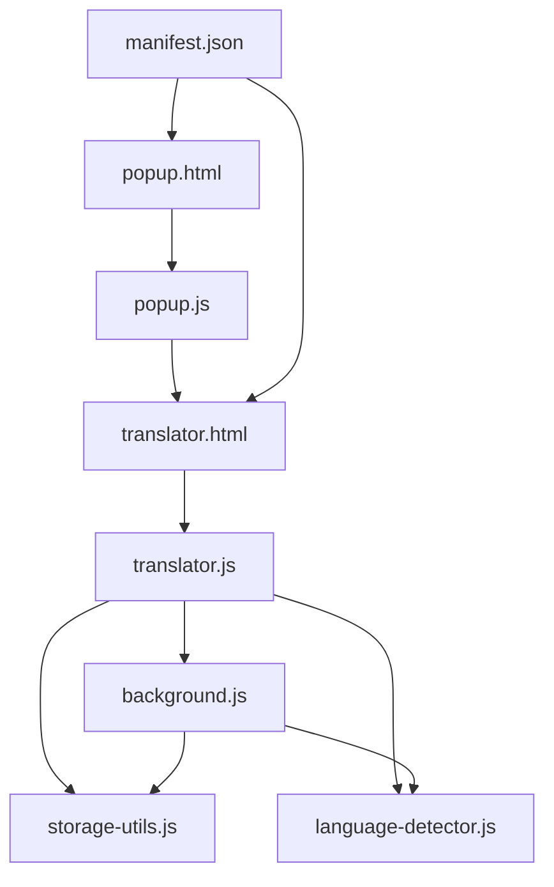
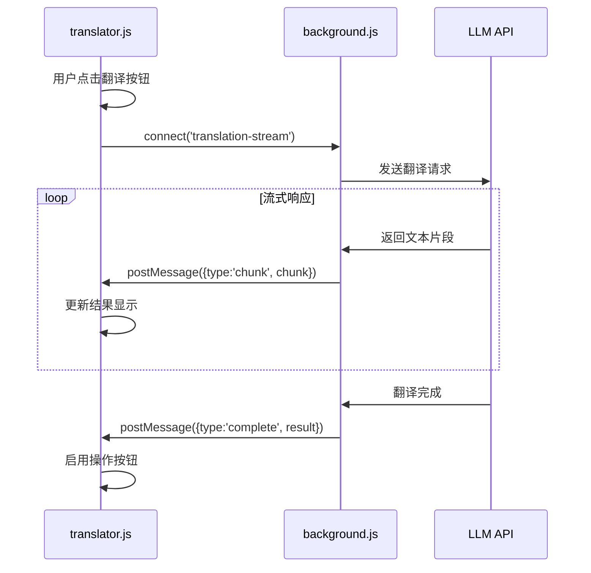
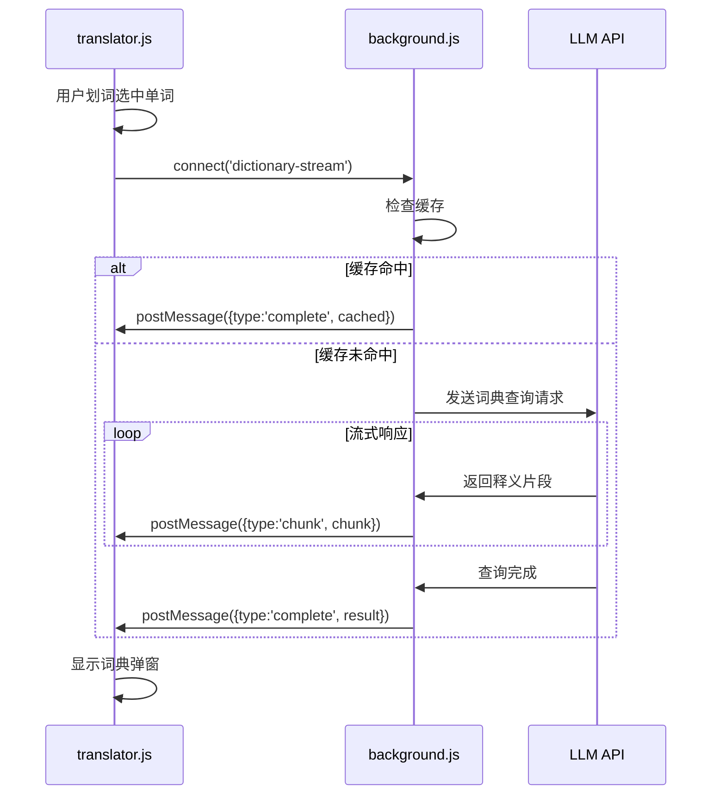
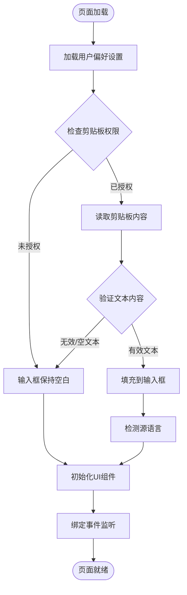
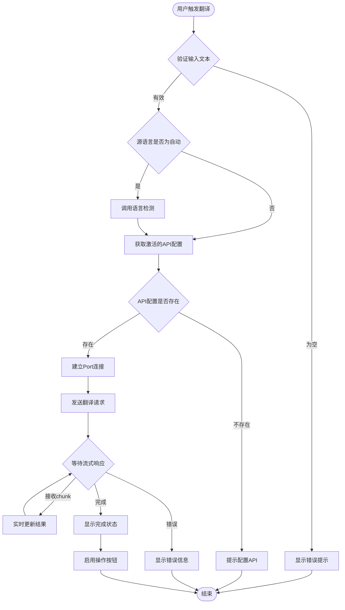
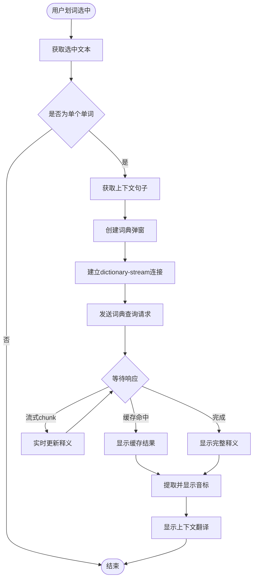

# 独立翻译页面功能设计

## 功能概述

本设计旨在为QuickTrans插件新增一个独立的翻译页面，该页面作为插件的独立功能入口，提供完整的翻译和词典查询服务。页面将复用现有的大模型API配置、词典功能及相关基础模块，为用户提供更灵活的使用场景。

## 设计目标

1. 提供独立的全功能翻译工作台，不依赖网页划词场景
2. 自动读取系统剪贴板内容作为默认输入，提升用户效率
3. 支持手动输入和编辑待翻译文本
4. 支持自由选择目标翻译语言
5. 复用插件现有的API配置、翻译服务和词典功能
6. 在输入区域内支持划词词典查询，提供即时释义

## 功能需求

### 页面入口

| 入口类型 | 触发方式 | 说明 |
|---------|---------|------|
| 插件Action按钮 | 点击插件图标弹出popup菜单 | popup菜单中新增"打开翻译页面"按钮 |
| 右键菜单 | 选中文本后右键菜单 | 新增"在翻译页面中打开"选项 |
| 快捷键 | 可配置的键盘快捷键 | 在manifest.json中定义命令快捷键 |

### 页面布局结构

页面采用上下分栏布局，包含以下核心区域：

```
┌─────────────────────────────────────────────────────────┐
│                      页面标题栏                          │
│  QuickTrans 翻译工作台                    [最小化] [×]   │
├─────────────────────────────────────────────────────────┤
│                     控制面板区域                          │
│  源语言：[自动检测 ▼]  →  目标语言：[中文 ▼]  [翻译按钮] │
├─────────────────────────────────────────────────────────┤
│                     输入文本区域                          │
│  ┌───────────────────────────────────────────────────┐  │
│  │  [待翻译文本输入框 - 多行文本域]                   │  │
│  │                                                    │  │
│  │  支持：                                            │  │
│  │  - 手动输入文本                                    │  │
│  │  - 页面加载时自动读取剪贴板                        │  │
│  │  - 划词选中后显示词典释义弹窗                      │  │
│  └───────────────────────────────────────────────────┘  │
│  [清空] [从剪贴板粘贴] [字数统计]                        │
├─────────────────────────────────────────────────────────┤
│                    翻译结果区域                          │
│  ┌───────────────────────────────────────────────────┐  │
│  │  [翻译结果显示框 - 只读]                           │  │
│  │                                                    │  │
│  │  - 流式输出翻译结果                                │  │
│  │  - 保持原文格式                                    │  │
│  └───────────────────────────────────────────────────┘  │
│  [复制译文] [重新翻译]                                   │
└─────────────────────────────────────────────────────────┘
```

### 核心功能模块

#### 剪贴板自动读取

**触发时机**：页面加载完成后

**执行流程**：

1. 页面初始化时调用浏览器剪贴板API读取内容
2. 检测剪贴板内容类型，仅处理文本类型
3. 验证文本长度，超过限制时提示用户
4. 将剪贴板文本自动填充到输入框
5. 如果剪贴板读取失败或为空，输入框保持空白状态

**权限要求**：需要在manifest.json中添加`clipboardRead`权限

#### 语言选择与检测

**源语言选择**：

- 默认选项：自动检测
- 手动选项：支持用户手动指定源语言
- 复用现有的`LanguageDetector`模块进行语言识别

**目标语言选择**：

- 默认值：读取用户偏好设置中的`lastTargetLanguage`
- 下拉列表：展示所有支持的目标语言
- 语言切换：选择变更后立即保存到用户偏好

#### 文本输入与编辑

**输入方式**：

- 自动填充：页面加载时从剪贴板读取
- 手动输入：用户直接在文本域中输入或编辑
- 粘贴按钮：点击按钮重新从剪贴板读取

**输入限制**：

- 文本长度限制：使用用户偏好中的`maxTextLength`设置
- 超出限制时显示警告提示，但不阻止输入
- 实时字数统计显示

#### 翻译功能

**触发方式**：

- 点击"翻译"按钮
- 快捷键触发（如Ctrl+Enter或Cmd+Enter）

**翻译流程**：

1. 验证输入文本是否为空
2. 检测源语言（如果设置为自动检测）
3. 获取当前激活的API配置
4. 建立流式连接到background服务
5. 实时显示翻译结果（流式输出）
6. 翻译完成后启用操作按钮

**翻译服务复用**：

- 使用background.js中的`TranslationService.translate()`方法
- 使用`chrome.runtime.connect()`建立Port连接实现流式翻译
- 复用现有的翻译缓存机制
- 复用现有的错误处理和重试机制

#### 划词词典功能

**功能描述**：在输入框内划词选中文本时，弹出词典释义窗口

**触发条件**：

- 在输入文本区域内选中文本
- 选中内容为单个英文单词（符合`isSingleWord`判断条件）
- 选中文本长度在2-50个字符之间

**实现方式**：

1. 监听输入框的`mouseup`事件
2. 获取选中文本和上下文句子
3. 判断是否为单个单词
4. 如果是单词，显示词典查询弹窗
5. 弹窗定位在选中文本附近，避免遮挡

**词典服务复用**：

- 使用background.js中的`dictionary-stream` Port连接
- 复用现有的词典查询系统提示词
- 复用词典结果格式化和Markdown渲染
- 复用音标提取和显示逻辑

**词典弹窗设计**：

```
┌──────────────────────────────────┐
│ 📖 词典                    [×]   │
├──────────────────────────────────┤
│ word  /wɜːd/  [🔊]               │
├──────────────────────────────────┤
│ ## 词典释义                       │
│ n. 单词；话语                     │
│ v. 措辞；用词表达                 │
│                                  │
│ ## 例句                          │
│ 1. A word to the wise...         │
├──────────────────────────────────┤
│ [复制释义]                        │
└──────────────────────────────────┘
```

#### 结果展示与操作

**显示特性**：

- 流式输出：翻译结果逐字显示
- 格式保持：保留原文的换行和段落结构
- 加载状态：显示加载动画和进度提示

**操作按钮**：

- 复制译文：将翻译结果复制到剪贴板
- 重新翻译：使用相同参数重新执行翻译
- 清空输入：清空输入框内容

## 技术架构

### 文件组织

```
QuickTrans/
├── manifest.json              # 新增clipboardRead权限和commands配置
├── translator.html            # 新建：独立翻译页面HTML
├── translator.js              # 新建：翻译页面逻辑脚本
├── translator.css             # 新建：翻译页面样式
├── popup.html                 # 修改：新增"打开翻译页面"入口
├── popup.js                   # 新建：popup页面逻辑
├── background.js              # 复用：翻译和词典服务
├── storage-utils.js           # 复用：配置和偏好管理
└── language-detector.js       # 复用：语言检测功能
```

### 模块依赖关系



### 页面与后台通信

#### 翻译服务通信流程



#### 词典查询通信流程



## 数据模型

### 页面状态数据

| 字段名 | 类型 | 说明 |
|--------|------|------|
| inputText | String | 输入框中的待翻译文本 |
| translatedText | String | 翻译结果文本 |
| sourceLanguage | String | 源语言代码（如'en', 'zh', 'auto'） |
| targetLanguage | String | 目标语言代码 |
| isTranslating | Boolean | 是否正在翻译中 |
| currentDictionaryWord | String | 当前查询的单词 |
| dictionaryResult | String | 词典查询结果 |

### 用户偏好设置复用

复用现有的`userPreferences`数据结构：

```
{
  lastTargetLanguage: 目标语言代码
  maxTextLength: 文本长度限制
  displayMode: 显示模式（独立页面新增'translator'模式）
}
```

### API配置复用

直接复用现有的API配置数据结构，无需新增字段。

## 业务流程

### 页面初始化流程



### 翻译执行流程



### 划词词典查询流程



## 界面交互设计

### 视觉风格

- 延续QuickTrans现有的设计语言
- 使用渐变色主题（#667eea → #764ba2）
- 现代化圆角设计（8px-16px）
- 柔和的阴影效果
- 流畅的过渡动画

### 响应式布局

| 视口宽度 | 布局调整 |
|---------|---------|
| > 1200px | 双栏布局，输入和结果左右分布 |
| 768px-1200px | 上下分栏，保持舒适间距 |
| < 768px | 单栏紧凑布局，垂直排列 |

### 交互反馈

| 操作 | 反馈方式 |
|------|---------|
| 翻译中 | 显示加载动画，结果区域流式显示文本 |
| 翻译完成 | 隐藏加载动画，显示完整结果 |
| 复制成功 | 按钮文字短暂变更为"已复制"，显示勾选图标 |
| 划词触发 | 选中区域高亮，词典弹窗淡入显示 |
| 错误提示 | 红色提示框，显示错误信息和操作建议 |

### 键盘快捷键

| 快捷键 | 功能 |
|--------|------|
| Ctrl/Cmd + Enter | 执行翻译 |
| Ctrl/Cmd + V | 从剪贴板粘贴 |
| Ctrl/Cmd + C | 复制译文（当焦点在结果区域） |
| Escape | 关闭词典弹窗 |

## 词典弹窗设计

### 弹窗结构

词典弹窗采用轻量级浮层设计，包含以下部分：

- 标题栏：显示"📖 词典"标识和关闭按钮
- 单词区域：显示单词、音标和发音按钮（如配置TTS）
- 上下文区域：显示原句和句子翻译（如有上下文）
- 释义区域：显示词性、释义、例句等
- 操作区域：复制释义按钮

### 弹窗定位策略

1. 优先显示在选中文本的右上方
2. 如果右侧空间不足，显示在左上方
3. 如果上方空间不足，显示在下方
4. 始终保持弹窗完整可见，不被视口边界裁剪

### 样式复用

- 复用现有的`content.css`中词典相关样式
- 适配独立页面的色彩主题
- 调整弹窗阴影和边框以适应页面背景

## 错误处理

### 剪贴板读取失败

**场景**：浏览器拒绝访问剪贴板或权限未授予

**处理方式**：

- 输入框显示提示文字："点击\"从剪贴板粘贴\"按钮或直接输入文本"
- 不阻止用户继续使用其他功能

### API配置缺失

**场景**：用户未配置任何翻译API

**处理方式**：

- 显示友好的提示信息："尚未配置翻译API"
- 提供"前往设置"按钮，点击打开options页面
- 翻译按钮置为禁用状态

### 翻译请求失败

**场景**：网络错误、API调用失败、超时等

**处理方式**：

- 在结果区域显示错误信息
- 根据错误类型提供不同的操作建议（重试、切换API、检查网络等）
- 复用background.js中的错误处理逻辑

### 文本长度超限

**场景**：输入文本超过用户设置的长度限制

**处理方式**：

- 显示警告提示："文本长度超过限制（当前XXX，限制XXX）"
- 允许用户继续翻译（由后端API决定是否处理）
- 提供"前往设置"链接调整限制

## 性能优化

### 剪贴板读取优化

- 使用异步API避免阻塞页面加载
- 设置合理的超时时间（3秒）
- 读取失败不影响页面其他功能初始化

### 翻译缓存复用

- 直接复用background.js中的翻译缓存机制
- 相同文本和目标语言的请求优先从缓存读取
- 显示缓存标识提示用户

### 流式输出优化

- 使用Port长连接减少通信开销
- 批量更新DOM，避免频繁重绘
- 大文本场景下限制更新频率（如每100ms更新一次）

### 词典弹窗优化

- 词典查询结果同样使用缓存机制
- 弹窗使用CSS动画，避免JavaScript动画开销
- 弹窗隐藏时销毁DOM节点释放内存

## 安全与隐私

### 剪贴板安全

- 仅在用户主动打开页面时读取剪贴板
- 不后台静默读取剪贴板内容
- 读取的内容仅在本地使用，不上传到第三方

### 数据隐私

- 所有翻译数据仅发送到用户配置的API端点
- 不收集或存储用户的翻译内容
- 缓存数据仅保存在本地浏览器存储

### 权限最小化

- 仅申请必要的`clipboardRead`权限
- 不申请全局剪贴板监听权限
- 用户可通过浏览器设置随时撤销权限

## 兼容性说明

### 浏览器支持

- Chrome/Edge：完整支持所有功能
- Firefox：需要适配Manifest V2语法差异
- Safari：剪贴板API行为可能有差异，需要适配

### 权限降级方案

如果浏览器不支持Clipboard API或用户拒绝授权：

- 提供手动粘贴按钮，引导用户使用Ctrl+V粘贴
- 显示友好的权限说明提示
- 其他功能不受影响，正常使用

## 扩展性设计

### 未来功能预留

- 翻译历史记录：保存最近的翻译记录供用户查看
- 多语言对照：同时翻译为多个目标语言
- 批量翻译：支持上传文件进行批量翻译
- 语音输入：集成Web Speech API进行语音识别输入
- 导出功能：将翻译结果导出为文本文件或PDF

### 接口扩展点

- 翻译服务接口：预留支持其他翻译引擎的扩展点
- 词典服务接口：支持接入第三方词典API
- 主题定制：支持用户自定义页面颜色主题

## 测试要点

### 功能测试

- 剪贴板读取功能在各种场景下的表现
- 语言检测准确性验证
- 翻译流式输出的流畅性
- 划词词典功能的触发准确性
- 各种错误场景的处理是否友好

### 兼容性测试

- 不同浏览器的权限授权流程
- 各浏览器的剪贴板API行为差异
- 不同操作系统下的表现

### 性能测试

- 大文本（5000+字符）翻译的性能
- 频繁划词查询的响应速度
- 内存占用情况
- 页面加载时间

### 用户体验测试

- 界面布局在不同屏幕尺寸下的适配
- 操作流程的直观性和易用性
- 错误提示的清晰度
- 快捷键的便捷性
