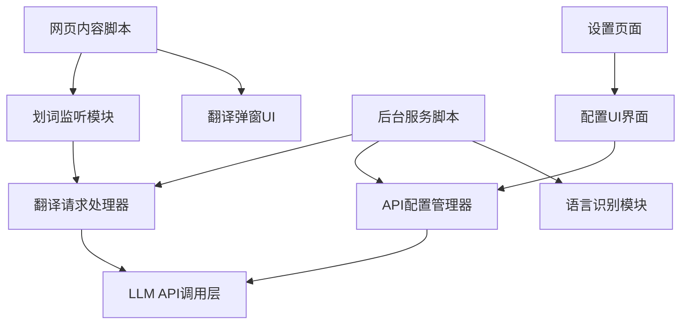
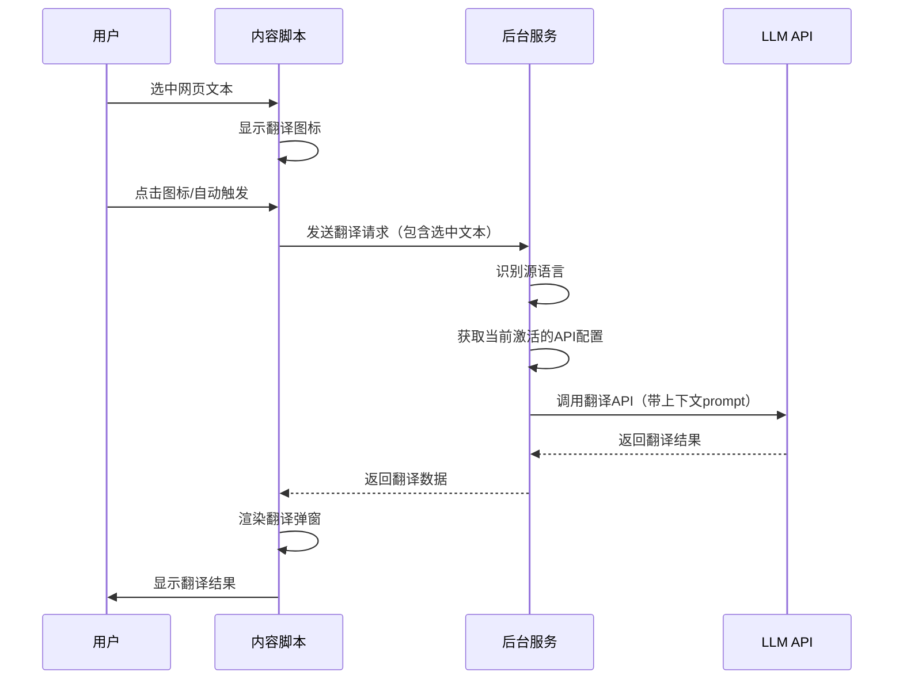
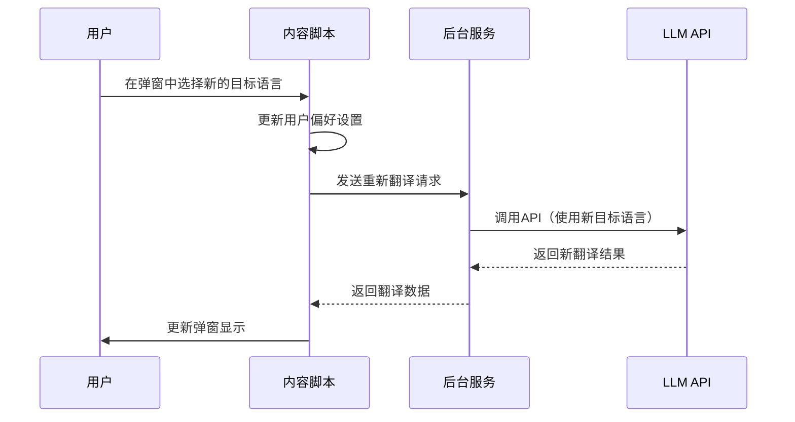
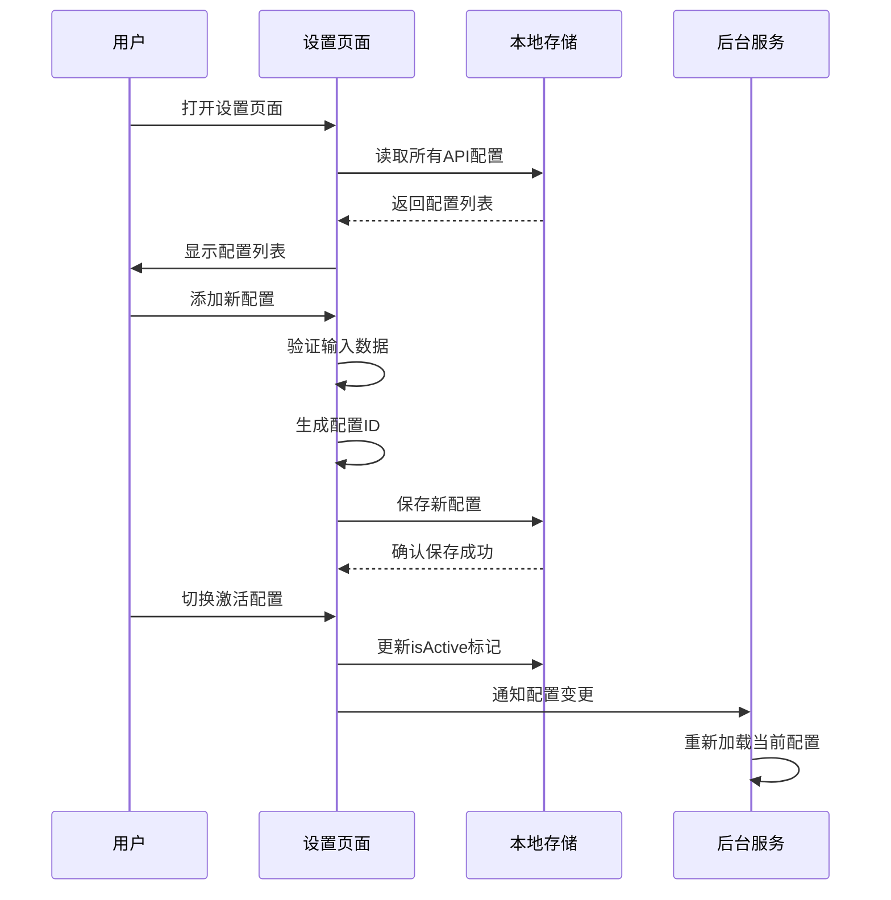

# Chrome划词翻译插件设计文档

## 项目概述

本项目旨在开发一个Chrome浏览器扩展插件，通过集成大语言模型API实现智能划词翻译功能。用户可以在任意网页上选中文本后，通过悬浮弹窗快速获取翻译结果。

### 核心价值
- 提供无缝的网页阅读辅助体验
- 支持多语言自动识别，减少用户操作步骤
- 灵活配置多个LLM服务，满足不同使用场景需求

## 功能需求

### 核心功能

#### 1. 划词翻译
- 用户在网页上选中文本后，自动触发翻译功能
- 在鼠标附近显示翻译图标或直接弹出翻译窗口
- 支持文本选中后的快速响应（响应时间目标：<500ms）

#### 2. 语言自动识别
- 系统自动检测选中文本的源语言类型
- 支持常见语言的识别（中文、英文、日文、韩文、法文、德文、西班牙文等）
- 识别结果在翻译弹窗中显示

#### 3. 目标语言选择
- 在翻译弹窗中提供目标语言下拉选择器
- 支持快速切换目标语言并重新翻译
- 记住用户最近使用的目标语言偏好

#### 4. 多API配置管理
- 支持添加多个OpenAI兼容协议的API配置
- 每个API配置包含：配置名称、API端点地址、API密钥
- 支持在配置列表中切换当前使用的API
- 支持配置的增删改查操作

### 辅助功能

#### 5. 插件设置页面
- 提供独立的设置页面管理API配置
- 配置数据持久化存储
- 提供配置验证功能（测试API连接）

#### 6. 用户体验优化
- 翻译加载时显示加载状态
- API调用失败时显示友好错误提示
- 支持复制翻译结果
- 支持关闭翻译弹窗（ESC键或点击外部区域）

## 系统架构设计

### 组件层次结构

### 核心模块说明

#### 内容脚本模块（Content Script）
- 职责：运行在网页上下文中，监听用户交互并显示翻译界面
- 关键功能：
  - 监听用户文本选中事件
  - 显示翻译触发图标
  - 渲染翻译结果弹窗
  - 管理弹窗生命周期

#### 后台服务模块（Background Service Worker）
- 职责：处理业务逻辑和API通信
- 关键功能：
  - 接收来自内容脚本的翻译请求
  - 调用语言识别功能
  - 发起LLM API请求
  - 管理API配置数据
  - 处理跨域请求

#### 设置页面模块（Options Page）
- 职责：提供用户配置界面
- 关键功能：
  - 展示所有API配置列表
  - 支持添加/编辑/删除配置
  - 标记当前激活的API配置
  - 提供API连接测试功能

## 数据模型设计

### API配置数据结构

| 字段名称 | 数据类型 | 说明 | 必填 |
|---------|---------|------|------|
| id | 字符串 | 配置唯一标识符（UUID） | 是 |
| name | 字符串 | 配置显示名称 | 是 |
| apiEndpoint | 字符串 | API端点URL（如：https://api.openai.com/v1/chat/completions） | 是 |
| apiKey | 字符串 | API访问密钥 | 是 |
| isActive | 布尔值 | 是否为当前激活配置 | 是 |
| createdAt | 时间戳 | 创建时间 | 是 |
| updatedAt | 时间戳 | 最后更新时间 | 是 |

### 用户偏好设置数据结构

| 字段名称 | 数据类型 | 说明 | 默认值 |
|---------|---------|------|--------|
| lastTargetLanguage | 字符串 | 最近使用的目标语言代码 | "zh" |
| autoShowPopup | 布尔值 | 选中文本后是否自动显示弹窗 | true |
| popupPosition | 字符串 | 弹窗位置偏好（near/center） | "near" |

### 翻译请求数据结构

| 字段名称 | 数据类型 | 说明 |
|---------|---------|------|
| text | 字符串 | 待翻译的文本内容 |
| sourceLanguage | 字符串 | 源语言代码（自动识别） |
| targetLanguage | 字符串 | 目标语言代码 |

### 翻译响应数据结构

| 字段名称 | 数据类型 | 说明 |
|---------|---------|------|
| translatedText | 字符串 | 翻译后的文本 |
| detectedLanguage | 字符串 | 检测到的源语言 |
| success | 布尔值 | 翻译是否成功 |
| errorMessage | 字符串 | 错误信息（失败时） |

## 业务流程设计

### 划词翻译主流程

### 切换目标语言流程

### API配置管理流程

## 交互设计

### 翻译弹窗界面结构

翻译弹窗应包含以下元素：

**顶部区域：**
- 源语言标签（自动识别结果，如"英语"）
- 箭头图标
- 目标语言下拉选择器
- 关闭按钮

**内容区域：**
- 原文显示区（可选，半透明背景）
- 翻译结果显示区（主要内容，清晰可读）

**底部操作区：**
- 复制按钮
- 加载状态指示器（翻译中显示）

### 设置页面界面结构

**页面标题区：**
- 插件名称和图标
- 页面说明文字

**API配置列表区：**
- 配置卡片列表（每个配置一个卡片）
- 每个卡片显示：配置名称、API端点、激活状态标记
- 卡片操作按钮：编辑、删除、设为激活

**配置表单区：**
- 配置名称输入框
- API端点URL输入框
- API密钥输入框（密码类型）
- 保存按钮
- 测试连接按钮
- 取消按钮

## 技术实现策略

### Chrome扩展清单配置要点

插件清单文件需声明以下权限和资源：

**必需权限：**
- storage：用于持久化API配置和用户偏好
- activeTab：访问当前活动标签页
- scripting：动态注入内容脚本（如需要）

**声明资源：**
- content_scripts：指定需要运行内容脚本的页面匹配模式
- background service_worker：声明后台服务文件
- options_page：声明设置页面HTML文件
- icons：插件图标资源

### 语言识别策略

采用混合识别方案以平衡准确性和性能：

**本地快速识别：**
- 通过字符Unicode范围进行初步判断
- 识别规则示例：
  - 中文：U+4E00 至 U+9FFF
  - 日文假名：U+3040 至 U+30FF
  - 韩文：U+AC00 至 U+D7AF
  - 其他默认为拉丁语系（英法德西等）

**LLM辅助识别：**
- 当本地识别不确定时，在翻译prompt中要求LLM返回检测到的语言
- 将检测结果缓存，优化后续相似文本识别

### LLM API调用规范

**请求格式：**
遵循OpenAI Chat Completions API格式，发送消息数组，包含系统提示和用户消息。

**系统提示设计：**
系统提示应明确指示LLM的角色为翻译助手，要求：
- 只返回翻译结果，不添加额外说明
- 保持原文的语气和风格
- 对于专业术语，提供准确翻译
- 识别并返回源语言类型

**用户消息格式：**
用户消息应包含明确的翻译指令，指定源文本和目标语言。

**错误处理：**
- 网络超时：设置合理超时时间（如10秒）
- API错误：解析错误响应并展示友好提示
- 配额超限：提示用户切换其他API配置
- 无效配置：引导用户前往设置页面

### 数据存储方案

使用Chrome Storage API进行数据持久化：

**storage.sync使用场景：**
- 用户偏好设置（目标语言偏好等）
- 在用户登录Chrome的多设备间同步

**storage.local使用场景：**
- API配置数据（包含敏感密钥，不应跨设备同步）
- 翻译历史缓存（可选功能）

**安全考虑：**
- API密钥虽存储在本地，但仍属于敏感数据，在界面显示时应脱敏处理
- 不应将配置数据暴露给网页上下文

## 性能与体验优化

### 性能优化策略

**响应速度优化：**
- 文本选中后立即显示翻译图标，无需等待API响应
- 使用防抖机制，避免用户快速划选时触发多次请求
- 缓存最近的翻译结果，相同文本直接返回缓存

**资源占用优化：**
- 内容脚本采用轻量级实现，最小化对网页性能的影响
- 翻译弹窗使用Shadow DOM隔离样式，避免与网页样式冲突
- 后台服务保持轻量运行，仅在需要时激活

### 用户体验优化

**视觉反馈：**
- 翻译加载中显示旋转动画或进度指示
- 翻译成功后平滑过渡显示结果
- 错误状态使用明显的视觉提示

**交互优化：**
- 支持键盘快捷操作（ESC关闭弹窗）
- 弹窗位置智能计算，避免超出视口边界
- 复制按钮点击后显示"已复制"提示

**容错处理：**
- API调用失败时提供重试选项
- 无可用API配置时引导用户完成初始设置
- 网络离线时显示友好提示

## 扩展性考虑

### 预留扩展点

**多模型支持：**
当前设计支持OpenAI协议，未来可扩展支持其他API协议（如Anthropic Claude、Google Gemini等），通过适配器模式实现。

**翻译历史：**
数据模型预留历史记录存储能力，可在后续版本中添加翻译历史查看功能。

**自定义prompt：**
可在API配置中增加自定义系统提示字段，允许用户调整翻译风格。

**批量翻译：**
架构支持扩展为批量翻译段落或整页翻译功能。

## 安全与隐私

### 数据安全

- API密钥仅存储在用户本地浏览器中，不上传至任何服务器
- 所有API调用直接从浏览器发起到用户配置的端点，插件不中转数据
- 用户翻译的内容仅发送至用户自行配置的LLM服务

### 权限最小化

- 仅请求必需的Chrome扩展权限
- 不请求访问所有网站数据的权限，仅在用户触发时访问选中文本
- 不收集用户行为数据或统计信息

## 验收标准

### 功能验收

- 在任意网页上选中文本后，能够正确触发翻译功能
- 系统能够准确识别至少5种常见语言（中、英、日、韩、法）
- 用户可以在翻译弹窗中切换目标语言并立即获得新翻译结果
- 用户可以在设置页面添加至少3个不同的API配置
- 切换激活的API配置后，翻译请求使用新的配置进行调用
- API调用失败时，显示明确的错误提示信息

### 性能验收

- 文本选中到翻译图标显示的时间 < 100ms
- API响应正常时，从点击到显示结果的时间 < 3秒（含网络延迟）
- 插件运行不影响网页正常交互和滚动性能

### 兼容性验收

- 支持Chrome最新版本及近两个大版本
- 翻译弹窗在不同分辨率和缩放比例下正常显示
- 与常见网站（新闻、文档、社交媒体等）无兼容性冲突- 翻译弹窗在不同分辨率和缩放比例下正常显示
- 与常见网站（新闻、文档、社交媒体等）无兼容性冲突