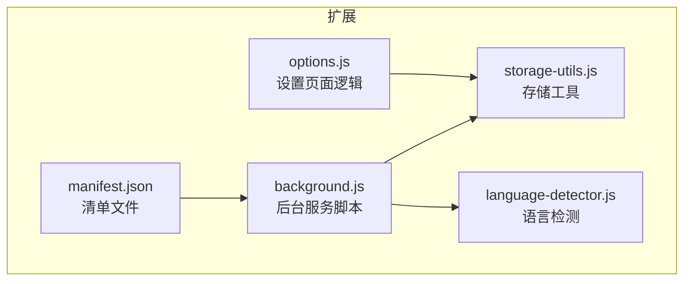
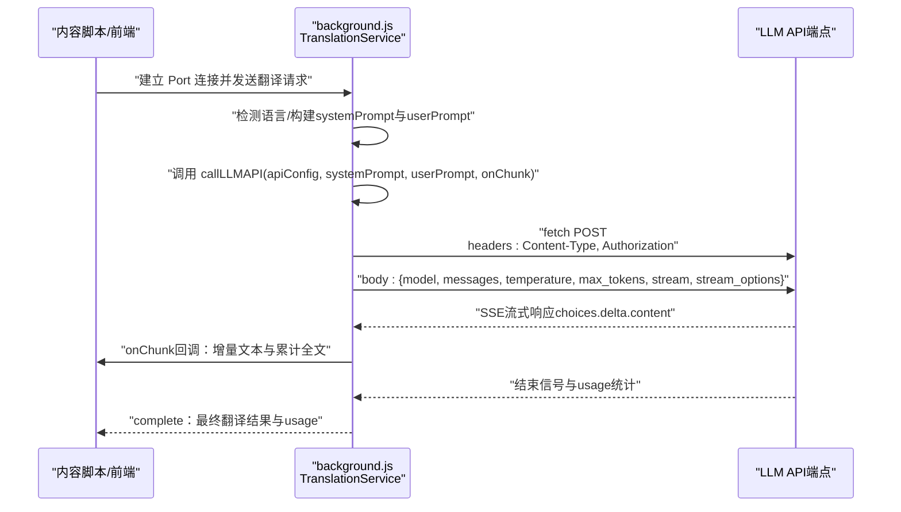
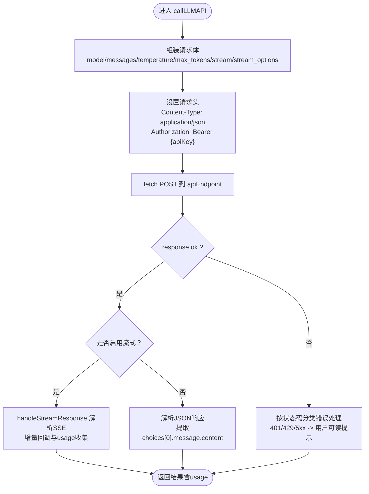
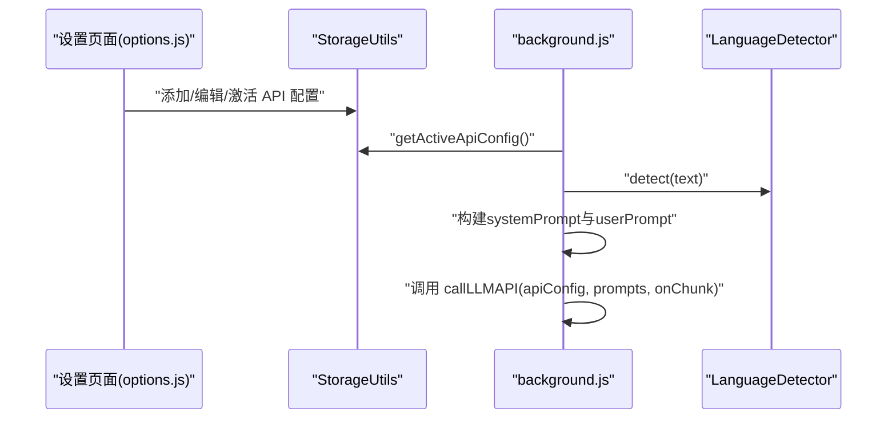
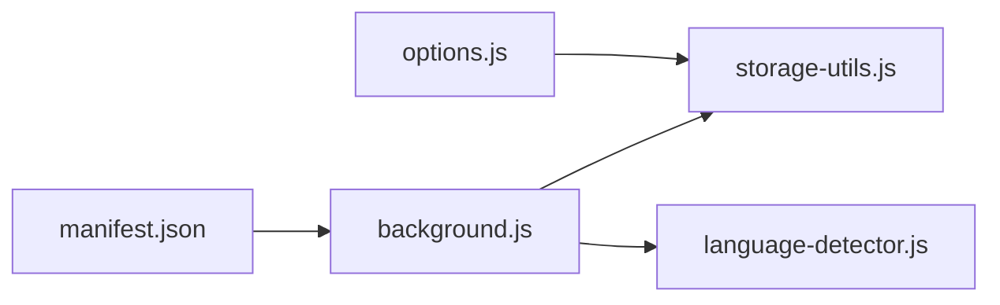

# API请求构造

<cite>
**本文引用的文件**
- [background.js](file://background.js)
- [storage-utils.js](file://storage-utils.js)
- [language-detector.js](file://language-detector.js)
- [manifest.json](file://manifest.json)
- [options.js](file://options.js)
</cite>

## 目录
1. [简介](#简介)
2. [项目结构](#项目结构)
3. [核心组件](#核心组件)
4. [架构概览](#架构概览)
5. [详细组件分析](#详细组件分析)
6. [依赖关系分析](#依赖关系分析)
7. [性能考虑](#性能考虑)
8. [故障排查指南](#故障排查指南)
9. [结论](#结论)

## 简介
本节聚焦于 background.js 中的 callLLMAPI 函数，系统性解析其请求构造逻辑与参数来源，包括：
- 如何使用 fetch 发起 POST 请求
- Content-Type 与 Authorization 的设置方式
- 请求体字段 model、messages、temperature、max_tokens、stream 的含义与作用
- 流式传输与非流式的差异及使用场景
- 参数如何由用户配置与选中文本动态生成
- 与不同 LLM API（OpenAI 兼容）的兼容性设计考量

## 项目结构
QuickTrans 是一个基于 Manifest V3 的浏览器扩展，核心运行在后台服务脚本中，负责翻译请求、API 配置管理与流式响应处理。关键文件与职责如下：
- background.js：后台服务脚本，包含翻译服务、LLM API 调用、流式处理、消息与端口监听等
- storage-utils.js：存储工具，管理 API 配置、TTS 配置、用户偏好、缓存与 token 统计
- language-detector.js：语言检测模块，用于自动识别源语言
- manifest.json：声明权限、后台脚本、内容脚本与图标等
- options.js：设置页面逻辑，管理 API 配置的增删改查与用户偏好

图表来源
- [manifest.json](file://manifest.json#L1-L52)
- [background.js](file://background.js#L1-L120)
- [storage-utils.js](file://storage-utils.js#L1-L120)
- [language-detector.js](file://language-detector.js#L1-L60)
- [options.js](file://options.js#L1-L120)

章节来源
- [manifest.json](file://manifest.json#L1-L52)
- [background.js](file://background.js#L1-L120)
- [storage-utils.js](file://storage-utils.js#L1-L120)
- [language-detector.js](file://language-detector.js#L1-L60)
- [options.js](file://options.js#L1-L120)

## 核心组件
- TranslationService：封装翻译流程，内部调用 callLLMAPI 构造并发送请求，处理流式与非流式响应
- callLLMAPI：核心请求构造函数，负责组装请求体、设置请求头、执行 fetch、解析响应与错误处理
- StorageUtils：提供 getActiveApiConfig、saveTranslationCache、updateTokenUsage 等能力，为请求提供配置与缓存支持
- LanguageDetector：提供语言检测与名称映射，用于动态生成系统提示词与用户提示词

章节来源
- [background.js](file://background.js#L49-L120)
- [background.js](file://background.js#L203-L323)
- [storage-utils.js](file://storage-utils.js#L120-L170)
- [language-detector.js](file://language-detector.js#L1-L60)

## 架构概览
下面的序列图展示了从“翻译流式连接”到“LLM API 请求”的完整调用链路，体现请求构造与流式处理的关键步骤。

图表来源
- [background.js](file://background.js#L866-L983)
- [background.js](file://background.js#L203-L323)

章节来源
- [background.js](file://background.js#L866-L983)
- [background.js](file://background.js#L203-L323)

## 详细组件分析

### callLLMAPI 函数：请求构造与参数来源
- 请求方法与端点
  - 使用 fetch 发起 POST 请求，端点来自 apiConfig.apiEndpoint
  - 请求头包含 Content-Type: application/json 与 Authorization: Bearer ${apiKey}
- 请求体字段
  - model：来自 apiConfig.model
  - messages：包含 system 与 user 角色的对话上下文
  - temperature：来自 apiConfig.temperature，若未配置则使用默认值
  - max_tokens：固定为较大上限，确保输出完整性
  - stream：根据是否存在 onChunk 回调决定是否启用流式
  - stream_options：当启用流式时，附加 include_usage 以获取 token 使用统计
- 错误处理
  - 对 401、429、500/503 等常见状态码进行分类处理
  - 对非 JSON 响应进行降级处理
  - 超时控制：AbortController 与 30 秒超时
  - 网络异常与超时分别返回不同错误码
- 响应处理
  - 非流式：解析 choices[0].message.content 作为翻译结果，返回 usage
  - 流式：handleStreamResponse 解析 SSE 数据，逐块拼接并回调，最后汇总 usage

图表来源
- [background.js](file://background.js#L211-L323)

章节来源
- [background.js](file://background.js#L211-L323)

### 请求体字段详解
- model
  - 作用：指定使用的 LLM 模型名称
  - 来源：apiConfig.model
- messages
  - 作用：承载对话上下文，包含 system 与 user 角色
  - system：用于约束翻译行为（如只返回翻译结果、保持语气与格式）
  - user：包含目标语言与原文本的翻译指令
- temperature
  - 作用：控制生成随机性，数值越小越稳定
  - 来源：apiConfig.temperature，未配置时使用默认值
- max_tokens
  - 作用：限制最大输出长度，避免过长响应
  - 设定：固定上限，兼顾稳定性与完整性
- stream
  - 作用：启用流式传输，提升交互体验
  - 来源：当传入 onChunk 回调时启用
- stream_options.include_usage
  - 作用：在流式响应中包含 usage 统计，便于 token 计费与监控
  - 来源：仅在启用流式时附加

章节来源
- [background.js](file://background.js#L211-L323)

### 参数如何由用户配置与选中文本动态生成
- 用户配置（来自设置页面）
  - 通过 options 页面添加/编辑 API 配置，保存至 StorageUtils
  - StorageUtils 提供 getActiveApiConfig，返回当前激活的配置
- 选中文本与语言检测
  - 由 LanguageDetector.detect 自动识别源语言
  - 结合 LanguageDetector.getLanguageName 生成自然语言描述
- 动态提示词
  - systemPrompt：约束翻译行为与格式
  - userPrompt：包含目标语言与原文本
- 调用入口
  - 翻译流式连接（Port）与词典查询流式连接均调用 TranslationService.translate 或 callLLMAPI

图表来源
- [options.js](file://options.js#L344-L447)
- [storage-utils.js](file://storage-utils.js#L120-L170)
- [background.js](file://background.js#L49-L120)
- [language-detector.js](file://language-detector.js#L1-L60)

章节来源
- [options.js](file://options.js#L344-L447)
- [storage-utils.js](file://storage-utils.js#L120-L170)
- [background.js](file://background.js#L49-L120)
- [language-detector.js](file://language-detector.js#L1-L60)

### 与不同 LLM API 的兼容性设计
- OpenAI 兼容性
  - 请求体结构与响应格式与 OpenAI 兼容：messages 数组、choices[0].message.content、usage 字段
  - 流式响应遵循 SSE 格式，choices.delta.content 逐块推送
  - 通过 include_usage 在流式响应中携带 token 使用统计
- Anthropic 兼容性
  - 代码未直接实现 Anthropic 的请求体与响应格式
  - 若需兼容 Anthropic，可在调用层做适配：将 messages 映射为 Anthropic 的 messages 结构，或将 usage 映射为 Anthropic 的计费字段
  - 由于本项目主要面向 OpenAI 兼容端点，建议在设置页面配置 OpenAI 兼容的端点与密钥

章节来源
- [background.js](file://background.js#L211-L323)

## 依赖关系分析
- TranslationService 依赖
  - StorageUtils：获取激活 API 配置、缓存翻译结果、更新 token 统计
  - LanguageDetector：检测语言、生成语言名称
- callLLMAPI 依赖
  - apiConfig：包含 apiEndpoint、apiKey、model、temperature
  - AbortController：超时控制
  - fetch：HTTP 请求
- 设置页面依赖
  - options.js：表单校验、保存配置、测试连接
  - storage-utils.js：持久化配置

图表来源
- [background.js](file://background.js#L1-L120)
- [storage-utils.js](file://storage-utils.js#L1-L120)
- [language-detector.js](file://language-detector.js#L1-L60)
- [options.js](file://options.js#L1-L120)
- [manifest.json](file://manifest.json#L1-L52)

章节来源
- [background.js](file://background.js#L1-L120)
- [storage-utils.js](file://storage-utils.js#L1-L120)
- [language-detector.js](file://language-detector.js#L1-L60)
- [options.js](file://options.js#L1-L120)
- [manifest.json](file://manifest.json#L1-L52)

## 性能考虑
- 流式传输
  - 启用 stream 可显著降低首字延迟，提升交互体验
  - 流式模式下 include_usage 可能增加额外负载，需权衡统计需求
- 超时与中断
  - 30 秒超时避免长时间挂起；AbortController 保证资源释放
- 缓存策略
  - 使用 session storage 缓存翻译结果，浏览器关闭后自动清空
  - 缓存命中可减少重复请求，提高整体性能
- 请求体大小
  - max_tokens 设为较大上限，避免截断；但过大的输入可能影响性能，建议配合前端文本长度限制

[本节为通用指导，不直接分析具体文件]

## 故障排查指南
- 常见错误与处理
  - 401 无效密钥：检查 apiConfig.apiKey 是否正确
  - 429 频率限制：降低并发或更换 API
  - 500/503 服务不可用：稍后重试或切换端点
  - 非 JSON 响应：确认端点与模型兼容性
  - 超时：检查网络与端点可达性
- 诊断步骤
  - 在设置页面测试连接，验证端点、密钥与模型
  - 查看后台日志与 Port 回调，确认流式数据是否到达
  - 检查缓存命中情况，排除重复请求问题
- 相关实现位置
  - 错误处理与超时：callLLMAPI 内部
  - 流式解析：handleStreamResponse
  - 配置获取：StorageUtils.getActiveApiConfig

章节来源
- [background.js](file://background.js#L211-L323)
- [background.js](file://background.js#L139-L201)
- [storage-utils.js](file://storage-utils.js#L120-L170)
- [options.js](file://options.js#L406-L447)

## 结论
- callLLMAPI 采用 OpenAI 兼容的请求体结构，通过 fetch 发起 POST 请求，严格设置 Content-Type 与 Authorization
- 请求体字段清晰明确：model、messages、temperature、max_tokens、stream、stream_options
- 参数来源多样：用户配置（StorageUtils）、语言检测（LanguageDetector）、动态提示词（system/user）
- 流式传输显著改善用户体验，配合 include_usage 实现 token 统计
- 与 Anthropic 的兼容性可通过调用层适配实现，当前项目主要面向 OpenAI 兼容端点