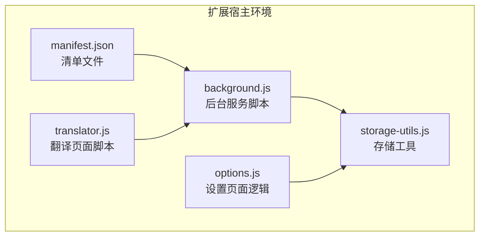
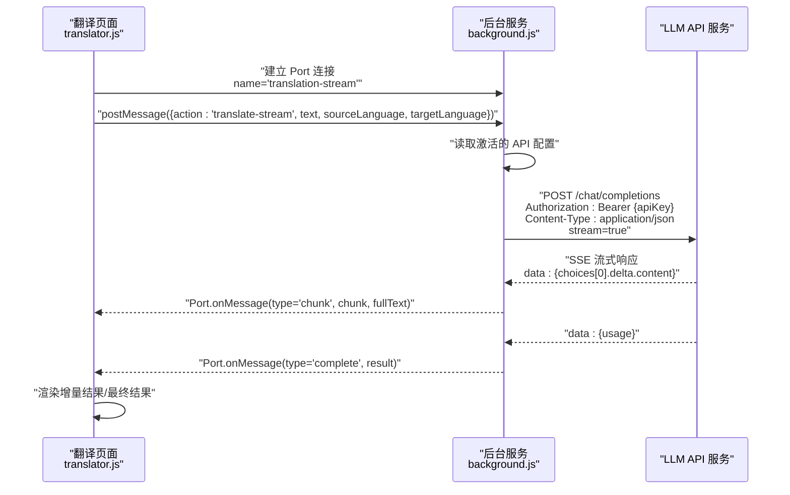
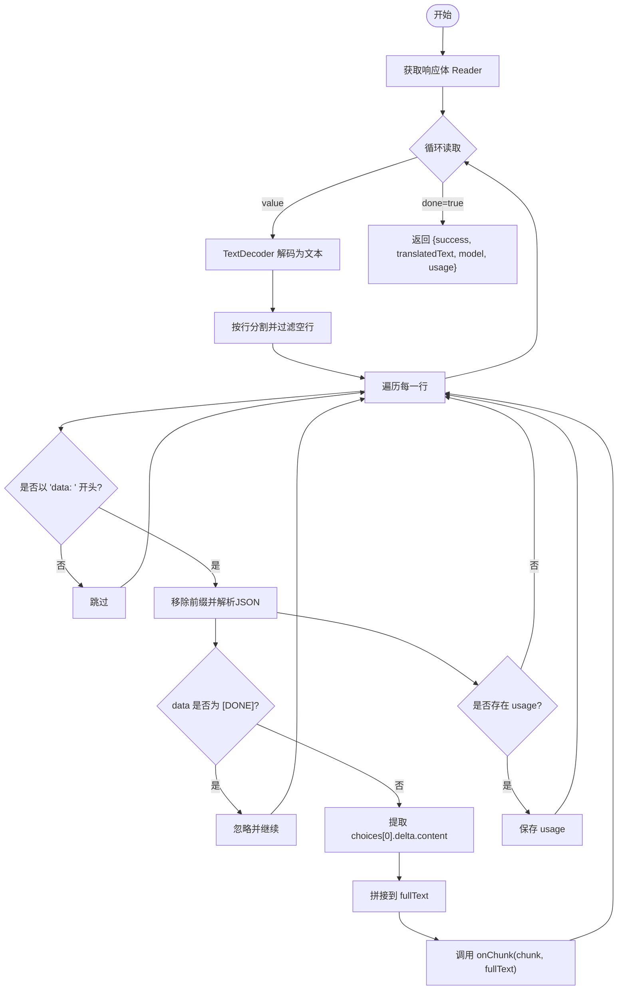
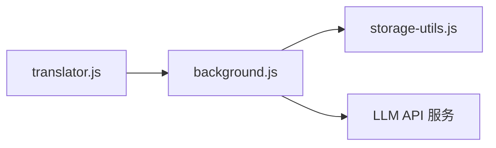

# API请求规范

<cite>
**本文引用的文件**
- [background.js](file://background.js)
- [storage-utils.js](file://storage-utils.js)
- [manifest.json](file://manifest.json)
- [translator.js](file://translator.js)
- [options.js](file://options.js)
</cite>

## 目录
1. [简介](#简介)
2. [项目结构](#项目结构)
3. [核心组件](#核心组件)
4. [架构总览](#架构总览)
5. [详细组件分析](#详细组件分析)
6. [依赖关系分析](#依赖关系分析)
7. [性能考量](#性能考量)
8. [故障排查指南](#故障排查指南)
9. [结论](#结论)
10. [附录](#附录)

## 简介
本文聚焦于 background.js 中的 callLLMAPI 函数，系统化梳理其作为翻译服务的 HTTP 请求构造与流式响应处理规范，覆盖请求方法、头部、请求体结构、SSE 流式解析、错误处理与超时控制，并提供请求/响应示例与重试策略建议。同时结合前端 translator.js 的流式连接与后台 Service Worker 的消息/端口交互，帮助读者全面理解端到端的调用链路。

## 项目结构
QuickTrans 是一个基于 Manifest V3 的 Chrome 扩展，核心逻辑集中在后台 Service Worker（background.js），并通过端口（Port）与前端页面（translator.html + translator.js）进行流式通信；翻译 API 配置由 options 页面维护，存储在本地存储中。

图表来源
- [manifest.json](file://manifest.json#L1-L52)
- [background.js](file://background.js#L1-L120)
- [storage-utils.js](file://storage-utils.js#L1-L120)
- [options.js](file://options.js#L1-L120)
- [translator.js](file://translator.js#L1-L120)

章节来源
- [manifest.json](file://manifest.json#L1-L52)
- [background.js](file://background.js#L1-L120)
- [storage-utils.js](file://storage-utils.js#L1-L120)
- [options.js](file://options.js#L1-L120)
- [translator.js](file://translator.js#L1-L120)

## 核心组件
- TranslationService.callLLMAPI：封装 LLM API 的 HTTP 请求与流式响应处理，负责：
  - 构造 POST 请求（application/json、Authorization Bearer）
  - 组装请求体（model、messages、temperature、max_tokens、stream、stream_options）
  - 处理非流式与流式两种返回路径
  - 超时控制（AbortController，30 秒）
  - 错误分类与返回结构
- handleStreamResponse：解析 SSE 事件流，逐块推送增量内容，聚合 usage 信息
- StorageUtils：提供 API 配置读取、缓存、token 统计等能力
- 前端 Port 连接：通过 chrome.runtime.connect 建立长连接，实现实时增量渲染

章节来源
- [background.js](file://background.js#L132-L323)
- [storage-utils.js](file://storage-utils.js#L1-L120)
- [translator.js](file://translator.js#L180-L307)

## 架构总览
下面的序列图展示了从前端发起翻译请求到后台调用 LLM API 并回传流式结果的完整流程。

图表来源
- [translator.js](file://translator.js#L220-L299)
- [background.js](file://background.js#L905-L981)
- [background.js](file://background.js#L211-L323)

章节来源
- [translator.js](file://translator.js#L180-L307)
- [background.js](file://background.js#L866-L983)
- [background.js](file://background.js#L211-L323)

## 详细组件分析

### callLLMAPI 函数：HTTP 请求构造与流式处理
- 请求方法与头部
  - 方法：POST
  - Content-Type：application/json
  - Authorization：Bearer {apiKey}（来自 API 配置）
- 请求体结构
  - model：来自 API 配置
  - messages：包含 system 与 user 角色的消息数组
  - temperature：来自 API 配置，若未配置则使用默认值
  - max_tokens：固定为 10000
  - stream：当提供回调函数（onChunk）时启用流式
  - stream_options：当启用流式时，包含 include_usage 以返回 token 使用统计
- 超时控制
  - 使用 AbortController，在 30 秒后中断请求
- 非流式与流式分支
  - 非流式：等待完整响应，解析 choices[0].message.content
  - 流式：调用 handleStreamResponse，逐块推送增量内容并聚合 usage
- 错误处理
  - 401：无效密钥
  - 429：频率超限
  - 500/503：服务不可用
  - 其他 HTTP 错误：解析错误体或回退为通用错误
  - 网络超时：AbortError
  - 其他网络异常：网络错误

章节来源
- [background.js](file://background.js#L211-L323)
- [background.js](file://background.js#L132-L201)

### 流式响应处理（SSE）：增量内容与 usage 聚合
- 读取响应体的 Reader，按字节解码为文本块
- 按行解析，识别 data: 前缀的事件行
- 特殊标记：当 data 内容为 [DONE] 时跳过
- JSON 解析：提取 choices[0].delta.content 作为增量内容
- usage：当响应中出现 usage 字段时，保存到结果对象
- 异常：解析失败时记录日志并继续处理后续数据

图表来源
- [background.js](file://background.js#L132-L201)

章节来源
- [background.js](file://background.js#L132-L201)

### 请求体与响应体示例（结构说明）
- 请求体（非流式）
  - 字段：model、messages（system/user）、temperature、max_tokens、stream=false
  - 示例结构（仅字段示意，不含具体内容）：
    - model: "模型名称"
    - messages: [{role: "system", content: "..."}, {role: "user", content: "..."}]
    - temperature: 数值
    - max_tokens: 10000
    - stream: false
- 请求体（流式）
  - 在非流式基础上增加 stream=true，并在 stream_options 中包含 include_usage
  - 示例结构（仅字段示意）：
    - stream: true
    - stream_options: {include_usage: true}
- 响应体（非流式）
  - 字段：choices[0].message.content（翻译结果）、usage（可选）
- 响应体（流式）
  - SSE 事件流中逐条 data: {choices[0].delta.content}，最后一条可能包含 usage

说明：本文不展示具体 JSON 文本，仅提供字段结构与语义说明，便于对照实现。

章节来源
- [background.js](file://background.js#L211-L323)
- [background.js](file://background.js#L132-L201)

### 错误处理与重试策略
- 错误分类与返回
  - 401：INVALID_API_KEY
  - 429：RATE_LIMIT
  - 500/503：SERVICE_UNAVAILABLE
  - 其他 HTTP 错误：API_ERROR
  - 超时：TIMEOUT
  - 网络异常：NETWORK_ERROR
- 重试策略建议
  - 429：指数退避重试（例如 1s、2s、4s、8s），最多 3 次
  - 500/503：短暂退避重试（1–3s），最多 2 次
  - 401：停止重试并提示用户检查密钥
  - TIMEOUT：可重试一次，必要时切换备用 API 配置
  - NETWORK_ERROR：可重试一次，检查网络与代理
- 建议
  - 在前端层（translator.js）对 RATE_LIMIT/API_ERROR 提供“重试/切换 API”按钮
  - 在后台层（background.js）对 429/500/503 增加可配置的重试上限与退避策略

章节来源
- [background.js](file://background.js#L247-L278)
- [translator.js](file://translator.js#L778-L807)

### 与存储与配置的集成
- API 配置来源：StorageUtils.getActiveApiConfig()
- 缓存：StorageUtils.getTranslationCache/saveTranslationCache
- Token 统计：StorageUtils.updateTokenUsage（流式时包含 usage）

章节来源
- [storage-utils.js](file://storage-utils.js#L1-L120)
- [background.js](file://background.js#L820-L840)
- [background.js](file://background.js#L949-L968)

## 依赖关系分析
- 调用链
  - translator.js 通过 Port 连接 background.js
  - background.js 读取 StorageUtils 的 API 配置
  - background.js 调用 fetch 发起 LLM API 请求
  - background.js 解析 SSE 并通过 Port 回传增量结果
- 外部依赖
  - 浏览器原生 fetch 与 AbortController
  - Chrome 扩展 API：chrome.runtime（消息/端口）、chrome.storage（本地存储）

图表来源
- [translator.js](file://translator.js#L220-L299)
- [background.js](file://background.js#L905-L981)
- [storage-utils.js](file://storage-utils.js#L1-L120)

章节来源
- [translator.js](file://translator.js#L220-L299)
- [background.js](file://background.js#L905-L981)
- [storage-utils.js](file://storage-utils.js#L1-L120)

## 性能考量
- 流式传输的优势：渐进式显示，降低首字延迟，提升交互体验
- 30 秒超时：防止长时间挂起，保障前台交互流畅
- usage 统计：在启用流式时通过 stream_options.include_usage 获取，便于成本控制与优化
- 缓存：对翻译结果进行 session 缓存，减少重复请求

章节来源
- [background.js](file://background.js#L211-L235)
- [background.js](file://background.js#L132-L201)
- [storage-utils.js](file://storage-utils.js#L356-L422)

## 故障排查指南
- 常见错误与定位
  - 401 无效密钥：检查 options 页面中的 API 密钥是否正确
  - 429 频率超限：降低并发或切换备用 API；参考重试策略
  - 500/503 服务不可用：稍后重试或切换上游服务
  - 超时：检查网络连通性、代理设置与 API 端点可用性
  - 网络异常：检查浏览器网络状态与扩展权限
- 前端提示
  - translator.js 对 NO_API_CONFIG、RATE_LIMIT、API_ERROR 提供明确的错误提示与操作入口（如“前往设置”、“重试”、“切换 API”）

章节来源
- [background.js](file://background.js#L247-L278)
- [translator.js](file://translator.js#L778-L807)
- [options.js](file://options.js#L403-L447)

## 结论
callLLMAPI 函数以简洁而稳健的方式封装了 LLM API 的调用与流式处理，配合端到端的 Port 通信与本地存储，实现了低延迟、可增量渲染的翻译体验。遵循本文的请求规范与错误处理建议，可进一步提升稳定性与可维护性。

## 附录
- API 配置管理
  - options 页面负责新增/编辑/删除 API 配置，并设置激活项
  - storage-utils 提供配置持久化与读取能力
- 使用建议
  - 在 options 页面配置多个 API 以实现故障转移
  - 合理设置 temperature 与 max_tokens，平衡质量与成本
  - 利用 usage 统计监控调用成本

章节来源
- [options.js](file://options.js#L180-L243)
- [storage-utils.js](file://storage-utils.js#L1-L120)