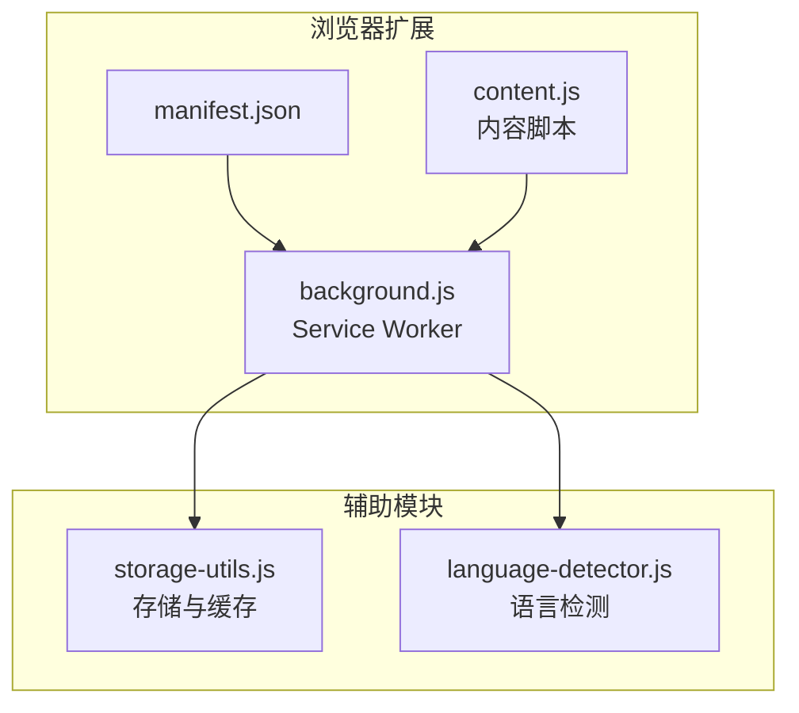
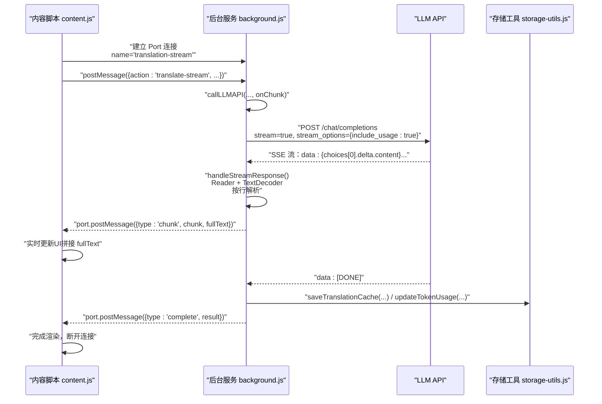
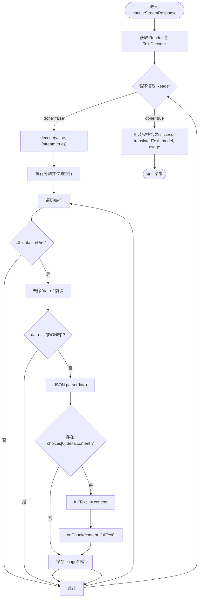
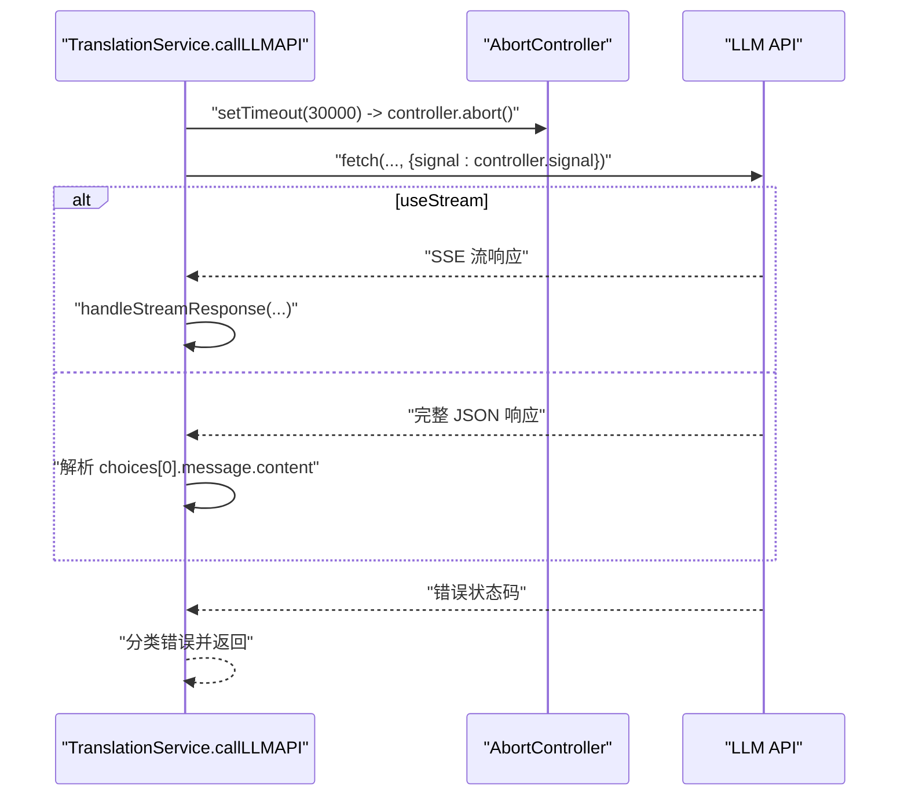
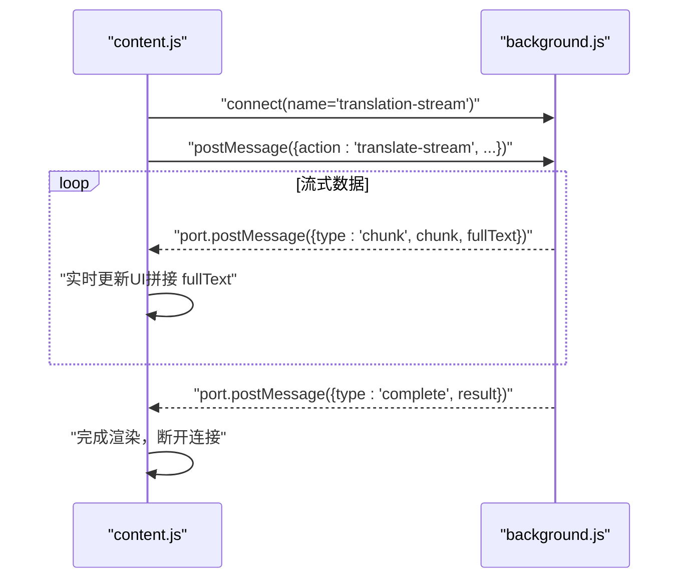
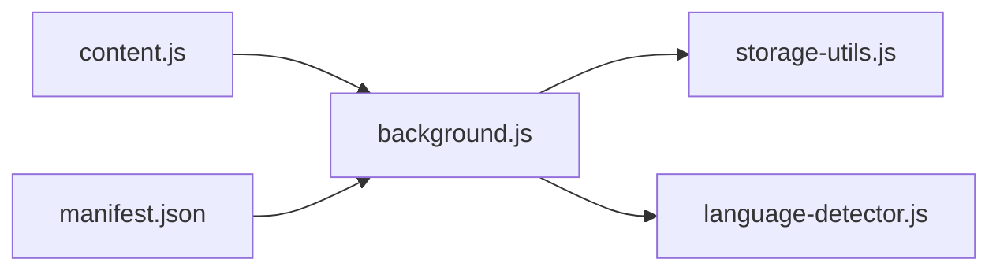

# 流式响应处理

<cite>
**本文引用的文件**
- [background.js](file://background.js)
- [content.js](file://content.js)
- [storage-utils.js](file://storage-utils.js)
- [language-detector.js](file://language-detector.js)
- [manifest.json](file://manifest.json)
</cite>

## 目录
1. [简介](#简介)
2. [项目结构](#项目结构)
3. [核心组件](#核心组件)
4. [架构总览](#架构总览)
5. [详细组件分析](#详细组件分析)
6. [依赖关系分析](#依赖关系分析)
7. [性能考量](#性能考量)
8. [故障排查指南](#故障排查指南)
9. [结论](#结论)

## 简介
本文聚焦于 QuickTrans 扩展中 background.js 对 Server-Sent Events（SSE）流式响应的处理机制，系统阐述如何通过 ReadableStream 接口逐块接收数据、解析以“data: ”前缀分隔的事件流、识别“[DONE]”标记以判断响应结束；并结合代码路径说明如何将流式数据拼接为完整响应、实时更新中间结果，以及在流式传输中如何保持连接、处理心跳与浏览器兼容性注意事项。同时，本文还总结了流式传输在提升用户体验方面的优势，例如即时显示翻译结果。

## 项目结构
QuickTrans 采用 Manifest V3 架构，background.js 作为 Service Worker 承担翻译与 TTS 的后端处理，content.js 作为内容脚本负责与用户交互并通过 Port 建立长连接实现流式数据传输。

图表来源
- [manifest.json](file://manifest.json#L1-L52)
- [background.js](file://background.js#L1-L120)
- [content.js](file://content.js#L614-L728)
- [storage-utils.js](file://storage-utils.js#L356-L422)
- [language-detector.js](file://language-detector.js#L1-L60)

章节来源
- [manifest.json](file://manifest.json#L1-L52)

## 核心组件
- TranslationService.handleStreamResponse：负责解析 fetch 响应体的 ReadableStream，按行拆分并识别“data: ”前缀，过滤“[DONE]”，解析 JSON 并拼接内容，实时回调中间结果，最终返回完整翻译结果与 usage 统计。
- TranslationService.callLLMAPI：构造请求体，按需开启 stream 与 stream_options.include_usage，发起 fetch，根据 useStream 决定走流式或非流式分支。
- content.js 的 performTranslation/performDictionaryLookup：通过 chrome.runtime.connect 建立 Port 长连接，监听 type='chunk' 实时更新 UI，type='complete' 完成收尾。
- storage-utils.js：提供缓存与 token 统计能力，配合流式结果进行持久化与用量统计。
- language-detector.js：提供语言检测与名称映射，辅助翻译提示词构建。

章节来源
- [background.js](file://background.js#L132-L201)
- [background.js](file://background.js#L203-L323)
- [content.js](file://content.js#L614-L728)
- [content.js](file://content.js#L442-L565)
- [storage-utils.js](file://storage-utils.js#L356-L422)
- [language-detector.js](file://language-detector.js#L1-L60)

## 架构总览
下面的序列图展示了从内容脚本到后台服务再到 LLM API 的完整流式调用链路，重点标注了 SSE 数据块的解析与实时回调。

图表来源
- [content.js](file://content.js#L614-L728)
- [background.js](file://background.js#L203-L323)
- [background.js](file://background.js#L132-L201)
- [storage-utils.js](file://storage-utils.js#L356-L422)

## 详细组件分析

### SSE 流式响应解析与实时回调
- ReadableStream 接口：通过 response.body.getReader() 获取 Reader，使用 TextDecoder.decode(value, { stream: true }) 逐步解码二进制片段。
- 行分割与前缀识别：将解码后的文本按换行符切分为行，过滤空行，仅处理以"data: "开头的行。
- “[DONE]”标记：当 data 内容等于“[DONE]”时跳过解析，作为流结束信号。
- JSON 解析与增量拼接：解析 data 为 JSON，提取 choices[0].delta.content，将其累加到 fullText，并调用 onChunk(chunk, fullText) 回传给内容脚本。
- usage 统计：若 JSON 包含 usage 字段，保存到 usage 变量，最终随完整结果返回。
- 异常处理：对解析异常与流式处理异常进行捕获并返回标准化错误对象。

图表来源
- [background.js](file://background.js#L132-L201)

章节来源
- [background.js](file://background.js#L132-L201)

### 流式请求构建与连接保持
- 请求体构造：根据配置设置 model、messages、temperature、max_tokens，并在启用流式时添加 stream=true 与 stream_options={include_usage:true}。
- 超时控制：使用 AbortController 在 30 秒后中断请求，避免长时间占用资源。
- 错误分类：对 401、429、500/503 等状态码进行分类处理，返回标准化错误信息。
- 非流式回退：当未提供回调函数时，走非流式分支，解析完整 JSON 并返回 choices[0].message.content。

图表来源
- [background.js](file://background.js#L203-L323)

章节来源
- [background.js](file://background.js#L203-L323)

### 内容脚本中的实时更新与完成通知
- 建立 Port：content.js 通过 chrome.runtime.connect({ name: 'translation-stream' }) 建立长连接。
- 监听 chunk：首次收到 type='chunk' 时清除加载动画，实时将 fullText 写入 DOM，并动态调整弹窗位置。
- 完成通知：收到 type='complete' 后，根据 success 渲染结果或错误信息，启用复制按钮，显示模型与 token 统计，断开连接。

图表来源
- [content.js](file://content.js#L614-L728)
- [background.js](file://background.js#L866-L983)

章节来源
- [content.js](file://content.js#L614-L728)
- [background.js](file://background.js#L866-L983)

### 缓存与 token 统计
- 缓存策略：使用 chrome.storage.session 保存翻译结果，键由原文哈希与目标语言组合生成，浏览器重启后自动清空。
- token 统计：当流式响应包含 usage 字段时，后台更新本地统计并在完成时一并返回给前端。

章节来源
- [storage-utils.js](file://storage-utils.js#L356-L422)
- [storage-utils.js](file://storage-utils.js#L460-L511)
- [background.js](file://background.js#L132-L201)

### 语言检测与提示词构建
- 语言检测：基于 Unicode 范围与特征词统计进行快速检测，支持中、英、日、韩、俄、阿拉伯、泰、越等语言。
- 提示词构建：根据检测到的源语言与目标语言生成系统提示与用户提示，保证翻译风格与格式一致性。

章节来源
- [language-detector.js](file://language-detector.js#L1-L140)
- [background.js](file://background.js#L49-L121)

## 依赖关系分析
- background.js 依赖 storage-utils.js（缓存与统计）、language-detector.js（语言检测）。
- content.js 依赖 dictionary-utils.js（词典工具，用于格式化与 PCM/WAV 转换等，见 content.js 中的调用）。
- manifest.json 声明 background.service_worker 为 background.js，content_scripts 注入 content.js。

图表来源
- [background.js](file://background.js#L1-L12)
- [manifest.json](file://manifest.json#L1-L52)

章节来源
- [background.js](file://background.js#L1-L12)
- [manifest.json](file://manifest.json#L1-L52)

## 性能考量
- 流式首字延迟：由于 API 以 SSE 分块返回，用户可在首个字到达时即看到翻译结果，显著降低感知等待时间。
- UI 增量渲染：content.js 在每次收到 chunk 后立即拼接并更新 DOM，避免一次性渲染大文本带来的卡顿。
- 缓存命中：对翻译结果使用 session 缓存，命中时直接返回，减少网络与 API 调用。
- 资源释放：流式结束后断开 Port 连接，避免内存泄漏；超时控制防止长时间挂起。
- 体积控制：对长文本进行最大长度限制与上下文截取，避免 UI 过大影响滚动与布局。

[本节为通用性能建议，不直接分析具体文件，故无章节来源]

## 故障排查指南
- 无流式数据或无响应
  - 检查 API 配置与鉴权头是否正确，确认 stream=true 已生效。
  - 观察后台错误分类返回，区分 401、429、5xx 等问题。
- “[DONE]”未出现或 UI 不断加载
  - 确认 API 端确实返回了“data: [DONE]”标记；若未返回，需在上游修复。
  - 检查 TextDecoder 解码与行分割逻辑是否被破坏。
- 中间结果不更新
  - 确认 onChunk 回调在 handleStreamResponse 中被调用，且 content.js 正确监听 type='chunk'。
- 错误信息显示
  - content.js 在收到 type='complete' 且 success=false 时会显示错误信息与重试/切换 API 按钮。

章节来源
- [background.js](file://background.js#L203-L323)
- [background.js](file://background.js#L132-L201)
- [content.js](file://content.js#L663-L714)

## 结论
QuickTrans 在 background.js 中实现了对 SSE 流式响应的稳健解析：通过 ReadableStream + TextDecoder 逐块解码，按行识别“data: ”前缀并过滤“[DONE]”，在回调中实时拼接与回传，最终汇总完整结果与 usage 统计。content.js 通过 Port 长连接实现渐进式 UI 更新，显著提升了用户体验。结合缓存与超时控制，系统在性能与稳定性之间取得良好平衡。对于连接保持与心跳，SSE 本身具备自动重连特性，浏览器在连接异常时会尝试恢复；若需更强健的长连接，可在应用层增加 ping/pong 机制（需在上游 API 支持的前提下）。在浏览器兼容性方面，SSE 与 fetch 在现代浏览器中广泛支持，但在受限环境中（如企业代理或 CSP 严格策略）可能需要额外适配。