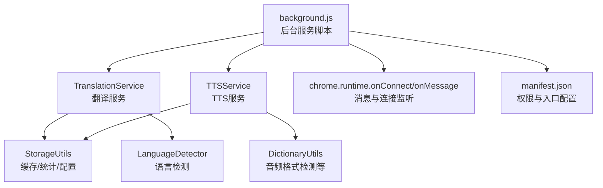
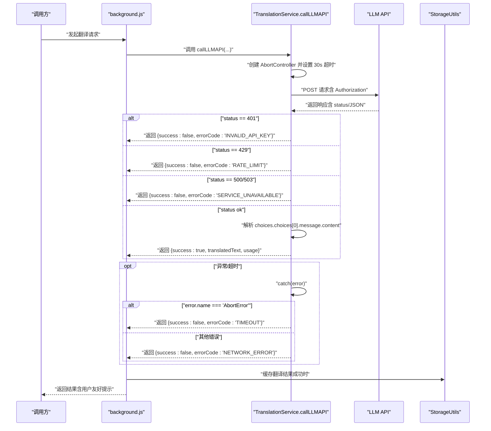
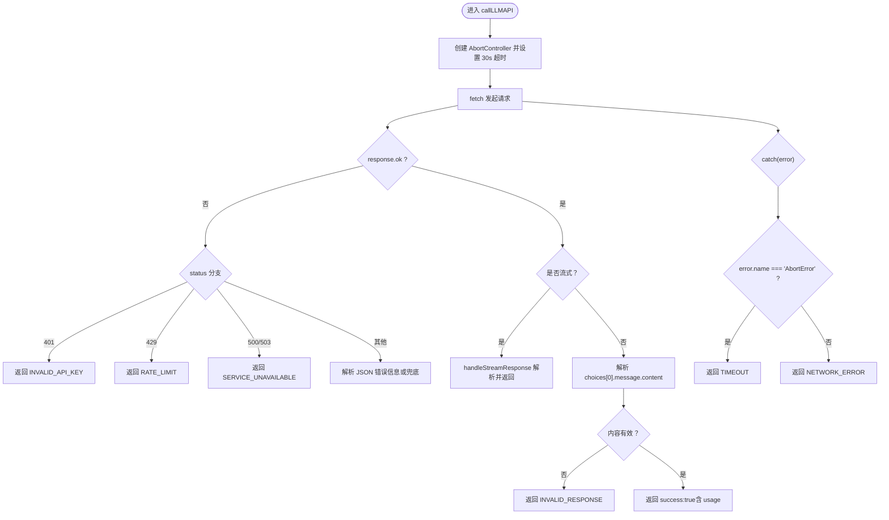
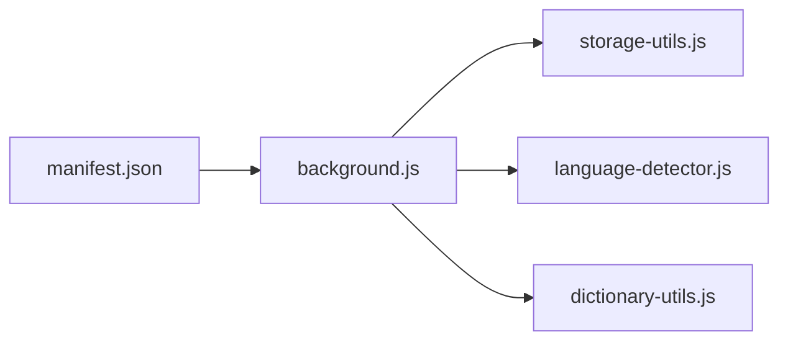

# 错误处理策略

<cite>
**本文引用的文件**
- [background.js](file://background.js)
- [storage-utils.js](file://storage-utils.js)
- [language-detector.js](file://language-detector.js)
- [manifest.json](file://manifest.json)
- [dictionary-utils.js](file://dictionary-utils.js)
</cite>

## 目录
1. [引言](#引言)
2. [项目结构](#项目结构)
3. [核心组件](#核心组件)
4. [架构总览](#架构总览)
5. [详细组件分析](#详细组件分析)
6. [依赖关系分析](#依赖关系分析)
7. [性能考量](#性能考量)
8. [故障排查指南](#故障排查指南)
9. [结论](#结论)
10. [附录](#附录)

## 引言
本文件系统梳理 background.js 中实现的 API 请求错误处理流程，聚焦以下目标：
- 明确对常见 HTTP 状态码的响应策略：401 触发“API 密钥无效”提示；429 启用“限流”提示；5xx 服务器错误提示“服务暂时不可用”。
- 解释 AbortController 实现的 30 秒超时控制原理与实现方式。
- 描述网络异常（如断网）的捕获与用户提示机制。
- 提供错误码映射表，说明如何将底层错误转化为用户可理解的提示信息，确保插件健壮性与可用性。

## 项目结构
QuickTrans 的后台服务脚本位于 background.js，负责：
- 翻译服务（LLM API 调用，支持流式与非流式）
- TTS 服务（文本转语音，支持多家供应商）
- 通过 Port 长连接提供流式体验
- 通过消息通道兼容旧版非流式接口
- 与存储工具模块协作进行缓存与统计

图表来源
- [background.js](file://background.js#L1-L120)
- [storage-utils.js](file://storage-utils.js#L1-L120)
- [language-detector.js](file://language-detector.js#L1-L60)
- [manifest.json](file://manifest.json#L1-L30)

章节来源
- [background.js](file://background.js#L1-L120)
- [manifest.json](file://manifest.json#L1-L30)

## 核心组件
- TranslationService.callLLMAPI：封装 LLM 翻译请求，统一处理 401/429/5xx、超时、网络异常、响应格式校验等。
- TTSService：封装 TTS 请求，分别处理通义千问与 OpenAI 兼容两种模式，统一错误策略。
- StorageUtils：提供缓存、统计、配置读取等能力，贯穿错误处理与用户体验优化。
- LanguageDetector：语言检测，影响翻译提示词构造与错误提示的上下文。
- DictionaryUtils：音频格式检测等辅助能力，间接支撑 TTS 错误定位。

章节来源
- [background.js](file://background.js#L200-L350)
- [storage-utils.js](file://storage-utils.js#L350-L517)
- [language-detector.js](file://language-detector.js#L1-L120)
- [dictionary-utils.js](file://dictionary-utils.js#L1-L120)

## 架构总览
下面的序列图展示翻译请求从发起到错误处理的关键路径，包括超时控制与状态码分支。

图表来源
- [background.js](file://background.js#L211-L323)
- [storage-utils.js](file://storage-utils.js#L356-L422)

## 详细组件分析

### 翻译服务错误处理（callLLMAPI）
- 超时控制：使用 AbortController，在请求前创建控制器并通过 signal 传入 fetch；同时设置 30 秒定时器，到期即 abort。若发生 AbortError，统一返回“请求超时”提示。
- 状态码策略：
  - 401：返回“API 密钥无效”，便于用户检查配置。
  - 429：返回“调用频率超限”，提示稍后重试或切换其他 API。
  - 500/503：返回“服务暂时不可用”，提示稍后再试。
  - 其他 4xx/5xx：尝试解析 JSON 中的错误信息，兜底返回“API 错误 (状态码)”。
- 响应格式校验：非流式场景下，若无法提取 choices[0].message.content，返回“API 返回数据格式错误”。
- 成功路径：非流式返回包含 usage 的结果；流式路径由 handleStreamResponse 负责拼接与返回。

图表来源
- [background.js](file://background.js#L211-L323)
- [background.js](file://background.js#L139-L201)

章节来源
- [background.js](file://background.js#L211-L323)
- [background.js](file://background.js#L139-L201)

### TTS 服务错误处理（通义千问与 OpenAI 兼容）
- 通义千问 TTS：同样采用 AbortController 控制 30 秒超时；对 401/429 做明确提示；流式读取时解析 SSE 数据，最终合并 Base64 音频片段；若无音频数据则返回“数据格式错误”。
- OpenAI 兼容 TTS：返回二进制音频，转换为 Base64；错误分支与通义千问一致，均返回统一的 errorCode 以便上层统一处理。

章节来源
- [background.js](file://background.js#L406-L588)
- [background.js](file://background.js#L596-L690)

### 超时控制原理与实现
- AbortController：在请求前创建控制器，将 controller.signal 传入 fetch；同时设置 30000ms 定时器，到期调用 controller.abort()。
- 捕获与提示：在 catch 中判断 error.name === 'AbortError'，统一返回“请求超时”提示；同时确保 clearTimeout 清理定时器，避免资源泄漏。
- 适用范围：翻译与 TTS 两个服务均采用相同模式，保证一致性。

章节来源
- [background.js](file://background.js#L211-L245)
- [background.js](file://background.js#L306-L323)
- [background.js](file://background.js#L406-L435)
- [background.js](file://background.js#L571-L588)
- [background.js](file://background.js#L596-L624)
- [background.js](file://background.js#L674-L690)

### 网络异常与用户提示
- 网络异常捕获：除超时外，其他 fetch 抛错统一返回“网络错误，请检查连接”，并在控制台记录错误详情，便于调试。
- 用户提示：所有错误均通过返回对象的 errorMessage 字段提供用户可读提示；errorCode 字段用于上层统一识别与处理。
- 缓存与回退：翻译前检查缓存，命中则直接返回，减少对外部 API 的依赖；即使外部 API 出错，也可通过缓存提升可用性。

章节来源
- [background.js](file://background.js#L317-L323)
- [storage-utils.js](file://storage-utils.js#L356-L422)

### 错误码映射表
以下为翻译与 TTS 服务中使用的统一错误码及其含义，便于前端与选项页进行一致化提示与处理：

- INVALID_API_KEY：API 密钥无效（401）
- RATE_LIMIT：调用频率超限（429）
- SERVICE_UNAVAILABLE：服务暂时不可用（500/503）
- API_ERROR：其他 API 错误（4xx/5xx，解析失败时兜底）
- INVALID_RESPONSE：API 返回数据格式错误
- TIMEOUT：请求超时（>30s）
- NETWORK_ERROR：网络异常（断网/DNS/代理等）
- NO_API_CONFIG：未配置 API
- NO_TTS_CONFIG：未配置 TTS
- STREAM_ERROR：流式处理失败
- TTS_API_ERROR：TTS API 错误
- DICTIONARY_ERROR：词典查询失败

章节来源
- [background.js](file://background.js#L253-L278)
- [background.js](file://background.js#L306-L323)
- [background.js](file://background.js#L443-L462)
- [background.js](file://background.js#L574-L588)
- [background.js](file://background.js#L631-L651)
- [background.js](file://background.js#L677-L690)
- [background.js](file://background.js#L851-L862)
- [background.js](file://background.js#L970-L981)

### 与存储、语言检测的协同
- 缓存：翻译成功后写入 session 缓存，失败不写入；Port 完成消息中携带 usage 时同步更新 token 统计。
- 语言检测：在翻译前进行语言检测，影响提示词构造与错误上下文，提升用户体验。

章节来源
- [background.js](file://background.js#L823-L848)
- [background.js](file://background.js#L949-L968)
- [storage-utils.js](file://storage-utils.js#L356-L422)
- [language-detector.js](file://language-detector.js#L1-L120)

## 依赖关系分析
- background.js 依赖：
  - storage-utils.js：缓存、统计、配置读取
  - language-detector.js：语言检测
  - dictionary-utils.js：音频格式检测等（TTS 辅助）
- manifest.json 提供权限与后台入口，确保 Service Worker 正常运行。

图表来源
- [manifest.json](file://manifest.json#L1-L30)
- [background.js](file://background.js#L1-L20)
- [storage-utils.js](file://storage-utils.js#L1-L40)
- [language-detector.js](file://language-detector.js#L1-L40)
- [dictionary-utils.js](file://dictionary-utils.js#L1-L40)

章节来源
- [manifest.json](file://manifest.json#L1-L30)
- [background.js](file://background.js#L1-L20)

## 性能考量
- 超时控制：30 秒超时避免长时间挂起，提升交互响应速度。
- 缓存策略：使用 session storage 缓存翻译结果，命中即返回，降低 API 调用次数。
- 流式传输：优先使用 Port + 流式，提升首字响应速度与实时反馈。
- 错误快速失败：对 401/429 等明确错误立即返回，避免无意义重试。

[本节为通用指导，不直接分析具体文件]

## 故障排查指南
- 401（API 密钥无效）：检查配置页面中的 API 密钥与端点是否正确。
- 429（频率超限）：降低请求频率或切换到其他 API；稍后重试。
- 500/503（服务不可用）：稍后再试；关注上游服务状态。
- TIMEOUT（请求超时）：检查网络连接、代理设置或 DNS；必要时更换网络环境。
- NETWORK_ERROR（网络异常）：确认设备联网正常，防火墙/代理未拦截。
- INVALID_RESPONSE（数据格式错误）：联系上游服务提供商或升级 API 版本。
- STREAM_ERROR（流式处理失败）：重试或切换到非流式模式；检查 SSE 数据格式。

章节来源
- [background.js](file://background.js#L253-L278)
- [background.js](file://background.js#L306-L323)
- [background.js](file://background.js#L443-L462)
- [background.js](file://background.js#L574-L588)
- [background.js](file://background.js#L631-L651)
- [background.js](file://background.js#L677-L690)

## 结论
background.js 通过统一的错误码体系与一致的错误提示策略，结合 AbortController 超时控制、缓存与流式传输，实现了健壮且用户友好的 API 请求处理流程。401/429/5xx 等关键状态码均有明确处理与提示，网络异常与超时也被妥善捕获与反馈，整体提升了插件的稳定性与可用性。

[本节为总结性内容，不直接分析具体文件]

## 附录
- 统一错误码一览（便于前端与选项页使用）
  - INVALID_API_KEY、RATE_LIMIT、SERVICE_UNAVAILABLE、API_ERROR、INVALID_RESPONSE、TIMEOUT、NETWORK_ERROR、NO_API_CONFIG、NO_TTS_CONFIG、STREAM_ERROR、TTS_API_ERROR、DICTIONARY_ERROR

[本节为汇总性内容，不直接分析具体文件]