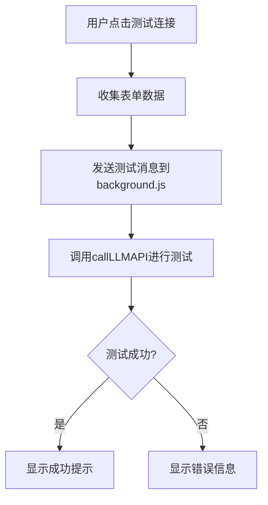
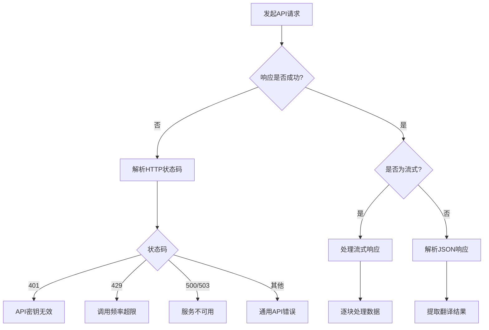

# API配置与集成

<cite>
**本文档引用的文件**
- [background.js](file://background.js)
- [options.js](file://options.js)
- [options.html](file://options.html)
- [storage-utils.js](file://storage-utils.js)
- [manifest.json](file://manifest.json)
</cite>

## 目录
1. [API服务兼容性](#api服务兼容性)
2. [API配置数据模型](#api配置数据模型)
3. [配置管理UI实现](#配置管理ui实现)
4. [HTTP请求构造与错误处理](#http请求构造与错误处理)
5. [API请求与响应示例](#api请求与响应示例)
6. [超时与重试策略](#超时与重试策略)
7. [自定义API端点添加指南](#自定义api端点添加指南)
8. [安全性注意事项](#安全性注意事项)

## API服务兼容性

本插件支持所有兼容OpenAI Chat Completions API协议的服务，实现了广泛的API服务兼容性。用户可以无缝集成多种AI服务提供商，包括官方和第三方平台。

支持的服务类型包括：
- **OpenAI官方API**：可直接使用`https://api.openai.com/v1/chat/completions`作为端点。
- **Azure OpenAI**：支持Azure特有的部署ID和API版本参数，端点格式为`https://<your-resource>.openai.azure.com/openai/deployments/<deployment-id>/chat/completions?api-version=2023-05-15`。
- **第三方代理服务**：支持国内API代理服务和自建的OpenAI兼容API服务，只要其遵循OpenAI的API规范。

这种设计通过标准化的API接口，使插件能够与多种LLM服务进行通信，为用户提供灵活的选择。用户可以根据性能、成本和可用性等因素选择最适合的API服务。

**Section sources**
- [background.js](file://background.js#L237-L245)
- [README.md](file://README.md#L194-L207)

## API配置数据模型

插件的API配置采用结构化的数据模型，包含多个关键字段，确保配置的完整性和功能性。每个API配置对象包含以下属性：

- **配置名称 (name)**：用户自定义的配置标识，用于区分不同的API配置。
- **API端点 (apiEndpoint)**：完整的API服务URL，必须是有效的HTTP/HTTPS地址。
- **API密钥 (apiKey)**：用于身份验证的密钥，采用Bearer Token方式进行认证。
- **模型名称 (model)**：指定使用的AI模型，如`gpt-3.5-turbo`或`gpt-4`。
- **Temperature参数 (temperature)**：控制输出随机性的参数，范围在0-2之间，0.3为默认值。

这些配置数据通过`storage-utils.js`中的`StorageUtils`模块进行管理，使用Chrome的`storage.local`API进行持久化存储。配置对象还包含元数据如`id`、`createdAt`、`updatedAt`和`isActive`，用于跟踪配置的状态和生命周期。

**Section sources**
- [storage-utils.js](file://storage-utils.js#L44-L53)
- [options.js](file://options.js#L350-L356)

## 配置管理UI实现

插件的配置管理界面（位于`options.html`）提供了一套完整的增删改查（CRUD）功能，使用户能够轻松管理多个API配置。界面实现基于`options.js`中的事件驱动架构。

### 增删改查功能

- **添加配置**：用户点击"添加配置"按钮后，弹出模态框，填写配置信息并保存。新配置会通过`StorageUtils.addApiConfig()`方法添加到存储中。
- **编辑配置**：用户可点击配置卡片上的"编辑"按钮，修改现有配置。编辑操作通过`StorageUtils.updateApiConfig()`方法实现。
- **删除配置**：通过"删除"按钮移除不需要的配置，调用`StorageUtils.deleteApiConfig()`方法。
- **激活配置**：用户可点击"激活"按钮切换当前使用的API配置，该操作通过`StorageUtils.setActiveApiConfig()`方法实现。

### 测试功能

配置界面提供了"测试连接"功能，允许用户验证API配置的有效性。测试过程通过向后台服务发送测试请求来完成，使用一个简单的翻译任务来验证API的连通性和认证信息的正确性。



**Diagram sources**
- [options.js](file://options.js#L406-L447)
- [background.js](file://background.js#L324-L350)

**Section sources**
- [options.js](file://options.js#L116-L135)
- [options.html](file://options.html#L61-L64)

## HTTP请求构造与错误处理

`background.js`中的`callLLMAPI`函数负责构造和发送HTTP请求到LLM API服务，实现了完整的请求处理流程。

### 请求头构造

请求头包含两个关键字段：
- **Authorization**：使用`Bearer ${apiConfig.apiKey}`格式，将API密钥作为Bearer Token传递。
- **Content-Type**：设置为`application/json`，表明请求体为JSON格式。

### 请求体参数

请求体包含以下核心参数：
- **model**：指定使用的AI模型。
- **messages**：包含系统提示和用户提示的对话数组。
- **temperature**：控制输出的随机性。
- **max_tokens**：设置最大生成令牌数。
- **stream**：启用流式输出，实现逐字显示的打字机效果。
- **stream_options**：包含`include_usage`，在流式响应中包含token使用统计信息。

### 错误处理

函数实现了全面的错误处理机制，能够识别和处理多种错误情况：



**Diagram sources**
- [background.js](file://background.js#L239-L242)
- [background.js](file://background.js#L222-L230)

**Section sources**
- [background.js](file://background.js#L211-L323)
- [background.js](file://background.js#L249-L278)

## API请求与响应示例

以下是插件与LLM API交互的典型请求和响应示例，展示了实际的数据格式。

### API请求示例

```json
{
  "model": "gpt-3.5-turbo",
  "messages": [
    {
      "role": "system",
      "content": "你是一个专业的翻译助手。请将用户提供的文本翻译成中文。"
    },
    {
      "role": "user",
      "content": "请将以下英文文本翻译成中文：Hello, how are you?"
    }
  ],
  "temperature": 0.3,
  "max_tokens": 10000,
  "stream": true,
  "stream_options": {
    "include_usage": true
  }
}
```

### API响应示例

```json
{
  "id": "chatcmpl-123",
  "object": "chat.completion.chunk",
  "created": 1700000000,
  "model": "gpt-3.5-turbo-0125",
  "choices": [
    {
      "index": 0,
      "delta": {
        "content": "你好"
      },
      "logprobs": null,
      "finish_reason": null
    }
  ],
  "usage": {
    "prompt_tokens": 100,
    "completion_tokens": 50,
    "total_tokens": 150
  }
}
```

这些示例展示了插件如何构造符合OpenAI API规范的请求，并处理流式响应数据块。

**Section sources**
- [README.md](file://README.md#L210-L228)
- [background.js](file://background.js#L165-L182)

## 超时与重试策略

插件实现了稳健的超时和重试策略，确保在各种网络条件下都能提供可靠的用户体验。

### 超时机制

使用`AbortController`实现30秒的请求超时保护。当请求超过30秒时，控制器会自动中止请求，防止页面长时间无响应。

```javascript
const controller = new AbortController();
const timeoutId = setTimeout(() => controller.abort(), 30000); // 30秒超时
```

### 错误处理与重试

当请求超时时，系统会返回特定的错误码和消息，用户界面会提示"请求超时，请检查网络连接或稍后重试"。虽然当前实现中没有自动重试逻辑，但用户可以通过重新触发翻译操作来手动重试。

错误处理涵盖了多种场景：
- **网络错误**：无法连接到API服务。
- **认证错误**：API密钥无效。
- **速率限制**：API调用频率超限。
- **服务不可用**：API服务暂时不可用。

**Section sources**
- [background.js](file://background.js#L212-L213)
- [background.js](file://background.js#L307-L322)

## 自定义API端点添加指南

用户可以轻松添加自定义API端点，扩展插件的功能。以下是添加自定义API端点的步骤：

1. 打开插件选项页面，点击"添加新配置"按钮。
2. 在弹出的模态框中填写以下信息：
   - **配置名称**：为配置命名，如"自定义API"。
   - **API端点**：输入自定义API服务的完整URL。
   - **API密钥**：输入相应的认证密钥。
   - **模型名称**：指定要使用的模型。
   - **Temperature**：设置合适的随机性参数。
3. 点击"测试连接"验证配置。
4. 点击"保存配置"完成添加。

添加成功后，该配置将出现在配置列表中，用户可以随时激活、编辑或删除。

**Section sources**
- [README.md](file://README.md#L61-L70)
- [options.js](file://options.js#L347-L401)

## 安全性注意事项

插件在设计时充分考虑了安全性，采取了多项措施保护用户数据和API密钥。

### 密钥保密

API密钥仅存储在用户的本地浏览器中，使用Chrome的`storage.local`API进行加密存储。密钥不会上传到任何服务器或第三方服务，确保了用户的隐私和安全。

### 输入验证

在保存配置时，系统会对输入进行严格验证：
- 检查必填字段是否完整。
- 验证API端点URL的格式。
- 验证Temperature参数在0-2的有效范围内。

### 安全通信

所有API请求都通过HTTPS协议发送，确保数据在传输过程中的安全性。插件的`manifest.json`文件中声明了`host_permissions`，明确指定了允许通信的主机范围。

**Section sources**
- [options.html](file://options.html#L163)
- [options.js](file://options.js#L359-L376)
- [manifest.json](file://manifest.json#L12-L15)