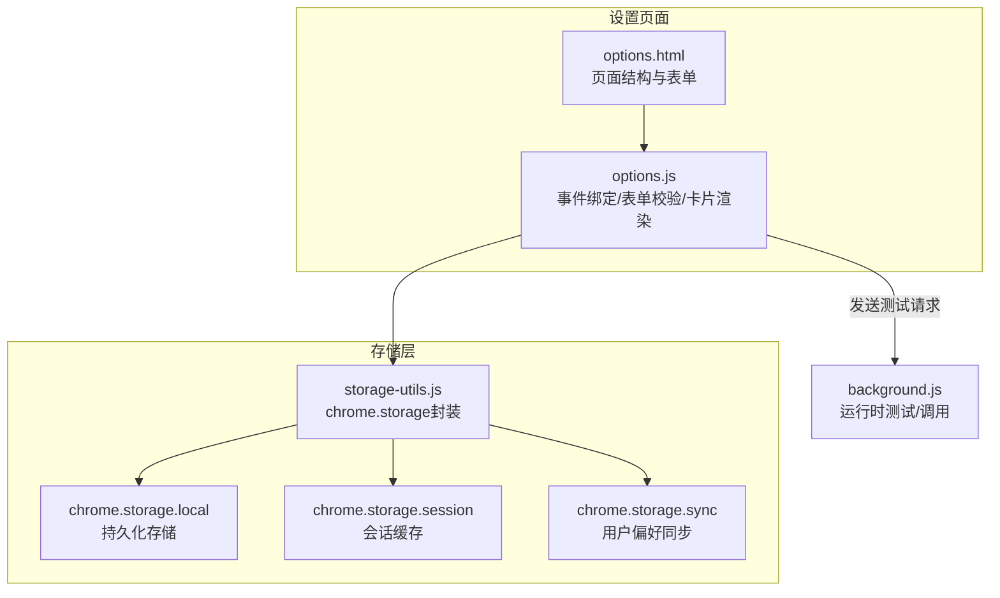
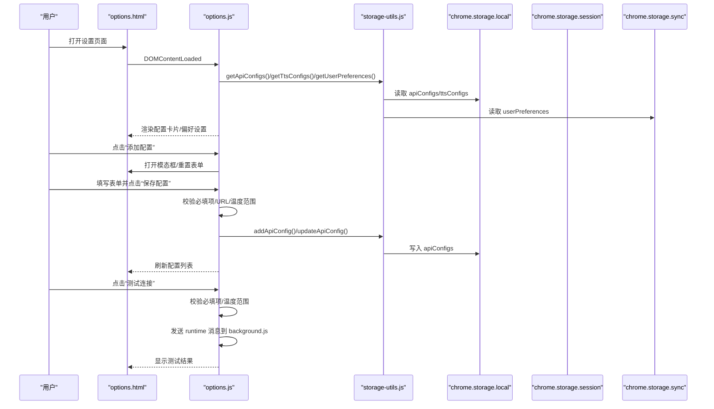
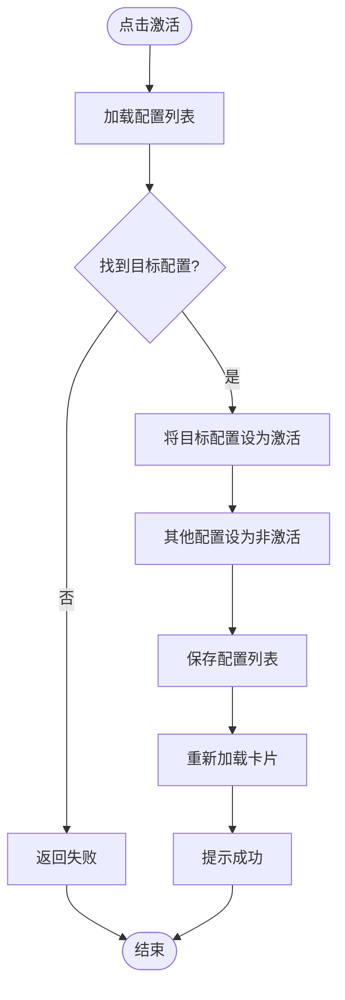
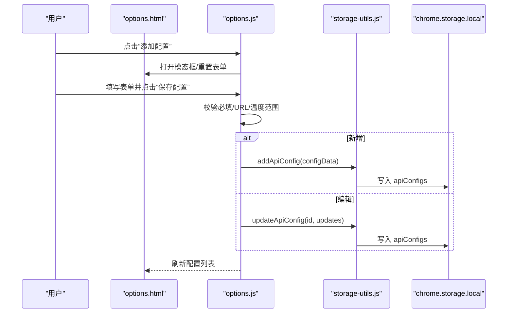
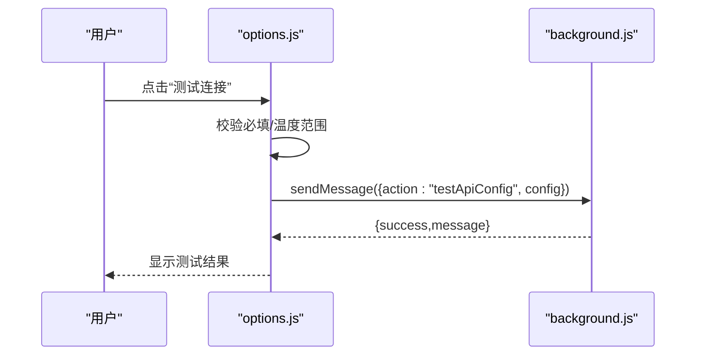
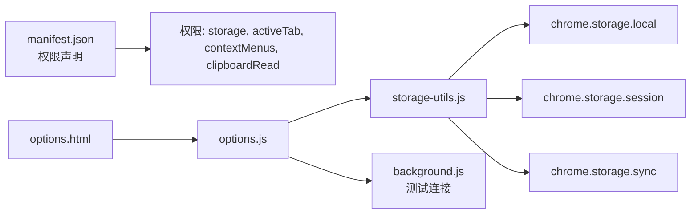

# API配置管理

<cite>
**本文引用的文件**
- [options.html](file://options.html)
- [options.js](file://options.js)
- [storage-utils.js](file://storage-utils.js)
- [manifest.json](file://manifest.json)
- [background.js](file://background.js)
</cite>

## 目录
1. [简介](#简介)
2. [项目结构](#项目结构)
3. [核心组件](#核心组件)
4. [架构总览](#架构总览)
5. [详细组件分析](#详细组件分析)
6. [依赖关系分析](#依赖关系分析)
7. [性能考量](#性能考量)
8. [故障排查指南](#故障排查指南)
9. [结论](#结论)
10. [附录](#附录)

## 简介
本文件面向使用者与开发者，系统化阐述 QuickTrans 插件在设置页面（options.html + options.js）中的 API 配置管理能力。重点覆盖：
- 配置数据模型：配置名称、端点URL、API密钥、模型名称、Temperature参数等
- 配置卡片渲染与激活机制
- 与浏览器存储（chrome.storage）的交互方式
- 添加新配置与编辑现有配置的完整流程
- 表单验证规则（URL格式、Temperature范围）
- 使用指南与安全最佳实践（密钥本地存储、最小暴露原则）

## 项目结构
设置页面采用“视图层 + 控制器 + 存储工具”的分层设计：
- 视图层：options.html 定义页面结构与表单字段
- 控制器：options.js 负责事件绑定、表单校验、卡片渲染、与存储工具交互
- 存储工具：storage-utils.js 封装对 chrome.storage 的读写、激活切换、缓存与Token统计
- 权限声明：manifest.json 声明 storage 权限，确保设置页可访问本地存储

图表来源
- [options.html](file://options.html#L112-L226)
- [options.js](file://options.js#L111-L176)
- [storage-utils.js](file://storage-utils.js#L11-L31)
- [manifest.json](file://manifest.json#L6-L11)

章节来源
- [options.html](file://options.html#L1-L120)
- [options.js](file://options.js#L1-L110)
- [manifest.json](file://manifest.json#L6-L11)

## 核心组件
- 配置数据模型（翻译API）
  - 字段：id、name、apiEndpoint、apiKey、model、temperature、isActive、createdAt、updatedAt
  - 默认值：temperature 默认 0.3；当新增配置且无其他配置时自动设为激活
- 配置数据模型（TTS API）
  - 字段：id、name、provider、apiEndpoint、apiKey、isActive、createdAt、updatedAt
  - provider 特有字段：qwen（model、voice）、openai（openai_model、openai_voice、openai_format）
  - 默认值：provider 默认 qwen；各 provider 的默认模型/音色/格式在存储工具中补齐
- 存储与激活
  - StorageUtils 提供 getApiConfigs/addApiConfig/updateApiConfig/deleteApiConfig/getActiveApiConfig/setActiveApiConfig
  - 同一时刻仅允许一个配置处于激活状态；切换激活会将其他配置置为非激活
- 视图与交互
  - options.js 负责渲染配置卡片、绑定激活/编辑/删除事件、表单提交与测试连接
  - options.html 定义表单字段、模态框、空状态、提示信息与用户偏好设置

章节来源
- [storage-utils.js](file://storage-utils.js#L11-L117)
- [storage-utils.js](file://storage-utils.js#L146-L308)
- [options.js](file://options.js#L181-L243)
- [options.js](file://options.js#L450-L541)
- [options.html](file://options.html#L112-L226)

## 架构总览
设置页面的配置管理遵循“视图-控制器-存储”三层：
- 视图层（options.html）：定义表单字段、模态框、配置卡片容器、空状态与用户偏好区
- 控制器层（options.js）：初始化、事件绑定、表单校验、卡片渲染、激活切换、测试连接
- 存储层（storage-utils.js）：封装 chrome.storage 的读写、激活切换、缓存与Token统计

图表来源
- [options.html](file://options.html#L112-L226)
- [options.js](file://options.js#L111-L176)
- [options.js](file://options.js#L345-L447)
- [storage-utils.js](file://storage-utils.js#L11-L31)
- [manifest.json](file://manifest.json#L6-L11)

## 详细组件分析

### 配置卡片渲染与激活机制
- 翻译API卡片
  - 渲染字段：名称、端点、密钥（掩码显示）、模型、Temperature、创建日期
  - 激活状态以类名 active 标识，卡片标题旁显示“当前使用”徽章
  - 卡片动作：激活、编辑、删除
- TTS API卡片
  - 渲染字段：服务商、端点、密钥（掩码显示）、模型/音色/格式（按 provider 动态展示）
  - 激活状态与翻译API一致
  - 卡片动作：激活、编辑、删除
- 激活机制
  - 点击“激活”按钮后，调用 StorageUtils.setActiveXxxConfig 切换激活配置
  - 切换时会将其他配置置为非激活，保证同一时刻仅有一个激活配置
  - 激活切换后重新加载列表并提示成功

图表来源
- [options.js](file://options.js#L246-L284)
- [options.js](file://options.js#L544-L583)
- [storage-utils.js](file://storage-utils.js#L128-L144)
- [storage-utils.js](file://storage-utils.js#L283-L308)

章节来源
- [options.js](file://options.js#L195-L243)
- [options.js](file://options.js#L450-L541)
- [storage-utils.js](file://storage-utils.js#L128-L144)
- [storage-utils.js](file://storage-utils.js#L283-L308)

### 添加新配置流程（翻译API）
- 打开模态框：点击“添加配置”，重置表单并设置标题为“添加翻译API配置”
- 填写表单：名称、端点、密钥、模型、Temperature
- 校验规则：
  - 必填字段：名称、端点、密钥、模型
  - Temperature 范围：0-2
  - 端点 URL 格式：通过 URL 构造函数校验
- 保存策略：
  - 若为新增：调用 StorageUtils.addApiConfig，自动生成 id、createdAt、updatedAt，并在无其他配置时自动激活
  - 若为编辑：调用 StorageUtils.updateApiConfig，更新指定字段并置更新时间
- 成功后关闭模态框并刷新列表

图表来源
- [options.html](file://options.html#L112-L226)
- [options.js](file://options.js#L286-L343)
- [options.js](file://options.js#L345-L401)
- [storage-utils.js](file://storage-utils.js#L32-L91)

章节来源
- [options.html](file://options.html#L112-L226)
- [options.js](file://options.js#L286-L401)
- [storage-utils.js](file://storage-utils.js#L32-L91)

### 编辑现有配置流程（翻译API）
- 在配置卡片上点击“编辑”，定位到对应配置并填充表单
- 修改后保存，触发 updateApiConfig 并刷新列表
- 若切换为激活，其他配置自动置为非激活

章节来源
- [options.js](file://options.js#L260-L284)
- [options.js](file://options.js#L310-L318)
- [storage-utils.js](file://storage-utils.js#L66-L91)

### 添加新配置流程（TTS API）
- 打开模态框：选择服务商（qwen/openai），动态显示对应字段
- 填写表单：名称、服务商、端点、密钥、模型/音色/格式（按服务商）
- 校验规则：
  - 必填字段：名称、服务商、端点、密钥
  - 端点 URL 格式：通过 URL 构造函数校验
- 保存策略：
  - 新增：自动生成 id、createdAt、updatedAt；provider 不同则写入对应字段
  - 更新：保留 createdAt，更新 updatedAt

章节来源
- [options.html](file://options.html#L207-L350)
- [options.js](file://options.js#L585-L668)
- [options.js](file://options.js#L669-L731)
- [storage-utils.js](file://storage-utils.js#L146-L227)

### 编辑现有配置流程（TTS API）
- 在配置卡片上点击“编辑”，根据 provider 动态显示字段并填充
- 修改后保存，触发 updateTtsConfig 并刷新列表

章节来源
- [options.js](file://options.js#L544-L583)
- [options.js](file://options.js#L609-L632)
- [storage-utils.js](file://storage-utils.js#L229-L281)

### 表单验证规则
- 翻译API
  - 必填字段：名称、端点、密钥、模型
  - Temperature：数值，范围 0-2
  - 端点 URL：需能被 URL 构造函数解析
- TTS API
  - 必填字段：名称、服务商、端点、密钥
  - 端点 URL：需能被 URL 构造函数解析
- 用户偏好
  - 文字长度限制：最小 100，最大 50000，超出范围将被裁剪至边界值

章节来源
- [options.js](file://options.js#L358-L377)
- [options.js](file://options.js#L420-L424)
- [options.js](file://options.js#L694-L707)
- [options.js](file://options.js#L766-L774)

### 测试连接流程
- 从表单读取配置（端点、密钥、模型、Temperature）
- 校验必填与温度范围
- 通过 runtime 发送消息到 background.js 进行连通性测试
- 根据返回结果提示成功或失败

图表来源
- [options.js](file://options.js#L403-L447)
- [background.js](file://background.js#L247-L278)

章节来源
- [options.js](file://options.js#L403-L447)
- [background.js](file://background.js#L247-L278)

### 与浏览器存储交互
- 翻译API配置
  - 读取：StorageUtils.getApiConfigs
  - 新增：StorageUtils.addApiConfig（自动生成 id、createdAt、updatedAt；首个配置自动激活）
  - 更新：StorageUtils.updateApiConfig（更新 updatedAt；若设为激活则其他置非激活）
  - 删除：StorageUtils.deleteApiConfig（若删除的是激活配置且仍有其他配置，则激活第一个）
  - 激活：StorageUtils.setActiveApiConfig（切换激活）
- TTS API配置
  - 读取：StorageUtils.getTtsConfigs（兼容旧配置，补齐 provider 与默认字段）
  - 新增/更新/删除/激活：与翻译API类似，按 provider 写入对应字段
- 用户偏好
  - 读取/更新：StorageUtils.getUserPreferences()/updateUserPreferences()
  - 存储位置：chrome.storage.sync
- 缓存与Token统计
  - 翻译缓存：chrome.storage.session（会话存储，浏览器关闭后自动清空）
  - Token统计：chrome.storage.local（本地持久化）

章节来源
- [storage-utils.js](file://storage-utils.js#L11-L117)
- [storage-utils.js](file://storage-utils.js#L146-L308)
- [storage-utils.js](file://storage-utils.js#L310-L517)

## 依赖关系分析
- 权限与宿主
  - manifest.json 声明 storage、activeTab、contextMenus、clipboardRead 权限
  - host_permissions 支持 http/https 匹配
- 设置页依赖
  - options.html 引入 storage-utils.js、language-detector.js、options.js
  - options.js 依赖 StorageUtils、LanguageDetector、chrome.runtime（测试连接）
- 存储依赖
  - StorageUtils 依赖 chrome.storage.local/session/sync

图表来源
- [manifest.json](file://manifest.json#L6-L11)
- [options.html](file://options.html#L459-L469)
- [options.js](file://options.js#L111-L176)
- [storage-utils.js](file://storage-utils.js#L11-L31)

章节来源
- [manifest.json](file://manifest.json#L6-L11)
- [options.html](file://options.html#L459-L469)
- [options.js](file://options.js#L111-L176)

## 性能考量
- 渲染优化
  - 配置列表一次性渲染，避免频繁 DOM 操作
  - 激活切换仅更新目标配置与列表重载，复杂度 O(n)
- 存储优化
  - 翻译缓存使用 session 存储，自动清理，避免长期占用空间
  - Token统计仅在本地持久化，避免网络传输
- 交互体验
  - 表单提交与测试连接期间禁用按钮并显示文案变化，防止重复提交
  - Toast 提示统一管理，避免阻塞用户操作

[本节为通用建议，不直接分析具体文件]

## 故障排查指南
- 无法保存配置
  - 检查必填字段是否填写完整
  - 检查 Temperature 是否在 0-2 范围内
  - 检查端点 URL 是否有效
  - 查看控制台错误日志
- 无法切换激活
  - 确认目标配置是否存在
  - 检查存储是否可用（chrome.storage.local）
- 测试连接失败
  - 确认端点、密钥、模型、Temperature 均已正确填写
  - 查看 background.js 返回的错误码与提示（如 INVALID_API_KEY、RATE_LIMIT、SERVICE_UNAVAILABLE）
- 密钥泄露风险
  - 密钥仅存储在本地浏览器中，不上传到服务器
  - 建议定期轮换密钥，避免长期使用同一密钥
  - 不要在公共设备上保存敏感密钥

章节来源
- [options.js](file://options.js#L358-L401)
- [options.js](file://options.js#L694-L731)
- [options.js](file://options.js#L403-L447)
- [background.js](file://background.js#L247-L278)

## 结论
QuickTrans 的设置页面提供了完整的 API 配置管理能力：清晰的数据模型、直观的卡片渲染、严格的表单校验、可靠的存储交互与便捷的测试连接。通过合理的激活机制与最小暴露原则（密钥掩码、本地存储），在保障易用性的同时兼顾安全性。

[本节为总结性内容，不直接分析具体文件]

## 附录

### 配置数据模型一览
- 翻译API
  - 字段：id、name、apiEndpoint、apiKey、model、temperature、isActive、createdAt、updatedAt
  - 默认值：temperature=0.3；首条配置自动激活
- TTS API
  - 字段：id、name、provider、apiEndpoint、apiKey、isActive、createdAt、updatedAt
  - provider=qwen：model、voice
  - provider=openai：openai_model、openai_voice、openai_format
- 用户偏好
  - lastTargetLanguage、displayMode、autoShowPopup（兼容字段）、maxTextLength

章节来源
- [storage-utils.js](file://storage-utils.js#L11-L117)
- [storage-utils.js](file://storage-utils.js#L146-L308)
- [options.js](file://options.js#L733-L785)