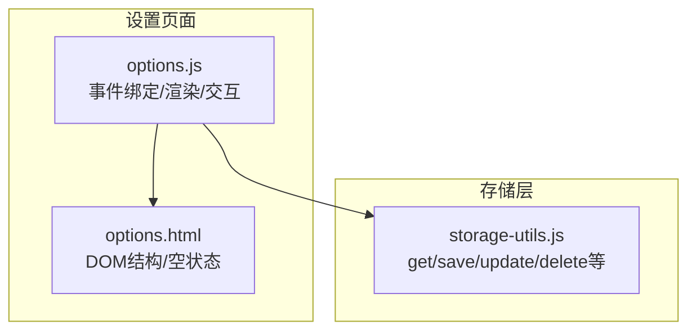
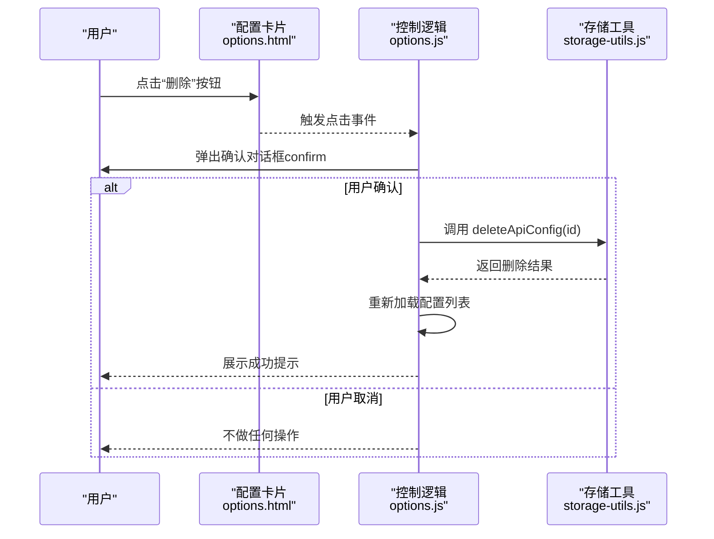
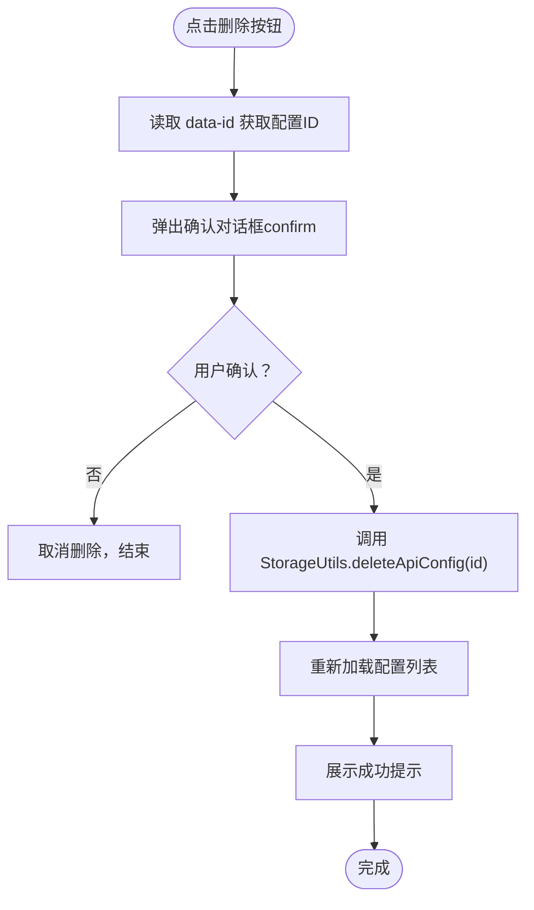
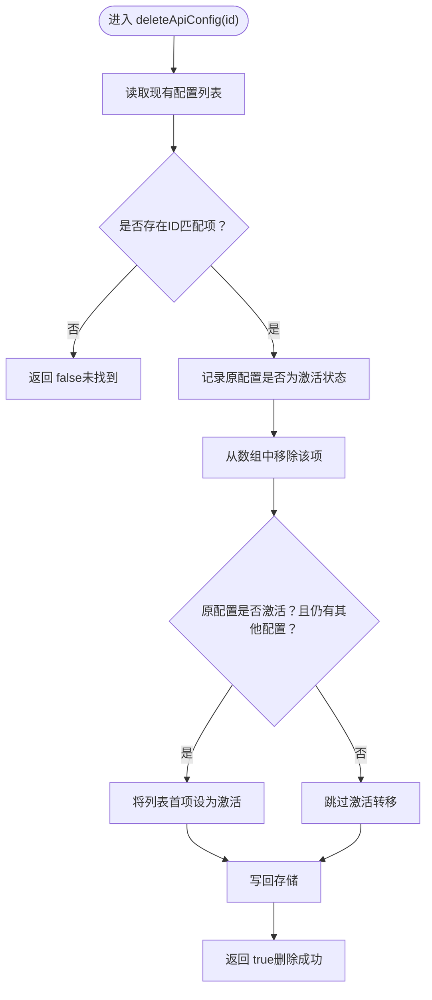
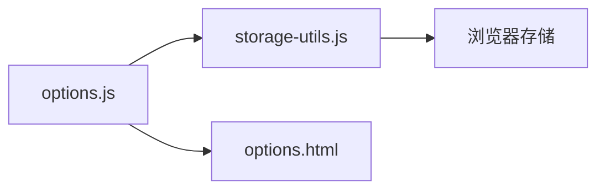

# 配置删除

<cite>
**本文引用的文件**
- [options.js](file://options.js)
- [storage-utils.js](file://storage-utils.js)
- [options.html](file://options.html)
</cite>

## 目录
1. [简介](#简介)
2. [项目结构](#项目结构)
3. [核心组件](#核心组件)
4. [架构总览](#架构总览)
5. [详细组件分析](#详细组件分析)
6. [依赖关系分析](#依赖关系分析)
7. [性能考量](#性能考量)
8. [故障排查指南](#故障排查指南)
9. [结论](#结论)
10. [附录](#附录)

## 简介
本篇文档聚焦于“配置删除”功能，围绕 options.js 中的删除按钮事件绑定机制（bindConfigCardEvents）与用户确认对话框（confirm）的使用，深入解析 StorageUtils.deleteApiConfig 的实现逻辑，包括：
- 从配置列表中移除指定 ID 的配置
- 处理被删除配置为激活状态时的默认激活转移（激活列表中的第一个配置）
- 持久化更新后的配置列表
- 删除操作对系统状态的影响，如删除最后一个配置时的空状态显示
- 删除请求的调用方式与错误处理
- 强调该操作的不可逆性，并给出避免误删的操作建议

## 项目结构
与“配置删除”直接相关的核心文件如下：
- options.js：设置页面逻辑，负责渲染配置卡片、绑定事件、调用存储工具执行删除
- storage-utils.js：封装浏览器存储读写与配置管理，提供删除 API 配置的方法
- options.html：页面模板，包含空状态占位与配置卡片容器

图表来源
- [options.js](file://options.js#L180-L200)
- [storage-utils.js](file://storage-utils.js#L94-L117)
- [options.html](file://options.html#L56-L80)

章节来源
- [options.js](file://options.js#L180-L200)
- [storage-utils.js](file://storage-utils.js#L94-L117)
- [options.html](file://options.html#L56-L80)

## 核心组件
- 删除按钮事件绑定：在配置卡片渲染后，为每个删除按钮绑定点击事件，触发用户确认与删除流程
- 用户确认对话框：使用浏览器内置 confirm 进行二次确认，防止误删
- 存储工具删除方法：从本地存储中移除指定 ID 的配置，并在必要时转移激活状态
- 空状态显示：当配置列表为空时，展示“空状态”占位，引导用户添加配置

章节来源
- [options.js](file://options.js#L247-L284)
- [storage-utils.js](file://storage-utils.js#L94-L117)
- [options.html](file://options.html#L56-L80)

## 架构总览
删除流程涉及三层协作：
- 视图层（options.html）：承载配置卡片与空状态
- 控制层（options.js）：负责事件绑定、用户交互、调用存储工具
- 存储层（storage-utils.js）：负责实际的数据持久化与状态管理

图表来源
- [options.js](file://options.js#L273-L284)
- [storage-utils.js](file://storage-utils.js#L94-L117)

## 详细组件分析

### 删除按钮事件绑定机制（bindConfigCardEvents）
- 在配置列表渲染完成后，调用 bindConfigCardEvents 为每个删除按钮绑定点击事件
- 点击事件中：
  - 从事件目标的 data-id 属性提取待删除配置的 ID
  - 弹出 confirm 确认对话框
  - 若用户确认，则调用 StorageUtils.deleteApiConfig(id)
  - 成功删除后，重新加载配置列表并展示成功提示

图表来源
- [options.js](file://options.js#L273-L284)

章节来源
- [options.js](file://options.js#L196-L200)
- [options.js](file://options.js#L247-L284)

### 用户确认对话框（confirm）使用
- 在删除按钮点击事件中，使用 confirm 对话框进行二次确认
- 若用户点击取消，直接返回，不执行删除
- 该设计有效降低误删风险

章节来源
- [options.js](file://options.js#L273-L284)

### StorageUtils.deleteApiConfig 实现逻辑
- 从本地存储读取全部翻译 API 配置
- 查找匹配 ID 的配置项，若不存在则返回失败
- 记录被删除配置是否处于激活状态
- 从数组中移除该配置
- 若被删除配置为激活状态且列表仍存在其他配置，则将列表首项设为激活
- 将更新后的配置数组写回本地存储，返回成功

图表来源
- [storage-utils.js](file://storage-utils.js#L94-L117)

章节来源
- [storage-utils.js](file://storage-utils.js#L94-L117)

### 删除对系统状态的影响
- 删除后立即重新加载配置列表，确保视图与存储一致
- 当配置列表为空时，显示“空状态”占位，引导用户添加新配置
- 若删除的是当前激活配置，且列表中仍有其他配置，则自动激活列表首项，保证系统始终有一个可用的默认配置

章节来源
- [options.js](file://options.js#L180-L200)
- [options.html](file://options.html#L56-L80)
- [storage-utils.js](file://storage-utils.js#L107-L114)

### 删除请求的调用方式与错误处理
- 调用方式：在 options.js 的删除事件回调中，直接调用 StorageUtils.deleteApiConfig(id)，随后刷新界面
- 错误处理：
  - StorageUtils.deleteApiConfig 返回布尔值，表示删除是否成功
  - options.js 在删除成功后统一展示成功提示；未显式处理失败场景，可在上层扩展统一错误提示
- 注意：删除操作为本地持久化操作，无网络请求参与

章节来源
- [options.js](file://options.js#L273-L284)
- [storage-utils.js](file://storage-utils.js#L94-L117)

### 不可逆性与误删防护
- 删除操作不可逆：配置从本地存储中移除，无法通过前端界面恢复
- 误删防护：
  - 使用 confirm 进行二次确认
  - 删除后自动刷新列表，便于用户核对
  - 建议在删除前先备份或确认不再需要该配置

章节来源
- [options.js](file://options.js#L273-L284)

## 依赖关系分析
- options.js 依赖 storage-utils.js 提供的删除 API 配置能力
- options.js 依赖 options.html 的 DOM 结构（配置卡片、空状态容器）
- 删除流程的耦合度低，控制层仅负责事件与调用，存储层负责数据一致性与状态转移

图表来源
- [options.js](file://options.js#L247-L284)
- [storage-utils.js](file://storage-utils.js#L94-L117)
- [options.html](file://options.html#L56-L80)

章节来源
- [options.js](file://options.js#L247-L284)
- [storage-utils.js](file://storage-utils.js#L94-L117)
- [options.html](file://options.html#L56-L80)

## 性能考量
- 删除操作为内存数组操作与一次存储写入，复杂度为 O(n)（查找）+ O(1)（移除）+ O(1)（可能的首项激活），整体高效
- 重新加载配置列表会触发 DOM 重建，但配置数量有限，影响可忽略
- 若配置数量增长到较大规模，可考虑局部更新 DOM 或批量更新策略

## 故障排查指南
- 删除无效
  - 确认事件已正确绑定：检查配置卡片渲染后是否调用了 bindConfigCardEvents
  - 确认 data-id 正确：删除按钮应带有 data-id 属性
  - 确认 confirm 未被误取消
- 删除后未显示空状态
  - 检查 loadConfigs 是否在删除后被调用
  - 确认空状态容器的显示逻辑（当配置列表为空时显示空状态）
- 删除后激活状态异常
  - 若删除的是当前激活配置且列表仍有其他配置，应自动激活首项
  - 如未生效，检查存储层的激活转移逻辑

章节来源
- [options.js](file://options.js#L180-L200)
- [options.js](file://options.js#L247-L284)
- [storage-utils.js](file://storage-utils.js#L107-L114)

## 结论
配置删除功能通过“事件绑定 + 用户确认 + 存储删除 + 状态转移”的组合，实现了安全、直观且可恢复的用户体验。其核心在于：
- 明确的二次确认机制
- 完备的状态转移（删除激活配置时自动激活首项）
- 空状态引导与即时刷新
- 本地持久化，简单可靠

## 附录
- 删除流程的关键路径参考：
  - 事件绑定：[options.js](file://options.js#L247-L284)
  - 删除调用：[options.js](file://options.js#L273-L284)
  - 存储删除：[storage-utils.js](file://storage-utils.js#L94-L117)
  - 空状态显示：[options.html](file://options.html#L56-L80)