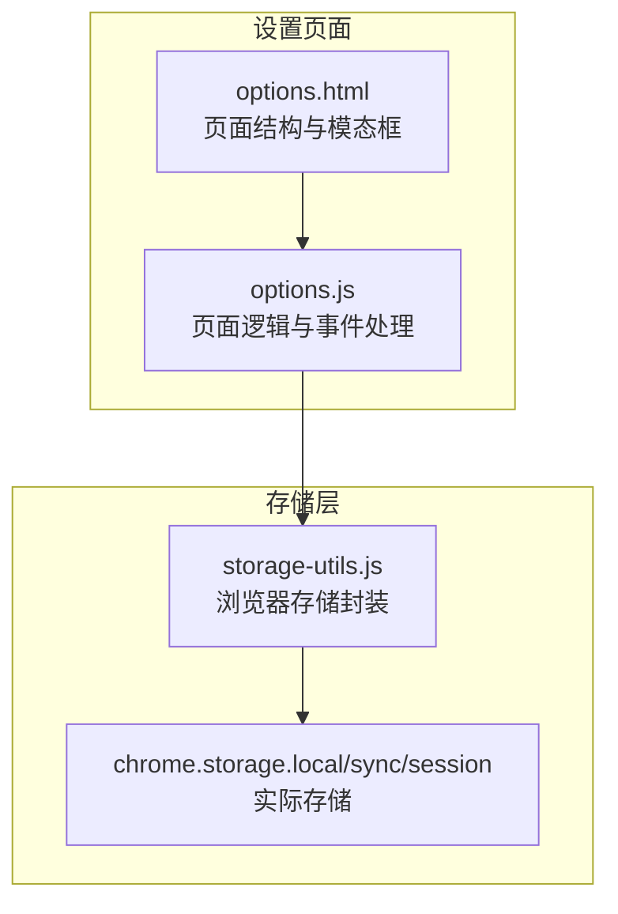
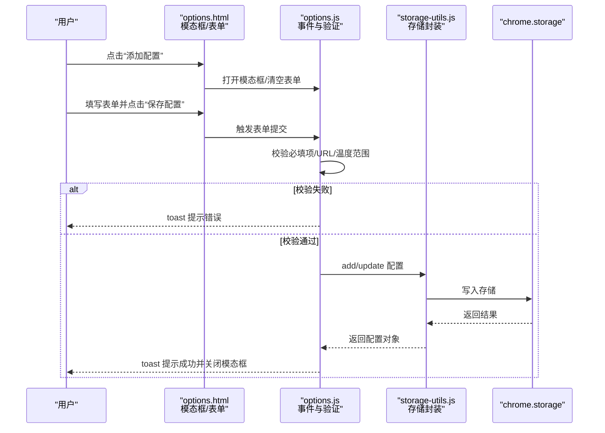
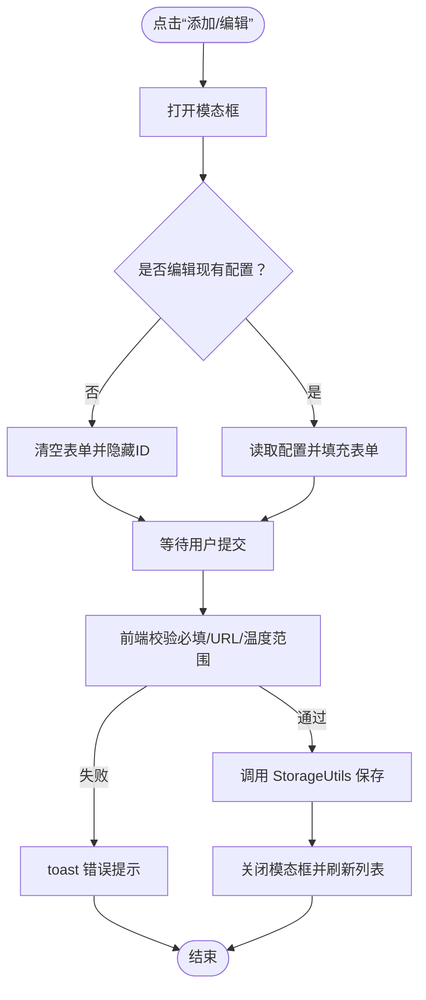
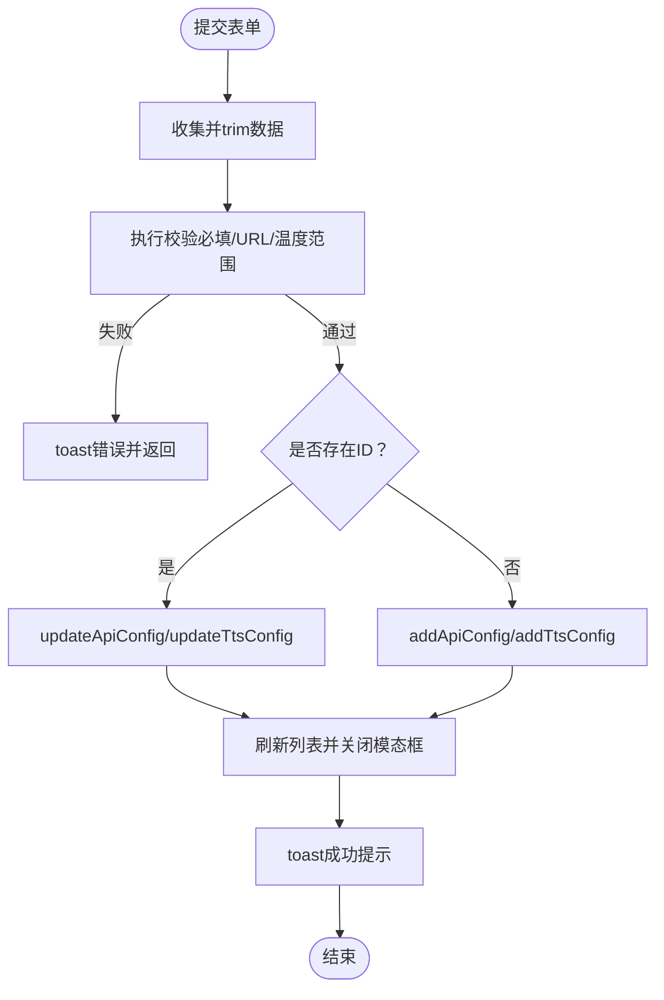
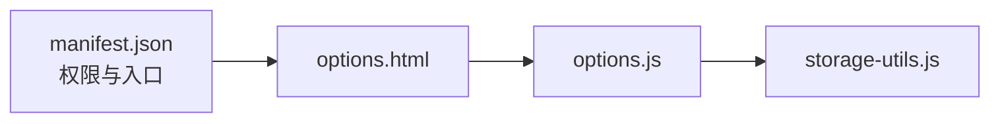

# 配置添加与编辑

<cite>
**本文引用的文件**
- [options.html](file://options.html)
- [options.js](file://options.js)
- [storage-utils.js](file://storage-utils.js)
- [manifest.json](file://manifest.json)
</cite>

## 目录
1. [简介](#简介)
2. [项目结构](#项目结构)
3. [核心组件](#核心组件)
4. [架构总览](#架构总览)
5. [详细组件分析](#详细组件分析)
6. [依赖关系分析](#依赖关系分析)
7. [性能考量](#性能考量)
8. [故障排查指南](#故障排查指南)
9. [结论](#结论)

## 简介
本文件围绕设置页面（options.html）中的“API配置添加与编辑”功能展开，重点解释：
- 在 options.js 中实现的模态框（modal）机制，覆盖“添加新配置”和“编辑现有配置”的完整流程；
- 表单字段（配置名称、端点URL、API密钥、模型名称、Temperature参数）的输入验证规则（URL格式校验、Temperature范围校验）；
- 如何通过 StorageUtils.addApiConfig 与 StorageUtils.updateApiConfig 方法与浏览器存储交互；
- 表单数据如何映射到配置对象，以及默认值设置（如 temperature 默认为 0.3）；
- 密钥字段的可见性切换功能（toggleApiKeyVisibility/toggleTtsApiKeyVisibility）及安全注意事项；
- 表单提交处理逻辑（handleFormSubmit/handleTtsFormSubmit）中的错误处理与用户反馈（toast 提示）。

## 项目结构
设置页面采用“HTML + JS + 存储工具”的三层结构：
- options.html：定义页面布局、模态框、表单字段与交互入口；
- options.js：负责页面初始化、事件绑定、模态框控制、表单提交与验证、用户反馈等；
- storage-utils.js：封装浏览器存储（chrome.storage）访问，提供配置的增删改查与默认值兼容处理；
- manifest.json：声明权限与页面入口，确保设置页可访问存储能力。

图表来源
- [options.html](file://options.html#L1-L120)
- [options.js](file://options.js#L1-L120)
- [storage-utils.js](file://storage-utils.js#L1-L60)
- [manifest.json](file://manifest.json#L1-L30)

章节来源
- [options.html](file://options.html#L1-L120)
- [options.js](file://options.js#L1-L120)
- [storage-utils.js](file://storage-utils.js#L1-L60)
- [manifest.json](file://manifest.json#L1-L30)

## 核心组件
- 模态框与表单
  - 翻译API配置模态框：包含配置名称、端点URL、API密钥、模型名称、Temperature、隐藏ID字段；
  - TTS API配置模态框：包含配置名称、服务商（qwen/openai）、端点URL、API密钥、各服务商特有字段（模型、音色、格式等）。
- 事件绑定
  - “添加配置”按钮打开模态框并清空表单；
  - “编辑”按钮填充表单并进入更新流程；
  - “测试连接”按钮对当前表单数据进行连通性测试；
  - ESC键关闭模态框。
- 存储交互
  - 添加/更新翻译API配置：StorageUtils.addApiConfig / StorageUtils.updateApiConfig；
  - 添加/更新TTS配置：StorageUtils.addTtsConfig / StorageUtils.updateTtsConfig；
  - 默认值与兼容性：温度默认值、TTS默认服务商与字段、激活状态一致性。

章节来源
- [options.html](file://options.html#L112-L204)
- [options.html](file://options.html#L206-L350)
- [options.js](file://options.js#L111-L176)
- [options.js](file://options.js#L286-L342)
- [options.js](file://options.js#L346-L401)
- [options.js](file://options.js#L670-L731)
- [storage-utils.js](file://storage-utils.js#L32-L117)
- [storage-utils.js](file://storage-utils.js#L188-L281)

## 架构总览
下图展示了从用户操作到存储写入的关键路径，以及验证与反馈流程。

图表来源
- [options.html](file://options.html#L112-L204)
- [options.js](file://options.js#L111-L176)
- [options.js](file://options.js#L346-L401)
- [storage-utils.js](file://storage-utils.js#L32-L117)

## 详细组件分析

### 模态框机制（添加与编辑）
- 打开模态框
  - 添加新配置：清空表单并设置标题为“添加配置”，隐藏ID字段；
  - 编辑现有配置：根据选中配置填充表单，设置标题为“编辑配置”，保留ID以便更新。
- 关闭模态框
  - 点击关闭按钮、遮罩或ESC键均会关闭模态框并重置表单。
- 编辑流程
  - 点击“编辑”按钮后，从存储读取配置并填充表单；
  - 提交时根据是否存在ID判断是新增还是更新。

图表来源
- [options.js](file://options.js#L111-L176)
- [options.js](file://options.js#L286-L342)
- [options.js](file://options.js#L346-L401)

章节来源
- [options.js](file://options.js#L111-L176)
- [options.js](file://options.js#L286-L342)

### 表单字段与验证规则
- 翻译API配置字段
  - 配置名称：必填；
  - 端点URL：必填，需为有效URL；
  - API密钥：必填；
  - 模型名称：必填；
  - Temperature：必填，数值范围 0-2。
- TTS API配置字段
  - 配置名称：必填；
  - 服务商：必填（qwen 或 openai）；
  - 端点URL：必填，需为有效URL；
  - API密钥：必填；
  - 服务商特有字段：按所选服务商显示对应字段（模型、音色、格式等）。
- 验证策略
  - 必填字段校验：任一为空则提示错误；
  - URL格式校验：使用构造函数尝试解析，失败则提示；
  - Temperature范围校验：NaN或不在[0,2]区间则提示；
  - TTS配置中，根据服务商动态拼装字段并进行URL校验。

章节来源
- [options.html](file://options.html#L112-L204)
- [options.html](file://options.html#L206-L350)
- [options.js](file://options.js#L346-L401)
- [options.js](file://options.js#L670-L731)

### 配置对象结构与默认值
- 翻译API配置对象
  - 关键字段：id、name、apiEndpoint、apiKey、model、temperature、isActive、createdAt、updatedAt；
  - 默认值与兼容性：
    - temperature 默认 0.3；
    - 若新增配置为首个配置，则自动设为激活；
    - 设为激活时，其他配置将被取消激活。
- TTS配置对象
  - 关键字段：id、name、provider、apiEndpoint、apiKey、isActive、createdAt、updatedAt；
  - 默认值与兼容性：
    - provider 默认 qwen；
    - qwen：model 默认 qwen3-tts-flash，voice 默认 Cherry；
    - openai：openai_model 默认 tts-1，openai_voice 默认 alloy，openai_format 默认 mp3；
    - 新增配置若为首个配置则自动激活，激活切换时同步更新其他配置。
- 表单到对象映射
  - 翻译API：表单字段 trim 后直接映射到配置对象；temperature 通过 parseFloat 解析；
  - TTS：根据 provider 动态拼装字段（model/voice/openai_*），其余字段直接映射。

章节来源
- [storage-utils.js](file://storage-utils.js#L32-L117)
- [storage-utils.js](file://storage-utils.js#L146-L281)
- [options.js](file://options.js#L346-L401)
- [options.js](file://options.js#L670-L731)

### 与浏览器存储的交互（StorageUtils）
- 翻译API
  - addApiConfig：生成唯一ID、设置默认值与激活状态、写入存储；
  - updateApiConfig：定位配置并合并更新，必要时同步取消其他配置的激活；
  - getApiConfigs：读取并兼容旧配置（补全默认字段）。
- TTS
  - addTtsConfig：生成唯一ID、根据provider设置默认字段、写入存储；
  - updateTtsConfig：定位配置并合并更新，必要时同步取消其他配置的激活；
  - getTtsConfigs：读取并兼容旧配置（补全默认字段与provider）。
- 存储类型
  - 配置类数据使用 local 存储；
  - 用户偏好使用 sync 存储；
  - 翻译缓存使用 session 存储（自动清理）。

章节来源
- [storage-utils.js](file://storage-utils.js#L1-L60)
- [storage-utils.js](file://storage-utils.js#L32-L117)
- [storage-utils.js](file://storage-utils.js#L146-L281)
- [manifest.json](file://manifest.json#L1-L30)

### 密钥可见性切换与安全建议
- 切换机制
  - 翻译API密钥：点击“显示/隐藏”按钮，切换 input 的 type（password/text）；
  - TTS API密钥：同上。
- 安全建议
  - 密钥仅在内存中切换显示，不改变存储；
  - 建议在多人共用设备上谨慎使用“显示”功能；
  - 避免在公共场合截图或录屏包含密钥；
  - 建议定期轮换密钥并限制权限范围。

章节来源
- [options.html](file://options.html#L146-L164)
- [options.html](file://options.html#L254-L272)
- [options.js](file://options.js#L332-L342)
- [options.js](file://options.js#L320-L331)

### 表单提交处理与用户反馈
- 提交流程
  - 阻止默认提交；
  - 收集表单数据并 trim；
  - 执行字段级校验（必填、URL、温度范围）；
  - 根据是否存在ID决定新增或更新；
  - 调用 StorageUtils 并捕获异常；
  - 成功后关闭模态框并刷新列表，失败则 toast 提示。
- 用户反馈
  - 使用 toast 组件显示成功/错误/警告信息；
  - 成功提示自动消失（3秒）；
  - 按钮禁用与文案切换提升交互体验。

图表来源
- [options.js](file://options.js#L346-L401)
- [options.js](file://options.js#L670-L731)
- [options.js](file://options.js#L787-L809)

章节来源
- [options.js](file://options.js#L346-L401)
- [options.js](file://options.js#L670-L731)
- [options.js](file://options.js#L787-L809)

## 依赖关系分析
- 权限与入口
  - manifest.json 声明 storage 权限与设置页入口；
  - options.html 引入 storage-utils.js、language-detector.js、options.js。
- 模块耦合
  - options.js 依赖 storage-utils.js 进行持久化；
  - options.html 作为 UI 层，通过事件驱动 options.js；
  - 低耦合高内聚：验证、存储、渲染职责分离。

图表来源
- [manifest.json](file://manifest.json#L1-L30)
- [options.html](file://options.html#L459-L468)
- [options.js](file://options.js#L1-L120)
- [storage-utils.js](file://storage-utils.js#L1-L60)

章节来源
- [manifest.json](file://manifest.json#L1-L30)
- [options.html](file://options.html#L459-L468)
- [options.js](file://options.js#L1-L120)
- [storage-utils.js](file://storage-utils.js#L1-L60)

## 性能考量
- 表单校验在前端即时完成，减少无效网络请求；
- 存储写入批量合并（更新时仅写入变更字段），降低IO压力；
- 列表渲染采用一次性 innerHTML 拼接，避免频繁DOM操作；
- 缓存使用 session 存储，自动清理，避免长期占用空间。

## 故障排查指南
- 无法保存配置
  - 检查必填字段是否填写完整；
  - 确认端点URL格式正确；
  - 确认Temperature在 0-2 区间；
  - 查看 toast 错误提示并修正。
- 无法打开模态框
  - 确认“添加配置”按钮事件已绑定；
  - 检查 ESC 键关闭逻辑是否生效。
- 密钥显示异常
  - 确认切换按钮事件已绑定；
  - 检查 input 类型切换逻辑。
- 存储读写问题
  - 检查 manifest.json 权限声明；
  - 确认 chrome.storage 可用（浏览器扩展沙盒环境）。

章节来源
- [options.js](file://options.js#L111-L176)
- [options.js](file://options.js#L332-L342)
- [options.js](file://options.js#L346-L401)
- [manifest.json](file://manifest.json#L1-L30)

## 结论
本功能通过清晰的模态框流程、严格的前端校验与统一的存储封装，实现了“添加/编辑API配置”的易用性与可靠性。默认值与兼容性处理保证了历史配置的平滑过渡；密钥可见性切换兼顾了便利性与安全性；toast 反馈提升了用户体验。建议在生产环境中持续关注浏览器存储限额与权限变化，确保功能稳定运行。