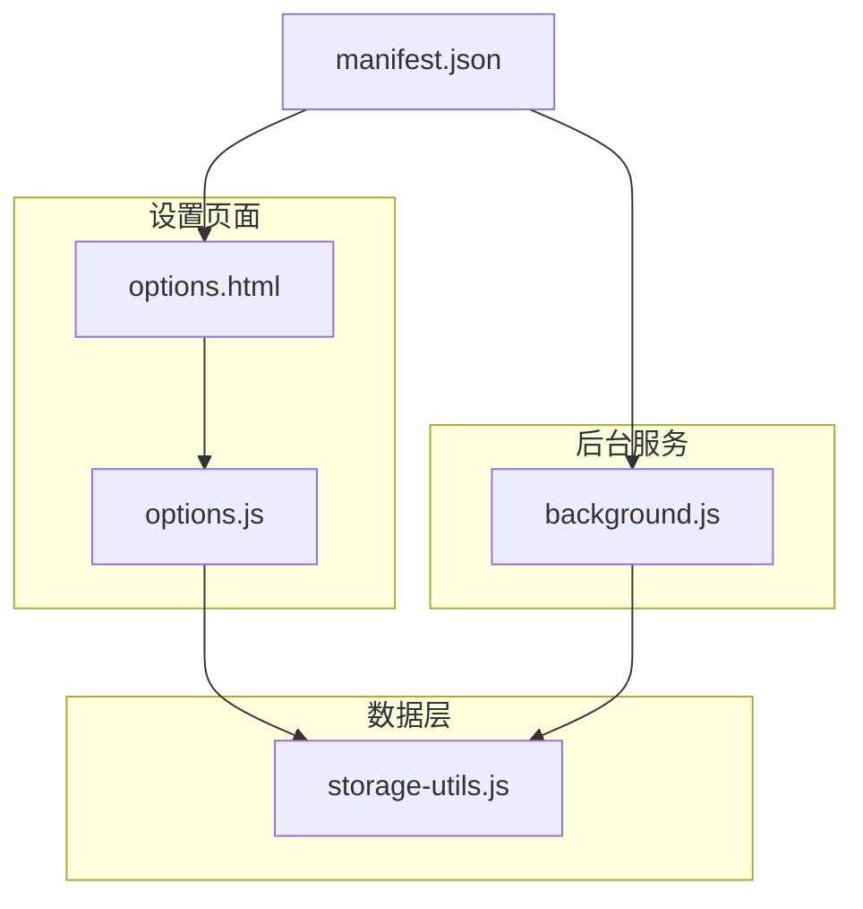
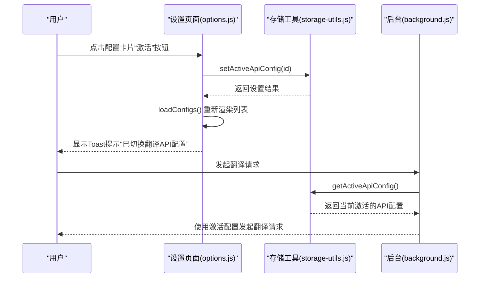
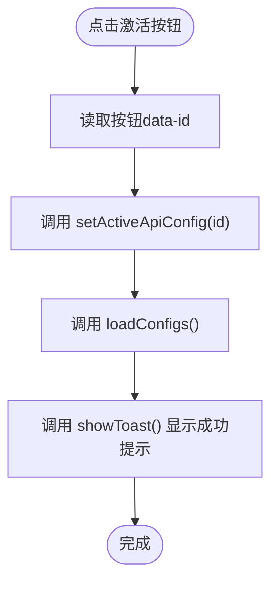
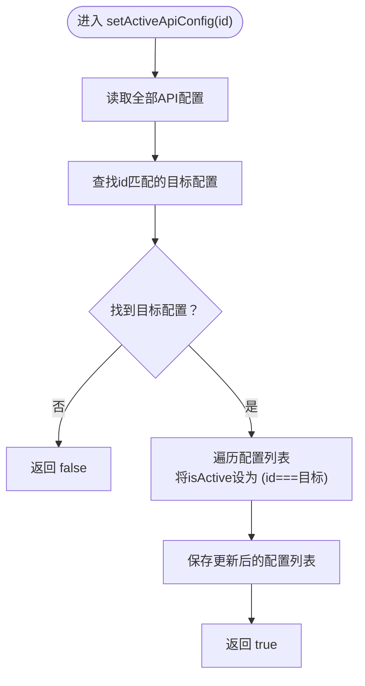
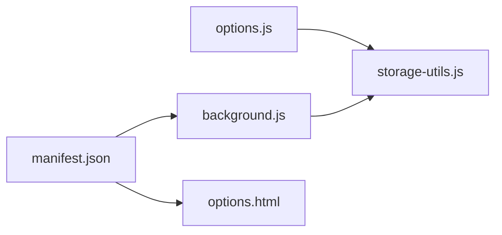

# 配置激活

<cite>
**本文引用的文件**
- [storage-utils.js](file://storage-utils.js)
- [options.js](file://options.js)
- [options.html](file://options.html)
- [background.js](file://background.js)
- [manifest.json](file://manifest.json)
</cite>

## 目录
1. [简介](#简介)
2. [项目结构](#项目结构)
3. [核心组件](#核心组件)
4. [架构总览](#架构总览)
5. [详细组件分析](#详细组件分析)
6. [依赖关系分析](#依赖关系分析)
7. [性能考量](#性能考量)
8. [故障排查指南](#故障排查指南)
9. [结论](#结论)

## 简介
本篇文档围绕“配置激活”机制展开，聚焦于翻译API配置的激活按钮UI逻辑、事件绑定、StorageUtils.setActiveApiConfig的实现细节，以及激活状态在系统中的作用。我们将解释：
- 配置卡片上的“激活”按钮仅在非激活配置上显示；
- 事件绑定函数bindConfigCardEvents如何处理激活按钮点击；
- StorageUtils.setActiveApiConfig如何在配置列表中定位目标配置，并将目标配置的isActive设为true，同时将其他配置的isActive设为false；
- 激活操作完成后，配置列表的重新加载与用户反馈；
- 激活状态在系统中的作用：background.js在发起翻译请求时会使用当前激活的API配置；
- 提供激活状态的查询与更新流程的代码示例路径。

## 项目结构
QuickTrans采用Manifest V3架构，核心文件如下：
- options.html/options.js：设置页面，负责展示与管理API配置卡片、表单与交互；
- storage-utils.js：统一的数据访问层，封装对chrome.storage的读写与配置管理；
- background.js：后台服务脚本，负责翻译请求、TTS请求与缓存管理；
- manifest.json：声明权限、后台脚本与入口页面。

图表来源
- [options.html](file://options.html#L1-L470)
- [options.js](file://options.js#L1-L120)
- [storage-utils.js](file://storage-utils.js#L1-L60)
- [background.js](file://background.js#L1-L40)
- [manifest.json](file://manifest.json#L1-L52)

章节来源
- [options.html](file://options.html#L1-L120)
- [options.js](file://options.js#L1-L120)
- [storage-utils.js](file://storage-utils.js#L1-L60)
- [background.js](file://background.js#L1-L40)
- [manifest.json](file://manifest.json#L1-L52)

## 核心组件
- 配置卡片渲染与激活按钮显示逻辑：在options.js中，createConfigCard根据配置的isActive属性决定是否渲染“激活”按钮；当配置处于激活状态时，卡片标题旁会显示“当前使用”徽章。
- 事件绑定：bindConfigCardEvents为所有“.activate-btn”按钮绑定点击事件，点击后调用StorageUtils.setActiveApiConfig(id)，随后重新加载配置列表并显示Toast提示。
- 存储工具：StorageUtils.setActiveApiConfig(id)负责在本地存储中将目标配置的isActive设为true，其余配置的isActive设为false，并持久化保存。
- 状态查询：StorageUtils.getActiveApiConfig()返回当前激活的配置对象，若不存在则返回null。
- 系统使用：background.js在发起翻译请求时，先通过StorageUtils.getActiveApiConfig()获取当前激活的API配置，再据此调用LLM API。

章节来源
- [options.js](file://options.js#L200-L243)
- [options.js](file://options.js#L246-L284)
- [storage-utils.js](file://storage-utils.js#L128-L144)
- [storage-utils.js](file://storage-utils.js#L120-L126)
- [background.js](file://background.js#L80-L120)

## 架构总览
激活机制涉及三层协作：
- UI层（options.js）：渲染配置卡片、绑定激活按钮事件；
- 数据层（storage-utils.js）：提供配置列表读取、更新与激活状态设置；
- 业务层（background.js）：在翻译请求中读取激活配置并发起API调用。

图表来源
- [options.js](file://options.js#L246-L284)
- [storage-utils.js](file://storage-utils.js#L128-L144)
- [storage-utils.js](file://storage-utils.js#L120-L126)
- [background.js](file://background.js#L80-L120)

## 详细组件分析

### UI层：配置卡片与激活按钮
- 卡片渲染：createConfigCard根据配置对象生成卡片HTML，其中：
  - 标题右侧显示“当前使用”徽章（当isActive为true时）；
  - 动作区包含“激活”“编辑”“删除”三个按钮；
  - “激活”按钮仅在配置非激活时显示（isActive为false时才渲染）。
- 事件绑定：bindConfigCardEvents为所有“.activate-btn”按钮绑定点击事件，点击后：
  - 调用StorageUtils.setActiveApiConfig(id)；
  - 调用loadConfigs()重新加载并渲染列表；
  - 调用showToast()显示成功提示。

图表来源
- [options.js](file://options.js#L246-L284)

章节来源
- [options.js](file://options.js#L200-L243)
- [options.js](file://options.js#L246-L284)
- [options.html](file://options.html#L66-L110)

### 数据层：StorageUtils.setActiveApiConfig
- 实现要点：
  - 从本地存储读取全部API配置；
  - 在配置列表中查找id匹配的目标配置；
  - 若目标配置不存在，返回false；
  - 将目标配置的isActive设为true，其余配置的isActive设为false；
  - 保存更新后的配置列表；
  - 返回true表示设置成功。
- 复杂度分析：
  - 查找目标配置：O(n)；
  - 遍历更新isActive：O(n)；
  - 总体：O(n)。

图表来源
- [storage-utils.js](file://storage-utils.js#L128-L144)

章节来源
- [storage-utils.js](file://storage-utils.js#L128-L144)

### 数据层：StorageUtils.getActiveApiConfig
- 作用：返回当前激活的API配置对象；若不存在，返回null。
- 使用场景：background.js在发起翻译请求前调用该方法获取当前激活配置。

章节来源
- [storage-utils.js](file://storage-utils.js#L120-L126)
- [background.js](file://background.js#L80-L120)

### 业务层：background.js中的激活配置使用
- 翻译流程中，background.js在translate方法内：
  - 调用StorageUtils.getActiveApiConfig()获取当前激活的API配置；
  - 若未配置激活项，返回错误提示；
  - 否则使用该配置调用LLM API并返回结果。
- 词典流式连接中，同样通过StorageUtils.getActiveApiConfig()获取激活配置。

章节来源
- [background.js](file://background.js#L80-L120)
- [background.js](file://background.js#L720-L800)

### 配置列表重新加载与用户反馈
- 重新加载：bindConfigCardEvents在setActiveApiConfig后调用loadConfigs()，后者会：
  - 从StorageUtils.getApiConfigs()读取最新配置；
  - 渲染卡片并再次绑定事件；
  - 使“激活”按钮与徽章状态与实际激活项保持一致。
- 用户反馈：bindConfigCardEvents在激活后调用showToast()显示“已切换翻译API配置”的成功提示；删除配置后也通过showToast()提示“配置已删除”。

章节来源
- [options.js](file://options.js#L180-L200)
- [options.js](file://options.js#L246-L284)
- [options.js](file://options.js#L800-L820)

## 依赖关系分析
- options.js依赖storage-utils.js进行配置的读取、更新与激活设置；
- background.js依赖storage-utils.js进行激活配置的查询；
- manifest.json声明了background脚本与options页面，确保二者可被正确加载。

图表来源
- [options.js](file://options.js#L1-L120)
- [storage-utils.js](file://storage-utils.js#L1-L60)
- [background.js](file://background.js#L1-L40)
- [manifest.json](file://manifest.json#L1-L52)

章节来源
- [options.js](file://options.js#L1-L120)
- [storage-utils.js](file://storage-utils.js#L1-L60)
- [background.js](file://background.js#L1-L40)
- [manifest.json](file://manifest.json#L1-L52)

## 性能考量
- 激活操作的时间复杂度为O(n)，其中n为配置总数。对于一般用户数量级的配置，性能影响可忽略。
- 优化建议：
  - 若配置数量增长，可在UI层增加“当前使用”徽章的局部更新，减少不必要的全量重渲染；
  - 在StorageUtils中引入索引或缓存最近一次激活的id，以加速后续查询（需权衡一致性与复杂度）。

## 故障排查指南
- 激活按钮不显示：
  - 检查createConfigCard中isActive判断逻辑是否正确；
  - 确认目标配置确实在列表中且id匹配。
- 激活后状态未更新：
  - 确认bindConfigCardEvents是否正确调用了loadConfigs()；
  - 检查StorageUtils.setActiveApiConfig是否返回true。
- 无法发起翻译：
  - 检查background.js中getActiveApiConfig()是否返回null；
  - 确认options页面已成功保存并激活某配置。

章节来源
- [options.js](file://options.js#L200-L243)
- [options.js](file://options.js#L246-L284)
- [storage-utils.js](file://storage-utils.js#L120-L144)
- [background.js](file://background.js#L80-L120)

## 结论
- 配置激活机制通过UI层的条件渲染与事件绑定、数据层的原子性更新、业务层的查询使用，形成闭环；
- StorageUtils.setActiveApiConfig保证了单一激活状态的一致性；
- background.js在翻译请求中严格依赖当前激活配置，确保用户选择的有效性；
- 通过loadConfigs与showToast，用户能够直观感知激活状态的变化。