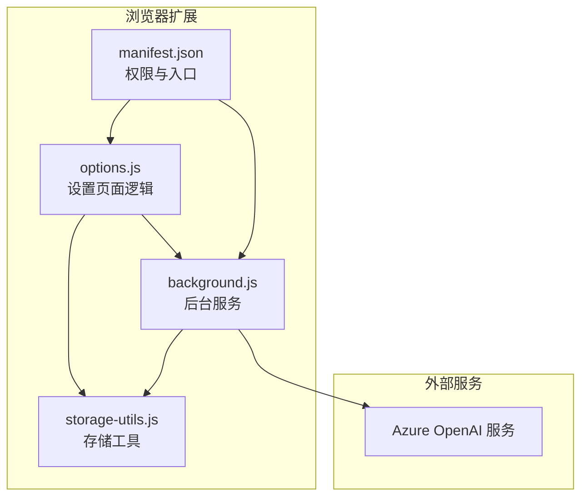
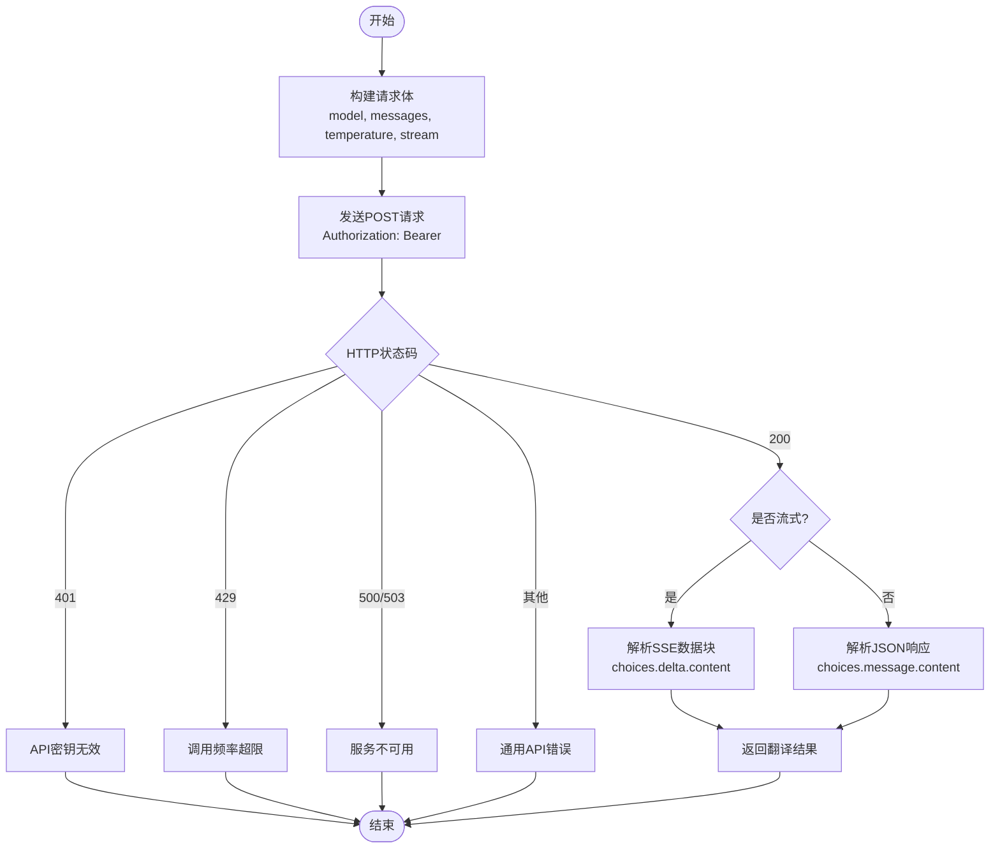
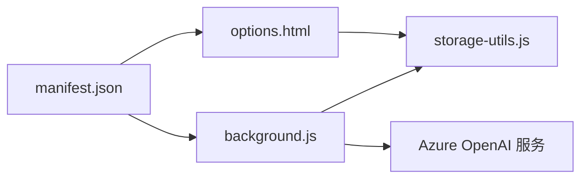

# Azure OpenAI服务

<cite>
**本文引用的文件**
- [README.md](file://README.md)
- [background.js](file://background.js)
- [options.js](file://options.js)
- [storage-utils.js](file://storage-utils.js)
- [manifest.json](file://manifest.json)
- [options.html](file://options.html)
</cite>

## 目录
1. [简介](#简介)
2. [项目结构](#项目结构)
3. [核心组件](#核心组件)
4. [架构总览](#架构总览)
5. [详细组件分析](#详细组件分析)
6. [依赖关系分析](#依赖关系分析)
7. [性能考虑](#性能考虑)
8. [故障排查指南](#故障排查指南)
9. [结论](#结论)
10. [附录](#附录)

## 简介
本文件面向希望在本插件中使用 Azure OpenAI 的用户，系统性说明如何配置与使用 Azure OpenAI 服务，包括：
- Azure 端点格式的构成要素与参数含义
- 如何获取 Azure API 密钥并在插件中配置
- 插件内部如何发起请求、处理响应与错误
- 常见连接问题的排查思路与建议

本插件支持所有兼容 OpenAI Chat Completions API 的服务，Azure OpenAI 即为其中之一。插件通过统一的 OpenAI 协议兼容层进行调用，因此只需正确填写 Azure 端点与密钥即可。

## 项目结构
本插件采用 Manifest V3 架构，核心模块包括：
- 后台服务脚本：负责翻译请求、调用 LLM API、缓存与错误处理
- 设置页面逻辑：负责 API 配置的增删改查、测试连接
- 存储工具：负责本地持久化与缓存管理
- 权限声明：声明存储、活动标签页与主机权限



图表来源
- [manifest.json](file://manifest.json#L1-L52)
- [background.js](file://background.js#L1-L120)
- [options.js](file://options.js#L1-L120)
- [storage-utils.js](file://storage-utils.js#L1-L60)

章节来源
- [manifest.json](file://manifest.json#L1-L52)

## 核心组件
- 后台服务（翻译与请求处理）
  - 负责构建请求体、调用 fetch、处理流式响应、错误分类与超时控制
  - 使用 Authorization: Bearer 方式携带密钥
- 设置页面（API 配置）
  - 提供表单字段：配置名称、API 端点、API 密钥、模型、Temperature
  - 支持“测试连接”按钮，调用后台进行连通性验证
- 存储工具（本地持久化）
  - 使用 chrome.storage.local 保存 API 配置；使用 chrome.storage.session 保存翻译缓存
- 权限声明
  - storage、activeTab、contextMenus、clipboardRead
  - host_permissions 对 http/https 全域开放

章节来源
- [background.js](file://background.js#L200-L323)
- [options.js](file://options.js#L344-L447)
- [storage-utils.js](file://storage-utils.js#L1-L120)
- [manifest.json](file://manifest.json#L1-L52)

## 架构总览
下面的序列图展示了从设置页面到后台服务再到 Azure OpenAI 的完整调用链路，以及插件如何处理错误与流式响应。

```mermaid
sequenceDiagram
participant UI as "设置页面(options.html)"
participant OPT as "options.js"
participant BG as "background.js"
participant AZ as "Azure OpenAI 服务"
UI->>OPT : "点击测试连接"
OPT->>BG : "chrome.runtime.sendMessage({action : 'testApiConfig', config})"
BG->>BG : "构造系统提示与用户提示"
BG->>BG : "组装请求体(含model, messages, temperature, stream)"
BG->>AZ : "POST 请求(含Authorization : Bearer)"
AZ-->>BG : "HTTP 响应(200/4xx/5xx)"
BG->>BG : "解析响应/流式处理/错误分类"
BG-->>OPT : "返回测试结果(success/message/errorCode)"
OPT-->>UI : "Toast提示测试结果"
```

图表来源
- [options.js](file://options.js#L404-L447)
- [background.js](file://background.js#L211-L323)

章节来源
- [options.js](file://options.js#L404-L447)
- [background.js](file://background.js#L211-L323)

## 详细组件分析

### Azure 端点格式与参数说明
- 端点格式
  - 插件支持的 Azure 端点格式为：https://<your-resource>.openai.azure.com/openai/deployments/<deployment-id>/chat/completions?api-version=YYYY-MM-DD
  - 示例路径：/openai/deployments/{deployment-id}/chat/completions
- 参数含义
  - your-resource：Azure OpenAI 资源名称（在 Azure 门户的 OpenAI 资源详情中可找到）
  - deployment-id：部署名称（在 Azure 门户的 OpenAI 部署页面中创建并管理）
  - api-version：API 版本（插件文档中给出的示例版本为 2023-05-15）

章节来源
- [README.md](file://README.md#L190-L210)

### 如何获取 Azure API 密钥
- 在 Azure 门户中，进入 OpenAI 资源，找到“密钥和终结点”页面
- 复制其中一个密钥（sk- 开头），在插件设置页面中粘贴到“API密钥”字段
- 插件会以 Authorization: Bearer 的形式随请求发送密钥

章节来源
- [README.md](file://README.md#L190-L210)
- [background.js](file://background.js#L237-L245)

### 在插件中配置 Azure 服务的步骤
- 打开设置页面（插件图标 → 选项）
- 点击“添加新配置”
- 填写以下字段：
  - 配置名称：如 “Azure GPT-3.5”
  - API端点：按 Azure 门户提供的端点格式填写（包含资源名、部署ID、api-version）
  - API密钥：从 Azure 门户复制的 sk- 开头密钥
  - 模型：与部署关联的模型名称（如 gpt-3.5-turbo）
  - Temperature：可选，范围 0-2
- 点击“测试连接”，确认连通性
- 点击“保存配置”，然后激活该配置

章节来源
- [README.md](file://README.md#L190-L210)
- [options.js](file://options.js#L344-L403)
- [options.js](file://options.js#L404-L447)

### 插件内部请求流程与认证机制
- 请求构建
  - 请求方法：POST
  - Content-Type：application/json
  - Authorization：Bearer {apiKey}
  - 请求体包含 model、messages、temperature、max_tokens、stream 等字段
- 流式输出
  - 若提供回调函数，则启用 stream=true，并在请求体中加入 stream_options.include_usage
  - 后台服务按 SSE 数据块解析 choices.delta.content 并实时回传
- 错误处理
  - 401：API密钥无效
  - 429：调用频率超限
  - 500/503：服务暂时不可用
  - 其他：通用 API 错误
  - 超时：默认 30 秒



图表来源
- [background.js](file://background.js#L211-L323)

章节来源
- [background.js](file://background.js#L211-L323)

### 设置页面与存储交互
- 设置页面负责收集用户输入并校验（必填字段、URL 格式、Temperature 范围）
- 保存配置时写入 chrome.storage.local.apiConfigs
- 测试连接时通过 chrome.runtime.sendMessage 触发后台服务的 testApiConfig
- 激活配置时更新 isActive 标记

```mermaid
sequenceDiagram
participant UI as "options.html"
participant OPT as "options.js"
participant ST as "storage-utils.js"
participant BG as "background.js"
UI->>OPT : "填写配置并点击保存"
OPT->>ST : "addApiConfig/updateApiConfig"
ST-->>OPT : "返回保存结果"
OPT-->>UI : "Toast提示成功/失败"
UI->>OPT : "点击测试连接"
OPT->>BG : "sendMessage({action : 'testApiConfig', config})"
BG->>BG : "callLLMAPI(构造系统提示与用户提示)"
BG-->>OPT : "返回测试结果"
OPT-->>UI : "Toast提示测试结果"
```

图表来源
- [options.js](file://options.js#L344-L447)
- [storage-utils.js](file://storage-utils.js#L1-L120)
- [background.js](file://background.js#L325-L351)

章节来源
- [options.js](file://options.js#L344-L447)
- [storage-utils.js](file://storage-utils.js#L1-L120)
- [background.js](file://background.js#L325-L351)

## 依赖关系分析
- 权限与入口
  - permissions：storage、activeTab、contextMenus、clipboardRead
  - host_permissions：对 http/https 全域开放，便于访问外部 API
  - background.service_worker：指向 background.js
  - options_page：指向 options.html
- 模块间耦合
  - options.js 依赖 storage-utils.js 进行配置持久化
  - background.js 依赖 storage-utils.js 进行缓存与配置读取
  - background.js 依赖 fetch 与 AbortController 进行网络请求与超时控制



图表来源
- [manifest.json](file://manifest.json#L1-L52)
- [options.js](file://options.js#L1-L120)
- [storage-utils.js](file://storage-utils.js#L1-L60)
- [background.js](file://background.js#L200-L323)

章节来源
- [manifest.json](file://manifest.json#L1-L52)

## 性能考虑
- 防抖与缓存
  - 内容脚本侧有防抖机制，避免频繁触发
  - 翻译结果使用 chrome.storage.session 缓存，相同文本+目标语言命中即直接返回
- 请求超时
  - 默认 30 秒超时，防止长时间阻塞
- 流式输出
  - 默认启用流式，提升首字响应速度与用户体验

章节来源
- [README.md](file://README.md#L240-L246)
- [storage-utils.js](file://storage-utils.js#L356-L422)
- [background.js](file://background.js#L139-L201)

## 故障排查指南
- 未配置API
  - 现象：提示“未配置API，请先在设置页面添加API配置”
  - 处理：在设置页面添加至少一个配置并激活
- API密钥无效
  - 现象：401 错误
  - 处理：确认密钥来自 Azure 门户、未过期、拼写正确；检查端点是否为 Azure OpenAI 端点
- 调用频率超限
  - 现象：429 错误
  - 处理：降低请求频率或升级配额；切换到其他可用的 API 配置
- 服务暂时不可用
  - 现象：500/503 错误
  - 处理：稍后再试；检查 Azure 服务状态
- 网络连接异常
  - 现象：超时或网络错误
  - 处理：检查本地网络；更换网络环境；确认 host_permissions 已正确声明
- 端点格式错误
  - 现象：URL 校验失败或 404/403
  - 处理：确保端点包含正确的资源名、部署ID与 api-version；参考插件文档中的示例格式

章节来源
- [background.js](file://background.js#L249-L323)
- [options.js](file://options.js#L370-L377)
- [README.md](file://README.md#L285-L315)

## 结论
- 本插件通过统一的 OpenAI 协议兼容层支持 Azure OpenAI，只需正确填写 Azure 端点与密钥即可使用
- 插件内置完善的错误分类、超时控制与缓存机制，能够稳定地进行翻译请求
- 建议在设置页面先“测试连接”，确认端点与密钥无误后再正式使用

## 附录

### Azure 端点字段与示例填写指引
- 字段说明
  - 资源名称：Azure 门户 OpenAI 资源的名称
  - 部署ID：在 Azure 门户 OpenAI 部署页面创建的部署名称
  - API版本：遵循 Azure 文档指定的版本号
- 填写示例
  - 端点示例：https://<your-resource>.openai.azure.com/openai/deployments/<deployment-id>/chat/completions?api-version=2023-05-15
  - 模型示例：gpt-3.5-turbo
  - 密钥示例：sk-xxxxxxxxxxxxxxxxxxxxxxxxxxxxxxxxxxxxxxxxxxxxxxxx

章节来源
- [README.md](file://README.md#L190-L210)