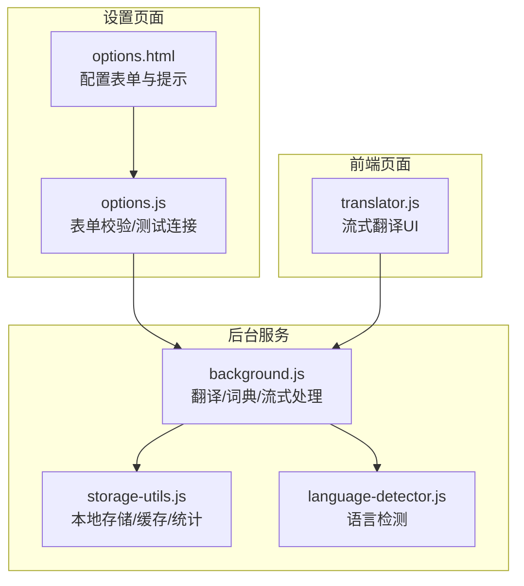
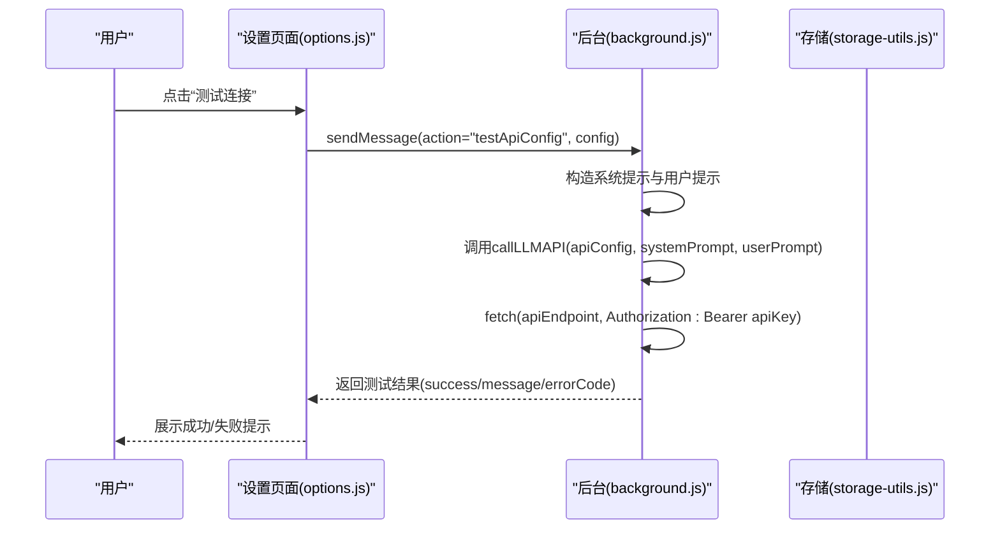
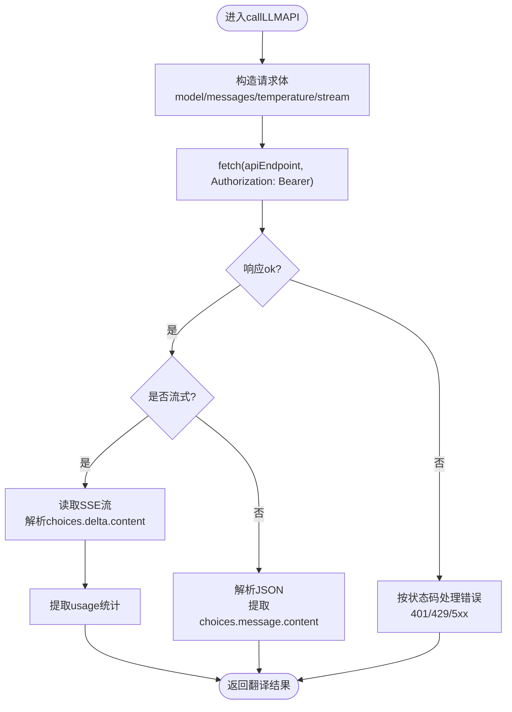
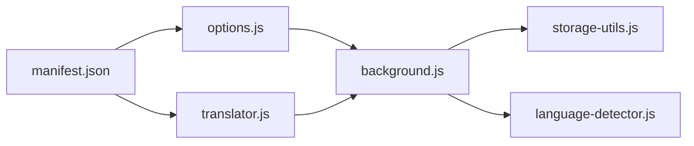

# OpenAI官方API

<cite>
**本文引用的文件**
- [manifest.json](file://manifest.json)
- [options.html](file://options.html)
- [options.js](file://options.js)
- [background.js](file://background.js)
- [storage-utils.js](file://storage-utils.js)
- [language-detector.js](file://language-detector.js)
- [translator.js](file://translator.js)
</cite>

## 目录
1. [简介](#简介)
2. [项目结构](#项目结构)
3. [核心组件](#核心组件)
4. [架构总览](#架构总览)
5. [详细组件分析](#详细组件分析)
6. [依赖关系分析](#依赖关系分析)
7. [性能考虑](#性能考虑)
8. [故障排查指南](#故障排查指南)
9. [结论](#结论)
10. [附录](#附录)

## 简介
本文件面向希望在本插件中配置并使用 OpenAI 官方服务的用户与开发者，系统说明如何正确填写插件设置中的 OpenAI 配置项，如何进行测试连接，以及在遇到常见问题时的排查与解决方法。文档覆盖以下要点：
- OpenAI 官方服务端点格式与认证方式
- 插件设置页面的配置项说明与填写规范
- 支持的模型与 Temperature 参数的作用
- 测试连接流程与错误提示
- 常见问题与解决方案（如密钥无效、额度不足、网络异常等）

## 项目结构
本项目为浏览器扩展（Manifest V3），核心交互链路如下：
- 设置页面负责录入与校验 API 配置，并提供“测试连接”能力
- 后台脚本负责发起 OpenAI 兼容 API 请求，处理流式响应与错误
- 存储工具负责本地持久化配置、缓存与 Token 统计
- 翻译页面负责与后台建立长连接，展示流式翻译结果

图表来源
- [options.html](file://options.html#L120-L204)
- [options.js](file://options.js#L344-L447)
- [background.js](file://background.js#L211-L323)
- [storage-utils.js](file://storage-utils.js#L1-L120)
- [language-detector.js](file://language-detector.js#L1-L140)
- [translator.js](file://translator.js#L178-L307)

章节来源
- [manifest.json](file://manifest.json#L1-L52)
- [options.html](file://options.html#L1-L120)
- [options.js](file://options.js#L1-L120)
- [background.js](file://background.js#L1-L120)
- [storage-utils.js](file://storage-utils.js#L1-L60)
- [language-detector.js](file://language-detector.js#L1-L60)
- [translator.js](file://translator.js#L1-L60)

## 核心组件
- 设置页面（options.html + options.js）
  - 提供翻译 API 配置表单，包含端点、密钥、模型、Temperature 等字段
  - 提供“测试连接”按钮，验证当前配置是否可用
- 后台服务（background.js）
  - 负责调用 OpenAI 兼容 API，构造请求体，处理流式响应与错误码
  - 提供测试 API 配置的方法
- 存储工具（storage-utils.js）
  - 管理 API 配置、激活状态、缓存、Token 统计等本地数据
- 翻译页面（translator.js）
  - 与后台建立长连接，接收流式翻译结果并渲染 UI

章节来源
- [options.html](file://options.html#L120-L204)
- [options.js](file://options.js#L344-L447)
- [background.js](file://background.js#L211-L323)
- [storage-utils.js](file://storage-utils.js#L1-L120)
- [translator.js](file://translator.js#L178-L307)

## 架构总览
下面的序列图展示了“设置页面测试连接”的完整流程，以及后台对 OpenAI 兼容 API 的调用过程。

图表来源
- [options.js](file://options.js#L403-L447)
- [background.js](file://background.js#L325-L351)
- [background.js](file://background.js#L211-L323)

章节来源
- [options.js](file://options.js#L403-L447)
- [background.js](file://background.js#L211-L323)
- [background.js](file://background.js#L325-L351)

## 详细组件分析

### 设置页面：OpenAI 配置项说明
- 配置项与含义
  - 配置名称：自定义标识，便于区分多个配置
  - API 端点地址：OpenAI 官方服务端点格式，如 https://api.openai.com/v1/chat/completions
  - API 密钥：以 Bearer 方式在 Authorization 头中发送
  - 模型名称：指定要使用的模型，常见模型如 gpt-4o-mini、gpt-4、gpt-3.5-turbo 等
  - Temperature：控制输出随机性，范围 0-2，越小越稳定，越大越多样化
- 表单校验
  - 必填字段校验：名称、端点、密钥、模型均需填写
  - Temperature 范围校验：0-2
  - 端点 URL 格式校验
- 测试连接
  - 点击“测试连接”后，若配置不完整会提示；通过后后台会发起一次最小化翻译请求并返回结果

章节来源
- [options.html](file://options.html#L120-L204)
- [options.js](file://options.js#L344-L447)

### 后台服务：OpenAI 兼容 API 调用
- 请求构造
  - Content-Type: application/json
  - Authorization: Bearer <你的API密钥>
  - 请求体包含 model、messages（system + user）、temperature、max_tokens、stream 等
  - 流式场景下附加 stream_options 以包含 usage 统计
- 错误处理
  - 401：API 密钥无效
  - 429：调用频率超限
  - 500/503：服务暂时不可用
  - 其他：通用 API 错误
- 流式处理
  - SSE 格式逐行解析，提取 choices.delta.content 并实时回传
  - 最后一个 chunk 中可能包含 usage 统计

图表来源
- [background.js](file://background.js#L211-L323)

章节来源
- [background.js](file://background.js#L211-L323)

### 存储与缓存：本地持久化与统计
- API 配置存储
  - 本地存储 apiConfigs，含 id、name、apiEndpoint、apiKey、model、temperature、isActive、createdAt、updatedAt
  - 首次添加自动激活，切换激活时会同步更新其他配置
- 缓存策略
  - 使用 chrome.storage.session 存放翻译缓存，浏览器关闭后自动清空
  - 缓存键基于原文与目标语言的哈希组合
- Token 统计
  - 本地存储 tokenUsage，包含 prompt_tokens、completion_tokens、total_tokens、requestCount、lastUpdated
  - 流式场景下从 usage 中累加统计

章节来源
- [storage-utils.js](file://storage-utils.js#L1-L120)
- [storage-utils.js](file://storage-utils.js#L356-L422)
- [storage-utils.js](file://storage-utils.js#L460-L511)

### 翻译页面：流式翻译与错误提示
- 流式连接
  - 通过 chrome.runtime.connect 建立长连接，接收 chunk 与 complete 消息
  - 首次收到 chunk 时清除加载动画，实时渲染翻译结果
- 错误提示
  - 根据 errorCode 提示“前往设置/重试/切换API”等操作
- Token 信息
  - 在结果底部展示模型与 usage 统计（prompt/completion/total tokens）

章节来源
- [translator.js](file://translator.js#L178-L307)
- [translator.js](file://translator.js#L778-L807)

## 依赖关系分析
- 权限与宿主权限
  - 插件声明了 storage、activeTab、contextMenus、clipboardRead 等权限
  - host_permissions 包含 http://*/* 与 https://*/*，满足访问 OpenAI 官方域名
- 模块间耦合
  - options.js 与 background.js 通过 runtime.sendMessage 通信
  - background.js 依赖 storage-utils.js 与 language-detector.js
  - translator.js 与 background.js 通过长连接通信

图表来源
- [manifest.json](file://manifest.json#L1-L52)
- [options.js](file://options.js#L1-L120)
- [translator.js](file://translator.js#L1-L60)
- [background.js](file://background.js#L1-L60)
- [storage-utils.js](file://storage-utils.js#L1-L60)
- [language-detector.js](file://language-detector.js#L1-L60)

章节来源
- [manifest.json](file://manifest.json#L1-L52)
- [options.js](file://options.js#L1-L120)
- [translator.js](file://translator.js#L1-L60)
- [background.js](file://background.js#L1-L60)
- [storage-utils.js](file://storage-utils.js#L1-L60)
- [language-detector.js](file://language-detector.js#L1-L60)

## 性能考虑
- 流式响应
  - 启用 stream 与 stream_options.include_usage，可获得更快的首字响应与实时进度
- 超时控制
  - 请求超时控制在 30 秒，避免长时间阻塞
- 缓存机制
  - 使用 session storage 缓存翻译结果，减少重复请求
- Token 统计
  - 本地统计，避免额外网络开销

[本节为通用建议，不涉及具体文件分析]

## 故障排查指南
- API 密钥无效（401）
  - 现象：后台返回“API密钥无效，请检查配置”
  - 排查：确认密钥格式、是否过期、是否被禁用；在设置页面重新填写并测试
- 调用频率超限（429）
  - 现象：后台返回“API调用频率超限，请稍后重试或切换其他API”
  - 排查：降低并发、等待配额恢复、更换账号或 API
- 服务暂时不可用（500/503）
  - 现象：后台返回“API服务暂时不可用，请稍后重试”
  - 排查：稍后再试，关注 OpenAI 服务状态
- 网络错误/超时
  - 现象：后台返回“请求超时/网络错误，请检查连接”
  - 排查：检查网络连通性、代理设置、防火墙；必要时更换网络环境
- 配置不完整
  - 现象：设置页面提示“请填写所有必填字段”或“Temperature必须在 0-2 之间”
  - 排查：补齐端点、密钥、模型；校准 Temperature 数值范围
- 未配置API
  - 现象：翻译页面提示“未配置API，请先在设置页面添加API配置”
  - 排查：在设置页面添加并激活一个翻译 API 配置

章节来源
- [background.js](file://background.js#L247-L278)
- [options.js](file://options.js#L344-L447)
- [translator.js](file://translator.js#L778-L807)

## 结论
本插件通过简洁的设置界面与后台的 OpenAI 兼容 API 调用，实现了稳定的翻译体验。遵循本文档的配置步骤与排错建议，可高效完成 OpenAI 官方服务的接入与使用。建议在生产环境中：
- 使用受信任的网络与代理
- 合理设置 Temperature 与模型，平衡质量与成本
- 定期检查 Token 统计，监控用量趋势
- 遇到异常及时使用“测试连接”定位问题

[本节为总结性内容，不涉及具体文件分析]

## 附录

### A. OpenAI 官方服务端点与认证
- 端点格式
  - 文本补全（Chat Completions）：https://api.openai.com/v1/chat/completions
- 认证方式
  - Authorization: Bearer <你的API密钥>

章节来源
- [options.html](file://options.html#L134-L144)
- [background.js](file://background.js#L237-L245)

### B. 支持的模型与 Temperature
- 模型示例
  - 常见模型：gpt-4o-mini、gpt-4、gpt-3.5-turbo 等
- Temperature
  - 控制输出随机性，范围 0-2
  - 较小值（如 0.3）更稳定一致，较大值（如 1.0）更多样化

章节来源
- [options.html](file://options.html#L166-L177)
- [background.js](file://background.js#L211-L235)

### C. 插件设置页面配置步骤
- 步骤
  - 打开设置页面，点击“添加配置”
  - 填写配置名称、端点地址、API 密钥、模型、Temperature
  - 点击“保存配置”，再点击“测试连接”验证
  - 在任意网页选中文本进行翻译

章节来源
- [options.html](file://options.html#L1-L54)
- [options.js](file://options.js#L344-L447)