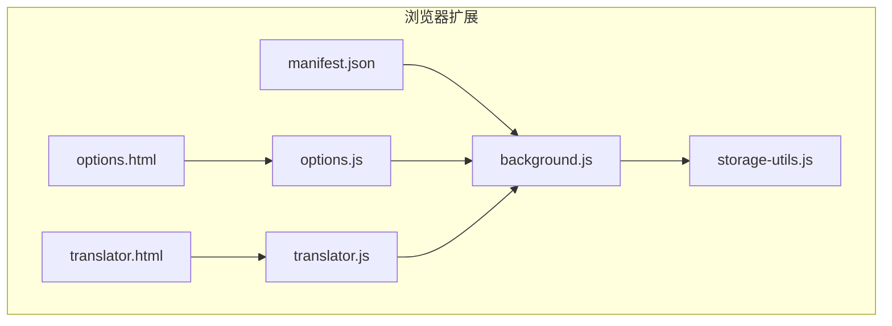
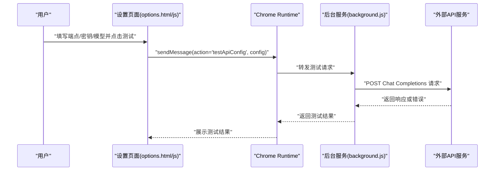
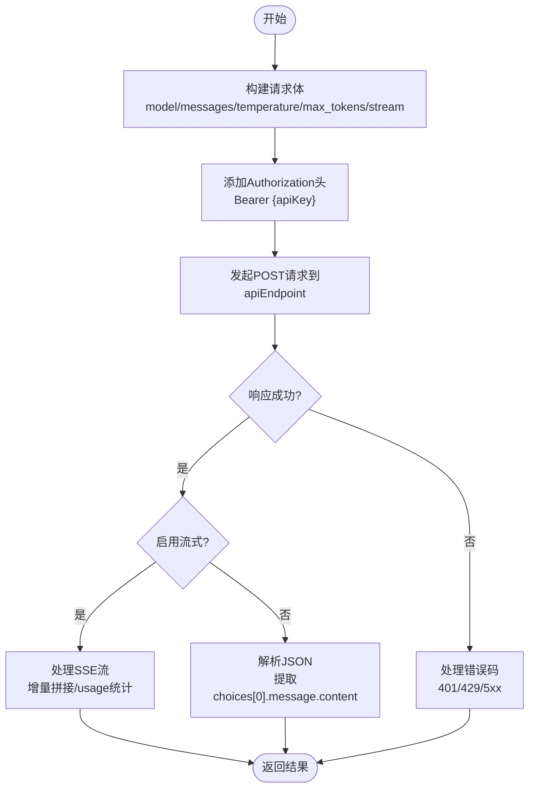
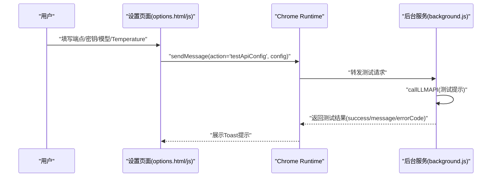
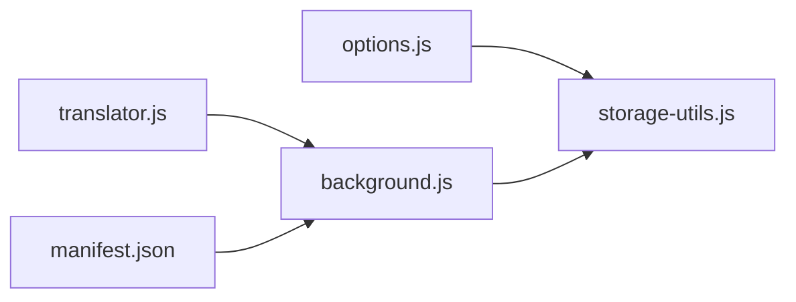

# 兼容服务

<cite>
**本文引用的文件**
- [manifest.json](file://manifest.json)
- [background.js](file://background.js)
- [options.html](file://options.html)
- [options.js](file://options.js)
- [storage-utils.js](file://storage-utils.js)
- [translator.html](file://translator.html)
- [translator.js](file://translator.js)
- [README.md](file://README.md)
</cite>

## 目录
1. [简介](#简介)
2. [项目结构](#项目结构)
3. [核心组件](#核心组件)
4. [架构总览](#架构总览)
5. [详细组件分析](#详细组件分析)
6. [依赖关系分析](#依赖关系分析)
7. [性能考量](#性能考量)
8. [故障排查指南](#故障排查指南)
9. [结论](#结论)
10. [附录](#附录)

## 简介
本文件面向“兼容服务”的使用与配置，聚焦于插件支持的OpenAI兼容API服务类型、端点URL配置方式、认证要求、以及如何通过自定义端点URL适配不同服务商（OpenAI官方API、Azure OpenAI服务、以及其他兼容服务）。文档强调配置的灵活性，允许用户集成任何遵循OpenAI Chat Completions API规范的服务；同时提供测试连接功能的使用说明，帮助用户验证配置的有效性。

## 项目结构
- 插件通过清单文件声明权限与入口，后台服务脚本负责翻译与TTS调用，设置页面负责API配置与测试，翻译页面负责交互与流式展示。
- 关键文件：
  - manifest.json：声明权限与后台脚本
  - background.js：翻译与TTS调用、错误处理、流式处理
  - options.html/js：API配置表单、测试连接、TTS配置
  - storage-utils.js：本地存储与缓存、Token统计
  - translator.html/js：翻译页面与词典弹窗
  - README.md：支持的服务类型与端点示例

图表来源
- [manifest.json](file://manifest.json#L1-L52)
- [background.js](file://background.js#L1-L120)
- [options.html](file://options.html#L1-L120)
- [options.js](file://options.js#L1-L120)
- [translator.html](file://translator.html#L1-L60)
- [translator.js](file://translator.js#L1-L120)

章节来源
- [manifest.json](file://manifest.json#L1-L52)
- [README.md](file://README.md#L190-L230)

## 核心组件
- 翻译服务（LLM）：封装OpenAI兼容API调用，支持流式输出与非流式回退，内置超时与错误分类处理。
- TTS服务：支持通义千问与OpenAI兼容两种提供商，分别使用不同的端点与参数。
- 设置页面：提供API配置表单、测试连接、TTS配置与偏好设置。
- 存储工具：统一管理API配置、激活状态、缓存与Token统计。

章节来源
- [background.js](file://background.js#L46-L120)
- [options.js](file://options.js#L1-L120)
- [storage-utils.js](file://storage-utils.js#L1-L120)

## 架构总览
插件通过后台服务脚本与内容脚本/页面脚本协作，实现“设置页面配置—后台调用API—页面流式展示”的闭环。设置页面提供测试连接能力，后台服务脚本负责实际请求与错误处理。

图表来源
- [options.js](file://options.js#L406-L447)
- [background.js](file://background.js#L325-L351)

章节来源
- [options.js](file://options.js#L406-L447)
- [background.js](file://background.js#L325-L351)

## 详细组件分析

### 支持的服务类型与端点配置
- 支持的服务类型
  - OpenAI官方API：端点为Chat Completions标准路径，需OpenAI API Key。
  - Azure OpenAI：端点为部署路径，需Azure API Key。
  - 其他兼容服务：任何遵循OpenAI Chat Completions API规范的服务均可通过自定义端点URL接入。
- 端点URL模式
  - OpenAI官方API：标准Chat Completions端点。
  - Azure OpenAI：资源域下的部署路径，包含版本参数。
  - 其他兼容服务：任意符合OpenAI Chat Completions协议的端点。
- 认证要求
  - 所有服务均通过HTTP头Authorization携带Bearer Token（即API Key）。
- 配置灵活性
  - 插件不绑定特定服务商，仅要求端点URL与认证方式满足OpenAI Chat Completions协议。

章节来源
- [README.md](file://README.md#L190-L230)
- [background.js](file://background.js#L237-L245)

### 翻译服务（LLM）调用流程
- 请求体字段
  - model：模型名称
  - messages：系统提示与用户提示
  - temperature：采样温度
  - max_tokens：最大输出长度
  - stream：是否启用流式
  - stream_options：当启用流式时，包含usage统计
- 认证头
  - Authorization: Bearer {apiKey}
- 错误处理
  - 401：密钥无效
  - 429：频率限制
  - 500/503：服务不可用
  - 其他：通用API错误
- 超时与回退
  - 请求超时控制在30秒
  - 非流式回退路径仍可返回翻译结果

图表来源
- [background.js](file://background.js#L211-L323)

章节来源
- [background.js](file://background.js#L211-L323)

### 设置页面与测试连接
- 翻译API配置表单
  - 字段：配置名称、端点URL、API密钥、模型、Temperature
  - URL校验：使用URL构造器验证端点格式
  - Temperature范围：0-2
- 测试连接
  - 触发条件：填写必要字段后点击“测试连接”
  - 行为：向后台发送测试请求，返回成功/失败与错误码
- TTS配置
  - 服务商选择：通义千问/Qwen、OpenAI Compatible
  - 端点提示：根据服务商动态提示端点格式
  - OpenAI兼容TTS：模型、音色、音频格式可配置

图表来源
- [options.js](file://options.js#L406-L447)
- [background.js](file://background.js#L325-L351)

章节来源
- [options.html](file://options.html#L120-L210)
- [options.js](file://options.js#L344-L447)
- [options.html](file://options.html#L206-L350)
- [options.js](file://options.js#L585-L731)

### 翻译页面与流式展示
- 页面脚本通过长连接与后台建立流式通道，实时接收增量翻译结果并展示。
- 支持复制、重试、设置跳转等操作。
- 词典弹窗支持单词与上下文查询，同样使用流式连接。

章节来源
- [translator.html](file://translator.html#L1-L100)
- [translator.js](file://translator.js#L180-L307)
- [translator.js](file://translator.js#L608-L700)

## 依赖关系分析
- 权限与宿主
  - manifest声明storage、activeTab、host_permissions，允许向任意http/https主机发送请求。
- 模块耦合
  - options.js依赖storage-utils.js进行配置持久化与测试转发
  - background.js依赖storage-utils.js进行激活配置与缓存
  - translator.js依赖background.js通过runtime connect建立流式通道
- 外部依赖
  - 任意OpenAI兼容API服务（含Azure OpenAI）

图表来源
- [manifest.json](file://manifest.json#L1-L52)
- [options.js](file://options.js#L1-L120)
- [storage-utils.js](file://storage-utils.js#L1-L120)
- [background.js](file://background.js#L1-L120)
- [translator.js](file://translator.js#L1-L120)

章节来源
- [manifest.json](file://manifest.json#L1-L52)
- [options.js](file://options.js#L1-L120)
- [storage-utils.js](file://storage-utils.js#L1-L120)
- [background.js](file://background.js#L1-L120)
- [translator.js](file://translator.js#L1-L120)

## 性能考量
- 流式输出：默认启用，提升首字响应速度与用户体验。
- 缓存机制：相同文本+目标语言的翻译结果被缓存，减少重复请求。
- 超时控制：请求超时30秒，避免长时间阻塞。
- Token统计：记录prompt/completion/总tokens与请求次数，便于成本分析。

章节来源
- [README.md](file://README.md#L240-L246)
- [storage-utils.js](file://storage-utils.js#L356-L422)
- [storage-utils.js](file://storage-utils.js#L460-L511)
- [background.js](file://background.js#L132-L201)

## 故障排查指南
- 未配置API
  - 现象：翻译失败提示“未配置API”
  - 处理：在设置页面添加并激活至少一个API配置
- API密钥无效
  - 现象：401错误
  - 处理：核对密钥、端点、网络与账户状态
- 频率限制
  - 现象：429错误
  - 处理：降低调用频率或切换其他API
- 服务不可用
  - 现象：500/503错误
  - 处理：稍后重试或更换服务端点
- 网络/超时
  - 现象：网络错误或超时
  - 处理：检查网络连通性与代理设置
- 测试连接
  - 使用设置页面的“测试连接”按钮验证端点、密钥与模型配置是否正确

章节来源
- [background.js](file://background.js#L249-L278)
- [options.js](file://options.js#L406-L447)
- [translator.js](file://translator.js#L777-L807)

## 结论
本插件通过统一的OpenAI兼容API调用接口，实现了对OpenAI官方API、Azure OpenAI服务及其他兼容服务的无缝支持。用户只需提供正确的端点URL与API Key，即可灵活接入任意遵循Chat Completions协议的服务。配合设置页面的测试连接与后台服务的错误分类处理，能够快速定位并解决配置问题，保障稳定高效的翻译体验。

## 附录

### 服务类型与配置要点
- OpenAI官方API
  - 端点：Chat Completions标准路径
  - 认证：Bearer Token（OpenAI API Key）
- Azure OpenAI
  - 端点：资源域下的部署路径，包含版本参数
  - 认证：Bearer Token（Azure API Key）
- 其他兼容服务
  - 端点：任意OpenAI Chat Completions兼容端点
  - 认证：Bearer Token（服务端API Key）

章节来源
- [README.md](file://README.md#L190-L230)
- [background.js](file://background.js#L237-L245)

### 端点URL与认证示例（说明性）
- OpenAI官方API
  - 端点URL：标准Chat Completions路径
  - 认证头：Authorization: Bearer {OpenAI API Key}
- Azure OpenAI
  - 端点URL：资源域下的部署路径，包含版本参数
  - 认证头：Authorization: Bearer {Azure API Key}
- 其他兼容服务
  - 端点URL：任意OpenAI Chat Completions兼容端点
  - 认证头：Authorization: Bearer {服务端API Key}

章节来源
- [README.md](file://README.md#L190-L230)
- [background.js](file://background.js#L237-L245)

### 测试连接使用说明
- 在设置页面填写端点、密钥、模型与Temperature
- 点击“测试连接”，插件将向指定端点发送一次测试请求
- 成功：显示“测试成功”提示
- 失败：显示错误信息与错误码，便于定位问题

章节来源
- [options.js](file://options.js#L406-L447)
- [background.js](file://background.js#L325-L351)