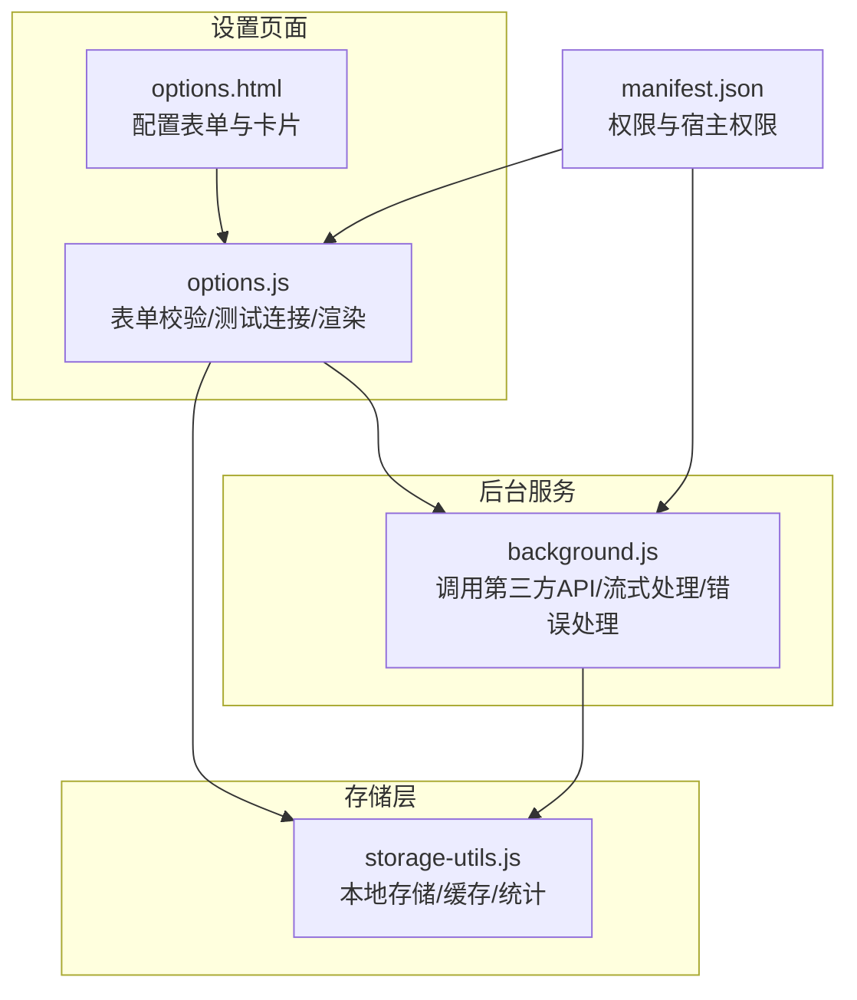
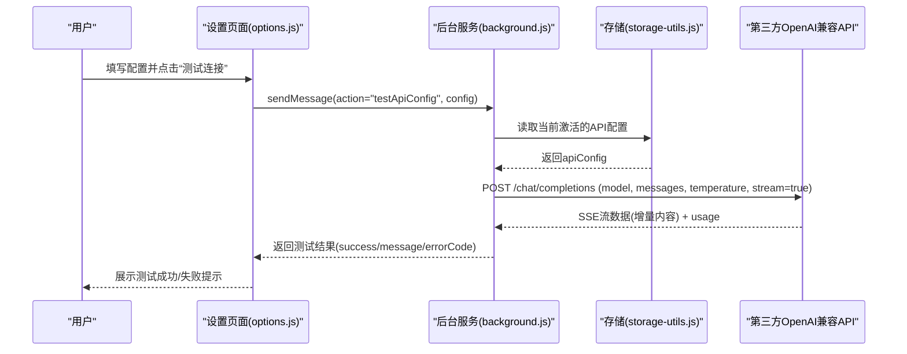
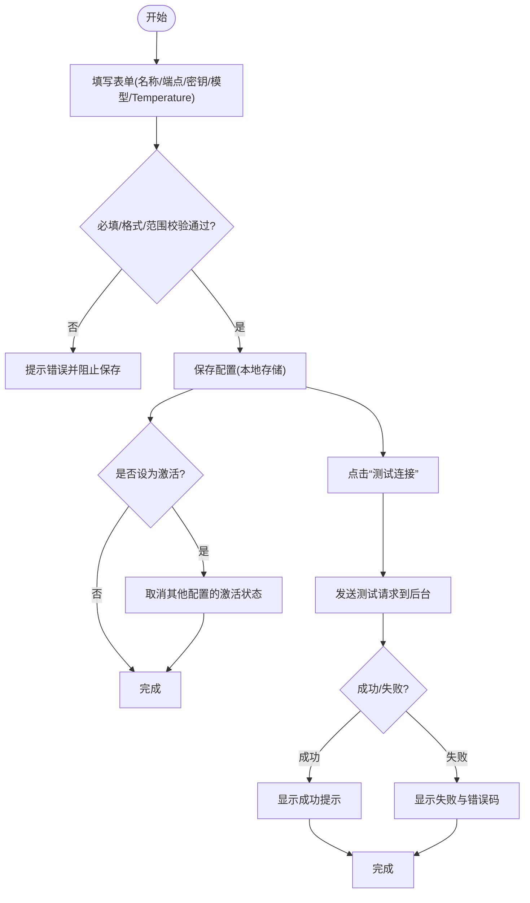
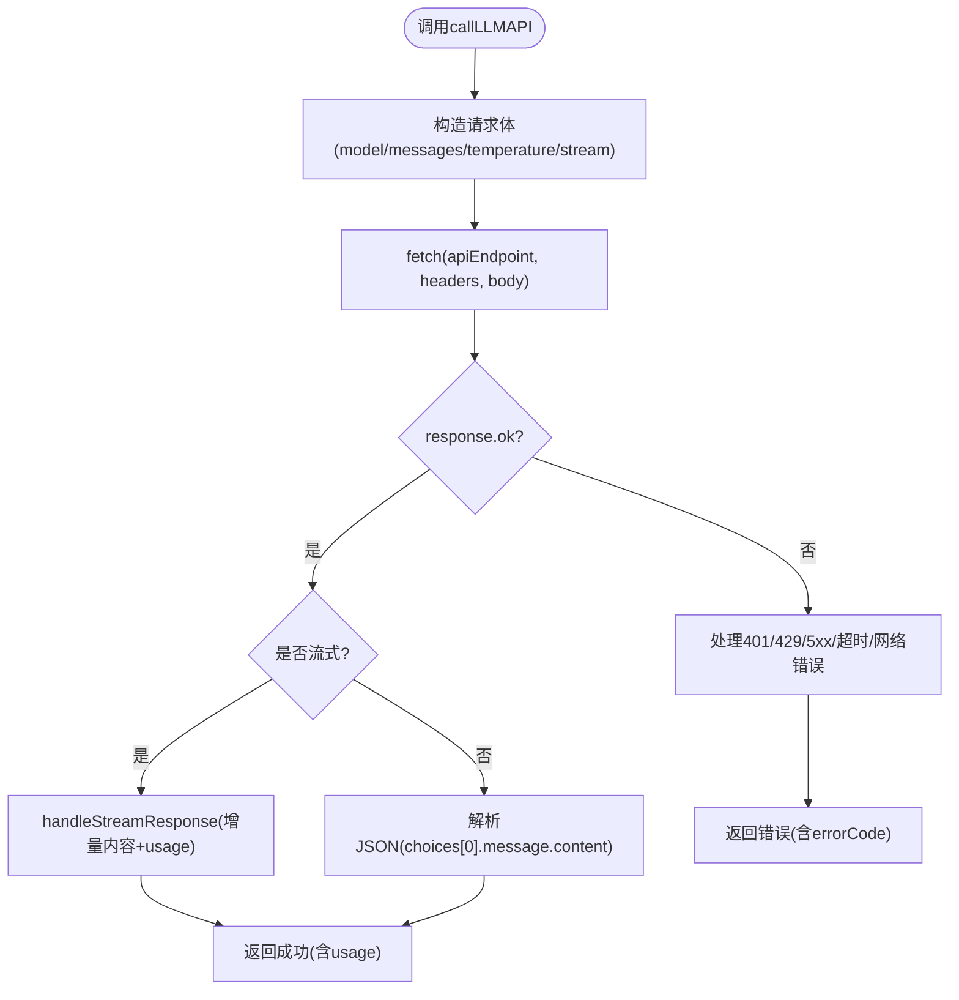
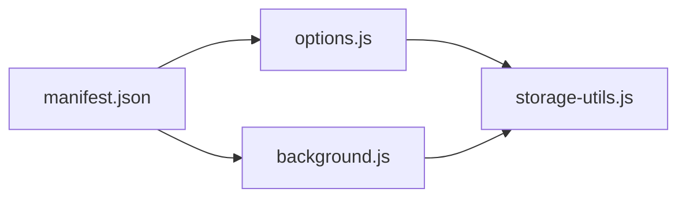

# 第三方代理服务

<cite>
**本文引用的文件**
- [manifest.json](file://manifest.json)
- [options.html](file://options.html)
- [options.js](file://options.js)
- [storage-utils.js](file://storage-utils.js)
- [background.js](file://background.js)
- [README.md](file://README.md)
- [INSTALL.md](file://INSTALL.md)
- [QUICKSTART.md](file://QUICKSTART.md)
</cite>

## 目录
1. [简介](#简介)
2. [项目结构](#项目结构)
3. [核心组件](#核心组件)
4. [架构总览](#架构总览)
5. [详细组件分析](#详细组件分析)
6. [依赖关系分析](#依赖关系分析)
7. [性能考量](#性能考量)
8. [故障排查指南](#故障排查指南)
9. [结论](#结论)
10. [附录](#附录)

## 简介
本章节面向希望使用第三方代理服务（OpenAI兼容API）的用户，系统讲解如何在本插件中配置各种OpenAI兼容的代理服务，包括国内API代理与自建OpenAI兼容API服务。内容涵盖：
- 如何确定正确的端点URL、认证方式与模型名称
- 通用配置指导原则与最佳实践
- 常见第三方服务示例与填写指引
- 插件对OpenAI Chat Completions API规范的适配能力
- 通过“测试连接”功能验证配置正确性

## 项目结构
本插件采用Chrome扩展的标准结构，核心与第三方代理服务相关的模块包括：
- 设置页面（options.html + options.js）：负责API配置的录入、校验、激活与测试
- 后台服务（background.js）：负责实际调用第三方API，处理流式响应与错误
- 存储工具（storage-utils.js）：负责本地持久化API配置、偏好设置与缓存
- 清单文件（manifest.json）：声明权限与宿主权限，确保可访问第三方端点

图表来源
- [options.html](file://options.html#L120-L204)
- [options.js](file://options.js#L344-L447)
- [background.js](file://background.js#L211-L245)
- [storage-utils.js](file://storage-utils.js#L11-L21)
- [manifest.json](file://manifest.json#L12-L15)

章节来源
- [manifest.json](file://manifest.json#L12-L15)
- [options.html](file://options.html#L120-L204)
- [options.js](file://options.js#L344-L447)
- [storage-utils.js](file://storage-utils.js#L11-L21)
- [background.js](file://background.js#L211-L245)

## 核心组件
- 设置页面（options.js + options.html）
  - 提供“添加/编辑/删除/激活”翻译API配置的完整生命周期
  - 表单字段：配置名称、API端点、API密钥、模型名称、Temperature
  - 校验规则：必填项、URL格式、Temperature范围、密钥可见性切换
  - “测试连接”：通过后台通道发送测试请求，返回成功/失败与错误码
- 后台服务（background.js）
  - 调用第三方OpenAI兼容API，构造标准请求体（model、messages、temperature、stream等）
  - 处理流式响应（SSE），实时回传增量内容；在流式场景下包含usage统计
  - 错误处理：401/429/5xx、超时、网络异常、无效响应等
  - 提供独立的“测试API配置”方法，便于前端验证
- 存储工具（storage-utils.js）
  - 统一管理API配置列表、激活状态、用户偏好、缓存与Token统计
  - 为首次配置自动激活，删除激活配置时自动切换

章节来源
- [options.html](file://options.html#L120-L204)
- [options.js](file://options.js#L344-L447)
- [background.js](file://background.js#L211-L245)
- [storage-utils.js](file://storage-utils.js#L11-L21)

## 架构总览
下图展示从设置页面到后台服务再到第三方API的整体流程，以及插件如何适配OpenAI兼容API规范。

图表来源
- [options.js](file://options.js#L403-L447)
- [background.js](file://background.js#L325-L350)
- [storage-utils.js](file://storage-utils.js#L120-L144)

章节来源
- [options.js](file://options.js#L403-L447)
- [background.js](file://background.js#L325-L350)
- [storage-utils.js](file://storage-utils.js#L120-L144)

## 详细组件分析

### 组件A：设置页面（翻译API配置）
- 表单字段与用途
  - 配置名称：便于识别与切换
  - API端点：第三方OpenAI兼容API的完整URL（需以HTTP/HTTPS开头）
  - API密钥：Bearer认证头所需
  - 模型名称：如gpt-4o-mini、gpt-4、gpt-3.5-turbo、claude-3-5-sonnet等
  - Temperature：0-2之间的数值，越低越稳定，越高越多样化
- 校验与安全
  - 必填字段校验
  - URL格式校验（new URL）
  - Temperature范围校验（0-2）
  - 密钥可见性切换（密码/明文）
- 激活与测试
  - 支持激活/编辑/删除配置
  - “测试连接”通过runtime通道发送测试请求，返回成功/失败与错误码

图表来源
- [options.html](file://options.html#L120-L204)
- [options.js](file://options.js#L344-L447)
- [storage-utils.js](file://storage-utils.js#L32-L77)

章节来源
- [options.html](file://options.html#L120-L204)
- [options.js](file://options.js#L344-L447)
- [storage-utils.js](file://storage-utils.js#L32-L77)

### 组件B：后台服务（调用第三方API）
- 请求构造
  - 使用配置中的model与temperature
  - 构造messages（system+user）
  - 启用stream=true，必要时开启stream_options.include_usage
  - Authorization: Bearer {apiKey}
- 流式处理
  - 解析SSE数据块，提取choices[0].delta.content作为增量内容
  - 在流式场景收集usage并在最终返回
- 错误处理
  - 401：API密钥无效
  - 429：频率限制
  - 5xx：服务不可用
  - 超时/网络异常/无效响应
- 测试API配置
  - 发送简短测试文本，验证第三方服务可达与返回格式正确

图表来源
- [background.js](file://background.js#L211-L245)
- [background.js](file://background.js#L139-L201)
- [background.js](file://background.js#L247-L323)
- [background.js](file://background.js#L325-L350)

章节来源
- [background.js](file://background.js#L211-L245)
- [background.js](file://background.js#L139-L201)
- [background.js](file://background.js#L247-L323)
- [background.js](file://background.js#L325-L350)

### 组件C：存储与缓存（storage-utils.js）
- API配置管理
  - 读取/保存/新增/更新/删除
  - 自动激活首个配置；激活切换时同步取消其他配置
- 缓存与统计
  - session存储翻译缓存，自动清理
  - 本地存储Token使用统计（prompt/completion/total、请求次数、最后更新）

章节来源
- [storage-utils.js](file://storage-utils.js#L11-L21)
- [storage-utils.js](file://storage-utils.js#L120-L144)
- [storage-utils.js](file://storage-utils.js#L356-L422)
- [storage-utils.js](file://storage-utils.js#L459-L511)

## 依赖关系分析
- 权限与宿主权限
  - permissions.host_permissions允许向第三方端点发起请求
- 模块耦合
  - options.js依赖storage-utils.js进行配置读写与测试
  - background.js依赖storage-utils.js读取激活配置与缓存
  - manifest.json为上述模块提供运行时权限

图表来源
- [manifest.json](file://manifest.json#L12-L15)
- [options.js](file://options.js#L344-L447)
- [background.js](file://background.js#L325-L350)
- [storage-utils.js](file://storage-utils.js#L11-L21)

章节来源
- [manifest.json](file://manifest.json#L12-L15)
- [options.js](file://options.js#L344-L447)
- [background.js](file://background.js#L325-L350)
- [storage-utils.js](file://storage-utils.js#L11-L21)

## 性能考量
- 流式输出：默认启用流式，提升首字响应速度与实时反馈
- 缓存策略：相同文本+目标语言的翻译结果缓存于session存储，减少重复请求
- 超时保护：请求超时30秒，避免长时间阻塞
- 本地计算：语言识别与UI交互在本地完成，降低网络依赖

章节来源
- [README.md](file://README.md#L23-L33)
- [background.js](file://background.js#L139-L201)
- [storage-utils.js](file://storage-utils.js#L356-L422)

## 故障排查指南
- 未配置API
  - 现象：翻译失败提示“未配置API”
  - 处理：在设置页面添加并激活至少一个API配置
- API密钥无效
  - 现象：401错误
  - 处理：确认密钥正确、账户余额充足、网络正常
- 频率限制
  - 现象：429错误
  - 处理：降低调用频率或切换到其他API配置
- 服务不可用
  - 现象：5xx错误
  - 处理：稍后再试或切换到备用服务
- 网络/超时
  - 现象：超时/网络错误
  - 处理：检查网络连通性，必要时更换代理或服务端点
- 使用“测试连接”
  - 在设置页面点击“测试连接”，后台将发送测试请求并返回成功/失败与错误码，便于快速定位问题

章节来源
- [options.js](file://options.js#L403-L447)
- [background.js](file://background.js#L247-L323)

## 结论
本插件通过统一的OpenAI兼容API适配，使用户能够灵活接入各类第三方代理服务与自建OpenAI兼容API。通过设置页面的表单校验与“测试连接”功能，用户可以快速验证端点URL、认证方式与模型名称的正确性；后台服务的流式处理与错误分类，确保了良好的用户体验与可诊断性。建议在生产环境中优先使用稳定可靠的代理服务，并结合缓存与Token统计进行成本与性能优化。

## 附录

### A. 确定正确的端点URL、认证方式与模型名称
- 端点URL
  - 必须为HTTP/HTTPS协议的完整URL
  - 与OpenAI Chat Completions API兼容，路径通常为/chat/completions
- 认证方式
  - 使用Authorization: Bearer {API密钥}
- 模型名称
  - 常见模型：gpt-4o-mini、gpt-4、gpt-3.5-turbo、claude-3-5-sonnet等
  - 以服务商提供的可用模型为准

章节来源
- [options.html](file://options.html#L134-L144)
- [options.html](file://options.html#L166-L177)
- [background.js](file://background.js#L211-L245)

### B. 常见第三方服务配置示例（依据README与INSTALL）
- OpenAI官方API
  - 端点：https://api.openai.com/v1/chat/completions
  - 密钥：sk-...
- Azure OpenAI
  - 端点：https://{resource}.openai.azure.com/openai/deployments/{deployment-id}/chat/completions?api-version=2023-05-15
  - 密钥：Azure API Key
- 国内API代理服务与自建OpenAI兼容API服务
  - 仅需确保服务兼容OpenAI Chat Completions格式，填写正确的端点与密钥即可

章节来源
- [README.md](file://README.md#L194-L207)
- [INSTALL.md](file://INSTALL.md#L53-L80)

### C. 通用配置指导原则
- 优先使用稳定的代理服务，避免频繁切换
- 在设置页面先“测试连接”，再保存
- Temperature建议在0.3-0.7之间平衡准确性与多样性
- 若网络延迟较高，可考虑缩短文本长度或切换更快的模型/服务

章节来源
- [options.html](file://options.html#L178-L193)
- [options.js](file://options.js#L403-L447)

### D. 插件对OpenAI Chat Completions API规范的适配
- 请求体字段：model、messages（system+user）、temperature、max_tokens、stream、stream_options（包含usage）
- 认证头：Authorization: Bearer {apiKey}
- 响应处理：流式SSE增量内容与usage统计

章节来源
- [background.js](file://background.js#L211-L245)
- [background.js](file://background.js#L139-L201)