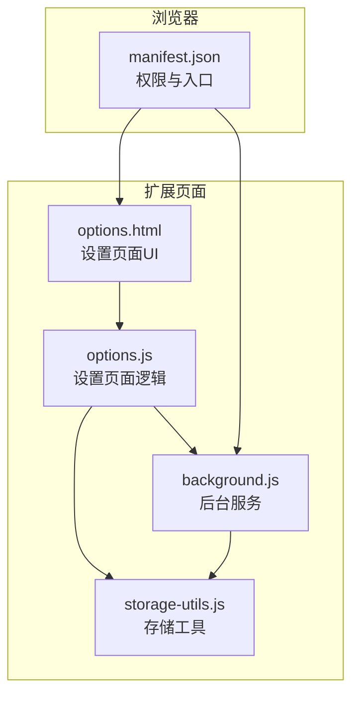
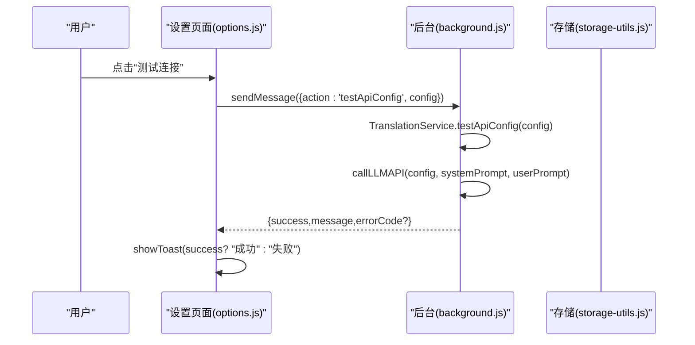
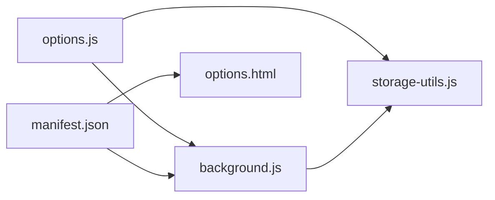

# API配置

<cite>
**本文引用的文件**
- [README.md](file://README.md)
- [QUICKSTART.md](file://QUICKSTART.md)
- [options.html](file://options.html)
- [options.js](file://options.js)
- [manifest.json](file://manifest.json)
- [storage-utils.js](file://storage-utils.js)
- [background.js](file://background.js)
</cite>

## 目录
1. [简介](#简介)
2. [项目结构](#项目结构)
3. [核心组件](#核心组件)
4. [架构总览](#架构总览)
5. [详细组件分析](#详细组件分析)
6. [依赖关系分析](#依赖关系分析)
7. [性能考虑](#性能考虑)
8. [故障排查指南](#故障排查指南)
9. [结论](#结论)
10. [附录](#附录)

## 简介
本指南面向首次使用本插件的用户，帮助您完成API配置的完整流程：从打开设置页面，到填写新配置、测试连接、保存并激活配置，再到连接到常见服务（OpenAI、Azure OpenAI、国内代理等）。文中所有操作步骤均以仓库内的实际实现为依据，确保您可以顺利完成首次配置并成功连接到LLM服务。

## 项目结构
本插件采用Chrome扩展Manifest V3结构，关键文件包括：
- 设置页面：options.html、options.js
- 后台服务：background.js
- 存储工具：storage-utils.js
- 权限与入口：manifest.json
- 快速开始与API说明：README.md、QUICKSTART.md

图表来源
- [options.html](file://options.html#L1-L200)
- [options.js](file://options.js#L1-L120)
- [background.js](file://background.js#L1-L120)
- [storage-utils.js](file://storage-utils.js#L1-L60)
- [manifest.json](file://manifest.json#L1-L52)

章节来源
- [manifest.json](file://manifest.json#L1-L52)
- [options.html](file://options.html#L1-L120)
- [options.js](file://options.js#L1-L120)
- [background.js](file://background.js#L1-L120)
- [storage-utils.js](file://storage-utils.js#L1-L60)

## 核心组件
- 设置页面（options.html + options.js）
  - 提供“添加新配置”、“编辑/删除/激活”等管理能力
  - 表单字段包含：配置名称、API端点、API密钥、模型名称、Temperature
  - 提供“测试连接”按钮，用于验证配置可用性
- 后台服务（background.js）
  - 负责调用LLM API、处理流式响应、缓存与错误处理
  - 提供“测试API配置”的实现，用于验证连通性
- 存储工具（storage-utils.js）
  - 统一管理API配置的增删改查、激活状态、缓存与Token统计
- 权限与入口（manifest.json）
  - 声明storage、activeTab、host_permissions等权限
  - 指定options_page与action入口

章节来源
- [options.html](file://options.html#L110-L210)
- [options.js](file://options.js#L344-L447)
- [background.js](file://background.js#L325-L351)
- [storage-utils.js](file://storage-utils.js#L1-L120)
- [manifest.json](file://manifest.json#L1-L52)

## 架构总览
设置页面通过options.js向后台发送“测试API配置”消息；后台调用LLM API并返回结果；成功与否通过Toast提示反馈给用户。

图表来源
- [options.js](file://options.js#L403-L447)
- [background.js](file://background.js#L325-L351)
- [background.js](file://background.js#L203-L324)
- [storage-utils.js](file://storage-utils.js#L1-L60)

章节来源
- [options.js](file://options.js#L403-L447)
- [background.js](file://background.js#L325-L351)
- [background.js](file://background.js#L203-L324)

## 详细组件分析

### 设置页面：打开设置与添加新配置
- 打开设置页面
  - 方式一：点击插件图标
  - 方式二：在扩展管理页面点击“扩展程序选项”
- 添加新配置
  - 点击“添加配置”，弹出表单
  - 表单字段：
    - 配置名称：如“OpenAI GPT-4o mini”
    - API端点：如“https://api.openai.com/v1/chat/completions”
    - API密钥：以“sk-”开头
    - 模型名称：如“gpt-4o-mini”、“gpt-4”、“gpt-3.5-turbo”等
    - Temperature：0-2之间的数值，越小越稳定，越大越多样化
- 保存与激活
  - 填写完成后点击“保存配置”
  - 若为首个配置，系统会自动激活；否则可在列表中点击“激活”

章节来源
- [README.md](file://README.md#L61-L75)
- [QUICKSTART.md](file://QUICKSTART.md#L14-L27)
- [options.html](file://options.html#L120-L204)
- [options.js](file://options.js#L344-L401)
- [storage-utils.js](file://storage-utils.js#L32-L92)

### “测试连接”功能：使用方法与判断标准
- 使用方法
  - 在设置页面填写API端点、密钥、模型名称后，点击“测试连接”
  - 页面会向后台发送测试消息，后台执行一次简短的翻译请求
- 成功/失败判断
  - 成功：提示“翻译API连接测试成功！”
  - 失败：提示具体错误信息，如“API密钥无效”“API调用频率超限”“API服务暂时不可用”“网络错误/超时”等
  - 失败时可根据提示检查密钥、端点、网络与配额

章节来源
- [options.js](file://options.js#L403-L447)
- [background.js](file://background.js#L325-L351)
- [background.js](file://background.js#L247-L278)

### 保存并激活配置
- 保存配置
  - 点击“保存配置”后，表单数据经前端校验后写入本地存储
- 激活配置
  - 若为首个配置，自动激活
  - 否则在列表中点击“激活”，即可作为默认翻译API

章节来源
- [options.js](file://options.js#L344-L401)
- [storage-utils.js](file://storage-utils.js#L32-L92)
- [storage-utils.js](file://storage-utils.js#L120-L144)

### 常见服务配置示例
- OpenAI官方API
  - 端点示例：https://api.openai.com/v1/chat/completions
  - 密钥：以“sk-”开头
- Azure OpenAI
  - 端点示例：https://<你的资源>.openai.azure.com/openai/deployments/<部署名>/chat/completions?api-version=2023-05-15
  - 密钥：Azure API Key
- 国内代理/自建OpenAI兼容服务
  - 端点：兼容OpenAI Chat Completions协议的任意地址
  - 密钥：对应服务的API Key

章节来源
- [README.md](file://README.md#L190-L230)

### API请求格式与模型参数
- 插件发送的请求包含：
  - model：模型名称
  - messages：系统提示词与用户提示词
  - temperature：采样温度
  - max_tokens：最大生成长度
- 后台默认启用流式输出，便于实时展示翻译结果

章节来源
- [README.md](file://README.md#L208-L229)
- [background.js](file://background.js#L211-L236)

## 依赖关系分析
- 设置页面依赖
  - options.js依赖storage-utils.js进行配置的增删改查与激活
  - options.js通过chrome.runtime.sendMessage与后台通信，实现“测试连接”
- 后台服务依赖
  - background.js依赖storage-utils.js获取/设置激活配置、缓存与Token统计
  - background.js负责调用LLM API并处理流式响应
- 权限与入口
  - manifest.json声明storage、activeTab、host_permissions等权限，以及options_page与action入口

图表来源
- [options.js](file://options.js#L1-L120)
- [background.js](file://background.js#L1-L120)
- [storage-utils.js](file://storage-utils.js#L1-L60)
- [manifest.json](file://manifest.json#L1-L52)

章节来源
- [options.js](file://options.js#L1-L120)
- [background.js](file://background.js#L1-L120)
- [storage-utils.js](file://storage-utils.js#L1-L60)
- [manifest.json](file://manifest.json#L1-L52)

## 性能考虑
- 首次翻译可能较慢，后续相同内容将命中缓存
- 插件默认启用流式输出，提升首字响应速度
- 请求超时时间为30秒，网络不稳定时请重试

章节来源
- [README.md](file://README.md#L240-L246)
- [background.js](file://background.js#L211-L214)

## 故障排查指南
- 未配置API
  - 现象：提示“未配置API，请先在设置页面添加API配置”
  - 处理：先添加至少一个API配置并激活
- API密钥无效
  - 现象：提示“API密钥无效，请检查配置”
  - 处理：确认密钥正确、无多余空格、账户余额充足
- 调用频率超限
  - 现象：提示“API调用频率超限，请稍后重试或切换其他API”
  - 处理：降低请求频率或更换API
- 服务暂时不可用
  - 现象：提示“API服务暂时不可用，请稍后重试”
  - 处理：稍后再试或更换服务端点
- 网络错误/超时
  - 现象：提示“请求超时，请检查网络连接或稍后重试”或“网络错误，请检查连接”
  - 处理：检查网络、更换代理或服务端点

章节来源
- [background.js](file://background.js#L84-L92)
- [background.js](file://background.js#L247-L278)
- [README.md](file://README.md#L285-L315)

## 结论
通过本指南，您可以在设置页面完成API配置的新增、测试、保存与激活，并根据常见服务示例正确填写端点与密钥。遇到问题时，可依据“测试连接”的反馈信息定位原因并采取相应措施。完成配置后，即可在任意网页上体验快速、流畅的划词翻译。

## 附录

### 快速开始步骤（来自README与QUICKSTART）
- 安装与加载扩展
- 打开设置页面（点击插件图标或在扩展管理页面点击“扩展程序选项”）
- 添加新配置：填写配置名称、API端点、API密钥
- 点击“测试连接”验证
- 点击“保存配置”，必要时在列表中“激活”

章节来源
- [README.md](file://README.md#L61-L75)
- [QUICKSTART.md](file://QUICKSTART.md#L14-L27)

### 设置页面表单字段说明
- 配置名称：用于标识该配置
- API端点：兼容OpenAI协议的Chat Completions端点
- API密钥：以“sk-”开头
- 模型名称：如“gpt-4o-mini”、“gpt-4”、“gpt-3.5-turbo”等
- Temperature：0-2之间，控制随机性

章节来源
- [options.html](file://options.html#L120-L204)
- [options.js](file://options.js#L344-L401)