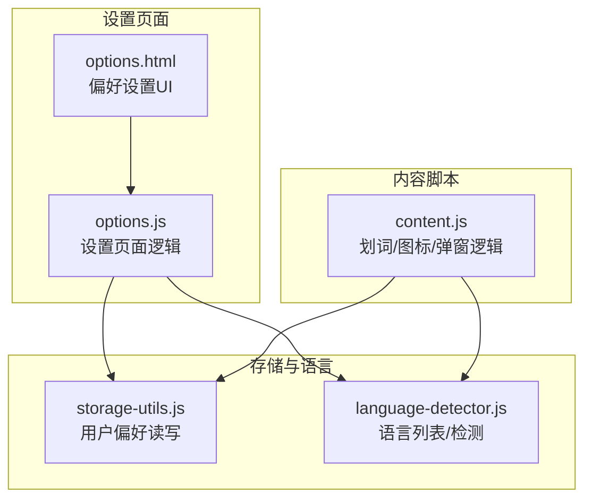
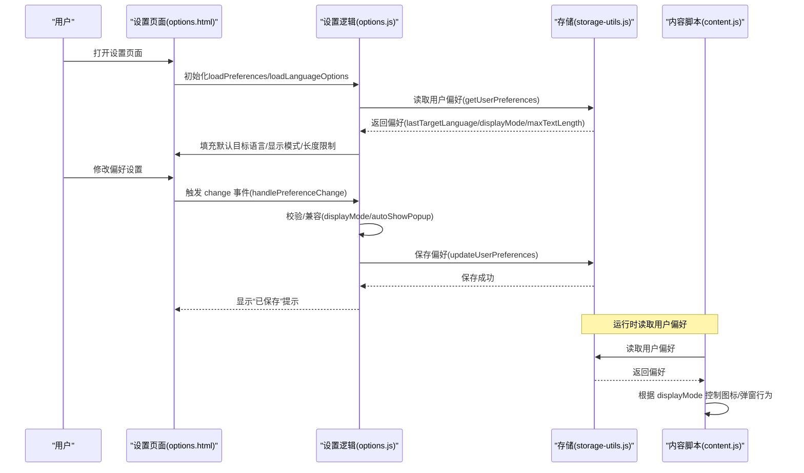
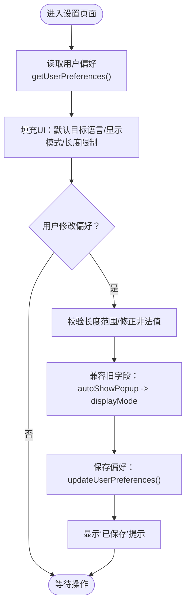
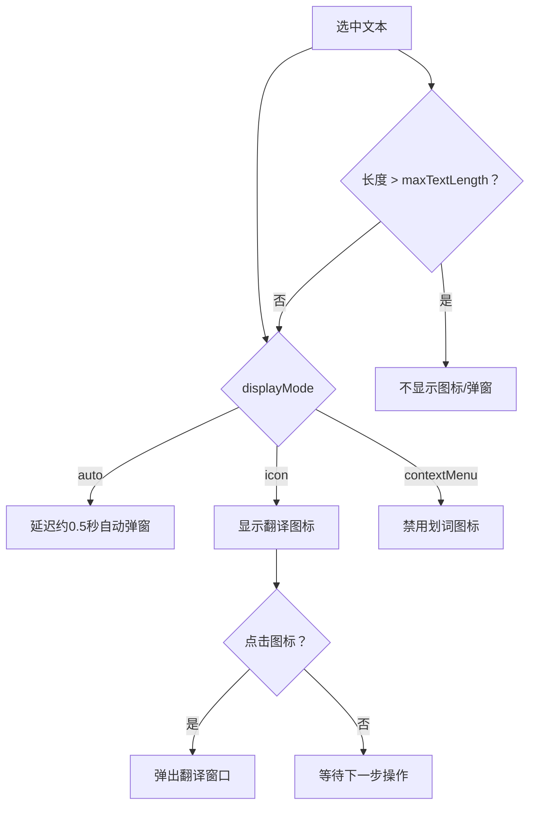
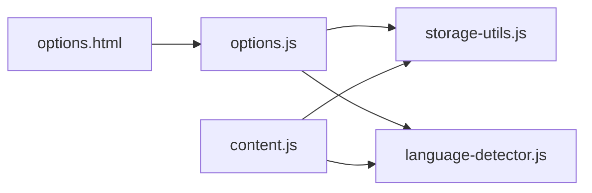

# 偏好设置

<cite>
**本文引用的文件**
- [options.html](file://options.html)
- [options.js](file://options.js)
- [storage-utils.js](file://storage-utils.js)
- [language-detector.js](file://language-detector.js)
- [content.js](file://content.js)
- [QUICKSTART.md](file://QUICKSTART.md)
</cite>

## 目录
1. [简介](#简介)
2. [项目结构](#项目结构)
3. [核心组件](#核心组件)
4. [架构概览](#架构概览)
5. [详细组件分析](#详细组件分析)
6. [依赖分析](#依赖分析)
7. [性能考虑](#性能考虑)
8. [故障排查指南](#故障排查指南)
9. [结论](#结论)

## 简介
本指南聚焦于“偏好设置”页面，帮助用户在设置页面调整用户偏好，提升划词翻译体验。重点说明以下两个关键项：
- 默认目标语言：设置划词翻译时的默认目标语言，减少手动切换。
- 划词显示模式：控制“选中文本后如何触发翻译”，包括自动弹窗、图标模式、右键菜单三种行为。

同时，提供保存设置的操作流程与验证方法，并引用 QUICKSTART.md 中的偏好设置说明，帮助用户按个人习惯优化使用体验。

## 项目结构
偏好设置相关的前端页面与逻辑分布如下：
- 设置页面 HTML：options.html
- 设置页面逻辑：options.js
- 存储与偏好读写：storage-utils.js
- 语言列表与检测：language-detector.js
- 内容脚本（划词与弹窗行为）：content.js
- 快速开始文档（含偏好设置说明）：QUICKSTART.md

图表来源
- [options.html](file://options.html#L352-L386)
- [options.js](file://options.js#L733-L785)
- [storage-utils.js](file://storage-utils.js#L310-L342)
- [language-detector.js](file://language-detector.js#L1-L263)
- [content.js](file://content.js#L132-L234)

章节来源
- [options.html](file://options.html#L352-L386)
- [options.js](file://options.js#L733-L785)
- [storage-utils.js](file://storage-utils.js#L310-L342)
- [language-detector.js](file://language-detector.js#L1-L263)
- [content.js](file://content.js#L132-L234)

## 核心组件
- 偏好设置界面（options.html）
  - 默认目标语言：下拉选择框，动态填充语言列表。
  - 划词显示模式：下拉选择框，支持“自动弹窗”“图标模式”“右键菜单”。
  - 文字长度限制：数值输入框，限制选中文本长度。
- 设置页面逻辑（options.js）
  - 加载用户偏好：从存储读取 lastTargetLanguage、displayMode、maxTextLength。
  - 语言选项加载：调用语言检测模块获取语言列表。
  - 偏好变更处理：监听下拉与输入框变化，写入存储并提示保存成功。
  - 兼容性处理：当旧字段 autoShowPopup 存在时，迁移到 displayMode。
- 存储工具（storage-utils.js）
  - 用户偏好读写：getUserPreferences、updateUserPreferences。
  - 默认值：lastTargetLanguage 默认中文；autoShowPopup 默认开启；popupPosition 默认 near。
- 内容脚本（content.js）
  - 划词显示模式影响：
    - displayMode 为 'auto'：选中文本后延迟自动弹出翻译。
    - displayMode 为 'icon'：仅显示翻译图标，点击图标再弹窗。
    - displayMode 为 'contextMenu'：禁用划词图标，通过右键菜单触发。
  - 文字长度限制：超过 maxTextLength 的文本不显示图标或弹窗。
  - 默认目标语言：在显示图标时，若检测到的源语言与目标语言相同，则不显示图标。

章节来源
- [options.html](file://options.html#L352-L386)
- [options.js](file://options.js#L733-L785)
- [storage-utils.js](file://storage-utils.js#L310-L342)
- [content.js](file://content.js#L132-L234)

## 架构概览
设置页面与运行时行为之间的交互关系如下：

图表来源
- [options.html](file://options.html#L352-L386)
- [options.js](file://options.js#L733-L785)
- [storage-utils.js](file://storage-utils.js#L310-L342)
- [content.js](file://content.js#L132-L234)

## 详细组件分析

### 偏好设置界面（options.html）
- 默认目标语言
  - UI：下拉选择框，用于选择划词翻译的目标语言。
  - 数据来源：由语言检测模块提供语言列表。
- 划词显示模式
  - UI：下拉选择框，提供三种模式：
    - 自动弹窗：选中文本后自动显示翻译。
    - 图标模式：仅显示翻译图标，点击图标后显示翻译。
    - 右键菜单：通过右键菜单触发翻译。
- 文字长度限制
  - UI：数值输入框，单位为字符数，范围 100–50000，默认 5000。
  - 运行时行为：超过该长度的文本不会显示图标或弹窗。

章节来源
- [options.html](file://options.html#L352-L386)

### 设置页面逻辑（options.js）
- 加载用户偏好
  - 从存储读取 lastTargetLanguage、displayMode、maxTextLength。
  - 兼容旧字段 autoShowPopup：若存在 autoShowPopup，则映射到 displayMode。
- 加载语言选项
  - 调用语言检测模块获取语言列表并填充下拉框。
- 偏好变更处理
  - 监听默认目标语言、显示模式、长度限制的 change/blur 事件。
  - 校验长度范围，修正非法值。
  - 保存偏好：同时设置 displayMode 和 autoShowPopup（向后兼容）。
  - 成功后显示“已保存”提示。

图表来源
- [options.js](file://options.js#L733-L785)
- [storage-utils.js](file://storage-utils.js#L310-L342)

章节来源
- [options.js](file://options.js#L733-L785)
- [storage-utils.js](file://storage-utils.js#L310-L342)

### 存储与语言（storage-utils.js、language-detector.js）
- 用户偏好默认值
  - lastTargetLanguage 默认中文。
  - autoShowPopup 默认开启（等价于 displayMode='auto'）。
  - popupPosition 默认 near。
- 语言列表
  - 提供中文、英语、日语、韩语、法语、德语、西班牙语、俄语、阿拉伯语、葡萄牙语、意大利语、泰语、越南语等。
  - 设置页面与内容脚本均使用该列表填充下拉框。

章节来源
- [storage-utils.js](file://storage-utils.js#L310-L342)
- [language-detector.js](file://language-detector.js#L1-L263)

### 运行时行为（content.js）
- 划词显示模式对行为的影响
  - displayMode='auto'：选中文本后延迟约 0.5 秒自动弹出翻译。
  - displayMode='icon'：仅显示翻译图标，点击图标后弹窗。
  - displayMode='contextMenu'：禁用划词图标，通过右键菜单触发翻译。
- 文字长度限制
  - 超过 maxTextLength 的文本不显示图标或弹窗。
- 默认目标语言
  - 若检测到的源语言与目标语言相同，则不显示图标（避免重复）。

图表来源
- [content.js](file://content.js#L132-L234)

章节来源
- [content.js](file://content.js#L132-L234)

## 依赖分析
- 设置页面依赖
  - options.html 依赖 options.js 实现交互。
  - options.js 依赖 storage-utils.js 读写用户偏好，依赖 language-detector.js 获取语言列表。
- 运行时依赖
  - content.js 依赖 storage-utils.js 读取用户偏好，依赖 language-detector.js 进行语言检测与列表填充。

图表来源
- [options.html](file://options.html#L352-L386)
- [options.js](file://options.js#L733-L785)
- [storage-utils.js](file://storage-utils.js#L310-L342)
- [language-detector.js](file://language-detector.js#L1-L263)
- [content.js](file://content.js#L132-L234)

章节来源
- [options.html](file://options.html#L352-L386)
- [options.js](file://options.js#L733-L785)
- [storage-utils.js](file://storage-utils.js#L310-L342)
- [language-detector.js](file://language-detector.js#L1-L263)
- [content.js](file://content.js#L132-L234)

## 性能考虑
- 自动弹窗延迟：displayMode='auto' 时采用约 0.5 秒延迟，降低频繁划词导致的弹窗抖动。
- 文字长度限制：通过 maxTextLength 防止超长文本触发不必要的图标/弹窗，减少 DOM 操作与渲染压力。
- 语言检测：language-detector.js 基于字符 Unicode 范围与拉丁语特征词进行本地快速识别，开销较小。

[本节为通用建议，不直接分析具体文件]

## 故障排查指南
- 设置未生效
  - 确认已在设置页面保存偏好（页面会显示“已保存”提示）。
  - 检查浏览器扩展页面是否已启用 QuickTrans。
- 自动弹窗未出现
  - 确认 displayMode 设置为“自动弹窗”。
  - 检查选中文本长度是否超过 maxTextLength。
  - 确认源语言与目标语言不同（相同语言不会显示图标）。
- 图标不显示
  - displayMode='contextMenu' 时不显示图标。
  - 选中文本长度过短或过长。
  - 源语言与目标语言相同。
- 右键菜单无反应
  - 确认 displayMode 设置为“右键菜单”。

章节来源
- [options.js](file://options.js#L733-L785)
- [content.js](file://content.js#L132-L234)

## 结论
- 默认目标语言：建议设置为常用目标语言（如中文），可减少每次手动切换。
- 划词显示模式：推荐使用“自动弹窗”，提升连续阅读翻译的效率；若希望更安静，可选择“图标模式”或“右键菜单”。
- 保存与验证：修改偏好后页面会提示“已保存”，随后在网页中进行划词测试即可验证效果。

章节来源
- [QUICKSTART.md](file://QUICKSTART.md#L66-L78)
- [options.html](file://options.html#L352-L386)
- [options.js](file://options.js#L733-L785)
- [content.js](file://content.js#L132-L234)