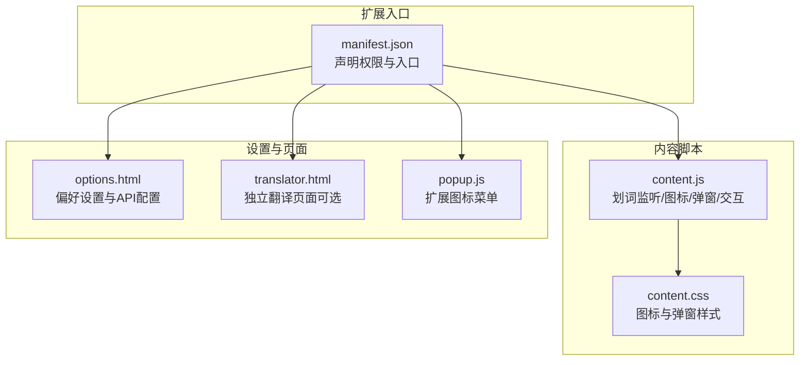
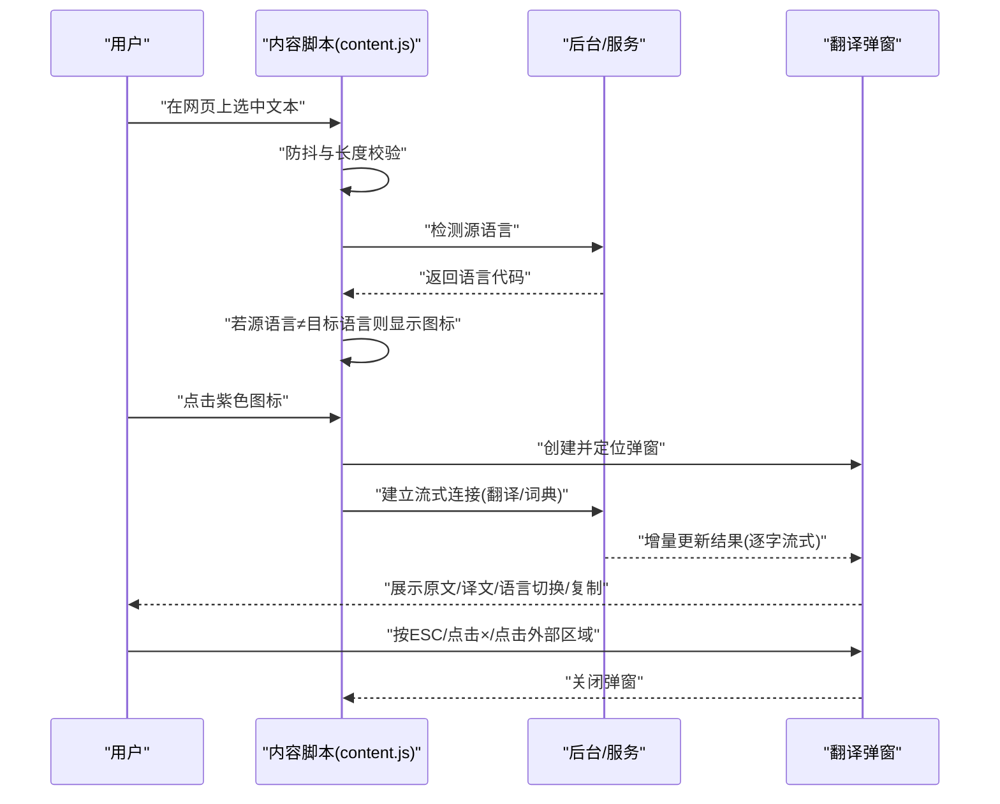
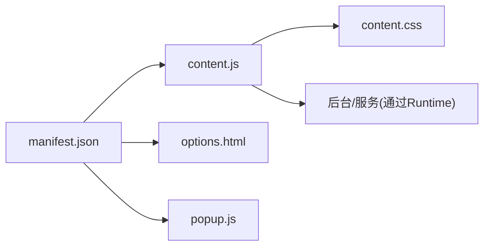

# 基本使用

<cite>
**本文引用的文件**
- [README.md](file://README.md)
- [QUICKSTART.md](file://QUICKSTART.md)
- [content.js](file://content.js)
- [content.css](file://content.css)
- [translator.html](file://translator.html)
- [options.html](file://options.html)
- [manifest.json](file://manifest.json)
- [popup.js](file://popup.js)
</cite>

## 目录
1. [简介](#简介)
2. [项目结构](#项目结构)
3. [核心组件](#核心组件)
4. [架构总览](#架构总览)
5. [详细组件分析](#详细组件分析)
6. [依赖关系分析](#依赖关系分析)
7. [性能考虑](#性能考虑)
8. [故障排查指南](#故障排查指南)
9. [结论](#结论)

## 简介
本指南面向首次使用者，聚焦“如何在任意网页上通过鼠标划词完成一次完整的翻译”。内容覆盖：
- 划词触发翻译的完整流程
- 翻译图标（紫色图标）出现的逻辑与点击行为
- 翻译弹窗的自动显示条件与内容结构
- 如何通过点击图标或按 ESC 键关闭弹窗
- 结合 QUICKSTART.md 的使用技巧，帮助新用户顺利完成首次翻译

## 项目结构
QuickTrans 是一个 Chrome 扩展，核心运行于网页内容脚本（content script）中，负责监听用户划词、显示翻译图标与弹窗、并与后台服务通信。

图表来源
- [manifest.json](file://manifest.json#L1-L52)
- [content.js](file://content.js#L1-L120)
- [content.css](file://content.css#L1-L120)
- [options.html](file://options.html#L1-L120)
- [translator.html](file://translator.html#L1-L60)
- [popup.js](file://popup.js#L1-L36)

章节来源
- [manifest.json](file://manifest.json#L1-L52)
- [content.js](file://content.js#L1-L120)
- [content.css](file://content.css#L1-L120)
- [options.html](file://options.html#L1-L120)
- [translator.html](file://translator.html#L1-L60)
- [popup.js](file://popup.js#L1-L36)

## 核心组件
- 内容脚本（content.js）：监听用户划词事件，根据偏好设置决定是否显示翻译图标；在图标点击或自动模式下显示翻译弹窗；处理语言切换、复制、拖拽、ESC 关闭等交互。
- 样式（content.css）：定义翻译图标与弹窗的外观、动画、布局与响应式适配。
- 设置页面（options.html）：管理 API 配置与用户偏好（默认目标语言、显示模式、文本长度限制等）。
- 独立翻译页面（translator.html）：提供更完整的文本翻译与词典查询界面（非划词场景）。
- 扩展图标菜单（popup.js）：提供打开翻译页面与设置页面的入口。

章节来源
- [content.js](file://content.js#L1-L120)
- [content.css](file://content.css#L1-L120)
- [options.html](file://options.html#L350-L420)
- [translator.html](file://translator.html#L1-L100)
- [popup.js](file://popup.js#L1-L36)

## 架构总览
下图展示了从“划词”到“弹窗显示”的关键交互路径，以及与设置页面的偏好联动。

图表来源
- [content.js](file://content.js#L146-L257)
- [content.js](file://content.js#L236-L391)
- [content.js](file://content.js#L614-L700)
- [content.css](file://content.css#L1-L120)

章节来源
- [content.js](file://content.js#L146-L257)
- [content.js](file://content.js#L236-L391)
- [content.js](file://content.js#L614-L700)
- [content.css](file://content.css#L1-L120)

## 详细组件分析

### 划词触发与翻译图标
- 触发条件
  - 用户在网页上选择文本，内容脚本进行防抖与长度校验（最小长度、最大长度限制）。
  - 检测源语言后，若与“默认目标语言”不同，才显示紫色翻译图标。
- 图标位置
  - 图标定位在选中文本右上角附近，随滚动与选择区域变化而更新。
- 点击行为
  - 点击图标会立即显示翻译弹窗，并根据显示模式决定是否自动弹出。

章节来源
- [content.js](file://content.js#L146-L205)
- [content.js](file://content.js#L206-L234)

### 翻译弹窗的自动显示条件与内容结构
- 自动显示条件
  - 当“显示模式”为“自动弹窗”时，在图标出现约 0.5 秒后自动弹出翻译窗口。
- 内容结构（普通翻译模式）
  - 头部：源语言标签、→ 箭头、目标语言下拉框（可切换）。
  - 内容区：原文展示、翻译结果区域（流式显示）。
  - 底部：复制译文按钮、信息栏（展示模型与 Token 消耗）。
- 内容结构（词典模式）
  - 头部：标题“词典”。
  - 单词展示区：单词文本、音标（可选）、单词发音按钮。
  - 上下文区域（可选）：包含单词的句子、句子发音按钮、上下文翻译。
  - 结果区：词典释义（Markdown 渲染）、复制释义按钮。
  - 底部：复制释义按钮、信息栏。

章节来源
- [content.js](file://content.js#L236-L391)
- [content.js](file://content.js#L393-L440)
- [content.css](file://content.css#L70-L160)
- [content.css](file://content.css#L160-L220)
- [content.css](file://content.css#L265-L320)
- [content.css](file://content.css#L350-L470)

### 关闭弹窗的方式
- 按下键盘 ESC 键
- 点击弹窗右上角的 × 按钮
- 点击弹窗外的任意区域（内容脚本统一监听）

章节来源
- [content.js](file://content.js#L60-L90)
- [content.js](file://content.js#L358-L365)

### 偏好设置对行为的影响
- 默认目标语言：影响“是否显示图标”（源语言与目标语言相同时不显示图标）与弹窗初始目标语言。
- 显示模式：
  - 自动弹窗：选中文本后自动显示弹窗。
  - 图标模式：需点击图标才显示弹窗。
  - 右键菜单：通过右键菜单触发翻译（内容脚本会忽略划词事件）。
- 文本长度限制：超过限制的选中文本不会触发图标或自动弹窗。

章节来源
- [content.js](file://content.js#L36-L75)
- [options.html](file://options.html#L352-L386)

### 使用技巧（来自 QUICKSTART.md）
- 切换目标语言：在弹窗顶部的目标语言下拉框中选择新语言，将自动重新翻译。
- 复制翻译结果：点击底部“复制译文”按钮，快速复制到剪贴板。
- 快速关闭弹窗：按 ESC、点击 ×、或点击弹窗外区域。
- 管理多个 API 配置：在设置页面添加多个配置，按需切换激活。

章节来源
- [QUICKSTART.md](file://QUICKSTART.md#L80-L100)
- [QUICKSTART.md](file://QUICKSTART.md#L66-L77)

## 依赖关系分析
- manifest.json 声明权限与入口，使内容脚本能在所有页面注入并在文档末尾运行。
- content.js 依赖 Chrome Runtime API 进行语言检测、流式翻译/词典查询、与后台通信。
- content.css 为图标与弹窗提供样式，保证在不同页面中稳定显示。
- options.html 与 popup.js 提供设置入口与扩展图标菜单，便于用户配置偏好与打开翻译页面。

图表来源
- [manifest.json](file://manifest.json#L1-L52)
- [content.js](file://content.js#L1-L120)
- [content.css](file://content.css#L1-L120)
- [options.html](file://options.html#L1-L120)
- [popup.js](file://popup.js#L1-L36)

章节来源
- [manifest.json](file://manifest.json#L1-L52)
- [content.js](file://content.js#L1-L120)
- [content.css](file://content.css#L1-L120)
- [options.html](file://options.html#L1-L120)
- [popup.js](file://popup.js#L1-L36)

## 性能考虑
- 防抖与长度限制：减少频繁触发与超长文本带来的开销。
- 流式输出：翻译过程逐字显示，提升感知速度与交互流畅度。
- 最小化注入：内容脚本仅在文档末尾注入，尽量降低对网页性能的影响。
- 缓存机制：相同内容与目标语言的翻译结果会被缓存，减少重复请求。

章节来源
- [README.md](file://README.md#L240-L246)
- [content.js](file://content.js#L146-L181)
- [content.js](file://content.js#L614-L700)

## 故障排查指南
- “未配置API”
  - 现象：弹窗显示错误提示，提供“前往设置”按钮。
  - 处理：在设置页面添加并保存至少一个有效 API 配置，再重试。
- “API密钥无效/网络异常”
  - 现象：弹窗显示错误提示，提供“重试/切换API”按钮。
  - 处理：检查密钥、端点、余额与网络，必要时切换到其他配置。
- “翻译很慢”
  - 现象：首字响应较慢或整体耗时较长。
  - 处理：更换响应更快的 API 服务，或减少文本长度。
- “某些网站无法使用”
  - 现象：插件在特定网站不可用。
  - 处理：尝试右键菜单触发翻译，或提交 Issue 反馈。

章节来源
- [content.js](file://content.js#L730-L777)
- [QUICKSTART.md](file://QUICKSTART.md#L100-L118)
- [README.md](file://README.md#L285-L314)

## 结论
通过本指南，新用户可以：
- 在任意网页上完成“划词→图标→弹窗→翻译→复制”的完整流程
- 理解翻译图标出现的条件与点击行为
- 掌握弹窗的自动显示规则与内容结构
- 学会通过多种方式关闭弹窗
- 借助 QUICKSTART.md 的技巧快速上手

建议在首次使用前完成 API 配置与偏好设置（默认目标语言、显示模式），以获得最佳体验。