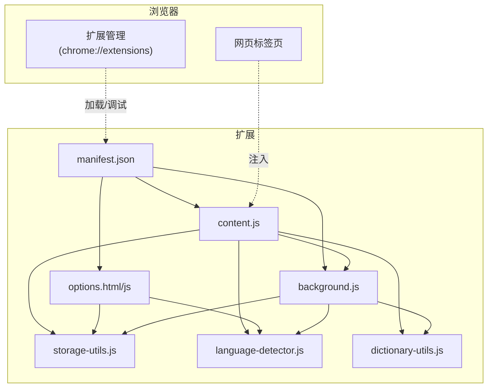
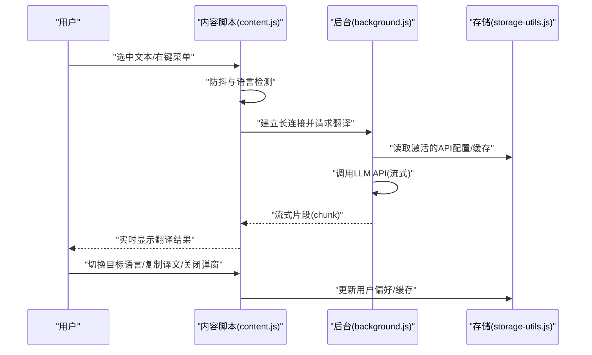
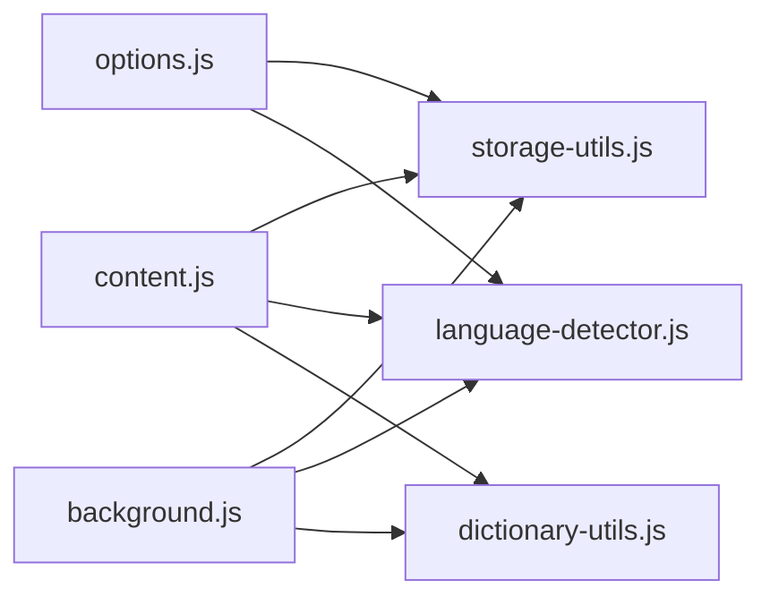

# 安装与使用指南

<cite>
**本文引用的文件**
- [INSTALL.md](file://INSTALL.md)
- [QUICKSTART.md](file://QUICKSTART.md)
- [README.md](file://README.md)
- [manifest.json](file://manifest.json)
- [options.html](file://options.html)
- [options.js](file://options.js)
- [content.js](file://content.js)
- [storage-utils.js](file://storage-utils.js)
- [language-detector.js](file://language-detector.js)
- [dictionary-utils.js](file://dictionary-utils.js)
</cite>

## 目录
1. [简介](#简介)
2. [项目结构](#项目结构)
3. [核心组件](#核心组件)
4. [架构总览](#架构总览)
5. [详细组件分析](#详细组件分析)
6. [依赖关系分析](#依赖关系分析)
7. [性能与体验](#性能与体验)
8. [故障排查指南](#故障排查指南)
9. [结论](#结论)
10. [附录](#附录)

## 简介
本指南面向新用户，提供从获取源码或安装包开始，到在Chrome浏览器中加载扩展、完成首次配置、掌握核心使用流程与偏好设置的完整路径。内容严格依据仓库中的 INSTALL.md、QUICKSTART.md、README.md 等文档整理，确保每一步都可操作、可验证。

## 项目结构
QuickTrans 是一个基于 Manifest V3 的 Chrome 扩展，主要由以下模块组成：
- manifest.json：扩展元信息、权限声明、背景脚本、内容脚本、选项页等
- background.js：后台服务（处理翻译请求、调用 LLM API、管理缓存）
- content.js：内容脚本（监听划词、显示翻译图标与弹窗、与后台通信）
- options.html/js：设置页面（管理翻译/TTS API 配置、用户偏好、缓存与 Token 统计）
- storage-utils.js：数据存储工具（Chrome Storage API 封装）
- language-detector.js：本地语言识别
- dictionary-utils.js：词典与 TTS 相关的通用工具
- icons/：图标资源
- 其他样式与页面：content.css、translator.html/css、popup.html/js 等

图表来源
- [manifest.json](file://manifest.json#L1-L52)
- [content.js](file://content.js#L1-L120)
- [options.js](file://options.js#L1-L120)
- [storage-utils.js](file://storage-utils.js#L1-L120)
- [language-detector.js](file://language-detector.js#L1-L60)
- [dictionary-utils.js](file://dictionary-utils.js#L1-L60)

章节来源
- [manifest.json](file://manifest.json#L1-L52)
- [README.md](file://README.md#L120-L168)

## 核心组件
- 扩展清单与权限
  - 权限：storage、activeTab、contextMenus、clipboardRead；host_permissions 允许向任意 http/https 发起请求
  - 背景脚本：service_worker
  - 内容脚本：注入到所有页面，运行于 document_end，支持所有框架
  - 选项页：options.html
  - 图标与动作：action.default_icon、default_title
  - 全局快捷键：open-translator
- 设置页面（options.html/js）
  - 翻译 API 配置：添加/编辑/删除/激活、测试连接
  - TTS API 配置：支持多家服务商，按 provider 展示不同字段
  - 偏好设置：默认目标语言、显示模式（自动/图标/右键菜单）、最大文本长度
  - 缓存管理：统计缓存数量与占用、清空缓存
  - Token 统计：总输入/输出/总 Token 数、请求次数、最后更新时间
- 内容脚本（content.js）
  - 划词监听与防抖（200ms）
  - 显示翻译图标或自动弹窗（displayMode）
  - 词典模式（单个英文单词）与翻译模式
  - 流式翻译与词典查询（长连接）
  - 复制译文、关闭弹窗（ESC、点击外部、右上角 ×）
- 存储与语言识别
  - Chrome Storage：local/sync/session 管理 API 配置、用户偏好、缓存、Token 统计
  - 本地语言识别：基于 Unicode 范围与拉丁语系特征词
- 词典工具
  - Markdown 到 HTML 格式化、音标提取、音频格式检测与 PCM 转 WAV

章节来源
- [manifest.json](file://manifest.json#L1-L52)
- [options.html](file://options.html#L1-L120)
- [options.js](file://options.js#L1-L120)
- [content.js](file://content.js#L1-L120)
- [storage-utils.js](file://storage-utils.js#L1-L120)
- [language-detector.js](file://language-detector.js#L1-L60)
- [dictionary-utils.js](file://dictionary-utils.js#L1-L60)

## 架构总览
QuickTrans 的核心交互链路如下：
- 用户在网页中划词或右键菜单触发
- content.js 检测语言、构建弹窗、建立与后台的长连接
- background.js 调用 LLM API，返回流式结果
- content.js 实时渲染结果，支持切换目标语言、复制译文、关闭弹窗
- storage-utils.js 负责持久化配置、缓存与统计

图表来源
- [content.js](file://content.js#L120-L240)
- [storage-utils.js](file://storage-utils.js#L310-L360)
- [options.js](file://options.js#L340-L420)

## 详细组件分析

### 安装与加载（Chrome）
- 准备图标（可选）
  - 使用浏览器生成或 Python 脚本生成图标文件，放置到 icons/ 目录
- 加载扩展
  - 打开 chrome://extensions/
  - 开启“开发者模式”
  - 点击“加载已解压的扩展程序”，选择项目根目录（包含 manifest.json）

章节来源
- [INSTALL.md](file://INSTALL.md#L1-L33)
- [README.md](file://README.md#L40-L60)

### 首次配置：API 配置与测试
- 进入选项页面
  - 点击扩展图标或在扩展管理页面点击“详细信息”->“扩展程序选项”
- 添加翻译 API 配置
  - 点击“添加新配置”，填写：
    - 配置名称（如 OpenAI GPT-3.5）
    - API 端点（如 OpenAI 官方端点）
    - API 密钥（sk- 开头）
    - 模型名称（如 gpt-4o-mini、gpt-4、gpt-3.5-turbo 等）
    - Temperature（0-2，如 0.3）
  - 点击“测试连接”验证配置
  - 点击“保存配置”
- 激活配置
  - 在配置卡片中点击“激活”，确保当前使用的是该配置

章节来源
- [INSTALL.md](file://INSTALL.md#L34-L69)
- [QUICKSTART.md](file://QUICKSTART.md#L14-L27)
- [options.html](file://options.html#L112-L204)
- [options.js](file://options.js#L344-L447)

### 核心使用流程：划词翻译与弹窗操作
- 划词触发
  - 在任意网页选中一段文本
  - 等待 0.5 秒（若开启自动显示）或点击紫色翻译图标
- 弹窗行为
  - 翻译模式：顶部显示源语言→目标语言下拉框，可切换目标语言
  - 词典模式：当选中文本为单个英文单词时，显示词典条目、音标、上下文与释义
- 切换目标语言
  - 在翻译弹窗顶部下拉框选择新语言，自动重新翻译
- 复制译文
  - 点击弹窗底部“复制译文”按钮，翻译结果复制到剪贴板
- 关闭弹窗
  - 按 ESC 键
  - 点击弹窗外部任意区域
  - 点击右上角 × 按钮

章节来源
- [QUICKSTART.md](file://QUICKSTART.md#L28-L35)
- [README.md](file://README.md#L80-L117)
- [content.js](file://content.js#L236-L391)

### 偏好设置调整
- 默认目标语言
  - 在设置页面“默认目标语言”中选择常用语言
- 显示模式
  - 自动弹窗：选中文本后自动显示翻译
  - 图标模式：点击图标后显示翻译
  - 右键菜单：通过右键菜单触发翻译
- 最大文本长度
  - 设置选中文本超过该长度时不显示翻译选项（字符数）

章节来源
- [QUICKSTART.md](file://QUICKSTART.md#L66-L77)
- [options.js](file://options.js#L733-L785)

### 高级配置与调试
- 修改默认模型与温度
  - 编辑 background.js 中的模型与温度参数（如需）
- 查看后台日志与内容脚本日志
  - 打开 chrome://extensions/，找到“Service Worker”查看后台日志
  - 在网页按 F12 打开开发者工具查看内容脚本日志
- 查看存储数据
  - 在开发者工具 Application -> Storage 中查看 chrome.storage.local 与 chrome.storage.sync

章节来源
- [INSTALL.md](file://INSTALL.md#L110-L159)
- [README.md](file://README.md#L250-L265)

## 依赖关系分析
- 模块耦合
  - content.js 依赖 storage-utils.js（读取用户偏好、缓存）、language-detector.js（语言检测）、dictionary-utils.js（格式化与工具）
  - options.js 依赖 storage-utils.js（API/TTS 配置、偏好、缓存与 Token 统计）
  - background.js 依赖 storage-utils.js（配置与缓存）、language-detector.js（语言检测）、dictionary-utils.js（格式化）
- 外部依赖
  - Chrome Storage API（local/sync/session）
  - Chrome Runtime（消息传递、长连接）
  - Host 权限用于向第三方 API 端点发起请求

图表来源
- [content.js](file://content.js#L1-L120)
- [options.js](file://options.js#L1-L120)
- [storage-utils.js](file://storage-utils.js#L1-L120)
- [language-detector.js](file://language-detector.js#L1-L60)
- [dictionary-utils.js](file://dictionary-utils.js#L1-L60)

章节来源
- [manifest.json](file://manifest.json#L1-L52)
- [storage-utils.js](file://storage-utils.js#L1-L120)

## 性能与体验
- 防抖机制：200ms 防抖，避免频繁触发
- 翻译缓存：相同文本+目标语言的结果被缓存，浏览器关闭后自动清空
- 请求超时：30 秒超时保护
- 轻量注入：内容脚本最小化对网页性能的影响
- 流式输出：翻译结果逐字显示，首字响应更快

章节来源
- [README.md](file://README.md#L240-L246)

## 故障排查指南
- 加载插件时报错
  - 检查 manifest.json 是否存在且格式正确
  - 确认 icons/ 目录下存在 icon16.png、icon48.png、icon128.png
  - 确保 JavaScript 文件无语法错误
- 插件图标不显示
  - 使用 icons/icon-generator.html 生成更好的图标
- 翻译功能无响应
  - 检查是否已配置 API
  - 打开 F12 查看 Console 错误
  - 在 chrome://extensions/ 中查看 Service Worker 日志
  - 尝试在其他网页测试
- 未配置 API 或 API 密钥无效
  - 按“首次配置”步骤添加并测试连接
- 翻译很慢
  - 取决于 API 服务响应速度与网络质量，可切换更快的 API 配置
- 某些网站无法使用
  - 部分网站可能有特殊安全策略或内容加载方式，建议反馈 Issue

章节来源
- [INSTALL.md](file://INSTALL.md#L81-L109)
- [QUICKSTART.md](file://QUICKSTART.md#L100-L118)

## 结论
通过本指南，您可以在 Chrome 中顺利安装 QuickTrans，完成 API 配置与测试，并掌握划词翻译、切换语言、复制译文与关闭弹窗等核心操作。结合偏好设置与缓存/Token 统计，您可以进一步优化使用体验。如遇问题，可参考故障排查章节或查看后台日志与存储数据。

## 附录

### 快速开始步骤对照
- 加载扩展到 Chrome：chrome://extensions/ -> 开启开发者模式 -> 加载已解压的扩展程序 -> 选择项目根目录
- 配置 API：扩展程序选项 -> 添加新配置 -> 填写名称/端点/密钥/模型/Temperature -> 测试连接 -> 保存
- 开始使用：打开网页 -> 选中文本 -> 等待弹窗或点击图标 -> 查看翻译结果

章节来源
- [QUICKSTART.md](file://QUICKSTART.md#L5-L35)
- [INSTALL.md](file://INSTALL.md#L25-L51)