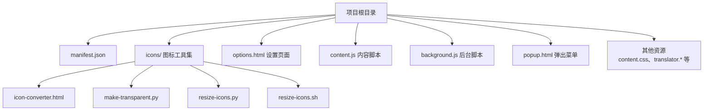
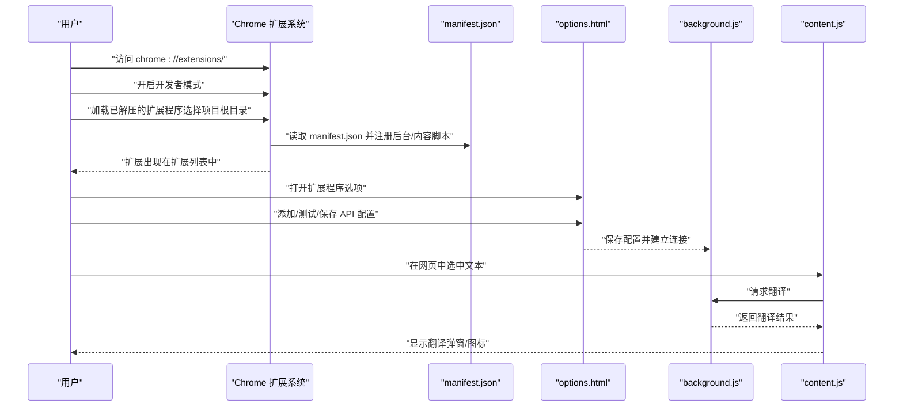
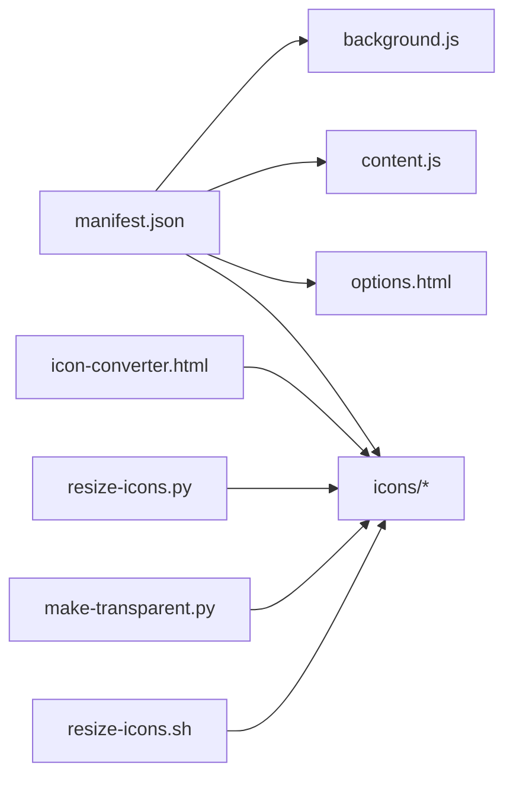

# 安装指南

<cite>
**本文引用的文件**
- [INSTALL.md](file://INSTALL.md)
- [README.md](file://README.md)
- [QUICKSTART.md](file://QUICKSTART.md)
- [manifest.json](file://manifest.json)
- [icons/icon-converter.html](file://icons/icon-converter.html)
- [icons/make-transparent.py](file://icons/make-transparent.py)
- [icons/resize-icons.py](file://icons/resize-icons.py)
- [icons/resize-icons.sh](file://icons/resize-icons.sh)
</cite>

## 目录
1. [简介](#简介)
2. [项目结构](#项目结构)
3. [核心组件](#核心组件)
4. [架构概览](#架构概览)
5. [详细组件分析](#详细组件分析)
6. [依赖分析](#依赖分析)
7. [性能考虑](#性能考虑)
8. [故障排查指南](#故障排查指南)
9. [结论](#结论)
10. [附录](#附录)

## 简介
本指南面向首次部署 QuickTrans 插件的新用户，提供从获取源码到在 Chrome 浏览器中加载已解压扩展的完整步骤说明。同时解释插件图标可能显示为占位符的正常现象，并指导用户使用内置工具生成正式图标。文档严格依据仓库内的 INSTALL.md、README.md、QUICKSTART.md、manifest.json 以及 icons 目录下的工具文件，确保每一步操作的目的与预期结果清晰明确。

## 项目结构
QuickTrans 是一个基于 Manifest V3 的 Chrome 扩展，核心入口为 manifest.json，内容脚本与后台脚本分别负责页面交互与翻译请求处理，设置页面位于 options.html。icons 目录提供图标生成与处理工具，便于用户替换默认占位图标。

图表来源
- [manifest.json](file://manifest.json#L1-L52)
- [icons/icon-converter.html](file://icons/icon-converter.html#L1-L247)
- [icons/make-transparent.py](file://icons/make-transparent.py#L1-L78)
- [icons/resize-icons.py](file://icons/resize-icons.py#L1-L51)
- [icons/resize-icons.sh](file://icons/resize-icons.sh#L1-L200)

章节来源
- [manifest.json](file://manifest.json#L1-L52)
- [README.md](file://README.md#L120-L140)

## 核心组件
- manifest.json：声明扩展元信息、权限、后台脚本、内容脚本、图标映射与快捷命令等，是加载扩展的关键配置。
- icons/：包含多种图标生成与处理工具，支持浏览器端与 Python 脚本两种方式生成 16x16、48x48、128x128 三种尺寸图标。
- options.html：扩展的设置页面，用于添加/管理翻译与 TTS API 配置、偏好设置、缓存与 Token 统计等。
- content.js / background.js：内容脚本监听页面选择事件并展示 UI；后台脚本负责调用 LLM API 并管理缓存。

章节来源
- [manifest.json](file://manifest.json#L1-L52)
- [icons/icon-converter.html](file://icons/icon-converter.html#L1-L247)
- [icons/make-transparent.py](file://icons/make-transparent.py#L1-L78)
- [icons/resize-icons.py](file://icons/resize-icons.py#L1-L51)
- [options.html](file://options.html#L1-L470)

## 架构概览
下图展示了从用户在 Chrome 中加载扩展到设置 API 并开始使用翻译功能的整体流程。

图表来源
- [INSTALL.md](file://INSTALL.md#L25-L52)
- [QUICKSTART.md](file://QUICKSTART.md#L1-L36)
- [manifest.json](file://manifest.json#L1-L52)
- [options.html](file://options.html#L1-L470)

## 详细组件分析

### 步骤一：准备图标文件（可选）
- 使用浏览器生成（推荐）
  - 打开 icons/icon-converter.html，上传图片后自动生成 16x16、48x48、128x128 三种尺寸图标，并可直接下载。
- 使用 Python 脚本
  - 先执行 icons/resize-icons.py 生成基础尺寸图标，再运行 icons/make-transparent.py 将浅色背景转为透明，最后可配合 icons/resize-icons.sh 进行批量处理。
- 操作目的与预期结果
  - 替换默认占位图标，提升视觉体验；确保 Chrome 扩展商店审核与用户体验的一致性。
  - 若不替换，插件仍可正常使用，但图标可能显示为占位符，属于正常现象。

章节来源
- [INSTALL.md](file://INSTALL.md#L1-L24)
- [icons/icon-converter.html](file://icons/icon-converter.html#L1-L247)
- [icons/make-transparent.py](file://icons/make-transparent.py#L1-L78)
- [icons/resize-icons.py](file://icons/resize-icons.py#L1-L51)
- [icons/resize-icons.sh](file://icons/resize-icons.sh#L1-L200)

### 步骤二：加载到 Chrome（开发者模式）
- 操作步骤
  - 打开 Chrome，访问 chrome://extensions/。
  - 打开右上角“开发者模式”开关。
  - 点击“加载已解压的扩展程序”，选择本项目的根目录（包含 manifest.json 的文件夹）。
  - 确认加载成功，扩展出现在扩展列表中。
- 操作目的与预期结果
  - 使 Chrome 识别并加载本扩展的所有资源（后台脚本、内容脚本、图标、设置页面等）。
  - 若加载失败，检查 manifest.json 是否存在且格式正确，以及 icons 目录下是否存在 icon16.png、icon48.png、icon128.png。

章节来源
- [INSTALL.md](file://INSTALL.md#L25-L33)
- [QUICKSTART.md](file://QUICKSTART.md#L1-L13)
- [manifest.json](file://manifest.json#L1-L52)

### 步骤三：配置 API（必需）
- 操作步骤
  - 点击扩展图标或在扩展管理页面点击“详细信息”->“扩展程序选项”。
  - 在设置页面点击“添加新配置”，填写配置名称、API 端点、API 密钥。
  - 点击“测试连接”验证配置，点击“保存配置”。
- 操作目的与预期结果
  - 为翻译功能提供有效的 LLM API 凭据；测试连接可提前发现端点或密钥问题。
  - 若翻译无响应，优先检查是否已配置 API、密钥是否正确、网络是否可达。

章节来源
- [INSTALL.md](file://INSTALL.md#L34-L52)
- [QUICKSTART.md](file://QUICKSTART.md#L14-L36)
- [options.html](file://options.html#L1-L470)

### 步骤四：开始使用
- 操作步骤
  - 打开任意网页，选中一段文本，等待翻译图标出现（或自动弹出翻译窗口），查看翻译结果。
- 操作目的与预期结果
  - 验证扩展已正确注入内容脚本并能与后台脚本通信，翻译流程正常。

章节来源
- [INSTALL.md](file://INSTALL.md#L46-L52)
- [QUICKSTART.md](file://QUICKSTART.md#L28-L36)

## 依赖分析
- manifest.json 依赖关系
  - permissions/host_permissions：声明存储权限、活动标签页访问权限与主机权限，确保扩展可读取页面内容并访问 API 端点。
  - background.service_worker：指向 background.js，负责翻译请求与缓存管理。
  - content_scripts：指向 dictionary-utils.js 与 content.js，并注入 content.css，负责监听选择事件与渲染 UI。
  - icons/action：映射 16x16/48x48/128x128 图标路径，供扩展图标显示。
- 图标工具链
  - icon-converter.html：浏览器端生成多尺寸图标。
  - resize-icons.py / resize-icons.sh：Python 脚本批量生成与处理图标。
  - make-transparent.py：将浅色背景转为透明，提升图标在不同背景下的可辨识度。

图表来源
- [manifest.json](file://manifest.json#L1-L52)
- [icons/icon-converter.html](file://icons/icon-converter.html#L1-L247)
- [icons/resize-icons.py](file://icons/resize-icons.py#L1-L51)
- [icons/make-transparent.py](file://icons/make-transparent.py#L1-L78)
- [icons/resize-icons.sh](file://icons/resize-icons.sh#L1-L200)

章节来源
- [manifest.json](file://manifest.json#L1-L52)

## 性能考虑
- 防抖与缓存：内容脚本对频繁选择事件进行防抖，后台脚本对相同内容+目标语言的翻译结果进行缓存，减少重复请求与 API 调用。
- 轻量注入：内容脚本仅在文档末尾注入，尽量降低对网页性能的影响。
- 请求超时：后台脚本对 API 请求设置超时保护，避免长时间阻塞。

章节来源
- [README.md](file://README.md#L240-L246)

## 故障排查指南
- 加载插件时报错
  - 检查清单
    - 确保 manifest.json 文件存在且格式正确。
    - 确保 icons 目录下有 icon16.png、icon48.png、icon128.png 文件。
    - 确保所有 JavaScript 文件没有语法错误。
- 插件图标不显示
  - 这是正常的，因为使用了简单的占位图标。可使用 icons/icon-generator.html 生成更好的图标。
- 翻译功能无响应
  - 排查步骤
    - 检查是否已配置 API。
    - 打开 Chrome 开发者工具（F12），查看 Console 是否有错误。
    - 访问 chrome://extensions/，点击插件的“Service Worker”查看后台日志。
    - 尝试在其他网页测试。
- 卸载插件
  - 访问 chrome://extensions/，找到“AI翻译助手”，点击“移除”。

章节来源
- [INSTALL.md](file://INSTALL.md#L81-L109)
- [INSTALL.md](file://INSTALL.md#L90-L93)

## 结论
通过以上步骤，新用户可以顺利完成 QuickTrans 插件的安装与初始配置。若遇到问题，可依据 INSTALL.md 中的检查清单与排障建议快速定位并解决问题。建议在生产环境中替换默认图标，并根据实际需求配置合适的 API 与偏好设置，以获得最佳使用体验。

## 附录
- 图标生成工具使用建议
  - 浏览器端：优先使用 icons/icon-converter.html，操作简单、即时可见。
  - Python 脚本：适合批量处理与自动化集成，配合 make-transparent.py 可进一步优化透明背景。
- 常用参考路径
  - 安装与快速开始：INSTALL.md、QUICKSTART.md
  - 扩展配置与权限：manifest.json
  - 设置页面与 API 管理：options.html
  - 图标工具：icons/icon-converter.html、icons/resize-icons.py、icons/make-transparent.py、icons/resize-icons.sh