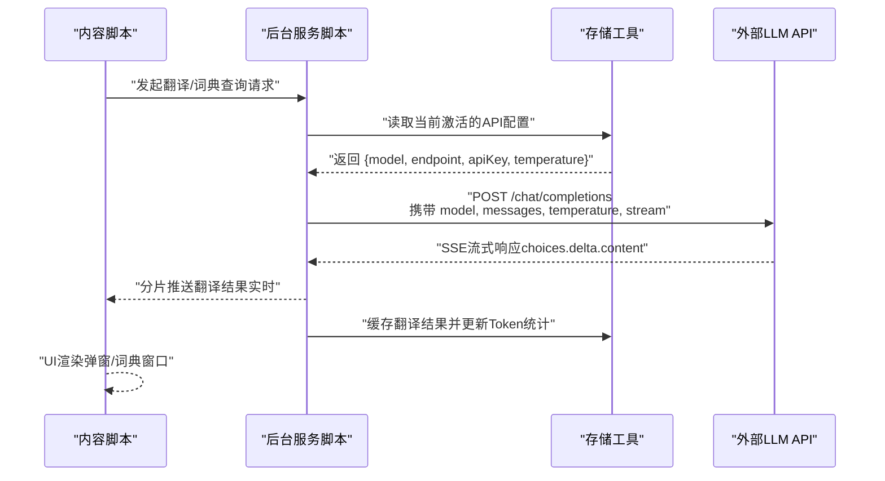
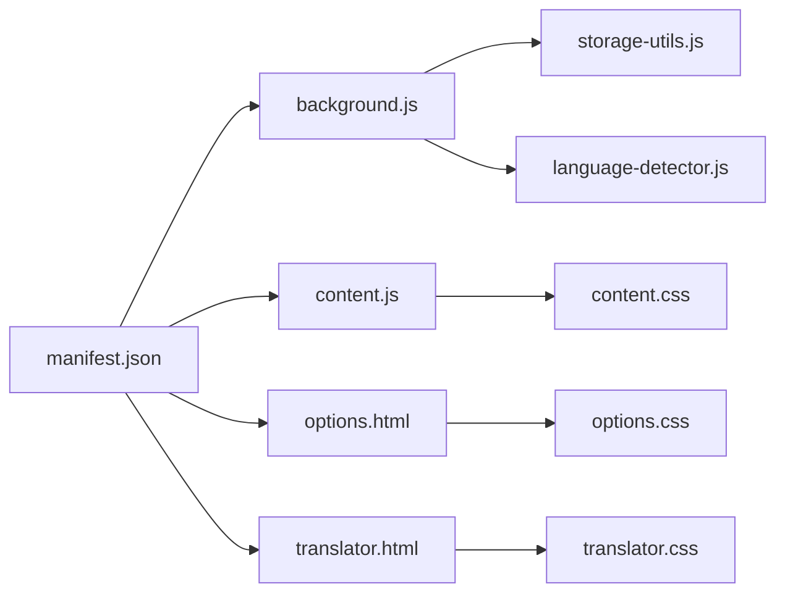
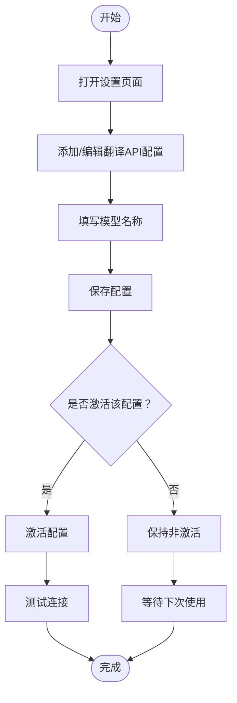

# 代码定制

<cite>
**本文引用的文件**
- [background.js](file://background.js)
- [content.css](file://content.css)
- [options.css](file://options.css)
- [manifest.json](file://manifest.json)
- [options.html](file://options.html)
- [options.js](file://options.js)
- [translator.css](file://translator.css)
</cite>

## 目录
1. [简介](#简介)
2. [项目结构](#项目结构)
3. [核心组件](#核心组件)
4. [架构总览](#架构总览)
5. [详细组件分析](#详细组件分析)
6. [依赖关系分析](#依赖关系分析)
7. [性能与可用性考量](#性能与可用性考量)
8. [故障排查指南](#故障排查指南)
9. [结论](#结论)
10. [附录](#附录)

## 简介
本指南面向希望对 QuickTrans 插件进行定制开发的工程师与高级用户，围绕“如何修改默认模型”和“如何自定义UI样式”两大主题，提供可落地的步骤说明、代码路径指引、可视化流程图与最佳实践建议。同时补充设置页面样式定制方法与扩展更新后的生效方式，帮助你在不破坏功能的前提下实现个性化体验。

## 项目结构
QuickTrans 是一个基于 Manifest V3 的浏览器扩展，主要由后台服务脚本、内容脚本样式、设置页面样式与模板组成。其核心交互通过 Service Worker 与内容脚本通信，借助端点配置驱动翻译与词典查询。

```mermaid
graph TB
subgraph "扩展清单"
M["manifest.json"]
end
subgraph "后台服务"
BG["background.js"]
end
subgraph "内容脚本与样式"
CS["content.js"]
CC["content.css"]
TRH["translator.html"]
TRCSS["translator.css"]
end
subgraph "设置页面"
OH["options.html"]
OJS["options.js"]
OC["options.css"]
end
M --> BG
M --> CS
M --> OH
M --> TRH
CS --> CC
TRH --> TRCSS
OH --> OC
BG <- --> CS
BG <- --> OJS
```

图表来源
- [manifest.json](file://manifest.json#L1-L52)
- [background.js](file://background.js#L1-L120)
- [content.css](file://content.css#L1-L120)
- [options.css](file://options.css#L1-L120)
- [translator.css](file://translator.css#L1-L120)
- [options.html](file://options.html#L1-L120)

章节来源
- [manifest.json](file://manifest.json#L1-L52)

## 核心组件
- 后台服务脚本（background.js）：负责翻译与词典查询的流式处理、API配置读取、缓存与Token统计更新、消息监听与右键菜单创建等。
- 内容脚本样式（content.css）：定义翻译弹窗、词典窗口、TTS按钮等UI组件的视觉样式与交互动画。
- 设置页面样式（options.css）：定义设置页的整体配色、卡片、表单、模态框、开关与响应式布局。
- 设置页面模板与逻辑（options.html、options.js）：提供API/TTS配置的增删改查、激活切换、测试连接、偏好设置与缓存/Token统计展示。
- 翻译页面样式（translator.css）：延续设计语言，定义翻译页面的容器、标题栏、控制面板、输入/结果区域、词典弹窗与TTS按钮样式。

章节来源
- [background.js](file://background.js#L1-L200)
- [content.css](file://content.css#L1-L200)
- [options.css](file://options.css#L1-L200)
- [options.html](file://options.html#L1-L200)
- [options.js](file://options.js#L1-L120)
- [translator.css](file://translator.css#L1-L200)

## 架构总览
QuickTrans 的请求链路以“内容脚本触发 -> 后台服务脚本处理 -> API端点调用 -> 流式回传 -> UI渲染”为主线。其中模型名来源于设置页面的“翻译API配置”，后台在调用 LLM API 时直接使用该配置中的 model 字段。



图表来源
- [background.js](file://background.js#L200-L320)
- [background.js](file://background.js#L860-L980)
- [options.html](file://options.html#L160-L200)
- [options.js](file://options.js#L200-L260)

## 详细组件分析

### 如何修改默认模型（翻译模型）
- 模型来源：设置页面的“翻译API配置”中包含 model 字段；后台在调用 LLM API 时直接使用该配置中的 model。
- 修改步骤
  1) 在设置页面添加或编辑一条“翻译API配置”，在“模型名称”字段填入期望的模型名（如 gpt-4-turbo、gpt-4o-mini 等）。
  2) 保存后，若该配置被“激活”，后台在后续翻译请求中会使用该 model 字段作为请求体中的 model 字段。
  3) 若需要测试模型连通性，可在设置页面点击“测试连接”。

- 关键代码路径
  - 设置页面表单字段：[options.html](file://options.html#L166-L193)
  - 保存/更新配置时写入 model 字段：[options.js](file://options.js#L200-L260)、[storage-utils.js](file://storage-utils.js#L32-L77)
  - 后台读取激活配置并发起请求：[background.js](file://background.js#L211-L245)、[background.js](file://background.js#L906-L917)
  - 请求体中 model 字段的构造与发送：[background.js](file://background.js#L221-L235)

- 注意事项
  - 不要在后台脚本中硬编码 DEFAULT_MODEL 常量（仓库中未发现该常量定义）。模型应通过设置页面配置并由后台读取。
  - 确保所填模型名与API端点兼容（例如 OpenAI 兼容端点支持的模型列表）。

章节来源
- [options.html](file://options.html#L166-L193)
- [options.js](file://options.js#L200-L260)
- [storage-utils.js](file://storage-utils.js#L32-L77)
- [background.js](file://background.js#L211-L245)
- [background.js](file://background.js#L906-L917)

### 如何自定义UI样式（内容脚本弹窗与词典窗口）
- 定位样式选择器
  - 翻译触发图标：.ai-translate-icon
  - 翻译弹窗容器：.ai-translate-popup
  - 弹窗头部：.ai-translate-popup-header
  - 关闭按钮：.ai-translate-popup-close
  - 内容区：.ai-translate-popup-content
  - 原文区域：.ai-translate-popup-original
  - 翻译结果区域：.ai-translate-popup-result
  - 底部操作栏：.ai-translate-popup-footer
  - 复制按钮：.ai-translate-popup-copy-btn
  - 错误状态：.ai-translate-popup-error
  - 词典模式头部：.ai-translate-dict-header
  - 单词展示区：.ai-translate-dict-word
  - 上下文区域：.ai-translate-dict-context
  - 上下文翻译：.ai-translate-dict-context-trans
  - TTS按钮：.ai-translate-tts-btn（含 small/play/loading/error 状态）
  - 滚动条样式：.ai-translate-popup-content::-webkit-scrollbar 系列

- 可定制维度
  - 颜色体系：主色、次色、成功/警告/危险色、文本色、背景色等（内容脚本样式中多处使用线性渐变与固定色值）
  - 字体与字号：标题、正文、标签、按钮等层级
  - 布局与间距：圆角、阴影、内外边距、flex 布局、响应式断点
  - 动画与过渡：入场动画、hover 效果、加载动画、播放状态波形动画

- 示例定制方向
  - 修改渐变背景：如将 .ai-translate-popup-header 的线性渐变替换为自定义色系
  - 调整弹窗圆角：修改 .ai-translate-popup 的 border-radius
  - 改变按钮样式：如 .ai-translate-popup-copy-btn 的背景色、悬停阴影、过渡时长
  - 自定义滚动条：调整 .ai-translate-popup-content::-webkit-scrollbar-track/Thumb 的颜色与圆角

- 注意事项
  - CSS优先级：内容脚本样式通过 manifest 中的 css 注入，优先级较高；若需覆盖，可在扩展注入的样式之外再增加更高优先级的选择器或使用 !important（谨慎使用）。
  - 浏览器默认样式：某些浏览器对滚动条、按钮等元素有默认样式，可通过伪元素与自定义控件覆盖。
  - 响应式适配：注意媒体查询（如 max-width: 480px）对移动端的影响。

章节来源
- [content.css](file://content.css#L1-L200)
- [content.css](file://content.css#L200-L420)
- [content.css](file://content.css#L420-L620)

### 如何通过 options.css 定制设置页面外观
- 设计要点
  - 使用 CSS 变量（:root）集中管理主色、文本色、背景色、阴影等，便于全局替换。
  - 卡片、表单、模态框、开关、Toast 提示等组件均有独立类名，便于按需覆盖。
  - 响应式布局通过媒体查询适配移动端。

- 可定制维度
  - 页面背景与渐变：body 的背景线性渐变
  - 头部与标题：.header、.header-title、.header-subtitle
  - 容器与阴影：.container、.config-card、.modal-content
  - 按钮组：.btn、.btn-primary、.btn-secondary、.btn-danger、.btn-test
  - 表单与输入：.form-group、.form-input、.form-label、.required
  - 开关：.toggle、.toggle-slider、.toggle input:checked + .toggle-slider
  - Toast：.toast、.toast.success/error/warning

- 示例定制方向
  - 替换主色系：修改 :root 中的 --primary-color、--success-color 等变量
  - 调整卡片圆角与阴影：修改 .config-card、.modal-content 的 border-radius 与 box-shadow
  - 自定义按钮风格：覆盖 .btn-primary、.btn-secondary 的背景色与 hover 效果
  - 优化表单焦点态：调整 .form-input:focus 的边框与阴影

章节来源
- [options.css](file://options.css#L1-L120)
- [options.css](file://options.css#L120-L360)
- [options.css](file://options.css#L360-L620)
- [options.css](file://options.css#L620-L800)

### 翻译页面样式（translator.css）的定制参考
- 适用场景：当你需要在翻译页面中统一风格，或为词典弹窗、TTS按钮等提供一致的视觉体验。
- 关键选择器：.translator-container、.translator-header、.control-panel、.input-section、.result-section、.dictionary-popup、.dict-tts-btn 等。
- 定制建议：与 options.css 的变量体系保持一致，确保设置页与翻译页风格统一。

章节来源
- [translator.css](file://translator.css#L1-L200)
- [translator.css](file://translator.css#L200-L520)
- [translator.css](file://translator.css#L520-L771)

## 依赖关系分析
- manifest.json 声明了后台脚本、内容脚本与样式、设置页面入口，决定扩展的运行时行为与资源注入顺序。
- background.js 依赖 storage-utils.js 与 language-detector.js（通过 importScripts 引入），负责翻译与词典查询的核心逻辑。
- content.css 由 manifest 的 content_scripts 注入，影响页面上的弹窗与词典窗口渲染。
- options.css 由 options.html 引入，影响设置页面的外观与交互。



图表来源
- [manifest.json](file://manifest.json#L1-L52)
- [background.js](file://background.js#L1-L20)
- [content.css](file://content.css#L1-L20)
- [options.css](file://options.css#L1-L20)
- [translator.css](file://translator.css#L1-L20)

章节来源
- [manifest.json](file://manifest.json#L1-L52)

## 性能与可用性考量
- 流式传输：后台使用 Port 连接与 SSE 流式返回，提升首字响应速度与实时反馈体验。定制时尽量避免阻塞主线程的复杂计算。
- 缓存策略：后台会对翻译结果进行缓存，减少重复请求与API调用成本。定制时可关注缓存命中率与清理策略。
- 样式优化：内容脚本样式包含大量动画与阴影，建议在低端设备上适度降低动画强度或禁用不必要的过渡。
- 响应式设计：移动端断点与滚动条样式已在样式中实现，定制时需确保在小屏设备上的可读性与可触达性。

[本节为通用建议，不直接分析具体文件]

## 故障排查指南
- 模型无法生效
  - 检查设置页面是否保存了“翻译API配置”，且该配置处于“激活”状态。
  - 确认 model 字段填写正确且与端点兼容。
  - 使用“测试连接”验证配置有效性。
- 翻译弹窗/词典窗口样式异常
  - 确认 content.css 已被注入（manifest 的 content_scripts 中声明）。
  - 检查是否存在更高优先级的第三方样式覆盖。
  - 在浏览器开发者工具中定位对应选择器，确认最终渲染结果。
- 设置页面样式未生效
  - 确认 options.css 已被 options.html 正确引入。
  - 若使用浏览器扩展自带的主题或系统样式，可能需要更强的优先级或禁用系统覆盖。
- 扩展更新后样式丢失
  - 修改后需重新加载扩展以使变更生效。建议使用版本控制管理自定义文件，避免更新覆盖。

章节来源
- [options.html](file://options.html#L1-L120)
- [options.css](file://options.css#L1-L120)
- [content.css](file://content.css#L1-L120)

## 结论
- 模型定制应通过设置页面的“翻译API配置”完成，后台将自动读取并使用该配置中的 model 字段。
- UI 定制建议集中在 content.css、options.css 与 translator.css，遵循 CSS 变量与响应式设计原则，注意优先级与浏览器默认样式的覆盖。
- 修改后务必重新加载扩展，并建议使用版本控制管理自定义文件，以便在更新时快速恢复。

[本节为总结性内容，不直接分析具体文件]

## 附录

### 模型配置流程图（概念示意）


[本图为概念流程图，不直接映射到具体源码文件]