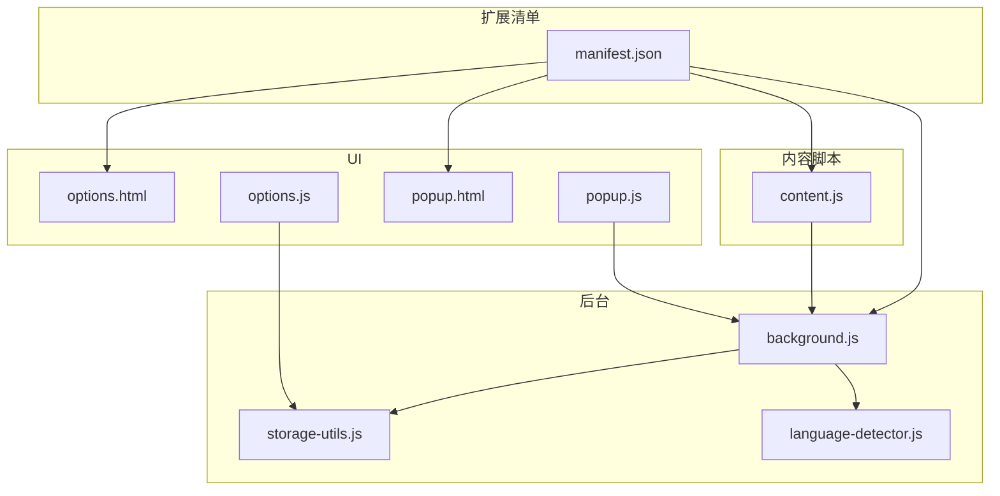
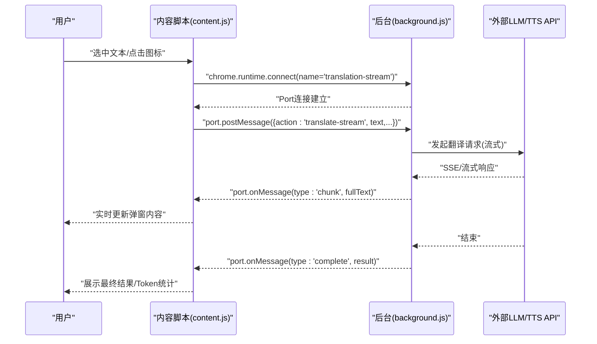
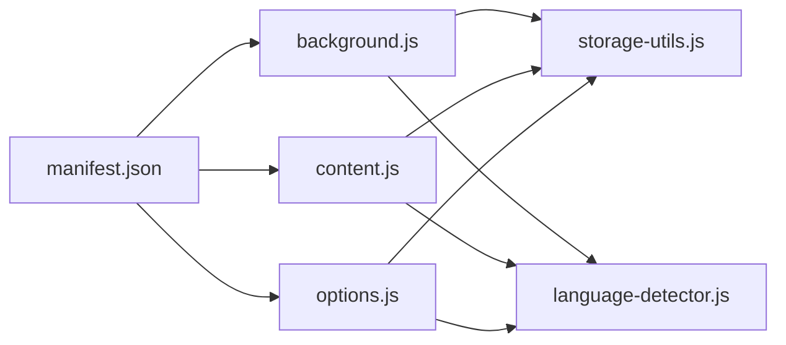

# 调试方法

<cite>
**本文引用的文件**
- [manifest.json](file://manifest.json)
- [background.js](file://background.js)
- [content.js](file://content.js)
- [options.js](file://options.js)
- [storage-utils.js](file://storage-utils.js)
- [language-detector.js](file://language-detector.js)
- [options.html](file://options.html)
- [popup.html](file://popup.html)
- [popup.js](file://popup.js)
</cite>

## 目录
1. [简介](#简介)
2. [项目结构](#项目结构)
3. [核心组件](#核心组件)
4. [架构总览](#架构总览)
5. [详细组件分析](#详细组件分析)
6. [依赖关系分析](#依赖关系分析)
7. [性能注意事项](#性能注意事项)
8. [故障排查指南](#故障排查指南)
9. [结论](#结论)

## 简介
本调试指南面向开发者，帮助你在Chrome扩展环境中高效定位QuickTrans的问题。内容覆盖：
- 如何在Chrome中查看后台服务工作线程（Service Worker）日志
- 如何调试content脚本（content.js）
- 如何检查chrome.storage中的数据
- 在background.js、content.js、options.js中添加有效的console.log进行追踪
- 各执行上下文的差异说明
- 常见问题排查建议（消息通信失败、存储读取异常等）

## 项目结构
QuickTrans采用Manifest V3，核心文件职责如下：
- manifest.json：声明权限、后台脚本、内容脚本、选项页、图标等
- background.js：后台服务脚本，负责翻译、TTS、消息与Port监听、缓存与统计
- content.js：内容脚本，负责划词监听、弹窗展示、与后台建立Port连接进行流式翻译/词典查询
- options.js：选项页脚本，负责API/TTS配置管理、用户偏好、缓存与Token统计
- storage-utils.js：封装chrome.storage的读写、缓存、Token统计
- language-detector.js：本地语言识别
- popup.html/popup.js：弹出菜单入口，跳转翻译页面与设置页

图表来源
- [manifest.json](file://manifest.json#L1-L52)
- [background.js](file://background.js#L1-L120)
- [content.js](file://content.js#L1-L120)
- [options.js](file://options.js#L1-L120)
- [storage-utils.js](file://storage-utils.js#L1-L120)
- [language-detector.js](file://language-detector.js#L1-L60)
- [options.html](file://options.html#L1-L120)
- [popup.html](file://popup.html#L1-L60)
- [popup.js](file://popup.js#L1-L36)

章节来源
- [manifest.json](file://manifest.json#L1-L52)

## 核心组件
- 后台服务（background.js）
  - 翻译与TTS服务：调用LLM/TTS API，处理流式响应，缓存与统计
  - Port监听：dictionary-stream/translation-stream，接收content.js请求，分发结果
  - 消息监听：处理旧版消息接口、语言检测、API配置测试
- 内容脚本（content.js）
  - 划词监听与图标/弹窗管理
  - 与后台建立Port连接，进行流式翻译/词典查询
  - 与后台通过chrome.runtime.sendMessage进行语言检测、获取语言列表、右键菜单翻译
- 选项页（options.js）
  - API/TTS配置的增删改查、激活切换
  - 用户偏好设置（目标语言、显示模式、最大文本长度）
  - 缓存统计与Token统计的加载与重置
- 存储工具（storage-utils.js）
  - API配置、TTS配置、用户偏好、缓存、Token统计的读写
- 语言检测（language-detector.js）
  - 基于Unicode范围与特征词的本地语言识别

章节来源
- [background.js](file://background.js#L1-L200)
- [content.js](file://content.js#L1-L200)
- [options.js](file://options.js#L1-L200)
- [storage-utils.js](file://storage-utils.js#L1-L200)
- [language-detector.js](file://language-detector.js#L1-L120)

## 架构总览
下面的序列图展示了典型流程：内容脚本发起翻译请求，后台通过Port进行流式传输，最终返回结果并在弹窗中展示。

图表来源
- [content.js](file://content.js#L618-L728)
- [background.js](file://background.js#L986-L1015)

章节来源
- [content.js](file://content.js#L618-L728)
- [background.js](file://background.js#L986-L1015)

## 详细组件分析

### 后台服务（background.js）调试要点
- 查看Service Worker日志
  - 在Chrome地址栏输入 chrome://extensions，开启“开发者模式”
  - 找到QuickTrans插件，点击“背景页”链接打开DevTools
  - 在Console中查看后台日志，如翻译错误、TTS错误、Port连接状态等
- 关键调试点
  - 翻译服务：handleStreamResponse、callLLMAPI、testApiConfig
  - TTS服务：callQwenTTSAPI、callOpenAITTSAPI、blobToBase64
  - Port监听：dictionary-stream/translation-stream的onMessage与postMessage
  - 消息监听：onMessage对旧版translate、detectLanguage、testApiConfig的支持
- 常见日志位置参考
  - 翻译错误：[background.js](file://background.js#L122-L130)
  - 流式解析失败：[background.js](file://background.js#L179-L183)
  - 流式处理错误：[background.js](file://background.js#L193-L201)
  - TTS合成错误：[background.js](file://background.js#L390-L398)
  - TTS音频chunk日志：[background.js](file://background.js#L507-L520)
  - TTS完成日志：[background.js](file://background.js#L518-L520)
  - 翻译完成日志：[background.js](file://background.js#L563-L565)
  - OpenAI TTS完成日志：[background.js](file://background.js#L666-L670)
  - Port连接建立与消息处理：[background.js](file://background.js#L986-L1015)
  - 旧版消息兼容警告：[background.js](file://background.js#L993-L996)

章节来源
- [background.js](file://background.js#L120-L200)
- [background.js](file://background.js#L390-L520)
- [background.js](file://background.js#L563-L670)
- [background.js](file://background.js#L986-L1015)

### 内容脚本（content.js）调试要点
- 在目标网页右键选择“检查”，切换到Console面板
- 确认content.js已注入并可执行调试语句
- 关键调试点
  - 初始化与事件监听：init、mouseup/keyup监听、ESC关闭弹窗、右键菜单消息
  - 划词与图标：handleTextSelection、showTranslateIcon、自动弹窗逻辑
  - 弹窗与位置：showTranslatePopup、adjustPopupPosition
  - 流式翻译/词典：performTranslation、performDictionaryLookup
  - 错误处理：showError、重试与前往设置
- 常见日志位置参考
  - 内容脚本加载日志：[content.js](file://content.js#L91-L93)
  - 词典查询错误：[content.js](file://content.js#L561-L565)
  - 翻译错误：[content.js](file://content.js#L724-L728)

章节来源
- [content.js](file://content.js#L1-L120)
- [content.js](file://content.js#L120-L240)
- [content.js](file://content.js#L240-L420)
- [content.js](file://content.js#L420-L720)
- [content.js](file://content.js#L720-L800)

### 选项页（options.js）调试要点
- 通过chrome://extensions页面点击插件的“检查视图：选项页面”打开DevTools
- 在Application选项卡中查看Storage下的chrome.storage数据
- 关键调试点
  - API/TTS配置列表加载与渲染
  - 激活配置切换、编辑/删除
  - 用户偏好设置（目标语言、显示模式、最大文本长度）
  - 缓存统计与Token统计的加载与重置
- 常见日志位置参考
  - 选项页初始化日志：[options.js](file://options.js#L108-L110)
  - 保存配置错误日志：[options.js](file://options.js#L395-L401)
  - 测试连接错误日志：[options.js](file://options.js#L441-L447)
  - 缓存统计加载错误日志：[options.js](file://options.js#L845-L849)

章节来源
- [options.js](file://options.js#L1-L120)
- [options.js](file://options.js#L120-L240)
- [options.js](file://options.js#L240-L480)
- [options.js](file://options.js#L480-L849)
- [options.html](file://options.html#L1-L120)

### 执行上下文差异与调试建议
- 后台（Service Worker）
  - 生命周期：常驻，适合处理网络请求、定时任务、持久化数据
  - 调试方式：chrome://extensions -> “背景页”
  - 注意：不支持DOM操作，所有UI交互需通过消息或Port转发
- 内容脚本（Content Script）
  - 注入时机：由manifest声明，随页面加载
  - 权限：可访问页面DOM，受限于隔离策略
  - 调试方式：页面右键 -> 检查 -> Console
  - 注意：与页面同源，可与页面脚本共存；与后台通过chrome.runtime通信
- 选项页（Options Page）
  - 生命周期：打开时加载，关闭即释放
  - 调试方式：chrome://extensions -> “检查视图：选项页面”
  - 注意：可直接读写chrome.storage，适合配置与统计
- 弹出菜单（Popup）
  - 生命周期：打开时加载，关闭即释放
  - 调试方式：chrome://extensions -> “检查视图：弹出窗口”
  - 注意：轻量交互，主要跳转翻译页面与设置页

章节来源
- [manifest.json](file://manifest.json#L16-L33)
- [popup.html](file://popup.html#L1-L60)
- [popup.js](file://popup.js#L1-L36)

## 依赖关系分析
- background.js依赖
  - storage-utils.js：读写API/TTS配置、用户偏好、缓存、Token统计
  - language-detector.js：语言识别
- content.js依赖
  - storage-utils.js：用户偏好（目标语言、显示模式、最大文本长度）
  - language-detector.js：语言列表
- options.js依赖
  - storage-utils.js：配置与统计
  - language-detector.js：语言列表
- manifest.json声明
  - 后台脚本、内容脚本、选项页、图标、权限、快捷命令等

图表来源
- [background.js](file://background.js#L1-L20)
- [content.js](file://content.js#L1-L20)
- [options.js](file://options.js#L1-L20)
- [storage-utils.js](file://storage-utils.js#L1-L20)
- [language-detector.js](file://language-detector.js#L1-L20)
- [manifest.json](file://manifest.json#L16-L33)

章节来源
- [background.js](file://background.js#L1-L20)
- [content.js](file://content.js#L1-L20)
- [options.js](file://options.js#L1-L20)
- [storage-utils.js](file://storage-utils.js#L1-L20)
- [language-detector.js](file://language-detector.js#L1-L20)
- [manifest.json](file://manifest.json#L16-L33)

## 性能注意事项
- 流式传输
  - 后台与内容脚本均采用Port进行流式传输，避免一次性等待，提升首字响应与交互体验
  - 若出现卡顿，检查后台网络请求与流式解析逻辑
- 缓存策略
  - 使用chrome.storage.session进行短期缓存，容量有限，满载时会自动清理
  - 若频繁报“缓存保存失败”，属于正常现象，不影响功能
- Token统计
  - 后台在收到usage时更新本地统计，避免频繁I/O，可在选项页刷新查看

章节来源
- [background.js](file://background.js#L139-L201)
- [content.js](file://content.js#L618-L728)
- [storage-utils.js](file://storage-utils.js#L356-L422)
- [storage-utils.js](file://storage-utils.js#L474-L511)

## 故障排查指南

### 一、消息通信失败
- 症状
  - 内容脚本无法发起翻译/词典查询，或后台无响应
- 排查步骤
  - 确认后台Port监听是否注册：检查后台onConnect监听与port.name
  - 确认内容脚本是否正确建立Port连接并发送消息
  - 检查后台onMessage对旧版translate的兼容逻辑
- 参考位置
  - Port监听与消息处理：[background.js](file://background.js#L986-L1015)
  - 内容脚本Port建立与消息发送：[content.js](file://content.js#L618-L728)
  - 旧版消息兼容警告：[background.js](file://background.js#L993-L996)

章节来源
- [background.js](file://background.js#L986-L1015)
- [content.js](file://content.js#L618-L728)

### 二、存储读取异常
- 症状
  - 选项页无法加载配置、用户偏好丢失、缓存统计异常
- 排查步骤
  - 在选项页DevTools的Application -> Storage中查看chrome.storage数据
  - 检查storage-utils.js的读写路径（local/sync/session）
  - 若缓存统计报错，确认后台是否正确更新tokenUsage
- 参考位置
  - API配置读写：[storage-utils.js](file://storage-utils.js#L1-L120)
  - 用户偏好读写：[storage-utils.js](file://storage-utils.js#L310-L342)
  - 缓存读写与统计：[storage-utils.js](file://storage-utils.js#L356-L422)
  - Token统计读写：[storage-utils.js](file://storage-utils.js#L474-L511)
  - 选项页缓存统计加载错误日志：[options.js](file://options.js#L845-L849)

章节来源
- [storage-utils.js](file://storage-utils.js#L1-L120)
- [storage-utils.js](file://storage-utils.js#L310-L342)
- [storage-utils.js](file://storage-utils.js#L356-L422)
- [storage-utils.js](file://storage-utils.js#L474-L511)
- [options.js](file://options.js#L830-L849)

### 三、翻译/TTS失败
- 症状
  - 翻译/词典查询无响应或报错；TTS合成失败
- 排查步骤
  - 在后台DevTools查看翻译/TTS错误日志
  - 检查API端点、密钥、模型、温度等配置是否正确
  - 检查网络状态与超时设置
- 参考位置
  - 翻译错误日志：[background.js](file://background.js#L122-L130)
  - 流式解析失败：[background.js](file://background.js#L179-L183)
  - TTS合成错误：[background.js](file://background.js#L390-L398)
  - TTS音频chunk日志：[background.js](file://background.js#L507-L520)
  - OpenAI TTS完成日志：[background.js](file://background.js#L666-L670)
  - 选项页测试连接错误日志：[options.js](file://options.js#L441-L447)

章节来源
- [background.js](file://background.js#L120-L200)
- [background.js](file://background.js#L390-L520)
- [background.js](file://background.js#L666-L670)
- [options.js](file://options.js#L406-L447)

### 四、右键菜单翻译异常
- 症状
  - 右键菜单触发翻译无弹窗或报错
- 排查步骤
  - 检查后台右键菜单创建与消息监听
  - 检查内容脚本对右键菜单翻译的处理逻辑
- 参考位置
  - 右键菜单创建日志：[background.js](file://background.js#L1053-L1057)
  - 右键菜单翻译消息监听：[content.js](file://content.js#L83-L91)
  - 发送翻译请求失败日志：[background.js](file://background.js#L1069-L1073)

章节来源
- [background.js](file://background.js#L1053-L1073)
- [content.js](file://content.js#L83-L91)

## 结论
- 使用chrome://extensions的“背景页”、“检查视图：选项页面”、“检查视图：弹出窗口”分别定位后台、选项页、弹出菜单的调试入口
- 在background.js、content.js、options.js中合理使用console.log进行分层追踪
- 重点关注Port流式通信、chrome.storage读写、语言检测与API配置测试
- 遇到问题时，先在对应上下文的DevTools中查看日志，再结合manifest声明与依赖关系定位根因