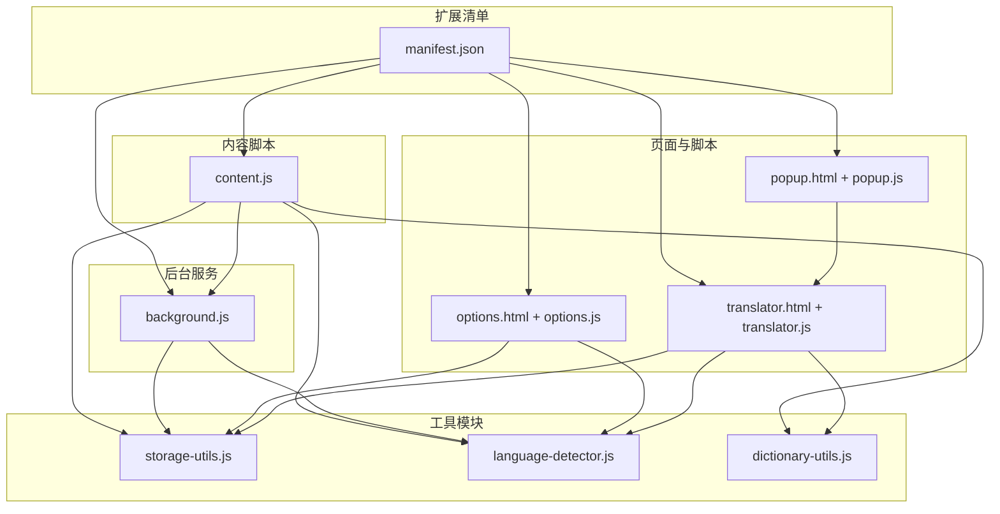
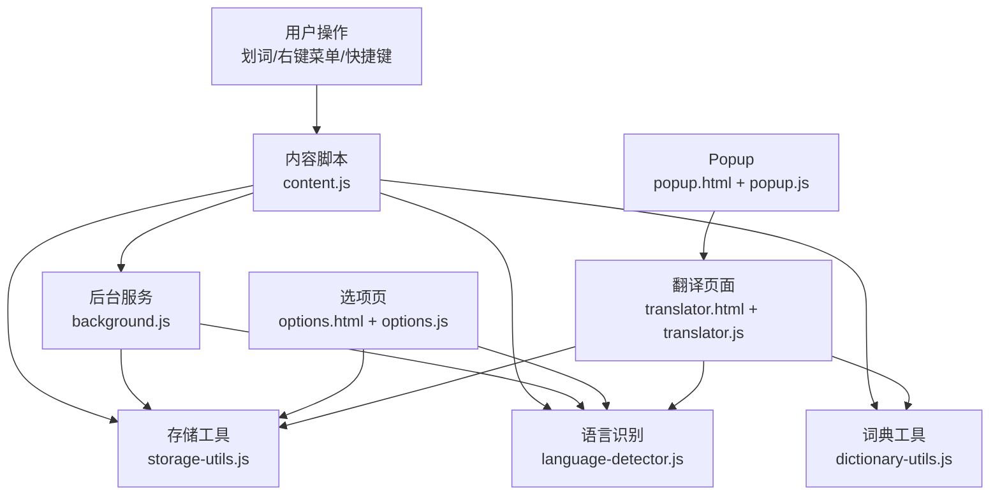
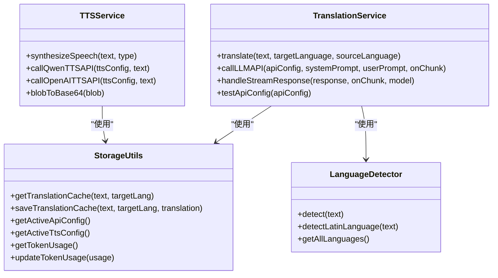
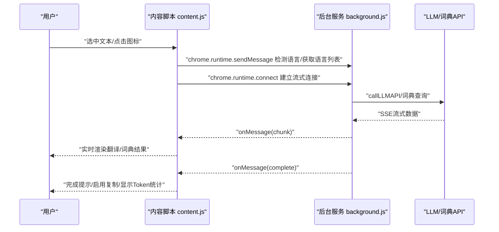
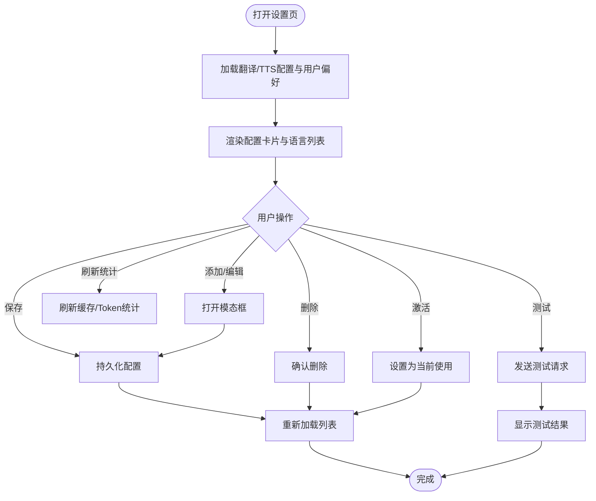
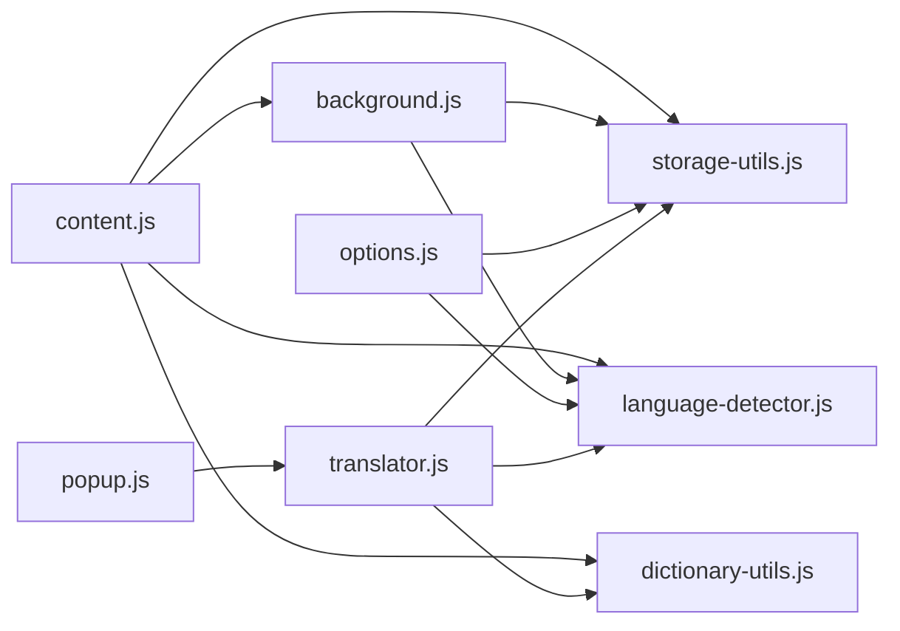

# 技术架构

<cite>
**本文引用的文件**
- [manifest.json](file://manifest.json)
- [background.js](file://background.js)
- [content.js](file://content.js)
- [options.js](file://options.js)
- [storage-utils.js](file://storage-utils.js)
- [language-detector.js](file://language-detector.js)
- [dictionary-utils.js](file://dictionary-utils.js)
- [translator.js](file://translator.js)
- [popup.js](file://popup.js)
- [translator.html](file://translator.html)
- [options.html](file://options.html)
- [popup.html](file://popup.html)
</cite>

## 目录
1. [引言](#引言)
2. [项目结构](#项目结构)
3. [核心组件](#核心组件)
4. [架构总览](#架构总览)
5. [详细组件分析](#详细组件分析)
6. [依赖关系分析](#依赖关系分析)
7. [性能考量](#性能考量)
8. [故障排查指南](#故障排查指南)
9. [结论](#结论)
10. [附录](#附录)

## 引言
本技术文档面向QuickTrans项目，系统阐述其基于Chrome扩展Manifest V3的架构设计与实现要点。文档聚焦于manifest.json关键配置、核心模块职责与交互流程，以及模块间通信机制与缓存策略，帮助开发者与使用者快速理解系统运行原理与优化方向。

## 项目结构
QuickTrans采用典型的Chrome扩展V3结构：清单文件定义权限与生命周期，后台服务脚本负责翻译与TTS调用，内容脚本负责页面交互与UI注入，选项页负责配置管理，工具模块提供通用能力（存储、语言识别、词典工具）。

图表来源
- [manifest.json](file://manifest.json#L1-L52)
- [background.js](file://background.js#L1-L120)
- [content.js](file://content.js#L1-L120)
- [options.js](file://options.js#L1-L120)
- [translator.js](file://translator.js#L1-L120)
- [popup.js](file://popup.js#L1-L36)
- [storage-utils.js](file://storage-utils.js#L1-L120)
- [language-detector.js](file://language-detector.js#L1-L60)
- [dictionary-utils.js](file://dictionary-utils.js#L1-L60)

章节来源
- [manifest.json](file://manifest.json#L1-L52)

## 核心组件
- 清单与入口
  - manifest.json声明权限、后台服务脚本、内容脚本注入规则、选项页与图标等。
- 后台服务（background.js）
  - 翻译服务：调用LLM API、处理流式响应、缓存与错误处理。
  - TTS服务：支持通义千问与OpenAI兼容TTS，处理流式音频数据。
  - 端口监听：建立与内容脚本/翻译页面的长连接，实现流式翻译体验。
- 内容脚本（content.js）
  - 划词监听与图标显示、弹窗渲染、词典查询与翻译流式展示、TTS播放。
  - 与后台通过chrome.runtime.sendMessage/connect通信。
- 选项页（options.js）
  - 翻译/TTS配置增删改查、测试连接、用户偏好设置、缓存与Token统计。
- 存储工具（storage-utils.js）
  - API配置、用户偏好、缓存、Token统计的本地持久化与管理。
- 语言识别（language-detector.js）
  - 基于Unicode范围与特征词的本地语言识别。
- 词典工具（dictionary-utils.js）
  - Markdown到HTML渲染、音标提取、音频格式检测与PCM转WAV等。
- 翻译页面（translator.js）
  - 独立翻译工作台，支持剪贴板读取、流式翻译、词典查询、TTS播放。
- Popup（popup.js）
  - 打开翻译页面与设置页的入口。

章节来源
- [manifest.json](file://manifest.json#L1-L52)
- [background.js](file://background.js#L1-L200)
- [content.js](file://content.js#L1-L200)
- [options.js](file://options.js#L1-L120)
- [storage-utils.js](file://storage-utils.js#L1-L120)
- [language-detector.js](file://language-detector.js#L1-L120)
- [dictionary-utils.js](file://dictionary-utils.js#L1-L120)
- [translator.js](file://translator.js#L1-L120)
- [popup.js](file://popup.js#L1-L36)

## 架构总览
QuickTrans采用“后台服务 + 内容脚本 + 页面脚本 + 工具模块”的分层架构。后台服务承担API调用与缓存管理，内容脚本负责页面交互与UI，选项页与翻译页面提供配置与独立工作台，工具模块提供通用能力。

图表来源
- [background.js](file://background.js#L700-L820)
- [content.js](file://content.js#L1-L200)
- [options.js](file://options.js#L1-L120)
- [translator.js](file://translator.js#L1-L120)
- [popup.js](file://popup.js#L1-L36)
- [storage-utils.js](file://storage-utils.js#L356-L422)
- [language-detector.js](file://language-detector.js#L1-L60)
- [dictionary-utils.js](file://dictionary-utils.js#L1-L60)

## 详细组件分析

### 清单与权限（manifest.json）
- 权限
  - storage：本地持久化API/TTS配置、用户偏好、缓存、Token统计。
  - activeTab：访问当前标签页信息，用于划词与注入。
  - contextMenus：右键菜单翻译入口。
  - clipboardRead：读取剪贴板内容（翻译页面）。
- 主机权限
  - http://*/* 与 https://*/*：允许访问任意HTTP/HTTPS资源，便于调用第三方API。
- 后台
  - service_worker：指向background.js。
- 内容脚本
  - matches：<all_urls>，run_at=document_end，all_frames=true，确保在所有页面注入。
  - js：dictionary-utils.js, content.js；css：content.css。
- 选项页与图标
  - options_page：options.html
  - action.default_icon：扩展图标
  - commands.open-translator：快捷键打开翻译页面
- 架构优势
  - Manifest V3将后台逻辑集中于service_worker，提升稳定性与安全性；内容脚本仅负责UI与事件，职责清晰。

章节来源
- [manifest.json](file://manifest.json#L1-L52)

### 后台服务（background.js）
- 翻译服务（TranslationService）
  - 语言检测：若未指定源语言，调用LanguageDetector进行识别。
  - 缓存：使用StorageUtils.getTranslationCache/saveTranslationCache进行session级缓存。
  - API调用：callLLMAPI封装fetch，支持流式与非流式两种模式；包含超时、错误码映射与usage统计。
  - 流式处理：handleStreamResponse解析SSE数据，实时回传chunk，最终聚合usage。
  - 测试配置：testApiConfig用于验证配置有效性。
- TTS服务（TTSService）
  - 通义千问：支持DashScope SSE流式输出，合并音频chunk为Base64。
  - OpenAI兼容：直接下载Blob并转换为Base64。
  - 错误处理：统一401/429/5xx处理与超时处理。
- 端口监听（dictionary-stream/translation-stream）
  - onConnect监听来自内容脚本/翻译页面的长连接，实现渐进式反馈与更快首字响应。
  - 词典查询：支持带上下文的提示词构建与缓存key生成。
  - 翻译：根据用户偏好与语言检测结果发起流式翻译。

图表来源
- [background.js](file://background.js#L46-L351)
- [background.js](file://background.js#L353-L710)
- [storage-utils.js](file://storage-utils.js#L356-L517)
- [language-detector.js](file://language-detector.js#L1-L120)

章节来源
- [background.js](file://background.js#L46-L351)
- [background.js](file://background.js#L353-L710)
- [storage-utils.js](file://storage-utils.js#L356-L517)
- [language-detector.js](file://language-detector.js#L1-L120)

### 内容脚本（content.js）
- 划词监听与图标
  - 监听mouseup/keyup事件，防抖处理，检测选中文本长度与语言，决定是否显示翻译图标。
  - 图标点击显示翻译弹窗，支持自动显示与图标模式切换。
- 弹窗渲染与交互
  - 动态构建HTML，支持词典模式与普通翻译模式；根据displayMode与maxTextLength控制行为。
  - 位置自适应：adjustPopupPosition确保不超出视口。
- 流式翻译与词典查询
  - 通过chrome.runtime.connect建立dictionary-stream/translation-stream长连接，接收chunk并实时更新UI。
  - 词典模式支持上下文提取与上下文翻译展示。
- 语言检测与TTS
  - 通过chrome.runtime.sendMessage调用后台语言检测；支持单词/句子TTS播放。
- 错误处理与重试
  - 根据错误码显示友好提示与重试/切换API按钮。

图表来源
- [content.js](file://content.js#L186-L234)
- [content.js](file://content.js#L236-L391)
- [content.js](file://content.js#L442-L565)
- [content.js](file://content.js#L614-L728)
- [background.js](file://background.js#L712-L820)

章节来源
- [content.js](file://content.js#L1-L200)
- [content.js](file://content.js#L200-L500)
- [content.js](file://content.js#L500-L800)

### 选项页（options.js）
- 配置管理
  - 翻译API：增删改查、激活切换、测试连接；温度、模型等参数校验。
  - TTS API：支持通义千问与OpenAI兼容，动态显示provider特定字段。
- 用户偏好
  - 默认目标语言、显示模式（自动/图标/右键菜单）、最大文本长度。
- 统计与缓存
  - 缓存统计：数量、大小、存储类型（session）。
  - Token统计：总输入/输出/总Token、请求次数、最后更新时间。
- 交互细节
  - 表单校验、模态框开关、键盘ESC关闭、Toast提示。

图表来源
- [options.js](file://options.js#L1-L200)
- [options.js](file://options.js#L200-L500)
- [options.js](file://options.js#L500-L800)

章节来源
- [options.js](file://options.js#L1-L200)
- [options.js](file://options.js#L200-L500)
- [options.js](file://options.js#L500-L800)

### 存储工具（storage-utils.js）
- API配置
  - getApiConfigs/addApiConfig/updateApiConfig/deleteApiConfig/getActiveApiConfig/setActiveApiConfig
- TTS配置
  - getTtsConfigs/addTtsConfig/updateTtsConfig/deleteTtsConfig/getActiveTtsConfig/setActiveTtsConfig
- 用户偏好
  - getUserPreferences/updateUserPreferences
- 缓存
  - getTranslationCache/saveTranslationCache/getCacheStats/clearAllCache（session存储）
- Token统计
  - getTokenUsage/updateTokenUsage/resetTokenUsage
- 设计要点
  - 使用chrome.storage.local存储配置与统计，chrome.storage.sync存储用户偏好，chrome.storage.session用于翻译缓存，自动管理空间与过期。

章节来源
- [storage-utils.js](file://storage-utils.js#L1-L120)
- [storage-utils.js](file://storage-utils.js#L120-L355)
- [storage-utils.js](file://storage-utils.js#L356-L517)

### 语言识别（language-detector.js）
- Unicode范围识别
  - 中文、日文假名、韩文、西里尔字母、阿拉伯、泰语、拉丁字母等。
- 特征词识别
  - 英语、法语、德语、西班牙语、葡萄牙语、意大利语的高频特征词，结合阈值判定。
- 辅助能力
  - getAllLanguages/getLanguageName/isSupported。

章节来源
- [language-detector.js](file://language-detector.js#L1-L120)
- [language-detector.js](file://language-detector.js#L120-L200)
- [language-detector.js](file://language-detector.js#L200-L263)

### 词典工具（dictionary-utils.js）
- Markdown渲染
  - 标题、加粗、斜体、行内代码、换行、词性标记、序号、项目符号。
- 音标提取
  - 支持多种音标格式与UK/US双音标。
- 音频处理
  - detectAudioFormat：检测MP3/WAV/Opus/AAC/FLAC/PCM。
  - convertPCMToWAV：将PCM转换为WAV供Web Audio API播放。
- 单词判断
  - isSingleWord：英文单词（含连字符/撇号）。

章节来源
- [dictionary-utils.js](file://dictionary-utils.js#L1-L120)
- [dictionary-utils.js](file://dictionary-utils.js#L120-L237)

### 翻译页面（translator.js）
- 剪贴板读取与输入框
  - 优先使用URL参数，否则尝试读取剪贴板；受maxTextLength限制。
- 流式翻译
  - 建立translation-stream连接，实时渲染结果，显示模型与Token统计。
- 词典查询
  - 基于dictionary-utils格式化结果，支持上下文翻译与音标显示。
- TTS播放
  - 与后台交互，播放单词/句子音频。
- 错误处理与重试
  - 根据错误码显示重试/切换API按钮。

章节来源
- [translator.js](file://translator.js#L1-L200)
- [translator.js](file://translator.js#L200-L500)
- [translator.js](file://translator.js#L500-L800)

### Popup（popup.js）
- 打开翻译页面与设置页
  - 通过chrome.tabs.create/chrome.runtime.openOptionsPage实现跳转。

章节来源
- [popup.js](file://popup.js#L1-L36)
- [popup.html](file://popup.html#L1-L154)

## 依赖关系分析
- 模块耦合
  - content.js与background.js通过chrome.runtime.sendMessage/connect强耦合，前者负责UI与事件，后者负责业务与API。
  - storage-utils.js被background.js、options.js、translator.js广泛使用，形成稳定的存储抽象。
  - language-detector.js与dictionary-utils.js被多个模块复用，降低重复逻辑。
- 外部依赖
  - fetch调用第三方LLM/TTS API；chrome.storage.*与chrome.runtime.*为扩展API。
- 潜在循环依赖
  - 未发现直接循环依赖；工具模块为纯函数与对象，避免相互引用。

图表来源
- [content.js](file://content.js#L1-L200)
- [background.js](file://background.js#L1-L200)
- [options.js](file://options.js#L1-L120)
- [translator.js](file://translator.js#L1-L120)
- [popup.js](file://popup.js#L1-L36)
- [storage-utils.js](file://storage-utils.js#L1-L120)
- [language-detector.js](file://language-detector.js#L1-L120)
- [dictionary-utils.js](file://dictionary-utils.js#L1-L120)

## 性能考量
- 流式传输
  - 通过Port长连接实现SSE流式数据，显著降低首字延迟，提升用户体验。
- 缓存策略
  - session级翻译缓存自动清理，避免内存膨胀；命中缓存直接返回，减少API调用。
- 语言检测
  - 本地Unicode与特征词识别，避免额外网络请求，提高响应速度。
- UI渲染
  - 仅在首次chunk到达时清空加载动画，后续增量更新，减少DOM重排。
- 存储选择
  - 配置与统计使用local，偏好使用sync，缓存使用session，合理分配存储类型与容量。

## 故障排查指南
- 翻译失败
  - 检查API配置是否激活与测试通过；关注错误码（INVALID_API_KEY/RATE_LIMIT/SERVICE_UNAVAILABLE/NETWORK_ERROR/TIMEOUT）。
  - 清空缓存或重试；必要时切换其他API。
- 词典查询异常
  - 确认选中为单个英文单词；检查上下文提取是否过长。
  - 查看后台日志与错误提示，必要时重试。
- TTS播放问题
  - 检查TTS配置（provider、模型、音色、格式）；确认音频格式检测与转换逻辑。
- 选项页配置无效
  - 确认配置已激活；检查URL格式与温度范围；刷新Token统计或重置统计。
- Popup/翻译页面无法打开
  - 检查快捷键与action按钮；确认manifest中options_page与action配置正确。

章节来源
- [background.js](file://background.js#L200-L351)
- [content.js](file://content.js#L728-L800)
- [options.js](file://options.js#L400-L500)
- [translator.js](file://translator.js#L700-L800)

## 结论
QuickTrans以Manifest V3为基础，构建了清晰的后台服务与内容脚本分工，配合完善的工具模块与流式传输机制，在保证性能与用户体验的同时，提供了灵活的配置管理与本地数据持久化。通过合理的缓存与语言识别策略，系统在复杂场景下仍能保持稳定与高效。

## 附录
- 页面与脚本入口
  - 翻译页面：translator.html + translator.js
  - 选项页：options.html + options.js
  - Popup：popup.html + popup.js

章节来源
- [translator.html](file://translator.html#L1-L100)
- [options.html](file://options.html#L1-L120)
- [popup.html](file://popup.html#L1-L154)