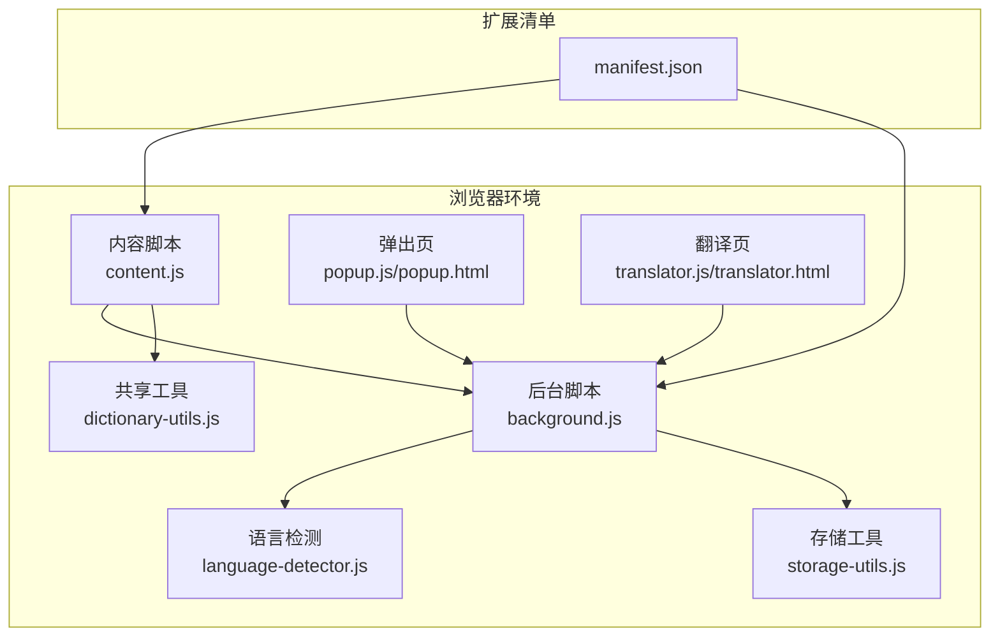
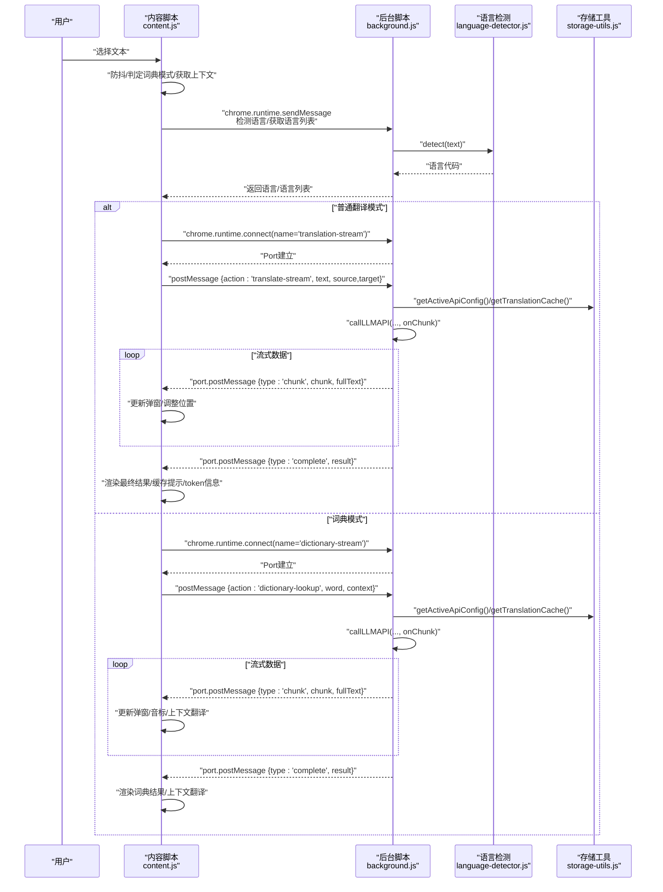
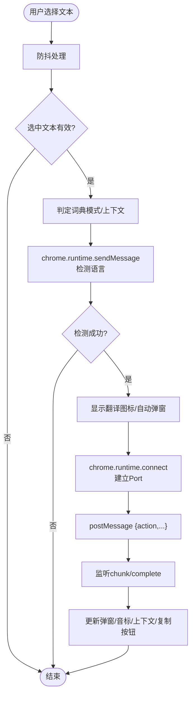
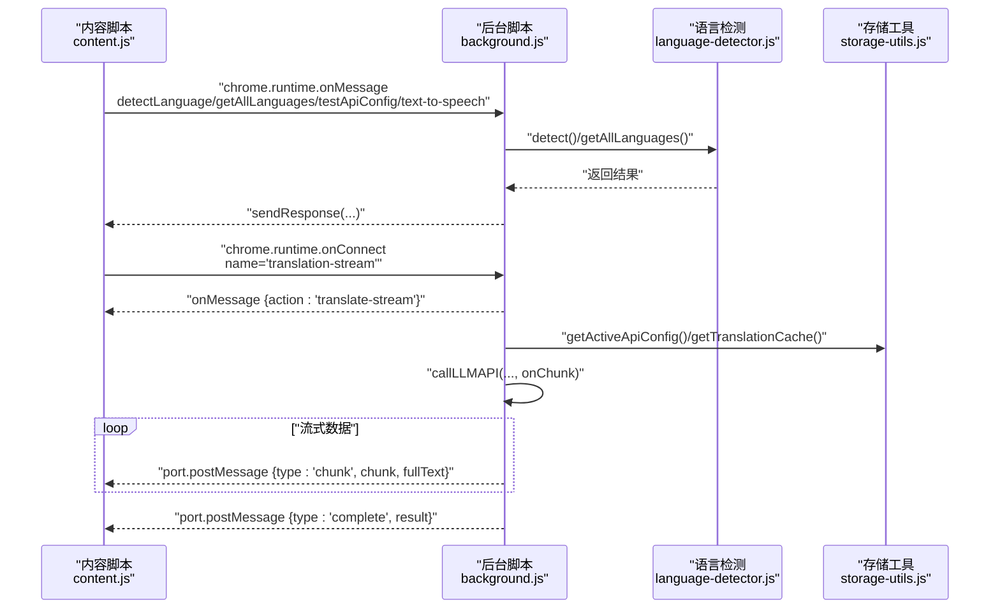
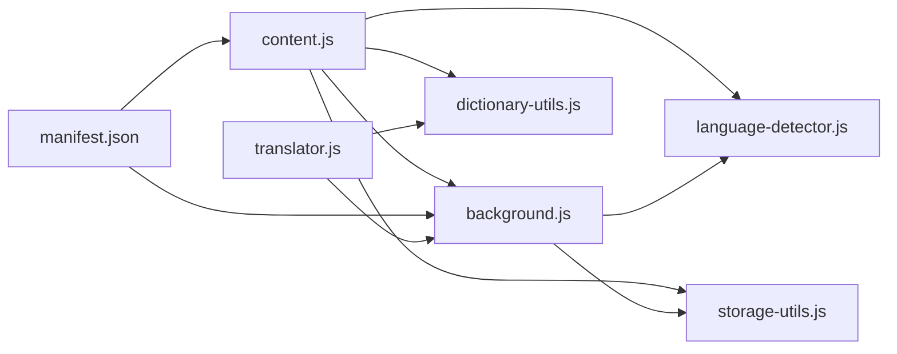

# 数据流分析

<cite>
**本文引用的文件**
- [content.js](file://content.js)
- [background.js](file://background.js)
- [language-detector.js](file://language-detector.js)
- [storage-utils.js](file://storage-utils.js)
- [manifest.json](file://manifest.json)
- [dictionary-utils.js](file://dictionary-utils.js)
- [translator.js](file://translator.js)
- [translator.html](file://translator.html)
- [popup.js](file://popup.js)
- [popup.html](file://popup.html)
</cite>

## 目录
1. [简介](#简介)
2. [项目结构](#项目结构)
3. [核心组件](#核心组件)
4. [架构总览](#架构总览)
5. [详细组件分析](#详细组件分析)
6. [依赖关系分析](#依赖关系分析)
7. [性能考量](#性能考量)
8. [故障排查指南](#故障排查指南)
9. [结论](#结论)

## 简介
本文聚焦QuickTrans从“用户在网页上选择文本”到“结果在页面上呈现”的完整数据流，重点说明content.js与background.js之间通过Chrome扩展消息传递API（chrome.runtime.sendMessage/chrome.runtime.onMessage）与长连接（chrome.runtime.connect/chrome.runtime.onConnect）进行通信的机制。流程包括：用户选择文本 -> content.js监听事件 -> content.js向background.js请求语言检测/语言列表/TTS -> background.js调用语言检测模块与存储工具 -> content.js建立Port连接 -> background.js通过LLM API进行翻译/词典查询 -> 流式数据回传 -> content.js渲染弹窗并展示结果。

## 项目结构
QuickTrans采用Manifest V3，核心文件如下：
- content.js：内容脚本，负责监听用户选择、显示图标/弹窗、与background.js通信（消息与Port）
- background.js：后台脚本，负责消息监听、Port连接监听、调用LLM API、语言检测、存储工具
- language-detector.js：本地语言检测模块
- storage-utils.js：API配置、用户偏好、缓存、token统计等存储工具
- manifest.json：声明权限、背景脚本、内容脚本、图标、动作入口等
- dictionary-utils.js：词典与TTS相关的共享工具（供content.js/translator.js复用）
- translator.js/translator.html：独立翻译页面（同样使用Port进行流式翻译）
- popup.js/popup.html：扩展图标弹出页（跳转翻译/设置）

图表来源
- [manifest.json](file://manifest.json#L1-L52)
- [content.js](file://content.js#L1-L120)
- [background.js](file://background.js#L1-L120)
- [language-detector.js](file://language-detector.js#L1-L60)
- [storage-utils.js](file://storage-utils.js#L1-L60)
- [dictionary-utils.js](file://dictionary-utils.js#L1-L46)
- [translator.js](file://translator.js#L210-L260)
- [popup.js](file://popup.js#L1-L35)

章节来源
- [manifest.json](file://manifest.json#L1-L52)

## 核心组件
- 内容脚本（content.js）
  - 监听文本选择/键盘/鼠标事件，显示翻译图标与弹窗
  - 通过chrome.runtime.sendMessage请求语言检测、语言列表、TTS
  - 通过chrome.runtime.connect建立Port，进行流式翻译/词典查询
  - 渲染弹窗UI，实时更新结果，支持拖拽、复制、TTS播放
- 后台脚本（background.js）
  - chrome.runtime.onMessage监听消息：语言检测、测试API、获取语言列表、TTS
  - chrome.runtime.onConnect监听Port：翻译流式连接、词典流式连接
  - 调用LanguageDetector与StorageUtils，调用LLM API，缓存结果，统计token
  - 右键菜单：转发翻译请求至content.js
- 语言检测（language-detector.js）
  - 基于字符Unicode范围与特征词的本地语言检测
- 存储工具（storage-utils.js）
  - API配置管理、用户偏好、缓存（session）、token统计
- 共享工具（dictionary-utils.js）
  - 词典结果格式化、PCM/WAV转换、HTML转义等

章节来源
- [content.js](file://content.js#L1-L200)
- [background.js](file://background.js#L986-L1033)
- [language-detector.js](file://language-detector.js#L1-L120)
- [storage-utils.js](file://storage-utils.js#L1-L120)
- [dictionary-utils.js](file://dictionary-utils.js#L1-L46)

## 架构总览
QuickTrans采用“内容脚本驱动UI + 后台脚本处理业务”的典型扩展架构。消息传递API用于短链路请求（语言检测、语言列表、TTS、测试API），Port用于长链路流式数据（翻译/词典查询）。后台脚本负责调用LLM API、缓存与统计，并通过Port将增量数据回传给内容脚本。

图表来源
- [content.js](file://content.js#L183-L234)
- [content.js](file://content.js#L252-L391)
- [content.js](file://content.js#L445-L565)
- [content.js](file://content.js#L618-L728)
- [background.js](file://background.js#L719-L744)
- [background.js](file://background.js#L866-L983)
- [language-detector.js](file://language-detector.js#L1-L60)
- [storage-utils.js](file://storage-utils.js#L356-L422)

## 详细组件分析

### 组件A：内容脚本（content.js）
- 事件监听与状态管理
  - 监听mouseup/keyup，防抖处理，判定词典模式与上下文
  - 记录鼠标位置，ESC关闭弹窗，右键菜单翻译回调
- 语言检测与语言列表
  - 通过chrome.runtime.sendMessage请求语言检测与语言列表
- 弹窗渲染与交互
  - 创建/定位/拖拽/复制/音标提取/上下文翻译
- 流式翻译/词典查询
  - 建立Port连接，监听chunk/complete，实时更新UI
  - 词典模式：提取音标、显示上下文翻译；翻译模式：语言切换、复制译文

图表来源
- [content.js](file://content.js#L132-L234)
- [content.js](file://content.js#L252-L391)
- [content.js](file://content.js#L445-L565)
- [content.js](file://content.js#L618-L728)

章节来源
- [content.js](file://content.js#L1-L200)
- [content.js](file://content.js#L200-L500)
- [content.js](file://content.js#L500-L900)
- [content.js](file://content.js#L900-L1423)

### 组件B：后台脚本（background.js）
- 消息监听（chrome.runtime.onMessage）
  - detectLanguage：调用LanguageDetector.detect返回语言代码
  - getAllLanguages：返回语言列表
  - text-to-speech：调用TTSService合成语音
  - translate（兼容旧接口）：调用TranslationService.translate
- Port监听（chrome.runtime.onConnect）
  - dictionary-stream：词典查询，流式返回定义与上下文翻译
  - translation-stream：翻译，流式返回结果，支持缓存与token统计
- LLM调用与流式处理
  - TranslationService.callLLMAPI：构造messages、温度、max_tokens、stream_options
  - handleStreamResponse：解析SSE数据块，聚合fullText，提取usage
- 右键菜单
  - 创建菜单项，点击后向content.js发送translateFromContextMenu消息

图表来源
- [background.js](file://background.js#L986-L1033)
- [background.js](file://background.js#L719-L744)
- [background.js](file://background.js#L866-L983)
- [language-detector.js](file://language-detector.js#L1-L60)
- [storage-utils.js](file://storage-utils.js#L1-L120)

章节来源
- [background.js](file://background.js#L1-L200)
- [background.js](file://background.js#L712-L983)
- [background.js](file://background.js#L986-L1033)
- [background.js](file://background.js#L1034-L1143)

### 组件C：语言检测（language-detector.js）
- 本地语言检测：基于Unicode范围统计与拉丁语族特征词打分
- 提供语言列表、语言名称、支持性检查

章节来源
- [language-detector.js](file://language-detector.js#L1-L263)

### 组件D：存储工具（storage-utils.js）
- API配置管理：增删改查、激活切换、兼容字段填充
- 用户偏好：读取/保存/更新
- 缓存：基于session的翻译缓存，自动清理
- Token统计：累加prompt/completion/total与请求次数

章节来源
- [storage-utils.js](file://storage-utils.js#L1-L200)
- [storage-utils.js](file://storage-utils.js#L356-L422)
- [storage-utils.js](file://storage-utils.js#L423-L517)

### 组件E：共享工具（dictionary-utils.js）
- 词典结果格式化（Markdown到HTML）
- PCM/WAV转换、HTML转义、拖拽辅助

章节来源
- [dictionary-utils.js](file://dictionary-utils.js#L1-L46)
- [content.js](file://content.js#L567-L617)

### 组件F：翻译页面（translator.js/translator.html）
- 与content.js相同的Port流式翻译/词典查询流程
- 适合在独立页面中进行长文本翻译与查看历史

章节来源
- [translator.js](file://translator.js#L210-L260)
- [translator.js](file://translator.js#L221-L254)

### 组件G：弹出页（popup.js/popup.html）
- 打开翻译页面与设置页面，便于快捷入口

章节来源
- [popup.js](file://popup.js#L1-L35)
- [popup.html](file://popup.html#L1-L200)

## 依赖关系分析
- content.js依赖
  - background.js（消息/Port通信）
  - language-detector.js（语言检测）
  - storage-utils.js（用户偏好）
  - dictionary-utils.js（格式化/PCM转换）
- background.js依赖
  - language-detector.js（语言检测）
  - storage-utils.js（API配置/缓存/token统计）
  - manifest.json（权限声明）
- translator.js依赖
  - background.js（Port流式翻译）
  - dictionary-utils.js（格式化）

图表来源
- [content.js](file://content.js#L1-L120)
- [background.js](file://background.js#L1-L120)
- [language-detector.js](file://language-detector.js#L1-L60)
- [storage-utils.js](file://storage-utils.js#L1-L120)
- [dictionary-utils.js](file://dictionary-utils.js#L1-L46)
- [translator.js](file://translator.js#L210-L260)
- [manifest.json](file://manifest.json#L1-L52)

章节来源
- [content.js](file://content.js#L1-L200)
- [background.js](file://background.js#L1-L200)
- [translator.js](file://translator.js#L210-L260)
- [manifest.json](file://manifest.json#L1-L52)

## 性能考量
- 流式传输
  - 使用Port与SSE增量推送，降低首字延迟，提升长文本体验
- 缓存策略
  - session缓存翻译结果，命中即返回，显著减少API调用
- 本地语言检测
  - 本地快速检测，避免不必要的网络请求
- 防抖与边界控制
  - 文本长度限制、弹窗位置自适应、拖拽边界约束，保证UI流畅

[本节为通用指导，无需列出章节来源]

## 故障排查指南
- 未配置API
  - 现象：返回“未配置API”
  - 排查：在设置页添加并激活API配置
- 速率限制/服务不可用
  - 现象：返回“频率超限/服务不可用”
  - 排查：切换其他API、等待冷却、检查网络
- 网络超时/网络错误
  - 现象：返回“请求超时/网络错误”
  - 排查：检查代理/防火墙、重试
- 无效API密钥
  - 现象：返回“API密钥无效”
  - 排查：核对密钥与端点
- 词典/翻译失败
  - 现象：弹窗显示错误与重试按钮
  - 排查：重试、切换API、检查上下文

章节来源
- [background.js](file://background.js#L203-L323)
- [background.js](file://background.js#L324-L510)
- [content.js](file://content.js#L730-L777)

## 结论
QuickTrans通过清晰的消息与Port通信机制，实现了从用户选择文本到结果呈现的高效数据流。content.js负责前端交互与UI渲染，background.js负责业务处理与外部API调用，二者通过Chrome扩展API紧密协作。流式传输、本地语言检测与缓存策略共同保障了良好的用户体验与性能表现。