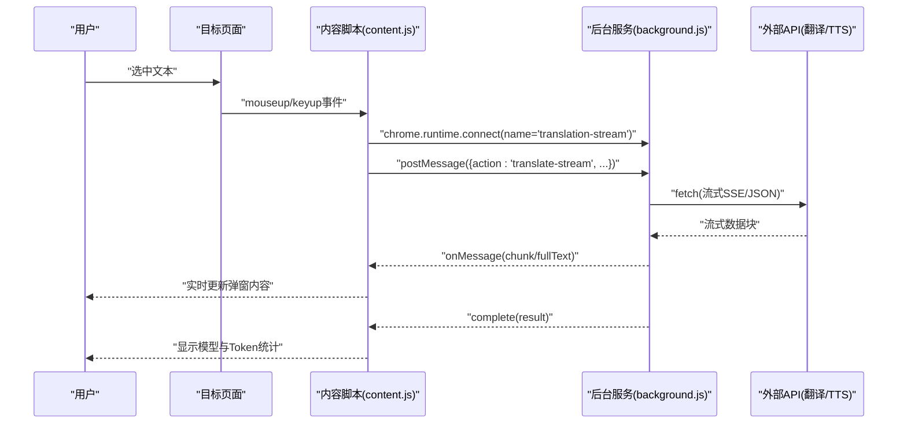
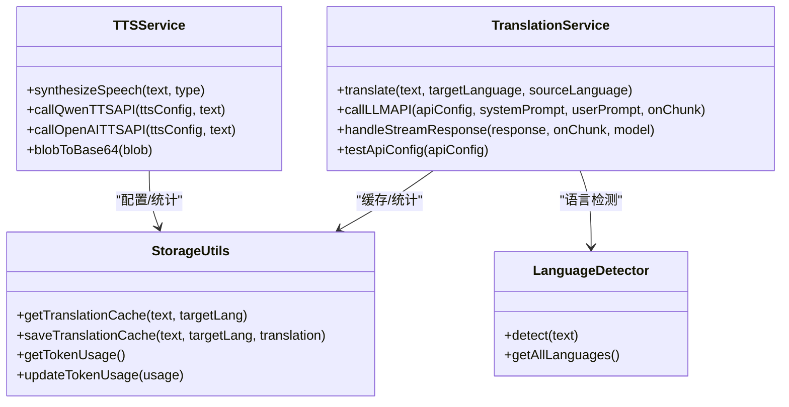
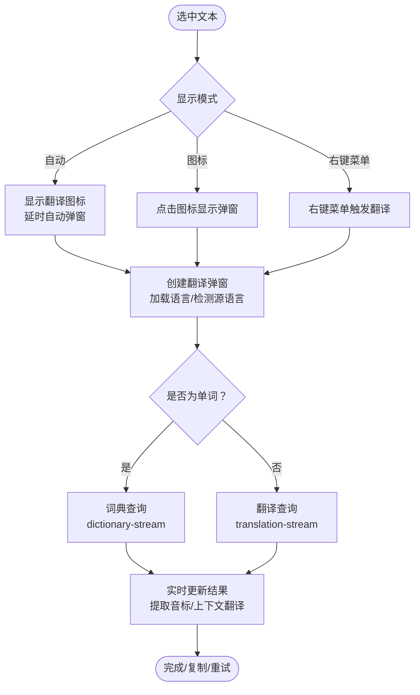
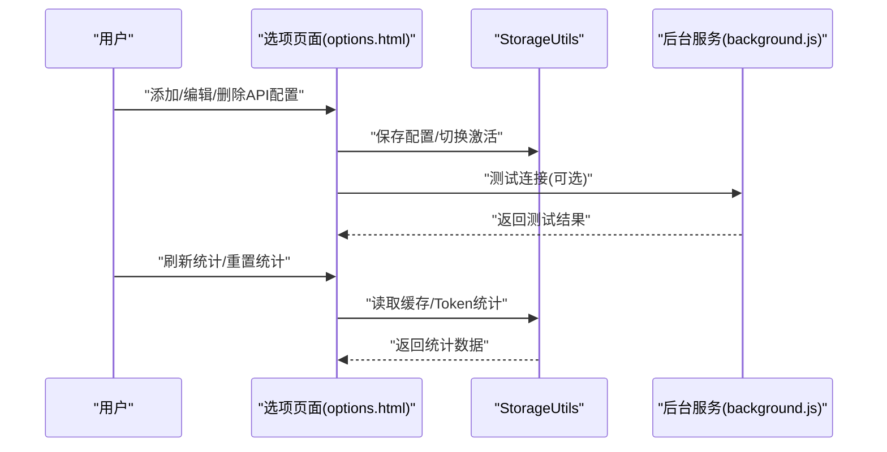
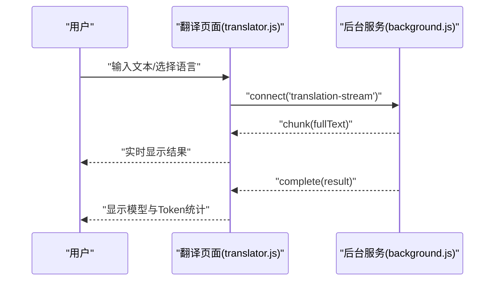
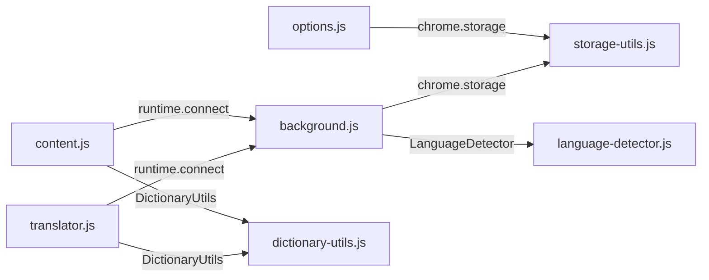

# 架构概览

<cite>
**本文引用的文件**
- [manifest.json](file://manifest.json)
- [background.js](file://background.js)
- [content.js](file://content.js)
- [options.html](file://options.html)
- [options.js](file://options.js)
- [storage-utils.js](file://storage-utils.js)
- [language-detector.js](file://language-detector.js)
- [dictionary-utils.js](file://dictionary-utils.js)
- [translator.js](file://translator.js)
- [translator.html](file://translator.html)
- [popup.html](file://popup.html)
- [popup.js](file://popup.js)
</cite>

## 目录
1. [引言](#引言)
2. [项目结构](#项目结构)
3. [核心组件](#核心组件)
4. [架构总览](#架构总览)
5. [详细组件分析](#详细组件分析)
6. [依赖关系分析](#依赖关系分析)
7. [性能考量](#性能考量)
8. [故障排查指南](#故障排查指南)
9. [结论](#结论)

## 引言
本文件面向QuickTrans的架构设计，围绕Chrome扩展Manifest V3展开，系统性解析manifest.json中的关键配置项及其作用边界，阐明后台服务工作线程、内容脚本、选项页面等组件的职责划分与协作方式，并说明该架构在安全性与功能性上的平衡策略。读者无需深入前端或后端实现细节，即可理解整体运行机制与扩展能力边界。

## 项目结构
QuickTrans采用典型的Chrome扩展V3分层结构：
- Manifest V3声明：集中定义权限、后台脚本、内容脚本、选项页面、图标、动作入口等。
- 后台服务工作线程：负责翻译与TTS的业务编排、与外部API通信、缓存与统计管理。
- 内容脚本：在目标网页中监听选中事件、展示翻译图标与弹窗、建立流式连接。
- 选项页面：提供API配置、TTS配置、用户偏好、缓存与Token统计管理。
- 翻译页面：独立窗口，支持剪贴板读取、手动输入翻译、词典查询与TTS。
- 共享工具：语言识别、词典格式化、存储工具等。

```mermaid
graph TB
subgraph "扩展清单(manifest)"
M["manifest.json"]
end
subgraph "后台服务(worker)"
BG["background.js"]
SU["storage-utils.js"]
LD["language-detector.js"]
end
subgraph "内容脚本(tab)"
CT["content.js"]
DU["dictionary-utils.js"]
end
subgraph "选项页面(options)"
OH["options.html"]
OJ["options.js"]
end
subgraph "翻译页面(translator)"
TH["translator.html"]
TJ["translator.js"]
end
subgraph "UI入口"
PH["popup.html"]
PJ["popup.js"]
end
M --> BG
M --> CT
M --> OH
M --> TH
M --> PH
CT <- --> BG
TJ <- --> BG
OJ --> SU
BG --> SU
CT --> DU
TJ --> DU
BG --> LD
```

图表来源
- [manifest.json](file://manifest.json#L1-L52)
- [background.js](file://background.js#L1-L120)
- [content.js](file://content.js#L1-L120)
- [options.html](file://options.html#L1-L60)
- [translator.html](file://translator.html#L1-L60)
- [popup.html](file://popup.html#L1-L60)

章节来源
- [manifest.json](file://manifest.json#L1-L52)

## 核心组件
- 后台服务工作线程(background.js)
  - 职责：翻译与TTS服务编排、与外部API通信、缓存与Token统计、长连接监听与消息路由。
  - 关键能力：流式翻译/词典查询、错误分类与提示、超时与异常处理、缓存命中与回退。
- 内容脚本(content.js)
  - 职责：监听文本选择、显示翻译图标与弹窗、建立与后台的流式连接、TTS播放控制。
  - 关键能力：防抖、位置自适应、词典模式与翻译模式切换、上下文提取。
- 选项页面(options.html + options.js)
  - 职责：管理翻译/TTS API配置、用户偏好、缓存与Token统计。
  - 关键能力：配置增删改查、激活切换、测试连接、统计刷新与重置。
- 翻译页面(translator.html + translator.js)
  - 职责：独立翻译工作台，支持剪贴板读取、手动输入、词典查询、TTS播放。
  - 关键能力：流式翻译、错误处理、复制与重试、上下文词典弹窗。
- 共享工具(dictionary-utils.js, language-detector.js, storage-utils.js)
  - 职责：词典格式化、语言识别、本地存储与缓存、Token统计。
  - 关键能力：Markdown到HTML渲染、Unicode语言识别、Session缓存、本地统计持久化。

章节来源
- [background.js](file://background.js#L1-L120)
- [content.js](file://content.js#L1-L120)
- [options.html](file://options.html#L1-L120)
- [translator.js](file://translator.js#L1-L120)
- [dictionary-utils.js](file://dictionary-utils.js#L1-L80)
- [language-detector.js](file://language-detector.js#L1-L60)
- [storage-utils.js](file://storage-utils.js#L1-L80)

## 架构总览
QuickTrans基于Manifest V3的后台服务工作线程与内容脚本双层架构，结合选项页面与翻译页面，形成“就地划词翻译 + 独立翻译工作台”的完整体验。权限与跨域访问通过清单文件集中声明，后台负责与外部API交互并提供流式结果，内容脚本负责在目标页面呈现与交互，选项页面负责配置与统计管理。



图表来源
- [content.js](file://content.js#L618-L728)
- [background.js](file://background.js#L203-L323)

章节来源
- [manifest.json](file://manifest.json#L16-L29)
- [content.js](file://content.js#L618-L728)
- [background.js](file://background.js#L203-L323)

## 详细组件分析

### 清单配置与权限边界
- permissions
  - storage：允许读写本地存储（配置、偏好、缓存、统计）。
  - activeTab：允许在用户主动操作的标签页内注入与交互。
  - contextMenus：允许注册右键菜单项，支持右键触发翻译。
  - clipboardRead：允许读取剪贴板内容（翻译页面与内容脚本均涉及）。
- host_permissions
  - http://*/* 与 https://*/*：允许对任意HTTP/HTTPS站点发起跨域请求（由后台服务统一处理）。
- background.service_worker
  - 指向后台服务工作线程，负责长连接监听与API调用。
- content_scripts
  - matches：<all_urls>，对所有页面生效。
  - js：dictionary-utils.js、content.js，css：content.css，run_at：document_end，all_frames：true。
  - 注入时机与范围确保在页面加载末尾即刻生效，覆盖iframe。
- options_page
  - 指向选项页面，提供配置与统计管理。
- 图标与动作入口
  - icons与action.default_icon：扩展图标。
  - commands.open-translator：全局快捷键打开翻译页面。

章节来源
- [manifest.json](file://manifest.json#L1-L52)

### 后台服务工作线程（background.js）
- 翻译服务
  - 支持流式与非流式两种模式；默认推荐流式以提升首字响应与交互体验。
  - 错误分类：API密钥无效、频率限制、服务不可用、网络超时、响应格式错误等。
  - 缓存策略：基于Session存储的短期缓存，浏览器重启自动清空。
  - Token统计：聚合prompt/completion/total tokens与请求次数。
- TTS服务
  - 支持多家供应商（通义千问、OpenAI兼容），分别处理流式与二进制响应。
  - 音频格式检测与必要时的PCM到WAV转换。
- 连接监听
  - 监听dictionary-stream与translation-stream两类长连接，分别处理词典查询与翻译。
  - 支持上下文词典查询，生成缓存key并命中缓存。



图表来源
- [background.js](file://background.js#L49-L351)
- [background.js](file://background.js#L356-L710)
- [storage-utils.js](file://storage-utils.js#L356-L422)
- [language-detector.js](file://language-detector.js#L1-L60)

章节来源
- [background.js](file://background.js#L49-L351)
- [background.js](file://background.js#L356-L710)
- [storage-utils.js](file://storage-utils.js#L356-L422)
- [language-detector.js](file://language-detector.js#L1-L60)

### 内容脚本（content.js）
- 事件监听
  - 文本选择与键盘事件，支持防抖与长度限制。
  - 右键菜单翻译：记录鼠标位置，定位弹窗。
- 弹窗与交互
  - 自动模式/图标模式/右键菜单模式三者切换。
  - 词典模式与翻译模式：词典模式支持上下文分析与音标提取。
- 流式连接
  - 建立dictionary-stream与translation-stream长连接，实时接收chunk并更新UI。
- TTS播放
  - 词典模式下的单词与句子TTS播放控制。



图表来源
- [content.js](file://content.js#L132-L234)
- [content.js](file://content.js#L236-L391)
- [content.js](file://content.js#L442-L565)
- [content.js](file://content.js#L614-L728)

章节来源
- [content.js](file://content.js#L1-L120)
- [content.js](file://content.js#L132-L234)
- [content.js](file://content.js#L236-L391)
- [content.js](file://content.js#L442-L565)
- [content.js](file://content.js#L614-L728)

### 选项页面（options.html + options.js）
- 配置管理
  - 翻译API配置：名称、端点、密钥、模型、Temperature、激活切换。
  - TTS API配置：服务商、端点、密钥、模型/音色/格式等差异化字段。
  - 测试连接：验证配置有效性。
- 用户偏好
  - 默认目标语言、显示模式、最大文本长度等。
- 缓存与统计
  - Session缓存统计与清空。
  - Token使用统计（prompt/completion/total tokens、请求次数、最后更新时间）。



图表来源
- [options.html](file://options.html#L112-L204)
- [options.html](file://options.html#L206-L350)
- [options.html](file://options.html#L352-L450)
- [storage-utils.js](file://storage-utils.js#L1-L120)
- [storage-utils.js](file://storage-utils.js#L356-L422)

章节来源
- [options.html](file://options.html#L1-L120)
- [options.html](file://options.html#L112-L204)
- [options.html](file://options.html#L206-L350)
- [options.html](file://options.html#L352-L450)
- [storage-utils.js](file://storage-utils.js#L1-L120)
- [storage-utils.js](file://storage-utils.js#L356-L422)

### 翻译页面（translator.html + translator.js）
- 剪贴板读取与输入框联动
  - 优先使用URL参数传入文本，否则尝试读取剪贴板。
- 流式翻译与词典查询
  - 与后台建立长连接，实时显示翻译结果与词典释义。
- 错误处理与重试
  - 针对无配置、频率限制、API错误等场景提供重试与切换API入口。
- TTS播放
  - 支持单词与句子TTS播放。



图表来源
- [translator.js](file://translator.js#L177-L307)
- [translator.js](file://translator.js#L490-L681)

章节来源
- [translator.js](file://translator.js#L1-L120)
- [translator.js](file://translator.js#L177-L307)
- [translator.js](file://translator.js#L490-L681)

### UI入口（popup.html + popup.js）
- 提供“打开翻译页面”和“打开设置”两个入口，便于快速跳转。

章节来源
- [popup.html](file://popup.html#L1-L120)
- [popup.js](file://popup.js#L1-L36)

## 依赖关系分析
- 组件耦合
  - content.js与background.js通过chrome.runtime.connect建立长连接，耦合度高但职责清晰。
  - options.js与storage-utils紧密耦合，负责配置与统计的持久化。
  - translator.js与background.js同样通过长连接交互，补充独立窗口体验。
- 外部依赖
  - 外部API（翻译/TTS）通过fetch调用，受host_permissions影响。
  - 语言识别与词典格式化为纯前端逻辑，不依赖外部API。
- 潜在风险
  - 由于content_scripts对所有页面生效，需确保注入时机与DOM稳定性。
  - Session缓存容量有限，应避免过度依赖。



图表来源
- [content.js](file://content.js#L442-L565)
- [translator.js](file://translator.js#L490-L681)
- [options.js](file://options.js#L1-L60)
- [storage-utils.js](file://storage-utils.js#L1-L120)
- [dictionary-utils.js](file://dictionary-utils.js#L1-L80)
- [language-detector.js](file://language-detector.js#L1-L60)

章节来源
- [content.js](file://content.js#L442-L565)
- [translator.js](file://translator.js#L490-L681)
- [options.js](file://options.js#L1-L60)
- [storage-utils.js](file://storage-utils.js#L1-L120)
- [dictionary-utils.js](file://dictionary-utils.js#L1-L80)
- [language-detector.js](file://language-detector.js#L1-L60)

## 性能考量
- 流式传输
  - 通过SSE/流式JSON逐步返回，显著降低首字延迟，提升交互体验。
- 缓存策略
  - Session级缓存适合短期复用，避免重复请求；注意容量上限与自动清理。
- 语言识别
  - 基于Unicode范围与特征词的本地识别，避免网络依赖，响应迅速。
- UI更新
  - 仅在收到chunk时局部更新，减少DOM重绘；弹窗位置动态适配视口，避免溢出。

[本节为通用指导，无需列出章节来源]

## 故障排查指南
- 无API配置
  - 现象：弹窗/翻译页面提示“未配置API”。
  - 处理：在选项页面添加并激活至少一个翻译/TTS配置。
- API密钥无效/频率限制
  - 现象：出现“API密钥无效”或“频率限制”提示。
  - 处理：检查密钥与配额，切换至其他可用API或等待冷却。
- 网络超时/服务不可用
  - 现象：请求超时或服务暂时不可用。
  - 处理：检查网络与代理，稍后重试或切换API。
- 词典查询失败
  - 现象：词典弹窗显示错误信息。
  - 处理：确认上下文长度与激活的翻译API配置。
- 剪贴板读取失败
  - 现象：翻译页面无法读取剪贴板。
  - 处理：检查浏览器权限与安全策略，或手动输入文本。

章节来源
- [content.js](file://content.js#L730-L777)
- [translator.js](file://translator.js#L778-L800)
- [background.js](file://background.js#L247-L323)

## 结论
QuickTrans以Manifest V3为基础，采用后台服务工作线程与内容脚本的清晰分工，结合选项页面与翻译页面，实现了“就地划词翻译 + 独立翻译工作台”的完整方案。通过最小权限原则与Session缓存、流式传输、本地语言识别等手段，在保证功能性的前提下兼顾了安全性与性能。建议在生产环境中持续关注API配额与网络稳定性，并合理设置用户偏好以优化体验。