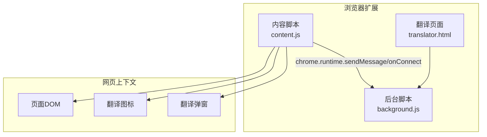
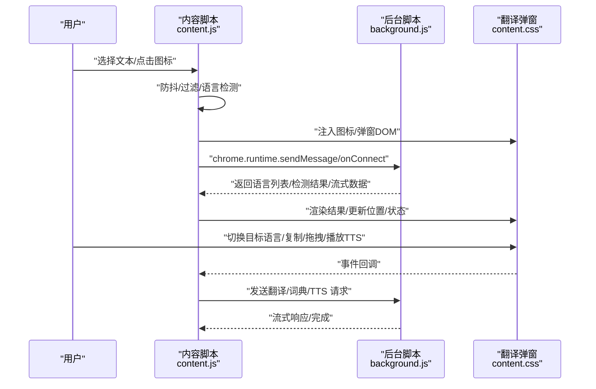
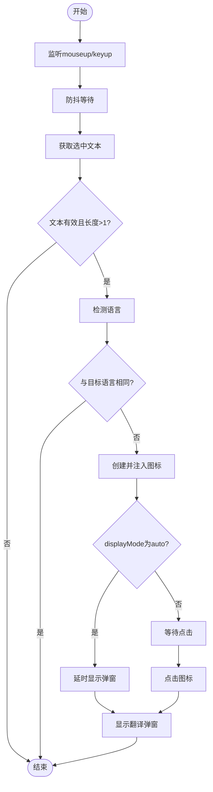
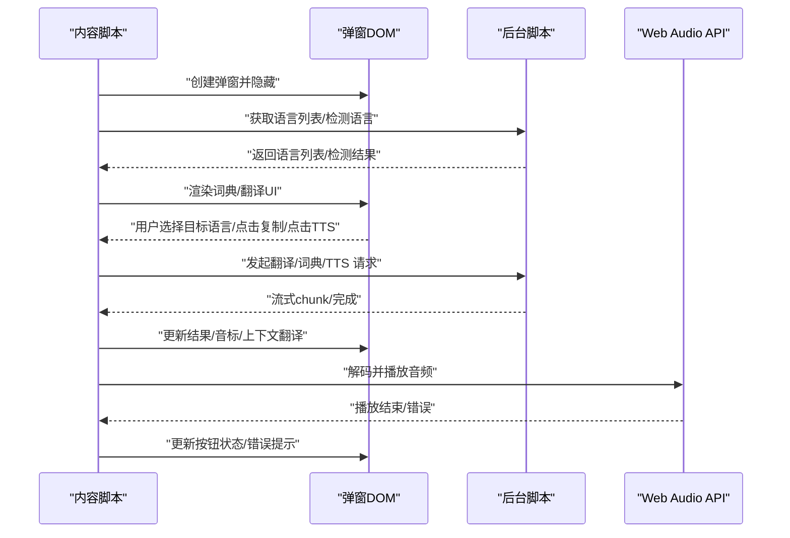
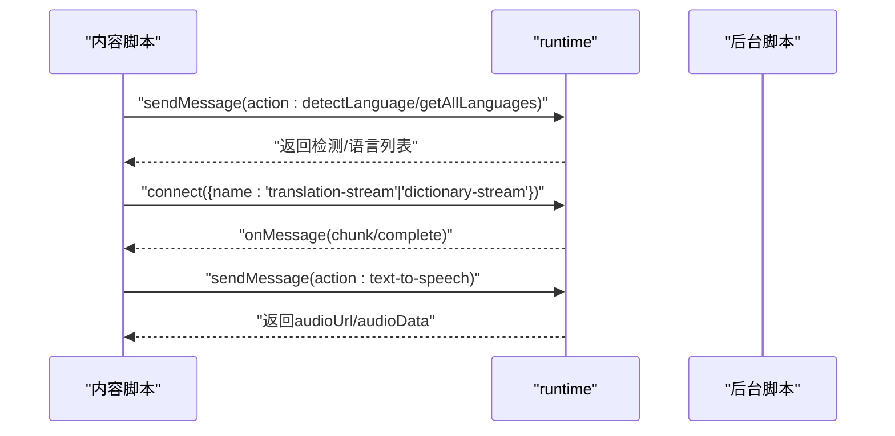
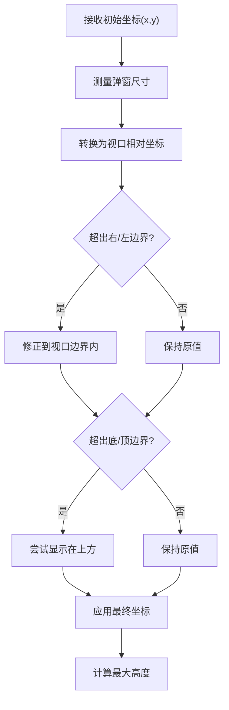
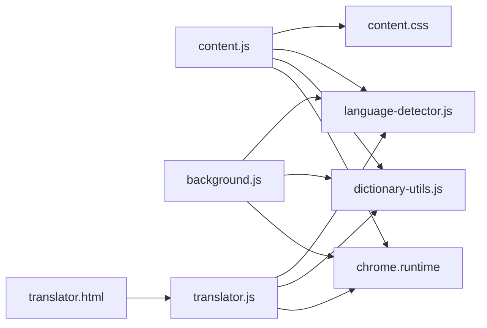

# 内容脚本模块

<cite>
**本文引用的文件**
- [content.js](file://content.js)
- [content.css](file://content.css)
- [background.js](file://background.js)
- [translator.html](file://translator.html)
- [translator.js](file://translator.js)
- [manifest.json](file://manifest.json)
- [dictionary-utils.js](file://dictionary-utils.js)
- [language-detector.js](file://language-detector.js)
</cite>

## 目录
1. [简介](#简介)
2. [项目结构](#项目结构)
3. [核心组件](#核心组件)
4. [架构总览](#架构总览)
5. [详细组件分析](#详细组件分析)
6. [依赖关系分析](#依赖关系分析)
7. [性能考量](#性能考量)
8. [故障排查指南](#故障排查指南)
9. [结论](#结论)

## 简介
本文件聚焦于内容脚本模块（content.js）在网页上下文中的角色与实现，涵盖以下主题：
- 如何监听用户鼠标选择事件以检测划词行为
- 动态注入翻译图标按钮并绑定点击事件
- 与后台脚本（background.js）通过 chrome.runtime.sendMessage/onConnect 进行跨上下文通信
- 翻译弹窗 UI（translator.html）的加载与交互逻辑（目标语言切换、复制翻译结果等）
- 结合 content.css 的 UI 样式定制化设计
- 弹窗定位算法如何适配不同页面布局
- DOM 注入的安全性与性能优化策略

## 项目结构
QuickTrans 采用 Manifest V3，内容脚本在所有页面注入，负责监听用户选择、注入 UI 并与后台服务通信。翻译页面（translator.html）独立存在，供用户手动打开进行批量翻译与词典查询。

图表来源
- [manifest.json](file://manifest.json#L19-L26)
- [content.js](file://content.js#L36-L93)
- [background.js](file://background.js#L720-L740)
- [translator.html](file://translator.html#L1-L20)

章节来源
- [manifest.json](file://manifest.json#L19-L26)

## 核心组件
- 内容脚本（content.js）：监听划词、注入图标与弹窗、处理拖拽、TTS 播放、复制、与后台通信
- 样式表（content.css）：定义图标与弹窗的视觉样式、动画与响应式布局
- 后台脚本（background.js）：提供翻译与词典查询的流式服务、TTS 合成、缓存与错误处理
- 翻译页面（translator.html + translator.js）：独立页面，提供更丰富的翻译与词典体验
- 共享工具（dictionary-utils.js、language-detector.js）：跨页面/脚本复用的格式化、语言检测与音频处理能力

章节来源
- [content.js](file://content.js#L36-L93)
- [content.css](file://content.css#L1-L120)
- [background.js](file://background.js#L1-L120)
- [translator.html](file://translator.html#L1-L40)
- [translator.js](file://translator.js#L1-L120)
- [dictionary-utils.js](file://dictionary-utils.js#L1-L60)
- [language-detector.js](file://language-detector.js#L1-L60)

## 架构总览
内容脚本在页面加载后初始化，注册多种事件监听器；当用户发生文本选择时，根据用户偏好与语言检测决定是否显示图标；点击图标或自动显示触发弹窗；弹窗内根据模式（普通翻译/词典）加载对应 UI，并通过 Port 连接与后台进行流式通信；后台负责调用 LLM/TTS 接口、缓存与错误处理；弹窗支持拖拽、复制、TTS 播放等交互。

图表来源
- [content.js](file://content.js#L135-L234)
- [content.js](file://content.js#L239-L391)
- [content.js](file://content.js#L393-L440)
- [background.js](file://background.js#L720-L740)
- [background.js](file://background.js#L1-L120)

## 详细组件分析

### 划词监听与图标注入
- 事件监听
  - 文本选择：监听 mouseup/keyup，使用防抖（约 200ms）避免频繁触发
  - 点击关闭：点击页面其他区域关闭弹窗
  - ESC 键：关闭弹窗
  - 右键菜单：记录鼠标位置，用于特殊页面（如 PDF）定位
- 图标注入
  - 依据选中文本范围计算图标位置（右上角偏移）
  - 仅当检测到的语言与目标语言不一致时才显示图标
  - 点击图标显示弹窗；若 displayMode 为 auto，延迟约 500ms 自动显示
- 词典模式
  - 若选中文本为单个英文单词，进入词典模式，提取上下文句子
  - 词典模式弹窗包含单词、音标、上下文与释义区域

图表来源
- [content.js](file://content.js#L135-L181)
- [content.js](file://content.js#L183-L234)

章节来源
- [content.js](file://content.js#L56-L93)
- [content.js](file://content.js#L135-L234)

### 弹窗 UI 与交互逻辑
- 弹窗创建与定位
  - 初始位置设在视口外并隐藏，等待 DOM 更新后测量尺寸并调整位置
  - 词典模式与翻译模式 UI 差异：前者包含单词、音标、上下文与释义；后者包含源语言、目标语言选择与原文/译文区域
  - 关闭按钮、复制按钮、拖拽头区域绑定事件
- 词典模式
  - 绑定单词/句子 TTS 按钮，支持播放与停止
  - 实时流式渲染词典结果，动态提取音标并更新弹窗位置
  - 上下文翻译显示与复制
- 翻译模式
  - 目标语言下拉选择，变更后持久化到存储并重新翻译
  - 流式翻译渲染，支持缓存命中与 token 信息展示
- 复制功能
  - 优先使用 Clipboard API；失败时回退到临时 textarea 方案
- TTS 播放
  - 通过 Web Audio API 解码并播放音频，支持 PCM/WAV/AAC/MP3 等格式
  - 播放状态与错误状态通过按钮样式反馈

图表来源
- [content.js](file://content.js#L239-L391)
- [content.js](file://content.js#L393-L440)
- [content.js](file://content.js#L442-L565)
- [content.js](file://content.js#L567-L714)
- [content.js](file://content.js#L834-L1071)
- [background.js](file://background.js#L720-L740)
- [background.js](file://background.js#L1-L120)

章节来源
- [content.js](file://content.js#L239-L391)
- [content.js](file://content.js#L393-L440)
- [content.js](file://content.js#L442-L714)
- [content.js](file://content.js#L834-L1071)

### 与后台脚本的跨上下文通信
- 翻译/词典/语言检测
  - 使用 chrome.runtime.sendMessage 发送请求，后台返回检测结果或建立 Port 连接
  - 使用 chrome.runtime.onConnect 监听 Port，实现流式数据传输
- 右键菜单翻译
  - 监听来自后台的消息（action: translateFromContextMenu），根据鼠标位置显示弹窗
- TTS 请求
  - 发送 text-to-speech 请求，后台返回音频 URL/Base64，前端解码并播放

图表来源
- [content.js](file://content.js#L190-L203)
- [content.js](file://content.js#L253-L261)
- [content.js](file://content.js#L387-L391)
- [content.js](file://content.js#L860-L864)
- [background.js](file://background.js#L720-L740)
- [background.js](file://background.js#L1-L120)

章节来源
- [content.js](file://content.js#L83-L93)
- [content.js](file://content.js#L190-L203)
- [content.js](file://content.js#L253-L261)
- [content.js](file://content.js#L387-L391)
- [content.js](file://content.js#L860-L864)
- [background.js](file://background.js#L720-L740)

### 弹窗定位算法与适配
- 基本策略
  - 以图标/鼠标位置为中心，计算弹窗左上角坐标
  - 保证不超出视口左右/上下边界，必要时将弹窗显示在选中文本上方
  - 动态计算最大高度，确保底部按钮区域可见
- 动态更新
  - 流式渲染过程中，每次更新后重新测量并调整位置，避免内容增长导致溢出
- 响应式
  - 使用 content.css 的媒体查询与弹性布局，保证在窄屏设备上的可用性

图表来源
- [content.js](file://content.js#L393-L440)

章节来源
- [content.js](file://content.js#L393-L440)
- [content.css](file://content.css#L343-L349)

### 样式定制与 UI 设计
- 图标样式
  - 圆形渐变背景、居中“译”字、悬停缩放与阴影、淡入动画
- 弹窗样式
  - 固定定位、圆角、阴影、滑入动画、内容区滚动、底部信息栏
  - 错误状态、加载动画、复制按钮状态变化
- 词典模式
  - 绿色主题头、单词展示区、音标显示、上下文区域、Markdown 渲染样式
- TTS 按钮
  - 加载/播放/错误状态样式，波形脉冲动画
- 响应式
  - 最小宽度/最大宽度约束、滚动条自定义样式

章节来源
- [content.css](file://content.css#L1-L120)
- [content.css](file://content.css#L120-L220)
- [content.css](file://content.css#L220-L342)
- [content.css](file://content.css#L350-L468)
- [content.css](file://content.css#L470-L620)

### 安全性与性能优化
- 安全性
  - HTML 转义：对用户输入与后台返回内容进行转义，避免 XSS
  - CSP 绕过：通过 Web Audio API 解码与播放音频，避免受限的 <audio> 使用
  - 仅注入必要的 DOM，避免污染页面结构
- 性能优化
  - 防抖：选择事件使用防抖，降低重复计算与 DOM 操作
  - 流式渲染：后台以流式方式返回数据，前端逐步渲染，提升首字到达时间
  - 动态尺寸测量：先隐藏/移出视口测量，再定位，避免布局抖动
  - 事件委托与最小化监听：仅在需要时绑定/解绑事件
  - 缓存：后台对翻译/词典结果进行缓存，命中时直接返回，减少网络请求

章节来源
- [content.js](file://content.js#L146-L181)
- [content.js](file://content.js#L442-L565)
- [content.js](file://content.js#L567-L714)
- [content.js](file://content.js#L834-L1071)
- [dictionary-utils.js](file://dictionary-utils.js#L190-L200)

## 依赖关系分析
- 内容脚本依赖
  - chrome.runtime：消息与 Port 通信
  - chrome.storage：用户偏好（displayMode、目标语言、最大文本长度）
  - DictionaryUtils：Markdown 渲染、音标提取、音频格式检测与 PCM 转 WAV
  - LanguageDetector：语言列表与检测
- 后台脚本依赖
  - StorageUtils：缓存与 API 配置
  - LanguageDetector：语言检测与名称
  - fetch：调用 LLM/TTS 接口
- 翻译页面
  - 与后台通信方式一致，但 UI 更丰富，支持批量翻译与词典弹窗

图表来源
- [content.js](file://content.js#L1-L35)
- [background.js](file://background.js#L1-L20)
- [translator.js](file://translator.js#L1-L40)
- [dictionary-utils.js](file://dictionary-utils.js#L1-L20)
- [language-detector.js](file://language-detector.js#L1-L20)

章节来源
- [content.js](file://content.js#L1-L35)
- [background.js](file://background.js#L1-L20)
- [translator.js](file://translator.js#L1-L40)

## 性能考量
- 事件与渲染
  - 防抖与最小化 DOM 操作，避免高频重排
  - 流式渲染减少一次性插入大量节点
- 网络与缓存
  - 后台缓存命中直接返回，降低延迟
  - 流式接口缩短首字时间
- 音频播放
  - Web Audio API 解码，避免 CSP 限制；对 PCM 数据进行 WAV 转换后再播放
- 样式与布局
  - 使用 transform/opacity 动画，避免触发布局计算
  - 响应式设计减少布局回流

[本节为通用指导，无需特定文件引用]

## 故障排查指南
- 无法显示翻译图标
  - 检查 displayMode 是否为 contextMenu（此时不会显示图标）
  - 确认检测到的语言与目标语言不同
  - 检查文本长度是否超过用户设置上限
- 弹窗不出现或位置异常
  - 确认鼠标位置记录正常（右键菜单场景）
  - 观察是否因内容增长导致溢出，需等待流式更新后再次调整
- 翻译/词典失败
  - 检查后台 API 配置是否存在
  - 网络错误/限流时，查看错误提示并重试或切换 API
- TTS 播放失败
  - 检查音频格式与解码流程，确认 Base64 数据有效
  - 若为 PCM，确认已转换为 WAV
- 复制失败
  - 优先使用 Clipboard API；若失败，检查权限与浏览器支持情况

章节来源
- [content.js](file://content.js#L83-L93)
- [content.js](file://content.js#L135-L181)
- [content.js](file://content.js#L393-L440)
- [content.js](file://content.js#L730-L777)
- [content.js](file://content.js#L834-L1071)
- [background.js](file://background.js#L1-L120)

## 结论
内容脚本模块通过轻量的事件监听与智能的图标注入，实现了对划词行为的无缝响应；借助 Port 流式通信与后台强大的翻译/词典/TTS 能力，为用户提供流畅的即时翻译体验。配合精心设计的样式与健壮的弹窗定位算法，能够在复杂页面布局中稳定运行。安全方面通过转义与 Web Audio API 绕过 CSP 限制，兼顾可用性与安全性；性能方面通过防抖、流式渲染与缓存策略，显著提升交互效率。