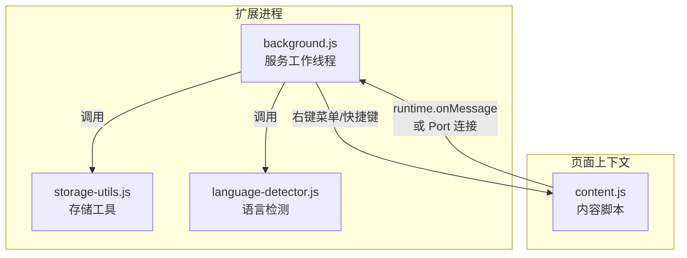
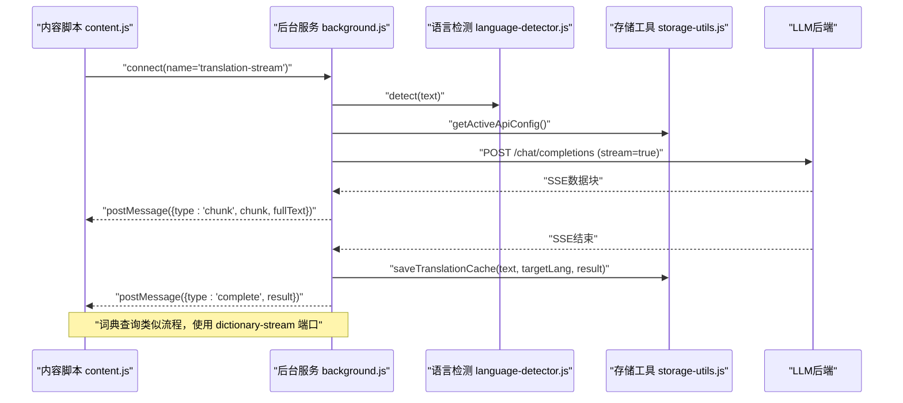
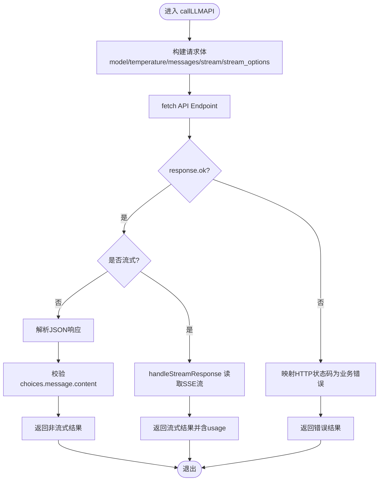
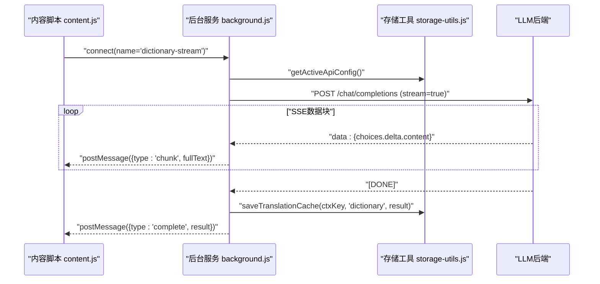
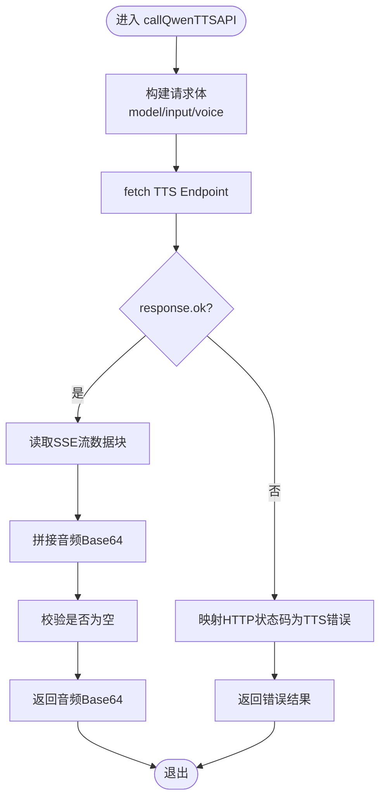
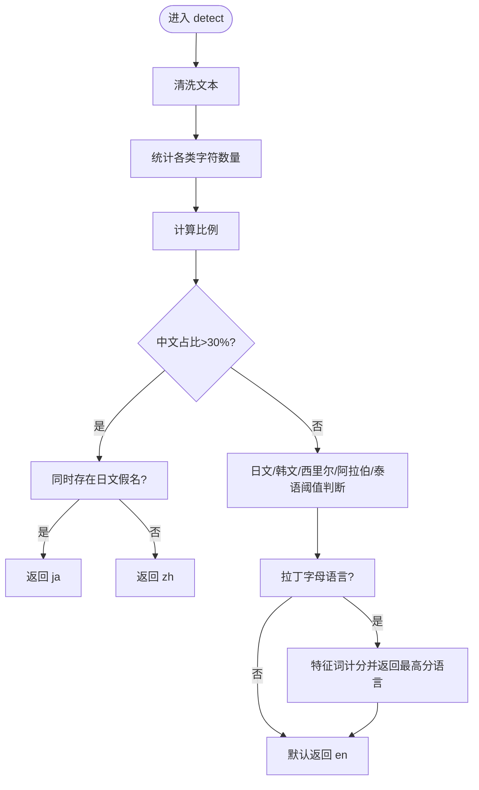
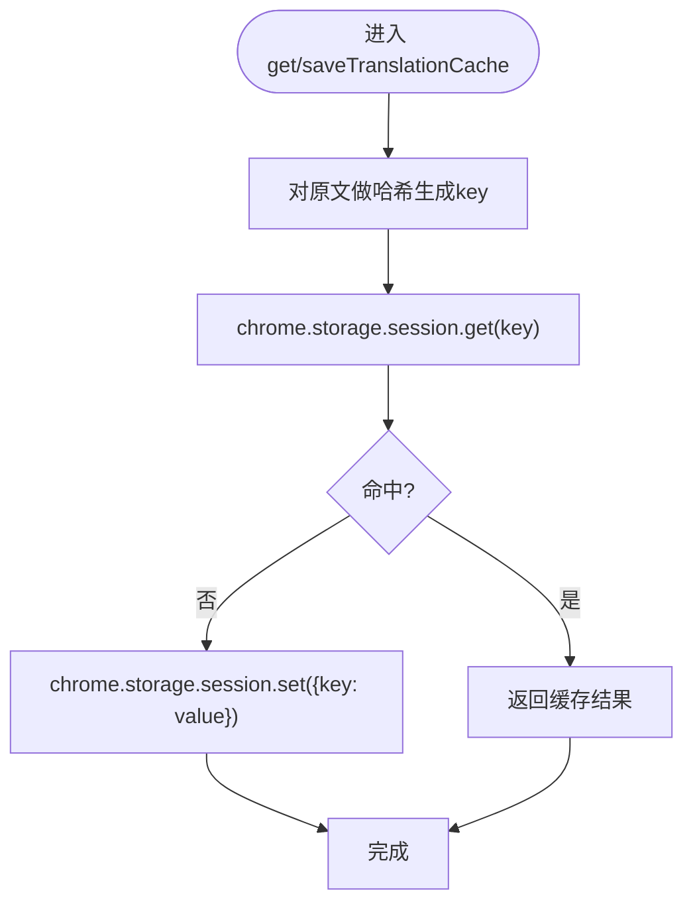
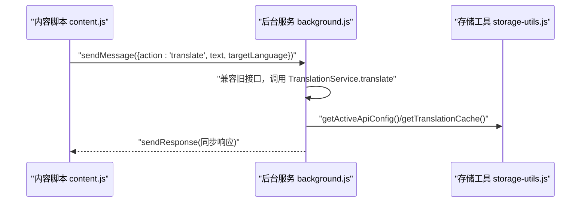
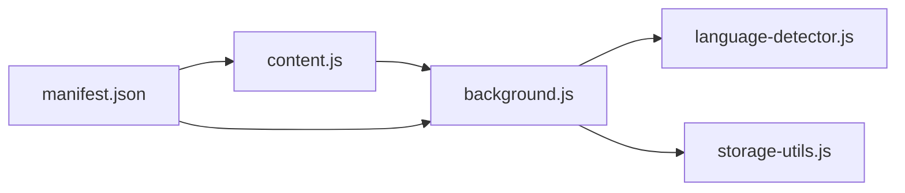

# 后台服务模块

<cite>
**本文引用的文件**
- [background.js](file://background.js)
- [storage-utils.js](file://storage-utils.js)
- [content.js](file://content.js)
- [language-detector.js](file://language-detector.js)
- [manifest.json](file://manifest.json)
</cite>

## 目录
1. [简介](#简介)
2. [项目结构](#项目结构)
3. [核心组件](#核心组件)
4. [架构总览](#架构总览)
5. [详细组件分析](#详细组件分析)
6. [依赖关系分析](#依赖关系分析)
7. [性能考量](#性能考量)
8. [故障排查指南](#故障排查指南)
9. [结论](#结论)
10. [附录](#附录)

## 简介
本文件聚焦于Chrome扩展服务工作线程background.js在Manifest V3架构下的核心职责，系统阐述其如何监听来自内容脚本content.js的消息，处理翻译请求与语言检测任务，通过fetch API调用大语言模型接口，并管理多个API配置的路由与切换逻辑；同时说明与storage-utils.js协作实现API配置与翻译结果缓存的机制，解释消息响应的异步处理流程。文档还结合代码路径说明onMessage事件监听器的实现方式，以及错误处理、超时控制与请求重试策略，并讨论该模块在Manifest V3下的生命周期管理与内容脚本通信的安全考虑。

## 项目结构
QuickTrans采用Manifest V3，后台服务worker运行在独立的service worker进程中，负责与内容脚本交互、调用LLM/TTS后端、管理配置与缓存。关键文件与职责如下：
- background.js：服务工作线程，负责消息监听、翻译/TTS服务、流式响应处理、右键菜单与快捷键处理、初始化与生命周期管理。
- storage-utils.js：封装Chrome存储API，提供API配置、TTS配置、用户偏好、翻译缓存、token统计等能力。
- content.js：内容脚本，负责划词监听、弹窗展示、与后台建立Port长连接进行流式翻译/词典查询。
- language-detector.js：本地语言检测模块，基于字符Unicode范围与特征词进行快速语言识别。
- manifest.json：声明权限、背景脚本、内容脚本、图标、动作按钮、命令等。

图表来源
- [background.js](file://background.js#L986-L1032)
- [content.js](file://content.js#L1-L120)
- [storage-utils.js](file://storage-utils.js#L1-L120)
- [language-detector.js](file://language-detector.js#L1-L60)
- [manifest.json](file://manifest.json#L1-L52)

章节来源
- [manifest.json](file://manifest.json#L1-L52)

## 核心组件
- 翻译服务（TranslationService）：封装翻译调用、流式响应处理、缓存命中、错误映射与超时控制。
- TTS服务（TTSService）：封装文本转语音调用，支持多家供应商（通义千问、OpenAI兼容）。
- 语言检测（LanguageDetector）：本地语言识别，用于翻译前置检测与提示词构造。
- 存储工具（StorageUtils）：API/TTS配置管理、用户偏好、翻译缓存、token统计、ID生成等。

章节来源
- [background.js](file://background.js#L49-L351)
- [background.js](file://background.js#L353-L710)
- [language-detector.js](file://language-detector.js#L1-L140)
- [storage-utils.js](file://storage-utils.js#L1-L120)

## 架构总览
服务工作线程通过两种主要通道与内容脚本交互：
- 短连接消息通道（chrome.runtime.onMessage）：处理语言检测、API测试、TTS等一次性请求。
- 长连接通道（chrome.runtime.onConnect）：建立Port连接，进行流式翻译与词典查询，实时推送增量结果。

图表来源
- [background.js](file://background.js#L986-L1032)
- [background.js](file://background.js#L866-L983)
- [content.js](file://content.js#L614-L728)
- [storage-utils.js](file://storage-utils.js#L356-L422)
- [language-detector.js](file://language-detector.js#L26-L140)

## 详细组件分析

### 翻译服务（TranslationService）
- 职责
  - 语言检测与前置校验（源语言与目标语言相同则直接返回原文）。
  - 缓存命中与回填（使用session存储，浏览器关闭即清空）。
  - 获取当前激活的API配置并构造提示词，调用LLM后端。
  - 流式响应处理（SSE），实时推送增量结果，支持usage统计。
  - 错误映射与超时控制（AbortController + 30秒超时）。
  - 非流式兼容路径（保留旧接口，推荐使用Port流式）。

- 关键流程图（callLLMAPI）

图表来源
- [background.js](file://background.js#L203-L323)
- [background.js](file://background.js#L132-L201)

- 错误处理与超时控制
  - 使用AbortController与30秒超时，超时返回TIMEOUT错误码。
  - 对401/429/5xx等HTTP状态进行业务错误映射，便于前端提示与重试策略。
  - 非流式兼容路径保留，但推荐使用Port流式接口。

- 缓存与路由
  - 通过StorageUtils.getTranslationCache与saveTranslationCache实现缓存。
  - 通过StorageUtils.getActiveApiConfig获取当前激活的API配置，实现多配置路由与切换。

章节来源
- [background.js](file://background.js#L49-L351)
- [storage-utils.js](file://storage-utils.js#L356-L422)
- [storage-utils.js](file://storage-utils.js#L120-L144)

### 词典查询服务（dictionary-stream Port）
- 职责
  - 接收来自内容脚本的词典查询请求（可携带上下文）。
  - 构造词典查询提示词（有上下文与无上下文两种模板）。
  - 流式调用LLM后端，实时推送chunk，完成后写入缓存并返回完整结果。
  - 从LLM结果中提取“上下文翻译”片段，供UI展示。

- 关键流程图（dictionary-stream）

图表来源
- [background.js](file://background.js#L712-L865)
- [content.js](file://content.js#L442-L565)
- [storage-utils.js](file://storage-utils.js#L356-L422)

章节来源
- [background.js](file://background.js#L712-L865)
- [content.js](file://content.js#L442-L565)

### TTS服务（TTSService）
- 职责
  - 根据provider路由至不同TTS实现（通义千问、OpenAI兼容）。
  - 通义千问：SSE流式读取音频数据块，拼接Base64。
  - OpenAI兼容：直接下载音频blob并转换为Base64。
  - 统一错误映射与超时控制（AbortController + 30秒）。

- 关键流程图（通义千问TTS）

图表来源
- [background.js](file://background.js#L353-L588)

章节来源
- [background.js](file://background.js#L353-L588)

### 语言检测（LanguageDetector）
- 职责
  - 基于字符Unicode范围与拉丁语族特征词进行快速语言识别。
  - 提供语言名称查询、支持语言列表、是否支持判断等辅助方法。

- 关键流程图（detect）

图表来源
- [language-detector.js](file://language-detector.js#L26-L140)

章节来源
- [language-detector.js](file://language-detector.js#L1-L263)

### 存储工具（StorageUtils）
- 职责
  - API配置管理：增删改查、激活切换、兼容性补全默认字段。
  - TTS配置管理：多供应商配置、默认字段补齐、激活切换。
  - 用户偏好：lastTargetLanguage、autoShowPopup、displayMode、popupPosition等。
  - 翻译缓存：基于session存储，自动清理，提供统计与清空。
  - token统计：聚合prompt/completion/total tokens与请求次数。

- 关键流程图（获取/保存翻译缓存）

图表来源
- [storage-utils.js](file://storage-utils.js#L356-L422)

章节来源
- [storage-utils.js](file://storage-utils.js#L1-L517)

### 消息与Port监听器
- onMessage事件监听器
  - 处理旧版非流式翻译请求（兼容路径）、语言检测、API测试、获取语言列表、TTS请求。
  - 对于异步响应，返回true以保持消息通道开放，直到异步处理完成再sendResponse。

- onConnect事件监听器
  - dictionary-stream：词典查询（可带上下文），流式返回定义与上下文翻译。
  - translation-stream：翻译请求，流式返回译文，支持usage统计与缓存写入。

- 关键流程图（onMessage翻译请求）

图表来源
- [background.js](file://background.js#L986-L1032)

章节来源
- [background.js](file://background.js#L986-L1032)

## 依赖关系分析
- 模块耦合
  - background.js依赖language-detector.js进行语言检测，依赖storage-utils.js进行配置与缓存管理。
  - content.js通过runtime API与background.js通信，建立Port连接进行流式交互。
- 外部依赖
  - fetch API：调用LLM/TTS后端。
  - Chrome扩展API：runtime、storage、contextMenus、commands、action等。
- 潜在循环依赖
  - 无直接循环依赖，模块间通过明确的导入/require关系解耦。

图表来源
- [background.js](file://background.js#L1-L20)
- [content.js](file://content.js#L1-L60)
- [manifest.json](file://manifest.json#L1-L52)

章节来源
- [background.js](file://background.js#L1-L20)
- [content.js](file://content.js#L1-L120)
- [manifest.json](file://manifest.json#L1-L52)

## 性能考量
- 流式传输
  - 使用Port长连接与SSE流式输出，显著降低首字延迟，提升用户体验。
- 缓存策略
  - session存储的翻译缓存自动清理，避免持久化占用，适合高频重复翻译场景。
- 超时与重试
  - 30秒超时保障长时间无响应时的健壮性；HTTP状态码映射便于前端触发重试或切换API。
- 语言检测
  - 本地快速检测减少网络往返，提高整体吞吐。

[本节为通用指导，不直接分析具体文件]

## 故障排查指南
- 常见错误与处理
  - 401（无效API密钥）：检查apiKey配置。
  - 429（频率限制）：等待冷却或切换其他API。
  - 500/503（服务不可用）：稍后重试或切换API。
  - TIMEOUT（请求超时）：检查网络连通性或延长等待。
  - INVALID_RESPONSE（返回格式错误）：检查后端返回结构。
- 缓存问题
  - 若缓存异常，可在选项页刷新统计或清空缓存。
- 重试策略建议
  - 对于RATE_LIMIT或SERVICE_UNAVAILABLE，前端可提示用户重试或切换API。
  - 对于INVALID_API_KEY，建议引导用户前往设置页修正配置。

章节来源
- [background.js](file://background.js#L249-L323)
- [background.js](file://background.js#L596-L690)
- [storage-utils.js](file://storage-utils.js#L356-L422)

## 结论
background.js在Manifest V3下承担了扩展的核心协调职责：通过Port长连接实现流式翻译与词典查询，借助StorageUtils实现API配置与缓存管理，利用LanguageDetector提供本地语言检测，配合content.js完成端到端的翻译体验。其错误映射、超时控制与缓存策略共同保障了稳定性与性能。建议优先使用Port流式接口，以获得最佳用户体验；同时合理配置API与缓存策略，提升复用率与响应速度。

[本节为总结性内容，不直接分析具体文件]

## 附录

### Manifest V3生命周期与安全要点
- 生命周期
  - onInstalled：安装/更新时创建右键菜单、初始化用户偏好、打开设置页引导配置。
  - onConnect：建立Port连接，处理翻译/词典流式请求。
  - onMessage：处理一次性消息（语言检测、API测试、TTS）。
  - commands/action：快捷键与图标点击打开翻译页面。
- 安全考虑
  - 权限最小化：仅申请storage、activeTab、contextMenus、clipboardRead等必要权限。
  - Host权限：允许http/https访问，需谨慎配置API端点。
  - 内容脚本与后台通信：通过runtime API与Port连接，避免直接注入全局变量。
  - CSP限制：TTS播放使用Web Audio API绕过CSP限制，确保音频安全播放。

章节来源
- [manifest.json](file://manifest.json#L1-L52)
- [background.js](file://background.js#L1034-L1142)
- [content.js](file://content.js#L821-L867)