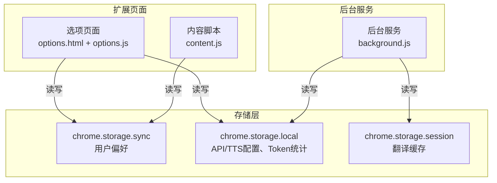
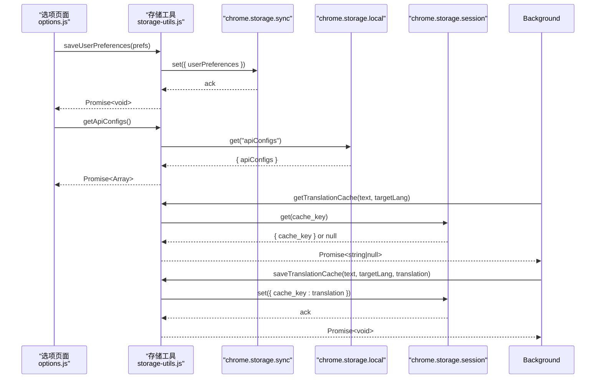
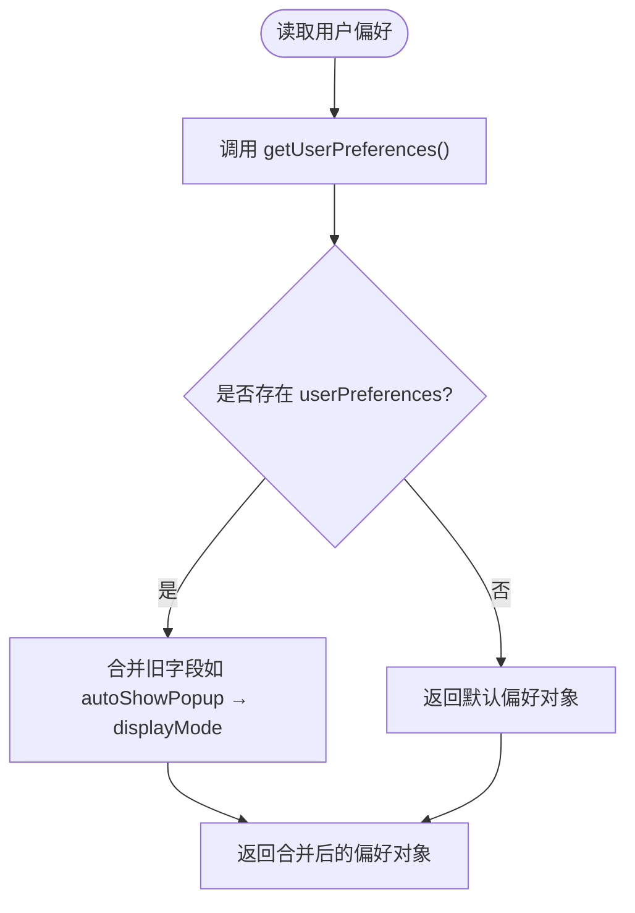
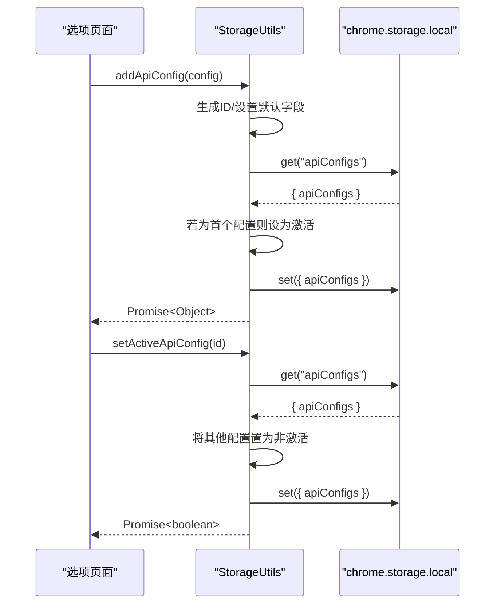
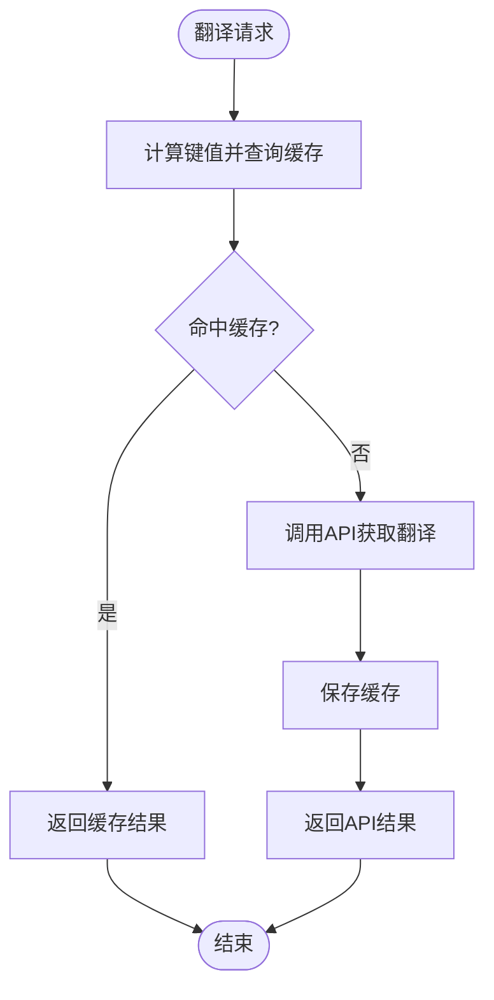
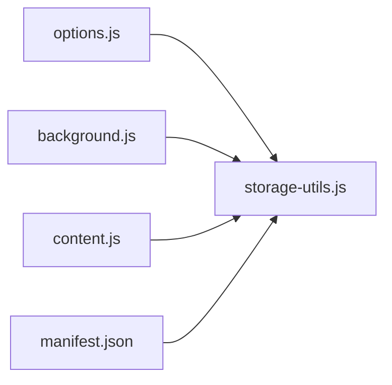

# 存储工具模块

<cite>
**本文引用的文件**
- [storage-utils.js](file://storage-utils.js)
- [background.js](file://background.js)
- [options.js](file://options.js)
- [options.html](file://options.html)
- [content.js](file://content.js)
- [manifest.json](file://manifest.json)
</cite>

## 目录
1. [简介](#简介)
2. [项目结构](#项目结构)
3. [核心组件](#核心组件)
4. [架构总览](#架构总览)
5. [详细组件分析](#详细组件分析)
6. [依赖关系分析](#依赖关系分析)
7. [性能考量](#性能考量)
8. [故障排查指南](#故障排查指南)
9. [结论](#结论)
10. [附录](#附录)

## 简介
本文件系统性地文档化 storage-utils.js 对 Chrome 扩展存储 API 的封装设计，重点覆盖以下方面：
- 高层接口：saveApiConfigs、getActiveApiConfig、saveUserPreferences 等方法的参数、返回值与异常处理机制
- 存储介质选择：为何采用 chrome.storage.sync 与 chrome.storage.local、chrome.storage.session 的差异及影响
- 缓存策略：翻译结果的键值设计、过期机制与容量限制处理
- 错误恢复：存储配额超限时的降级方案与健壮性保障
- 实际调用示例：其他模块如何安全高效地使用该工具类进行数据持久化

## 项目结构
storage-utils.js 作为通用存储工具模块，被多个入口脚本共享使用：
- options 页面：管理 API 配置、TTS 配置与用户偏好设置
- background 服务：执行翻译与 TTS 请求、缓存命中与统计
- content 脚本：读取用户偏好设置、触发翻译流程
- manifest 权限：声明 storage 权限，确保对 chrome.storage 的访问

图表来源
- [options.html](file://options.html#L465-L468)
- [options.js](file://options.js#L1-L120)
- [content.js](file://content.js#L36-L55)
- [background.js](file://background.js#L74-L121)
- [manifest.json](file://manifest.json#L6-L11)

章节来源
- [manifest.json](file://manifest.json#L6-L11)
- [options.html](file://options.html#L465-L468)

## 核心组件
storage-utils.js 提供统一的存储抽象，围绕三类数据域：
- API 配置域：翻译与 TTS 的多配置管理，含激活状态切换
- 用户偏好域：lastTargetLanguage、displayMode、maxTextLength 等
- 缓存与统计域：翻译缓存（session）、Token 使用统计（local）

关键接口概览（参数与返回值以“路径+行号”形式标注，便于查阅）：
- 获取/保存/更新用户偏好
  - getUserPreferences(): Promise<Object> → [storage-utils.js](file://storage-utils.js#L310-L321)
  - saveUserPreferences(preferences): Promise<void> → [storage-utils.js](file://storage-utils.js#L328-L330)
  - updateUserPreferences(updates): Promise<Object> → [storage-utils.js](file://storage-utils.js#L337-L342)
- 翻译 API 配置管理
  - getApiConfigs(): Promise<Array> → [storage-utils.js](file://storage-utils.js#L11-L21)
  - saveApiConfigs(configs): Promise<void> → [storage-utils.js](file://storage-utils.js#L28-L30)
  - addApiConfig(config): Promise<Object> → [storage-utils.js](file://storage-utils.js#L37-L63)
  - updateApiConfig(id, updates): Promise<Object|null> → [storage-utils.js](file://storage-utils.js#L71-L92)
  - deleteApiConfig(id): Promise<boolean> → [storage-utils.js](file://storage-utils.js#L99-L117)
  - getActiveApiConfig(): Promise<Object|null> → [storage-utils.js](file://storage-utils.js#L123-L126)
  - setActiveApiConfig(id): Promise<boolean> → [storage-utils.js](file://storage-utils.js#L133-L144)
- TTS 配置管理
  - getTtsConfigs(): Promise<Array> → [storage-utils.js](file://storage-utils.js#L150-L176)
  - saveTtsConfigs(configs): Promise<void> → [storage-utils.js](file://storage-utils.js#L183-L185)
  - addTtsConfig(config): Promise<Object> → [storage-utils.js](file://storage-utils.js#L192-L227)
  - updateTtsConfig(id, updates): Promise<Object|null> → [storage-utils.js](file://storage-utils.js#L235-L256)
  - deleteTtsConfig(id): Promise<boolean> → [storage-utils.js](file://storage-utils.js#L263-L281)
  - getActiveTtsConfig(): Promise<Object|null> → [storage-utils.js](file://storage-utils.js#L287-L290)
  - setActiveTtsConfig(id): Promise<boolean> → [storage-utils.js](file://storage-utils.js#L297-L308)
- 翻译缓存
  - getTranslationCache(text, targetLang): Promise<string|null> → [storage-utils.js](file://storage-utils.js#L363-L367)
  - saveTranslationCache(text, targetLang, translation): Promise<void> → [storage-utils.js](file://storage-utils.js#L377-L385)
  - getCacheStats(): Promise<Object> → [storage-utils.js](file://storage-utils.js#L391-L422)
  - clearAllCache(): Promise<number> → [storage-utils.js](file://storage-utils.js#L428-L442)
- Token 统计
  - getTokenUsage(): Promise<Object> → [storage-utils.js](file://storage-utils.js#L463-L472)
  - updateTokenUsage(usage): Promise<Object> → [storage-utils.js](file://storage-utils.js#L479-L494)
  - resetTokenUsage(): Promise<void> → [storage-utils.js](file://storage-utils.js#L500-L510)

章节来源
- [storage-utils.js](file://storage-utils.js#L11-L510)

## 架构总览
storage-utils.js 通过统一的 API 抽象屏蔽底层存储细节，使上层模块（options、background、content）无需关心存储介质差异，专注于业务逻辑。

图表来源
- [options.js](file://options.js#L181-L200)
- [storage-utils.js](file://storage-utils.js#L11-L30)
- [storage-utils.js](file://storage-utils.js#L363-L385)
- [background.js](file://background.js#L74-L121)

## 详细组件分析

### 用户偏好设置（chrome.storage.sync）
- 设计要点
  - 使用 sync 存储用户偏好，确保多设备间自动同步
  - 提供默认值回退，兼容旧配置字段（如 autoShowPopup → displayMode）
- 接口与行为
  - 读取：getUserPreferences() 返回默认偏好对象
  - 更新：updateUserPreferences(updates) 合并更新并保存
  - 保存：saveUserPreferences(prefs) 直接覆盖
- 异常处理
  - 读取失败时返回默认值，保证 UI 正常渲染
  - 更新失败时由上层模块负责提示与重试
- 与其他模块的交互
  - options 页面初始化时加载并绑定偏好
  - content 脚本启动时读取偏好决定显示模式与最大文本长度

图表来源
- [storage-utils.js](file://storage-utils.js#L310-L321)
- [content.js](file://content.js#L36-L55)
- [options.js](file://options.js#L736-L750)

章节来源
- [storage-utils.js](file://storage-utils.js#L310-L342)
- [content.js](file://content.js#L36-L55)
- [options.js](file://options.js#L736-L750)

### 翻译 API 配置（chrome.storage.local）
- 设计要点
  - 使用 local 存储 API 配置列表，支持多配置与激活切换
  - 新增配置时自动设置激活状态；激活切换时确保只有一个配置处于激活
  - 旧配置兼容：自动补全 model、temperature 等字段
- 接口与行为
  - 读取：getApiConfigs() 返回配置数组
  - 写入：saveApiConfigs(configs) 覆盖保存
  - 增删改：add/update/delete 分别处理新增、更新与删除
  - 激活管理：getActiveApiConfig()/setActiveApiConfig() 管理当前生效配置
- 异常处理
  - 更新不存在的 ID 返回 null，调用方需做空值判断
  - 删除激活配置时，若仍有其他配置则自动激活第一个

图表来源
- [storage-utils.js](file://storage-utils.js#L37-L63)
- [storage-utils.js](file://storage-utils.js#L133-L144)
- [options.js](file://options.js#L250-L284)

章节来源
- [storage-utils.js](file://storage-utils.js#L11-L144)
- [options.js](file://options.js#L181-L284)

### TTS 配置（chrome.storage.local）
- 设计要点
  - 支持多服务商（qwen/openai），按 provider 注入差异化字段
  - 与翻译 API 配置相同的激活管理策略
- 接口与行为
  - 读取：getTtsConfigs() 返回配置数组（兼容旧字段）
  - 写入：saveTtsConfigs(configs) 覆盖保存
  - 增删改：add/update/delete 分别处理
  - 激活管理：getActiveTtsConfig()/setActiveTtsConfig()

章节来源
- [storage-utils.js](file://storage-utils.js#L146-L308)
- [options.js](file://options.js#L450-L583)

### 翻译缓存（chrome.storage.session）
- 设计要点
  - 使用 session 存储，浏览器关闭后自动清空，天然过期
  - 键值设计：cache_{hash(text)}_{targetLang}，避免重复计算与冲突
  - 容量与过期：由 Chrome 自动管理，超出容量时自动清理
- 接口与行为
  - 读取：getTranslationCache(text, targetLang) 返回缓存或 null
  - 写入：saveTranslationCache(text, targetLang, translation) 保存缓存
  - 统计：getCacheStats() 返回缓存数量、总大小、存储类型与提示
  - 清理：clearAllCache() 清空所有缓存键
- 异常处理
  - 写入失败时捕获错误并记录警告，避免影响主流程
  - 统计失败时返回默认空统计对象，保证 UI 不崩溃

图表来源
- [background.js](file://background.js#L74-L121)
- [storage-utils.js](file://storage-utils.js#L356-L385)
- [storage-utils.js](file://storage-utils.js#L387-L442)

章节来源
- [storage-utils.js](file://storage-utils.js#L356-L442)
- [background.js](file://background.js#L74-L121)

### Token 使用统计（chrome.storage.local）
- 设计要点
  - 以增量方式累加 prompt_tokens、completion_tokens、total_tokens 与请求次数
  - 保存 lastUpdated 时间戳，便于展示与审计
- 接口与行为
  - 读取：getTokenUsage() 返回默认统计对象
  - 更新：updateTokenUsage(usage) 合并并保存
  - 重置：resetTokenUsage() 清零统计

章节来源
- [storage-utils.js](file://storage-utils.js#L460-L510)
- [background.js](file://background.js#L280-L305)

## 依赖关系分析
- 模块耦合
  - options.js 与 storage-utils.js：强耦合，负责配置与偏好的 CRUD 与持久化
  - background.js 与 storage-utils.js：强耦合，负责缓存读写与统计更新
  - content.js 与 storage-utils.js：弱耦合，仅读取用户偏好
- 外部依赖
  - manifest.json 声明 storage 权限，确保对 chrome.storage 的访问
- 存储介质选择
  - sync：用户偏好（跨设备同步）
  - local：配置与统计（本地持久化）
  - session：缓存（自动过期）

图表来源
- [options.js](file://options.js#L1-L120)
- [background.js](file://background.js#L1-L120)
- [content.js](file://content.js#L36-L55)
- [manifest.json](file://manifest.json#L6-L11)

章节来源
- [options.js](file://options.js#L1-L120)
- [background.js](file://background.js#L1-L120)
- [content.js](file://content.js#L36-L55)
- [manifest.json](file://manifest.json#L6-L11)

## 性能考量
- 缓存命中率
  - 使用稳定键值（hash(text)+targetLang）提升命中率，减少 API 调用
  - session 存储避免手动过期管理，降低维护成本
- I/O 成本
  - 批量读写：getApiConfigs()/saveApiConfigs() 一次性读写整个配置数组
  - 统一更新：updateUserPreferences() 合并更新，减少多次 set 调用
- 存储容量
  - session 约 10MB 限制，超出自动清理，无需上层干预
  - local 存储适合配置与统计，避免频繁写入造成碎片

[本节为通用建议，不直接分析具体文件]

## 故障排查指南
- 常见问题与定位
  - 用户偏好读取为空：确认 getUserPreferences() 是否返回默认值；检查 sync 权限
  - 配置更新无效：确认 updateApiConfig() 返回值；检查 ID 是否存在
  - 缓存写入失败：查看控制台警告；确认 session 容量是否接近上限
  - Token 统计未更新：确认 updateTokenUsage() 是否传入 usage 对象
- 诊断步骤
  - 在 options 页面刷新缓存统计与 Token 统计，观察数值变化
  - 在 background 中断点调试缓存读写链路
  - 在 content 中验证用户偏好读取是否正确

章节来源
- [storage-utils.js](file://storage-utils.js#L377-L385)
- [storage-utils.js](file://storage-utils.js#L391-L422)
- [storage-utils.js](file://storage-utils.js#L479-L494)

## 结论
storage-utils.js 通过清晰的分层与统一接口，将 Chrome 存储 API 的复杂性封装起来，实现了：
- 多设备同步的用户偏好
- 本地持久化的配置与统计
- 自动过期的翻译缓存
- 稳健的错误恢复与降级策略
这使得上层模块（options、background、content）能够以最小成本实现可靠的数据持久化。

[本节为总结性内容，不直接分析具体文件]

## 附录

### 实际调用示例（路径指引）
- 选项页面保存翻译 API 配置
  - 触发：options.js 表单提交
  - 调用：StorageUtils.addApiConfig()/updateApiConfig()
  - 路径参考：[options.js](file://options.js#L347-L401)
- 选项页面切换激活的翻译 API
  - 调用：StorageUtils.setActiveApiConfig()
  - 路径参考：[options.js](file://options.js#L250-L284)
- 后台服务执行翻译并缓存结果
  - 调用：StorageUtils.getTranslationCache()/saveTranslationCache()
  - 路径参考：[background.js](file://background.js#L74-L121)
- 内容脚本读取用户偏好
  - 调用：chrome.storage.sync.get('userPreferences')
  - 路径参考：[content.js](file://content.js#L36-L55)
- 选项页面更新用户偏好
  - 调用：StorageUtils.updateUserPreferences()
  - 路径参考：[options.js](file://options.js#L761-L785)

章节来源
- [options.js](file://options.js#L250-L401)
- [background.js](file://background.js#L74-L121)
- [content.js](file://content.js#L36-L55)
- [options.js](file://options.js#L761-L785)