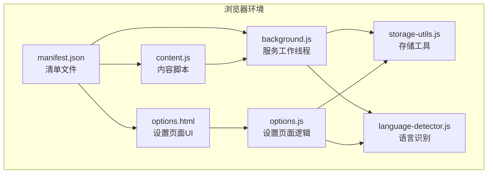
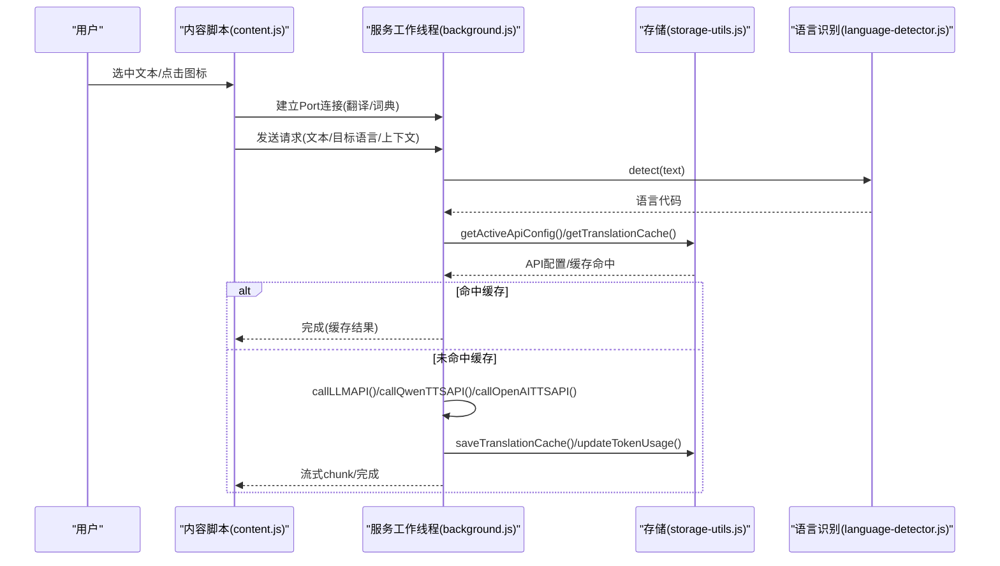
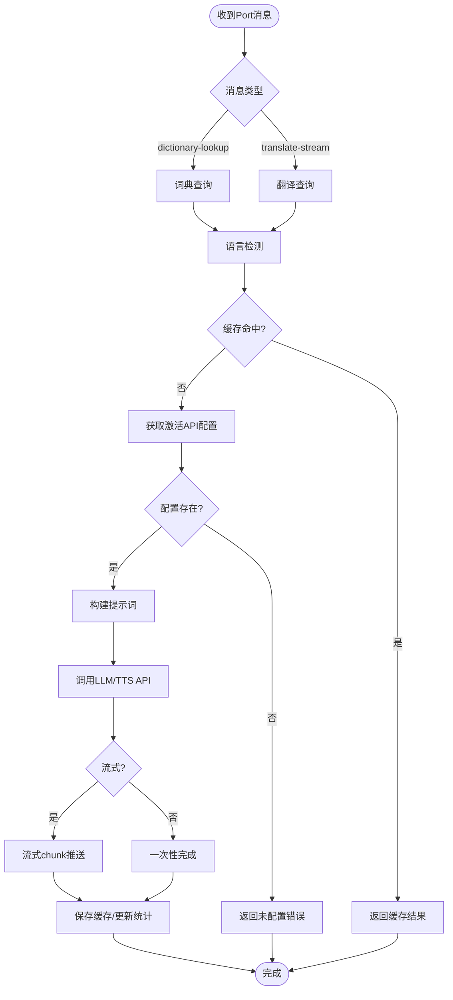
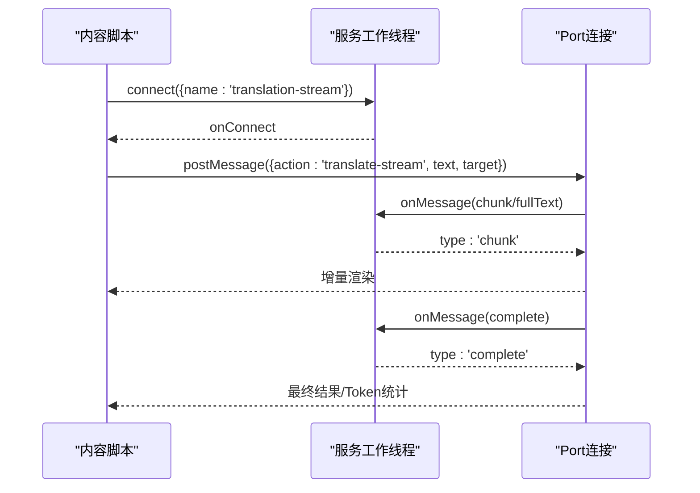
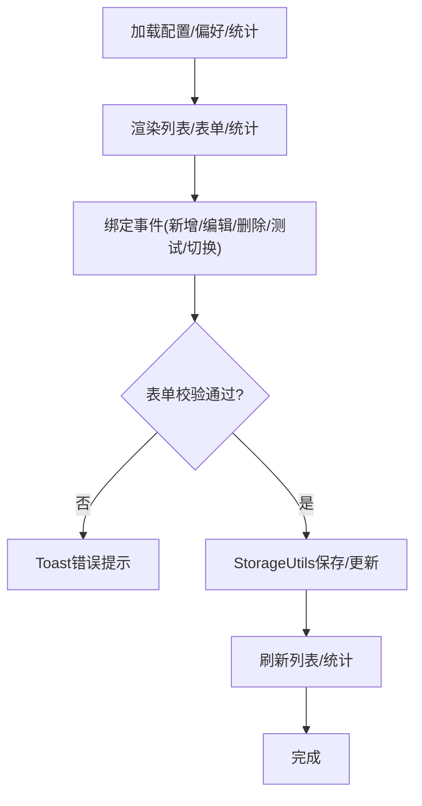
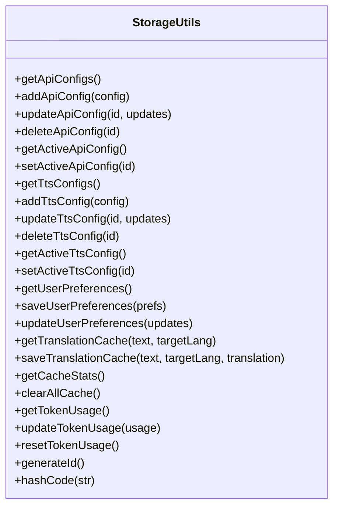
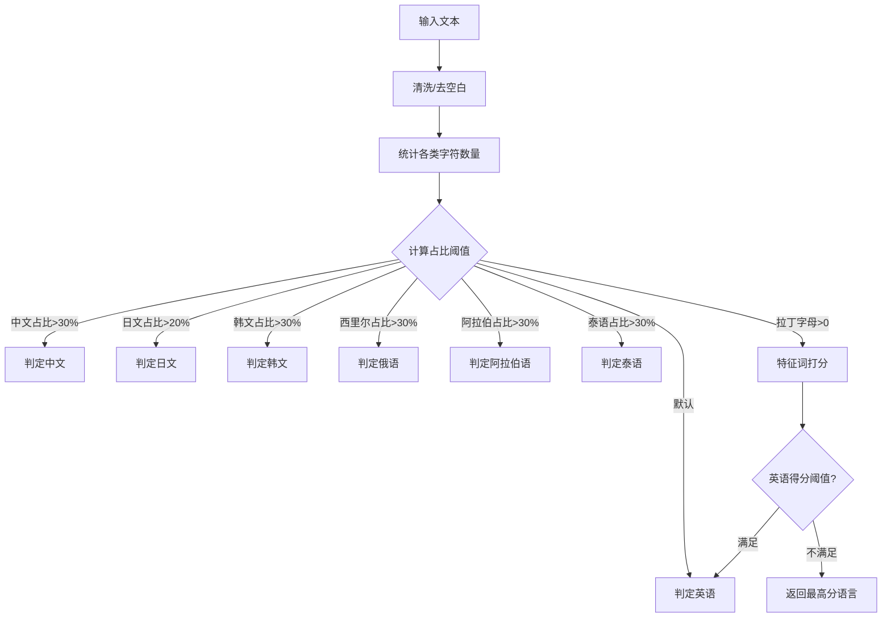
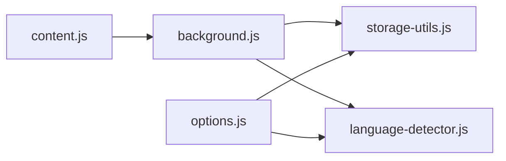

# 核心模块详解

<cite>
**本文引用的文件**
- [background.js](file://background.js)
- [content.js](file://content.js)
- [options.js](file://options.js)
- [storage-utils.js](file://storage-utils.js)
- [language-detector.js](file://language-detector.js)
- [manifest.json](file://manifest.json)
- [options.html](file://options.html)
</cite>

## 目录
1. [引言](#引言)
2. [项目结构](#项目结构)
3. [核心组件](#核心组件)
4. [架构总览](#架构总览)
5. [详细组件分析](#详细组件分析)
6. [依赖关系分析](#依赖关系分析)
7. [性能考量](#性能考量)
8. [故障排查指南](#故障排查指南)
9. [结论](#结论)

## 引言
本文件面向QuickTrans的五大核心模块，系统性剖析其职责、交互流程与实现要点，帮助开发者与用户全面理解服务工作线程、内容脚本、设置页面、存储工具与语言识别模块之间的协作方式。文档同时提供可视化图示，便于快速把握整体架构与关键路径。

## 项目结构
QuickTrans采用Manifest V3架构，核心文件分布如下：
- background.js：服务工作线程，负责翻译与TTS请求处理、缓存与API配置管理、右键菜单与快捷键等。
- content.js：内容脚本，负责监听划词、注入图标与弹窗、与background.js通过Port进行流式通信。
- options.js：设置页面逻辑，管理翻译/TTS配置的增删改查、用户偏好与缓存/Token统计。
- storage-utils.js：封装chrome.storage API，提供API配置、用户偏好、翻译缓存与Token统计的持久化能力。
- language-detector.js：本地语言识别模块，基于Unicode范围与特征词进行快速语言判定。
- manifest.json：声明权限、背景脚本、内容脚本、图标与快捷键等元信息。
- options.html：设置页面UI骨架，配合options.js完成配置与统计展示。

图表来源
- [manifest.json](file://manifest.json#L1-L52)
- [background.js](file://background.js#L1-L120)
- [content.js](file://content.js#L1-L120)
- [options.js](file://options.js#L1-L120)
- [storage-utils.js](file://storage-utils.js#L1-L120)
- [language-detector.js](file://language-detector.js#L1-L60)
- [options.html](file://options.html#L1-L120)

章节来源
- [manifest.json](file://manifest.json#L1-L52)

## 核心组件
- 服务工作线程（background.js）
  - 职责：处理翻译与词典查询请求；调用LLM与TTS API；管理API配置与缓存；提供消息与Port监听；创建右键菜单与快捷键。
  - 关键能力：流式翻译/词典查询、TTS合成、缓存命中与统计更新、错误分类与超时处理。
- 内容脚本（content.js）
  - 职责：监听用户划词事件，注入翻译图标与弹窗；与background.js通过Port建立长连接；支持拖拽、复制、TTS播放等交互。
  - 关键能力：防抖处理、词典模式与翻译模式切换、流式结果增量渲染、位置自适应与最大高度约束。
- 设置页面（options.js）
  - 职责：管理翻译/TTS配置的增删改查；维护用户偏好；展示缓存统计与Token使用统计；提供测试连接与切换。
  - 关键能力：表单校验、模态框管理、卡片事件绑定、Toast提示、Provider差异字段处理。
- 存储工具（storage-utils.js）
  - 职责：封装chrome.storage，提供API配置、用户偏好、翻译缓存、Token统计的读写与聚合。
  - 关键能力：ID生成、缓存键策略、session存储统计、批量操作与兼容性迁移。
- 语言识别（language-detector.js）
  - 职责：基于Unicode范围与特征词进行本地语言识别，提供语言名称与支持列表。
  - 关键能力：CJK/日文/韩文/西里尔/阿拉伯/泰语/拉丁语族识别，拉丁语族特征词打分与阈值控制。

章节来源
- [background.js](file://background.js#L1-L200)
- [content.js](file://content.js#L1-L200)
- [options.js](file://options.js#L1-L200)
- [storage-utils.js](file://storage-utils.js#L1-L200)
- [language-detector.js](file://language-detector.js#L1-L160)

## 架构总览
QuickTrans采用“内容脚本驱动交互 + 服务工作线程承载业务”的典型架构。内容脚本负责UI与用户交互，服务工作线程负责网络请求、缓存与配置管理，设置页面通过chrome.storage与工作线程交互，语言识别模块提供本地判定能力。

图表来源
- [content.js](file://content.js#L360-L560)
- [background.js](file://background.js#L720-L983)
- [storage-utils.js](file://storage-utils.js#L356-L422)
- [language-detector.js](file://language-detector.js#L31-L141)

## 详细组件分析

### 服务工作线程（background.js）
- 翻译服务（TranslationService）
  - 支持流式与非流式两种模式；默认推荐流式，提供渐进式体验与更快首字响应。
  - 错误处理覆盖：401/429/5xx、超时、网络异常、响应格式错误等，统一返回结构便于前端展示。
  - 缓存策略：基于原文与目标语言生成缓存键；词典查询支持上下文缓存键。
  - Token统计：在流式场景下提取usage并更新本地统计。
- TTS服务（TTSService）
  - 支持通义千问与OpenAI兼容TTS；通义千问使用SSE流式输出，OpenAI兼容API返回二进制并转换为Base64。
  - 错误处理与超时控制与翻译一致。
- Port连接监听
  - dictionary-stream：词典查询，支持上下文与音标提取。
  - translation-stream：翻译查询，支持自动语言检测与缓存命中。
- 消息监听
  - detectLanguage：返回本地语言识别结果。
  - testApiConfig：测试配置连通性。
  - getAllLanguages：返回支持语言列表。
  - text-to-speech：触发TTS合成。
- 右键菜单与快捷键
  - 创建“翻译选中文本”“在翻译页面中打开”菜单项；支持快捷键打开翻译页面。
- 初始化与生命周期
  - 安装/更新时创建菜单、初始化默认偏好、打开设置页面引导配置。

图表来源
- [background.js](file://background.js#L720-L983)
- [background.js](file://background.js#L986-L1032)

章节来源
- [background.js](file://background.js#L1-L200)
- [background.js](file://background.js#L200-L500)
- [background.js](file://background.js#L500-L800)
- [background.js](file://background.js#L800-L1143)

### 内容脚本（content.js）
- 划词监听与图标注入
  - 防抖处理，过滤过短/超长文本；根据检测语言与目标语言决定是否显示图标。
  - 自动显示模式下延迟触发弹窗；图标点击与右键菜单均可触发翻译。
- 弹窗与交互
  - 词典模式：显示音标、上下文、TTS播放；翻译模式：语言切换、复制译文。
  - 位置自适应：根据视口边界动态调整弹窗位置与最大高度，保证可见性。
- 流式通信
  - 通过Port建立长连接，接收chunk增量渲染，完成后再更新底部信息栏（模型与Token统计）。
- 错误处理与重试
  - 根据错误码提供“前往设置/重试/切换API”等操作按钮。

图表来源
- [content.js](file://content.js#L360-L560)
- [content.js](file://content.js#L614-L728)
- [background.js](file://background.js#L866-L983)

章节来源
- [content.js](file://content.js#L1-L200)
- [content.js](file://content.js#L200-L500)
- [content.js](file://content.js#L500-L800)

### 设置页面（options.js）
- 翻译API配置
  - 列表渲染、卡片激活/编辑/删除；表单校验（必填、URL格式、Temperature范围）；测试连接。
- TTS API配置
  - Provider切换（通义千问/OpenAI兼容），差异化字段展示；保存与激活。
- 用户偏好
  - 默认目标语言、显示模式（自动/图标/右键）、文字长度限制；向后兼容旧字段。
- 缓存与Token统计
  - 展示缓存数量/大小/存储类型；提供刷新与清空；Token统计支持刷新与重置。
- 事件绑定与提示
  - ESC关闭模态框、Toast提示、语言选项加载。

图表来源
- [options.js](file://options.js#L1-L200)
- [options.js](file://options.js#L200-L500)
- [options.js](file://options.js#L500-L800)
- [options.html](file://options.html#L1-L200)

章节来源
- [options.js](file://options.js#L1-L200)
- [options.js](file://options.js#L200-L500)
- [options.js](file://options.js#L500-L800)
- [options.html](file://options.html#L1-L200)

### 存储工具（storage-utils.js）
- API配置管理
  - 增删改查、激活切换、兼容性迁移（默认model/temperature）。
- TTS配置管理
  - Provider差异字段补齐（通义千问默认模型/音色；OpenAI默认模型/音色/格式）。
- 用户偏好
  - 默认目标语言、显示模式、文字长度限制；向后兼容autoShowPopup。
- 缓存与统计
  - 翻译缓存：基于hashCode(text)+targetLang生成键；使用session存储，自动清理。
  - Token统计：累计prompt/completion/total tokens与请求次数，支持重置。
- 工具方法
  - ID生成、hashCode、缓存统计与清空。

图表来源
- [storage-utils.js](file://storage-utils.js#L1-L200)
- [storage-utils.js](file://storage-utils.js#L200-L422)
- [storage-utils.js](file://storage-utils.js#L422-L517)

章节来源
- [storage-utils.js](file://storage-utils.js#L1-L200)
- [storage-utils.js](file://storage-utils.js#L200-L422)
- [storage-utils.js](file://storage-utils.js#L422-L517)

### 语言识别（language-detector.js）
- Unicode范围识别
  - 中文（CJK统一汉字/扩展）、日文假名、韩文、西里尔、阿拉伯、泰语、拉丁字母等。
- 特征词打分
  - 拉丁语族通过常见词汇匹配进行打分，综合阈值避免误判。
- 辅助能力
  - 语言名称查询、支持语言列表、是否支持判断。

图表来源
- [language-detector.js](file://language-detector.js#L31-L141)
- [language-detector.js](file://language-detector.js#L143-L227)
- [language-detector.js](file://language-detector.js#L229-L257)

章节来源
- [language-detector.js](file://language-detector.js#L1-L160)
- [language-detector.js](file://language-detector.js#L160-L263)

## 依赖关系分析
- 模块耦合
  - background.js依赖storage-utils.js与language-detector.js；content.js通过chrome.runtime与background.js通信；options.js通过chrome.runtime与background.js交互并依赖storage-utils.js与language-detector.js。
- 外部依赖
  - chrome.storage（local/sync/session）、chrome.runtime（onMessage/onConnect）、fetch API、SSE流式处理。
- 潜在风险
  - storage.session容量上限与自动清理；Port连接断开与重连；API端点与密钥有效性；超时与错误码映射。

图表来源
- [background.js](file://background.js#L1-L120)
- [content.js](file://content.js#L1-L120)
- [options.js](file://options.js#L1-L120)
- [storage-utils.js](file://storage-utils.js#L1-L120)
- [language-detector.js](file://language-detector.js#L1-L60)

章节来源
- [manifest.json](file://manifest.json#L1-L52)

## 性能考量
- 流式传输
  - 通过Port与SSE实现增量渲染，显著降低首字延迟与感知等待时间。
- 缓存策略
  - session存储的翻译缓存自动清理，避免长期占用；相同文本重复翻译命中率高。
- 本地识别
  - language-detector.js基于Unicode与特征词，O(n)复杂度，适合高频调用。
- 资源占用
  - content.js弹窗位置与最大高度动态计算，避免过度DOM更新；TTS音频Base64拼接需注意内存峰值。

[本节为通用指导，不直接分析具体文件]

## 故障排查指南
- 翻译失败
  - 检查API配置是否激活；确认端点与密钥正确；查看错误码（INVALID_API_KEY/RATE_LIMIT/SERVICE_UNAVAILABLE/NETWORK_ERROR/TIMEOUT）并按提示重试或切换API。
- 未显示翻译图标
  - 确认显示模式设置；检查选中文本长度限制；确认目标语言与源语言不同。
- 词典模式无音标
  - 词典结果中音标格式多样，content.js尝试多种正则匹配；若未提取，可在结果中手动查看。
- 设置页面无法保存
  - 检查必填字段与URL格式；Temperature范围；确认chrome.storage可用。
- Token统计为空
  - 首次使用或重置后需要产生请求才会统计；刷新统计或进行一次翻译/词典查询。

章节来源
- [background.js](file://background.js#L986-L1032)
- [content.js](file://content.js#L729-L777)
- [options.js](file://options.js#L344-L447)

## 结论
QuickTrans通过清晰的模块划分与稳定的通信机制，实现了从划词到翻译/词典查询再到TTS播放的完整链路。服务工作线程承担核心业务与缓存/统计，内容脚本专注交互体验，设置页面提供完善的配置与监控能力，存储工具与语言识别模块分别提供持久化与本地判定支撑。整体设计兼顾易用性与可维护性，适合在多API与多语言场景下稳定运行。