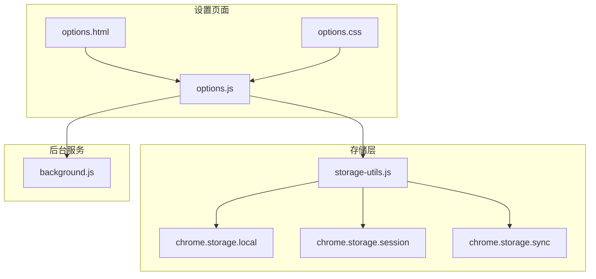
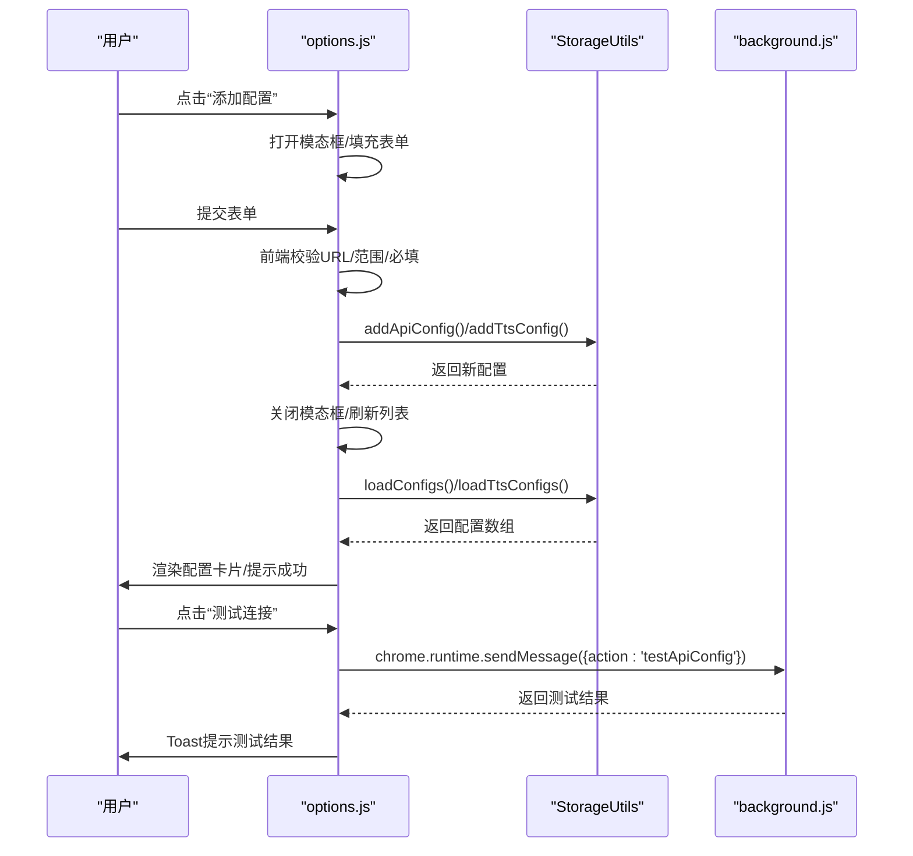
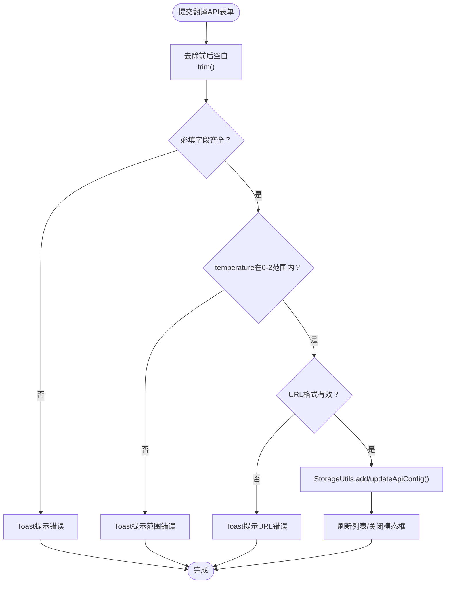
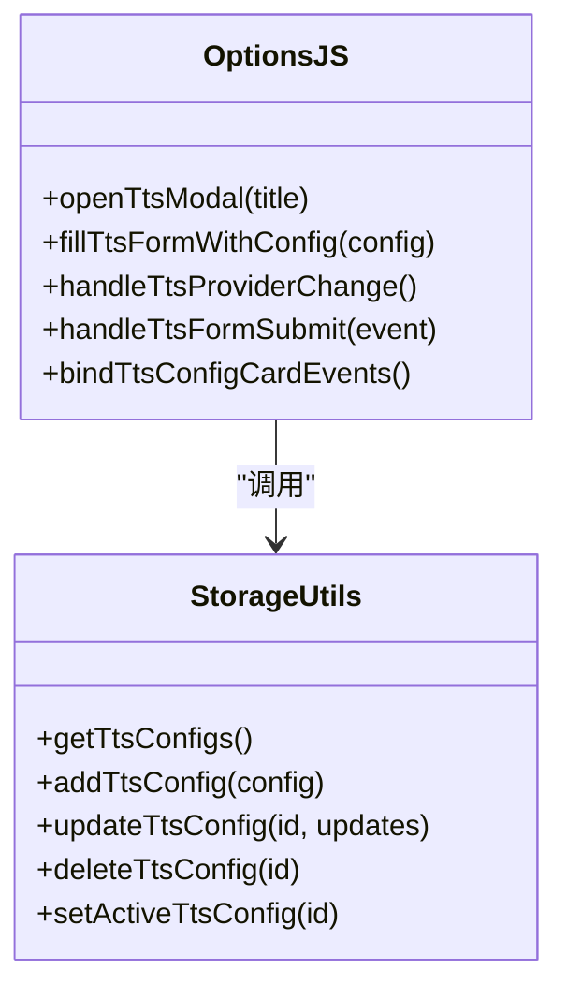
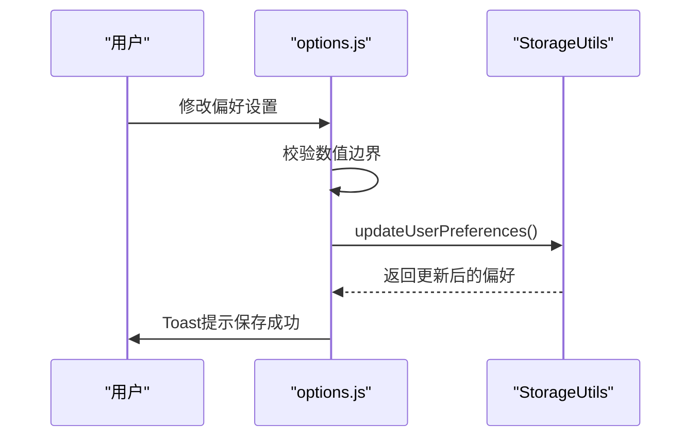
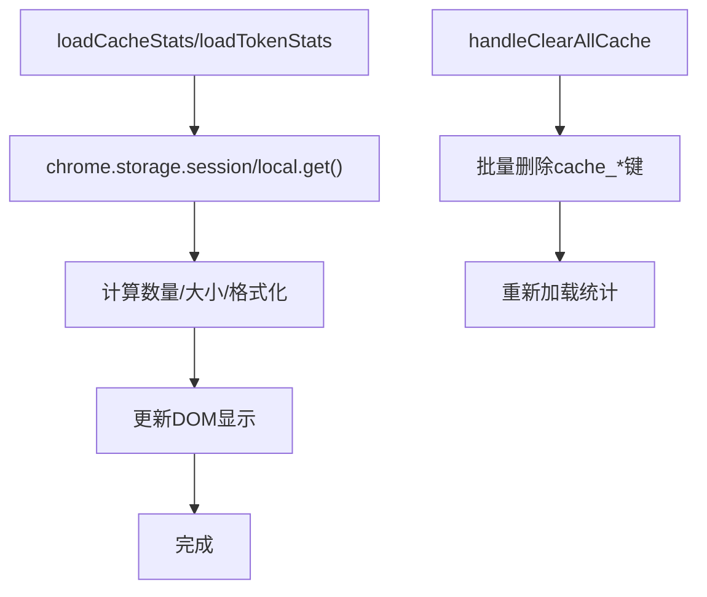
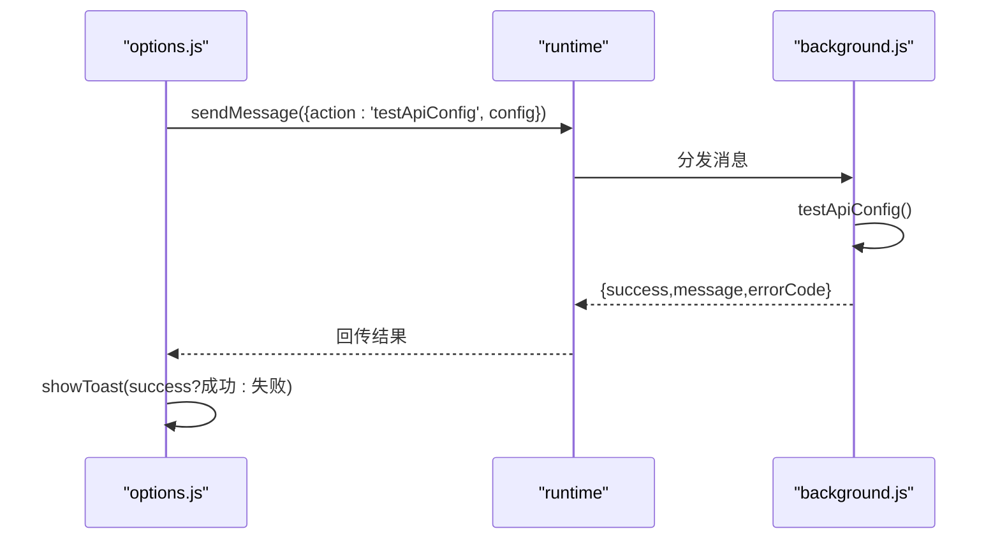
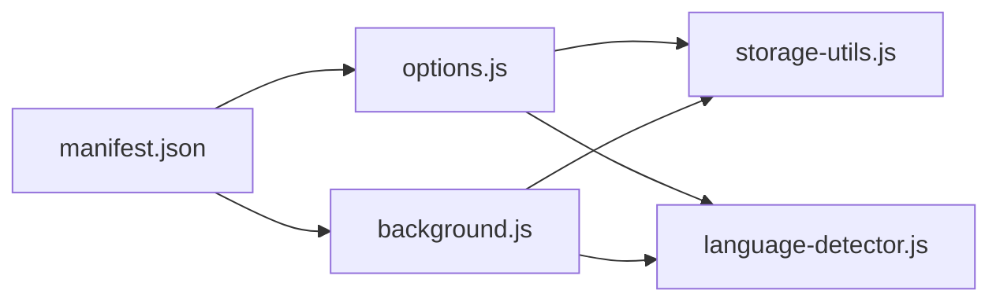

# 设置页面模块

<cite>
**本文引用的文件**
- [options.js](file://options.js)
- [options.html](file://options.html)
- [options.css](file://options.css)
- [storage-utils.js](file://storage-utils.js)
- [manifest.json](file://manifest.json)
- [background.js](file://background.js)
- [language-detector.js](file://language-detector.js)
</cite>

## 目录
1. [简介](#简介)
2. [项目结构](#项目结构)
3. [核心组件](#核心组件)
4. [架构总览](#架构总览)
5. [详细组件分析](#详细组件分析)
6. [依赖关系分析](#依赖关系分析)
7. [性能考量](#性能考量)
8. [故障排查指南](#故障排查指南)
9. [结论](#结论)
10. [附录](#附录)

## 简介
本文件面向 QuickTrans 插件的设置页面模块，系统性阐述 options.js 的用户配置界面逻辑，包括：
- 如何读取与持久化存储 API 配置列表（名称、API 端点、密钥、模型参数等）
- 支持用户添加、编辑、删除与激活特定配置
- TTS 语音设置的管理方式及与浏览器存储的集成
- 结合 options.html 与 options.css 的表单结构与样式设计
- 展示 chrome.storage API 的异步调用模式
- 配置测试功能（如 PING 检测）的实现原理
- 表单验证、用户输入 sanitization 与错误提示的最佳实践

## 项目结构
设置页面由三个核心文件组成：
- options.html：页面结构与表单布局
- options.css：样式与交互效果
- options.js：前端逻辑、事件绑定、与存储工具交互、UI 动态渲染与提示

图表来源
- [options.html](file://options.html#L1-L470)
- [options.css](file://options.css#L1-L800)
- [options.js](file://options.js#L1-L976)
- [storage-utils.js](file://storage-utils.js#L1-L517)
- [background.js](file://background.js#L1-L800)

章节来源
- [options.html](file://options.html#L1-L470)
- [options.css](file://options.css#L1-L800)
- [options.js](file://options.js#L1-L976)
- [storage-utils.js](file://storage-utils.js#L1-L517)
- [manifest.json](file://manifest.json#L1-L52)

## 核心组件
- 配置管理（翻译 API 与 TTS API）
  - 通过 StorageUtils 读取/保存配置，options.js 负责 UI 渲染与交互
- 用户偏好设置
  - 默认目标语言、显示模式、最大文本长度等，使用 chrome.storage.sync 持久化
- 缓存与 Token 统计
  - 使用 chrome.storage.session 管理翻译缓存；使用 chrome.storage.local 管理 Token 统计
- 表单验证与安全
  - 输入清洗（HTML 转义）、URL 校验、数值范围校验、敏感信息掩码
- 异步存储调用模式
  - 全部采用 async/await，保证 UI 与存储的一致性

章节来源
- [options.js](file://options.js#L1-L976)
- [storage-utils.js](file://storage-utils.js#L1-L517)

## 架构总览
设置页面的控制流如下：
- 页面加载后，options.js 初始化并调用 StorageUtils 获取配置与偏好
- 用户通过按钮触发添加/编辑/删除/激活操作
- 表单提交时进行前端校验，随后调用 StorageUtils 执行持久化
- TTS 配置支持多服务商（Qwen/OpenAI），根据选择动态显示字段
- 偏好设置变更即时保存至 chrome.storage.sync
- 缓存与 Token 统计通过 StorageUtils 读取并展示

图表来源
- [options.js](file://options.js#L1-L976)
- [storage-utils.js](file://storage-utils.js#L1-L517)
- [background.js](file://background.js#L1-L800)

## 详细组件分析

### 翻译 API 配置管理
- 读取与渲染
  - 通过 StorageUtils.getApiConfigs() 获取配置列表，若为空显示空状态，否则渲染为卡片网格
- 添加/编辑/删除/激活
  - 添加：首次配置自动激活；新增后刷新列表
  - 编辑：定位配置并回填表单，提交后更新并刷新
  - 删除：确认后删除并处理激活状态（若删除的是激活项，可能激活首个）
  - 激活：将目标配置设为激活，其他设为非激活
- 表单校验
  - 必填字段校验、URL 校验、temperature 数值范围校验
- 测试连接
  - 通过 chrome.runtime.sendMessage 触发 background.js 的 testApiConfig，返回成功/失败与错误码

图表来源
- [options.js](file://options.js#L344-L447)
- [storage-utils.js](file://storage-utils.js#L1-L144)

章节来源
- [options.js](file://options.js#L180-L447)
- [storage-utils.js](file://storage-utils.js#L1-L144)

### TTS API 配置管理
- 多服务商支持
  - 选择 Qwen 或 OpenAI 兼容端点，动态显示对应字段（模型、音色、格式等）
- 添加/编辑/删除/激活
  - 逻辑与翻译 API 类似，新增时根据 provider 注入默认字段
- 表单校验
  - 必填字段校验、URL 校验
- 服务商字段切换
  - handleTtsProviderChange 根据选择显示/隐藏对应组，同时更新端点提示文案

图表来源
- [options.js](file://options.js#L450-L731)
- [storage-utils.js](file://storage-utils.js#L146-L308)

章节来源
- [options.js](file://options.js#L450-L731)
- [storage-utils.js](file://storage-utils.js#L146-L308)

### 用户偏好设置
- 读取与迁移
  - 从 chrome.storage.sync 读取 userPreferences，兼容旧字段 autoShowPopup 并映射到 displayMode
- 变更保存
  - handlePreferenceChange 校验 maxTextLength 边界，保存 lastTargetLanguage、displayMode、autoShowPopup、maxTextLength
- 语言选项
  - 通过 LanguageDetector.getAllLanguages() 动态生成下拉选项

图表来源
- [options.js](file://options.js#L733-L785)
- [storage-utils.js](file://storage-utils.js#L310-L342)
- [language-detector.js](file://language-detector.js#L241-L247)

章节来源
- [options.js](file://options.js#L733-L785)
- [storage-utils.js](file://storage-utils.js#L310-L342)
- [language-detector.js](file://language-detector.js#L1-L263)

### 缓存与 Token 统计
- 缓存统计
  - 使用 chrome.storage.session 获取所有以 cache_ 开头的键，计算数量与大小
  - 支持刷新与清空缓存（批量删除）
- Token 统计
  - 使用 chrome.storage.local 存储 totalPromptTokens、totalCompletionTokens、totalTokens、requestCount、lastUpdated
  - 支持刷新与重置

图表来源
- [options.js](file://options.js#L830-L967)
- [storage-utils.js](file://storage-utils.js#L356-L517)

章节来源
- [options.js](file://options.js#L830-L967)
- [storage-utils.js](file://storage-utils.js#L356-L517)

### 表单结构与样式设计
- 表单结构
  - 翻译 API：名称、端点、密钥、模型、Temperature
  - TTS API：名称、服务商、端点、密钥、Qwen/OpenAI 特有字段
  - 偏好设置：默认目标语言、显示模式、最大文本长度
  - 缓存与 Token：统计展示与操作按钮
- 样式设计
  - 渐变背景、卡片式布局、模态框动画、按钮层级与悬停效果
  - 响应式设计，移动端适配

章节来源
- [options.html](file://options.html#L1-L470)
- [options.css](file://options.css#L1-L800)

### chrome.storage API 异步调用模式
- 本地持久化
  - 翻译/TTS 配置：chrome.storage.local
  - 用户偏好：chrome.storage.sync
  - 翻译缓存：chrome.storage.session（自动清理）
- 异步模式
  - 全部采用 async/await，避免阻塞 UI
  - 成功/失败均通过 Toast 提示，按钮禁用与文案切换提升可用性

章节来源
- [storage-utils.js](file://storage-utils.js#L1-L517)
- [options.js](file://options.js#L1-L976)

### 配置测试功能（PING 检测）
- 前端触发
  - handleTestConnection 从表单收集配置，进行温度范围校验，然后通过 chrome.runtime.sendMessage 发送 {action:'testApiConfig', config}
- 后台实现
  - background.js 的 TranslationService.testApiConfig 以简短提示词调用 callLLMAPI，返回成功/失败与错误码
- 结果呈现
  - options.js 根据返回 success/message 更新 Toast

图表来源
- [options.js](file://options.js#L403-L447)
- [background.js](file://background.js#L325-L350)

章节来源
- [options.js](file://options.js#L403-L447)
- [background.js](file://background.js#L325-L350)

### 表单验证、输入 sanitization 与错误提示最佳实践
- 输入清洗
  - escapeHtml 用于渲染用户输入，防止 XSS
  - maskApiKey 用于密钥显示，仅保留前后部分
- 校验策略
  - 必填字段校验、URL 校验、数值范围校验（temperature、maxTextLength）
  - 提示文案明确，Toast 类型区分 success/error/warning
- 错误处理
  - try/catch 包裹异步操作，finally 恢复按钮状态
  - 对 storage.session 满载等异常进行降级处理，避免崩溃

章节来源
- [options.js](file://options.js#L811-L829)
- [options.js](file://options.js#L800-L809)
- [storage-utils.js](file://storage-utils.js#L368-L385)

## 依赖关系分析
- 模块耦合
  - options.js 依赖 storage-utils.js 进行数据持久化；依赖 language-detector.js 生成语言选项
  - background.js 通过 importScripts 引入 storage-utils.js 与 language-detector.js
- 外部依赖
  - chrome.storage.* API（local/sync/session）
  - chrome.runtime.sendMessage 用于测试配置
- 权限
  - manifest.json 声明 storage 权限，确保设置页面与后台均可访问存储

图表来源
- [options.js](file://options.js#L1-L976)
- [storage-utils.js](file://storage-utils.js#L1-L517)
- [language-detector.js](file://language-detector.js#L1-L263)
- [manifest.json](file://manifest.json#L1-L52)

章节来源
- [manifest.json](file://manifest.json#L1-L52)

## 性能考量
- 存储访问
  - 批量读取与写入，避免频繁多次 set/get
  - session storage 自动清理，无需手动维护
- UI 响应
  - 表单提交与测试连接期间禁用按钮并切换文案，避免重复提交
  - Toast 自动隐藏，减少 DOM 操作
- 数据渲染
  - 列表渲染采用一次性 innerHTML 拼接，减少多次 DOM 操作

[本节为通用建议，不涉及具体文件分析]

## 故障排查指南
- 无法保存配置
  - 检查必填字段是否填写完整、URL 是否有效、temperature 是否在 0-2
  - 查看 Toast 错误提示，确认权限与网络
- 测试连接失败
  - 确认 API 端点、密钥、模型正确；查看后台返回的错误码（如 INVALID_API_KEY、RATE_LIMIT、TIMEOUT）
- 缓存/统计异常
  - 刷新统计或清空缓存；若 session 存储满载，Chrome 会自动清理，可忽略警告
- 偏好设置未生效
  - 确认 displayMode 与 autoShowPopup 的映射关系；检查 sync 存储是否被其他设备覆盖

章节来源
- [options.js](file://options.js#L344-L447)
- [options.js](file://options.js#L450-L731)
- [options.js](file://options.js#L830-L967)
- [storage-utils.js](file://storage-utils.js#L356-L517)
- [background.js](file://background.js#L325-L350)

## 结论
设置页面模块通过清晰的职责划分与完善的异步存储模式，实现了对翻译与 TTS 配置的全生命周期管理。前端负责直观的交互与校验，存储工具封装底层持久化细节，后台服务提供测试与调用能力。整体架构简洁、可维护性强，适合扩展更多配置项与服务提供商。

[本节为总结性内容，不涉及具体文件分析]

## 附录
- 代码示例路径（不展示具体代码）
  - 翻译 API 配置添加/更新：[options.js](file://options.js#L344-L401)
  - TTS 配置添加/更新：[options.js](file://options.js#L670-L731)
  - 测试连接触发与处理：[options.js](file://options.js#L403-L447)
  - 存储工具读取/保存配置：[storage-utils.js](file://storage-utils.js#L1-L144)
  - 用户偏好保存：[storage-utils.js](file://storage-utils.js#L310-L342)
  - 缓存统计与清空：[storage-utils.js](file://storage-utils.js#L356-L442)
  - Token 统计更新与重置：[storage-utils.js](file://storage-utils.js#L459-L517)
  - 后台测试配置实现：[background.js](file://background.js#L325-L350)