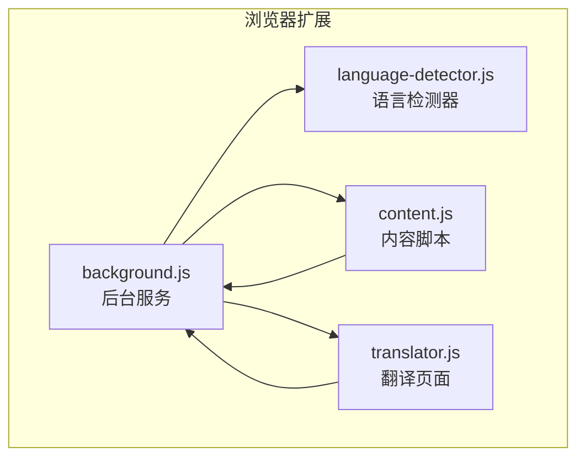
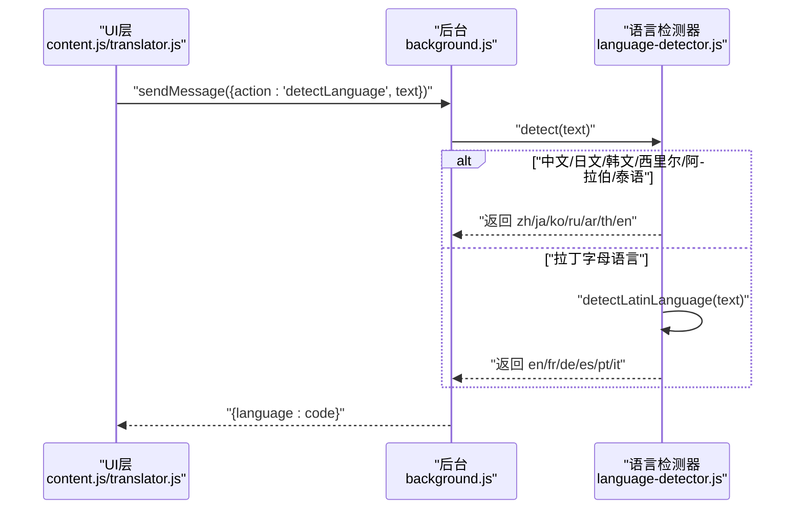
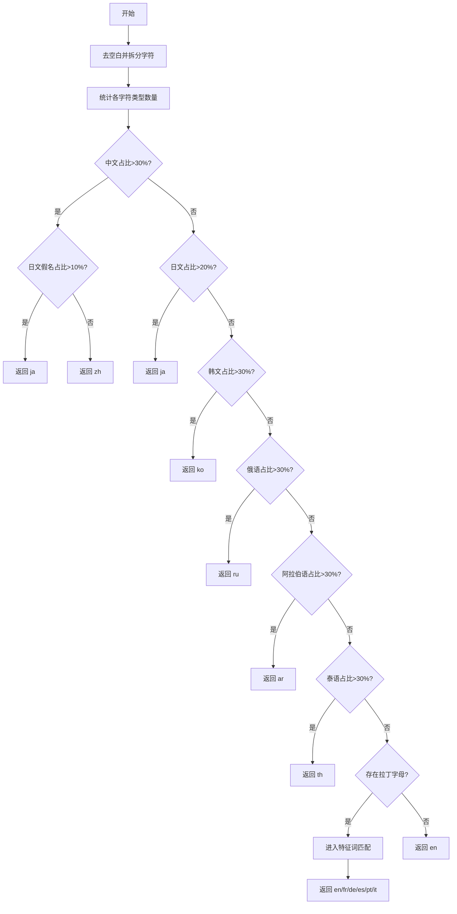
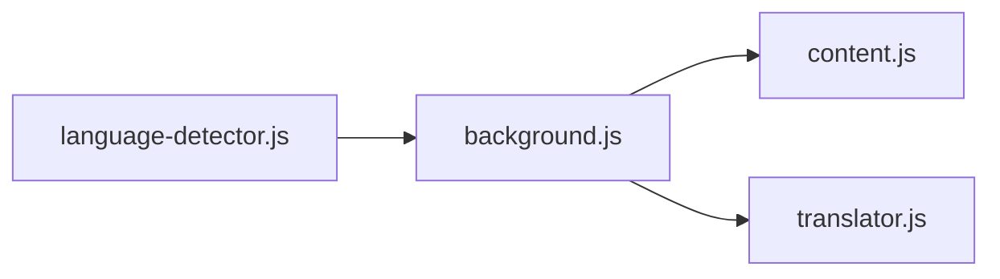

# 语言检测器模块

<cite>
**本文引用的文件**
- [language-detector.js](file://language-detector.js)
- [background.js](file://background.js)
- [content.js](file://content.js)
- [translator.js](file://translator.js)
- [manifest.json](file://manifest.json)
</cite>

## 目录
1. [简介](#简介)
2. [项目结构](#项目结构)
3. [核心组件](#核心组件)
4. [架构总览](#架构总览)
5. [详细组件分析](#详细组件分析)
6. [依赖关系分析](#依赖关系分析)
7. [性能考量](#性能考量)
8. [故障排查指南](#故障排查指南)
9. [结论](#结论)
10. [附录](#附录)

## 简介
本文件对 QuickTrans 项目中的语言检测器模块进行深入剖析，重点围绕 language-detector.js 的本地化语言识别算法展开，系统讲解其基于 Unicode 字符范围的快速判断逻辑、拉丁语族的特征词匹配机制、当前支持的 13 种语言及检测优先级、混合语言文本的处理策略、性能优化手段（如短路判断）、边界情况与测试建议，以及与远程语言检测 API 的对比优劣。

## 项目结构
语言检测器模块位于根目录，被多个入口脚本调用：
- background.js：后台服务脚本，负责翻译、TTS、消息分发，其中包含语言检测的 RPC 接口。
- content.js：内容脚本，负责划词监听、图标显示、弹窗交互，调用后台进行语言检测。
- translator.js：翻译页面脚本，负责页面交互、剪贴板读取、翻译流程，同样调用语言检测器。
- manifest.json：声明权限与背景脚本，确保语言检测器可被导入使用。

图表来源
- [background.js](file://background.js#L1-L120)
- [content.js](file://content.js#L185-L234)
- [translator.js](file://translator.js#L185-L203)
- [language-detector.js](file://language-detector.js#L1-L263)

章节来源
- [manifest.json](file://manifest.json#L1-L52)

## 核心组件
- 语言检测器 LanguageDetector：提供 detect(text) 主方法，返回语言代码；提供 detectLatinLanguage(text) 用于拉丁语族细粒度判断；提供语言名称查询、支持语言列表、支持性检查等辅助方法。
- 调用链路：content.js 与 translator.js 通过 chrome.runtime.sendMessage 触发后台 background.js 的 detectLanguage 请求；后台调用 LanguageDetector.detect 并返回结果。

章节来源
- [language-detector.js](file://language-detector.js#L1-L263)
- [background.js](file://background.js#L1004-L1009)
- [content.js](file://content.js#L190-L205)
- [translator.js](file://translator.js#L188-L193)

## 架构总览
语言检测器采用“字符统计 + 特征词匹配”的两级判定策略：
- 一级判定：遍历文本字符，依据 Unicode 范围统计各类字符占比，快速排除或粗判语言。
- 二级判定：若为拉丁字母语言，进入特征词匹配阶段，比较多语言高频词得分，择优返回。

图表来源
- [background.js](file://background.js#L1004-L1009)
- [language-detector.js](file://language-detector.js#L31-L141)
- [language-detector.js](file://language-detector.js#L149-L227)

## 详细组件分析

### 1) Unicode 字符范围判定逻辑
- 输入预处理：去除首尾空白，按字符拆分，仅统计“实际文字”字符（排除空白与标点）。
- 字符统计：统计中文（CJK统一汉字、扩展A、扩展B）、日文假名（平假名、片假名）、韩文（Hangul、Jamo、兼容片假名）、西里尔（俄语等）、阿拉伯（阿拉伯、补充）、泰语、拉丁字母、其他。
- 判定优先级（按顺序）：
  - 中文占比 > 30%：若同时日文假名占比 > 10%，返回日语；否则返回中文。
  - 日文占比 > 20%：返回日语。
  - 韩文占比 > 30%：返回韩语。
  - 俄语占比 > 30%：返回俄语。
  - 阿拉伯语占比 > 30%：返回阿拉伯语。
  - 泰语占比 > 30%：返回泰语。
  - 若存在拉丁字母：进入特征词匹配阶段。
  - 默认返回英语。

图表来源
- [language-detector.js](file://language-detector.js#L31-L141)
- [language-detector.js](file://language-detector.js#L149-L227)

章节来源
- [language-detector.js](file://language-detector.js#L31-L141)
- [language-detector.js](file://language-detector.js#L149-L227)

### 2) 特征词匹配机制（拉丁语族）
- 适用场景：当文本包含拉丁字母且需在英语、法语、德语、西班牙语、葡萄牙语、意大利语之间做精细区分。
- 匹配策略：
  - 将文本转小写，统计各语言高频词出现次数（得分）。
  - 选择最高分语言作为候选。
  - 英语特殊处理：若英语得分 ≥ 3 且 ≥ 最高分 × 0.7，优先返回英语。
  - 若最高分语言得分 < 4，回退为英语。
- 作用：显著降低英语与法语、德语、西班牙语等之间的误判概率。

章节来源
- [language-detector.js](file://language-detector.js#L149-L227)

### 3) 当前支持的 13 种语言与检测优先级
- 支持语言列表（代码、名称、原生名）：
  - zh：中文
  - en：英语
  - ja：日语
  - ko：韩语
  - fr：法语
  - de：德语
  - es：西班牙语
  - ru：俄语
  - ar：阿拉伯语
  - pt：葡萄牙语
  - it：意大利语
  - th：泰语
  - vi：越南语
- 优先级排序（由高到低）：
  1) 中文（占比阈值 30%，日文假名特判）
  2) 日语（占比阈值 20%）
  3) 韩语（占比阈值 30%）
  4) 俄语（占比阈值 30%）
  5) 阿拉伯语（占比阈值 30%）
  6) 泰语（占比阈值 30%）
  7) 拉丁语族（英语、法语、德语、西班牙语、葡萄牙语、意大利语）：先按特征词得分，再按英语特殊规则与阈值回退。
  8) 默认英语

章节来源
- [language-detector.js](file://language-detector.js#L10-L24)
- [language-detector.js](file://language-detector.js#L96-L141)
- [language-detector.js](file://language-detector.js#L149-L227)

### 4) 混合语言文本处理策略
- Unicode 层面：对中文、日文、韩文、西里尔、阿拉伯、泰语等字符分别统计，按占比阈值进行粗判；中文与日文存在“汉字重叠”，通过日文假名占比进行二次校正，避免将含日文汉字的文本误判为中文。
- 拉丁语族：若存在拉丁字母，进入特征词匹配阶段，通过高频词得分与阈值策略进行精细区分。
- 结论：该策略在“中日混杂”“拉丁语族混杂”等场景下具备一定鲁棒性，但仍可能受噪声词影响，建议结合业务场景增加上下文清洗或更严格的阈值。

章节来源
- [language-detector.js](file://language-detector.js#L96-L141)
- [language-detector.js](file://language-detector.js#L149-L227)

### 5) 性能优化手段（短路判断）
- 输入预处理：仅保留“实际文字”字符，避免空白与标点参与统计，降低循环与比较成本。
- 比例阈值短路：一旦某语言占比超过阈值，立即返回，避免继续统计其他语言。
- 特征词匹配短路：在 detectLatinLanguage 中，先统计各语言得分，再一次性比较最高分与阈值，避免多次扫描。
- 适用性：对短文本与长文本均友好，适合浏览器扩展的实时交互场景。

章节来源
- [language-detector.js](file://language-detector.js#L31-L141)
- [language-detector.js](file://language-detector.js#L149-L227)

### 6) 边界情况与测试建议
- 空文本/纯空白：返回英语。
- 仅包含标点/数字/符号：total 为 0，返回英语。
- 仅包含拉丁字母但无高频词：detectLatinLanguage 回退为英语。
- 中文与日文混杂：若中文占比高但日文假名占比也高，返回日语；反之返回中文。
- 仅包含少量目标字符：可能因占比不足而回退为英语，建议在 UI 层提示“置信度较低”。

测试建议（基于现有实现的可验证行为）：
- 空字符串与纯空白：期望返回 en。
- 仅拉丁字母且无高频词：期望返回 en。
- 仅包含法语高频词：期望返回 fr。
- 仅包含德语高频词：期望返回 de。
- 仅包含西班牙语高频词：期望返回 es。
- 仅包含葡萄牙语高频词：期望返回 pt。
- 仅包含意大利语高频词：期望返回 it。
- 中文文本（含少量日文假名）：中文占比>30% 且日文假名占比>10% → 返回 ja；否则返回 zh。
- 仅包含韩文字符：期望返回 ko。
- 仅包含西里尔字符：期望返回 ru。
- 仅包含阿拉伯字符：期望返回 ar。
- 仅包含泰文字符：期望返回 th。
- 仅包含越南语字符：当前未内置越南语特征词，可能回退为英语或按占比阈值返回（建议补充特征词以提升准确率）。

章节来源
- [language-detector.js](file://language-detector.js#L31-L141)
- [language-detector.js](file://language-detector.js#L149-L227)

### 7) 与远程语言检测 API 的对比
- 优点
  - 本地化：无需网络请求，毫秒级响应，适合浏览器扩展的即时交互。
  - 隐私安全：文本不出域，不依赖第三方 API。
  - 成本可控：无 API 调用费用。
- 局限
  - 依赖 Unicode 与特征词规则，对复杂混合语言、领域专用术语、噪声较多的文本，准确率可能不及基于深度学习的远程 API。
  - 对新语言或小语种支持有限，需手动扩充特征词库。
- 建议
  - 在本地检测器基础上，对置信度较低或边界案例，可考虑回退至远程 API 进行二次确认。
  - 对越语等语言，建议补充特征词以提升准确率。

章节来源
- [language-detector.js](file://language-detector.js#L149-L227)

## 依赖关系分析
- 模块内聚与耦合
  - LanguageDetector 内部自包含，对外暴露静态方法，内聚度高。
  - content.js 与 translator.js 通过 background.js 的 RPC 接口间接依赖 LanguageDetector，耦合度低。
- 外部依赖
  - 无外部依赖，纯本地实现。
- 潜在风险
  - 特征词库维护成本较高，需随语言演进持续更新。
  - Unicode 范围覆盖需与实际文本分布匹配，避免误判。

图表来源
- [background.js](file://background.js#L1004-L1009)
- [content.js](file://content.js#L190-L205)
- [translator.js](file://translator.js#L188-L193)

章节来源
- [background.js](file://background.js#L1004-L1009)
- [content.js](file://content.js#L185-L234)
- [translator.js](file://translator.js#L185-L203)

## 性能考量
- 时间复杂度
  - Unicode 统计：O(n)，n 为字符数。
  - 特征词匹配：O(k)，k 为特征词数量（常数级）。
  - 总体 O(n)，线性可扩展。
- 空间复杂度
  - 统计数组与临时变量常量级，空间开销极小。
- 优化点
  - 输入预处理过滤空白与标点，减少无效字符参与统计。
  - 比例阈值短路，避免不必要的后续判断。
  - 特征词匹配一次性比较最高分与阈值，避免重复扫描。

[本节为通用性能讨论，不直接分析具体文件]

## 故障排查指南
- 症状：检测结果总是英语
  - 可能原因：文本中拉丁字母极少或无高频词；或占比阈值不足。
  - 建议：检查输入文本是否包含拉丁字母；确认特征词库是否覆盖目标语言。
- 症状：中文与日文混杂文本误判
  - 可能原因：中文占比高但日文假名占比未达到阈值。
  - 建议：在 UI 层提示“置信度较低”，允许用户手动选择语言。
- 症状：越语文本准确率低
  - 可能原因：未内置越语特征词。
  - 建议：补充越语高频词，或在边界情况下回退至远程 API。

章节来源
- [language-detector.js](file://language-detector.js#L96-L141)
- [language-detector.js](file://language-detector.js#L149-L227)

## 结论
language-detector.js 采用“Unicode 字符范围 + 特征词匹配”的双层策略，在浏览器扩展场景下实现了快速、本地化的语言识别。其短路判断与阈值设计兼顾性能与准确性，适用于大多数日常文本场景。对于混合语言、小语种与噪声较多的文本，建议结合 UI 提示与远程 API 进行二次确认，以进一步提升体验与准确率。

[本节为总结性内容，不直接分析具体文件]

## 附录

### A. 调用链路与消息协议
- content.js/translator.js 发送消息：{ action: 'detectLanguage', text }
- background.js 接收并调用 LanguageDetector.detect，返回 { language: code }

章节来源
- [content.js](file://content.js#L190-L205)
- [translator.js](file://translator.js#L188-L193)
- [background.js](file://background.js#L1004-L1009)

### B. 语言名称与支持查询
- LanguageDetector.getLanguageName(code, useNative=false)：返回语言名称或原生名称。
- LanguageDetector.getAllLanguages()：返回支持语言列表。
- LanguageDetector.isSupported(code)：判断是否支持。

章节来源
- [language-detector.js](file://language-detector.js#L230-L257)