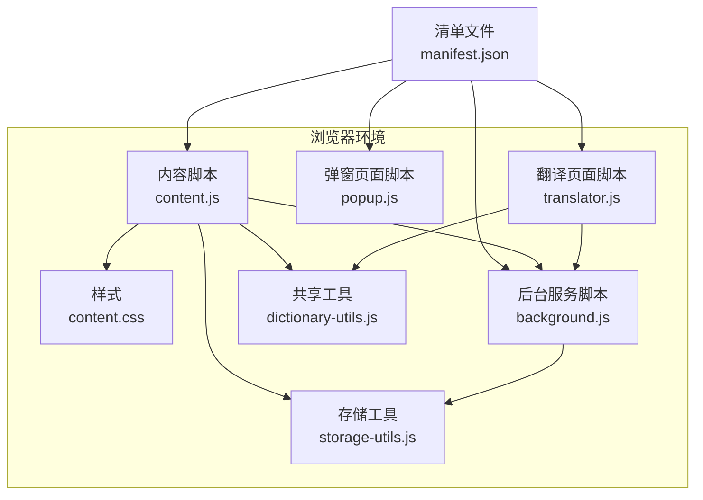
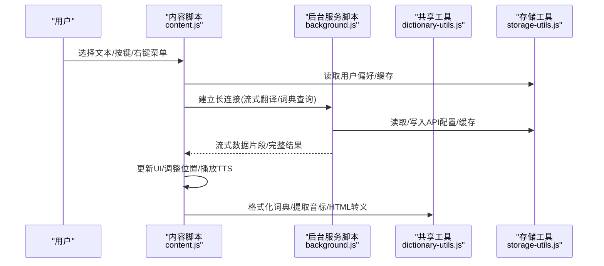
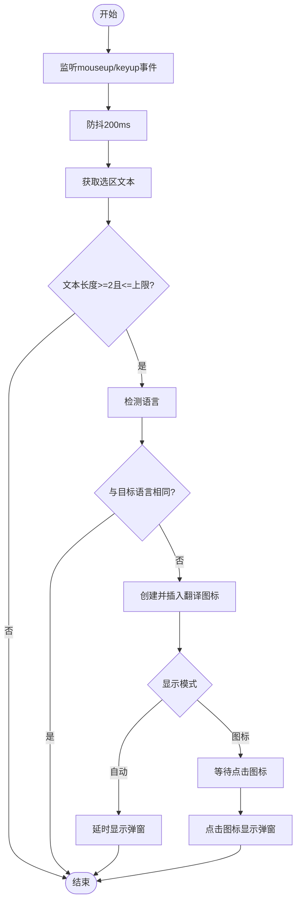
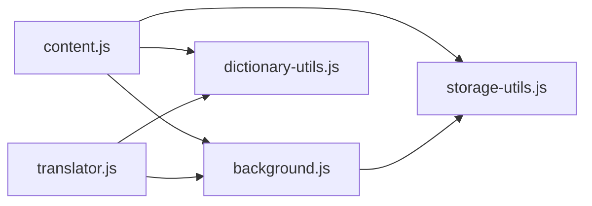

# 兼容性问题

<cite>
**本文引用的文件**
- [content.js](file://content.js)
- [content.css](file://content.css)
- [manifest.json](file://manifest.json)
- [background.js](file://background.js)
- [dictionary-utils.js](file://dictionary-utils.js)
- [storage-utils.js](file://storage-utils.js)
- [popup.js](file://popup.js)
- [translator.js](file://translator.js)
</cite>

## 目录
1. [简介](#简介)
2. [项目结构](#项目结构)
3. [核心组件](#核心组件)
4. [架构总览](#架构总览)
5. [详细组件分析](#详细组件分析)
6. [依赖关系分析](#依赖关系分析)
7. [性能考量](#性能考量)
8. [故障排查指南](#故障排查指南)
9. [结论](#结论)
10. [附录](#附录)

## 简介
本文件聚焦于“插件在特定网站无法正常使用”的兼容性问题，结合代码实现分析可能原因（如CSP限制、DOM结构特殊、页面加载方式为SPA动态加载、CSS样式冲突等），并解释 content.js 如何注入与监听文本选择事件、content.css 如何确保UI正确显示；同时提供可操作的排查步骤与建议。

## 项目结构
QuickTrans 插件采用 Manifest V3 架构，核心由内容脚本、样式、后台服务脚本、共享工具与选项页组成。内容脚本负责在目标页面注入图标与弹窗、监听文本选择与右键菜单翻译；样式文件保证UI在各种站点中稳定呈现；后台服务脚本通过长连接提供流式翻译与词典查询能力；共享工具提供词典格式化、TTS辅助与通用判断逻辑；存储工具提供用户偏好、API配置与缓存管理。

图表来源
- [manifest.json](file://manifest.json#L1-L52)
- [content.js](file://content.js#L1-L1423)
- [content.css](file://content.css#L1-L620)
- [background.js](file://background.js#L1-L1143)
- [dictionary-utils.js](file://dictionary-utils.js#L1-L237)
- [storage-utils.js](file://storage-utils.js#L1-L517)
- [popup.js](file://popup.js#L1-L36)
- [translator.js](file://translator.js#L1-L1200)

章节来源
- [manifest.json](file://manifest.json#L1-L52)

## 核心组件
- 内容脚本（content.js）：监听文本选择与键盘事件，注入翻译图标与弹窗，处理拖拽、复制、TTS播放等交互；通过长连接与后台通信，支持流式翻译与词典查询。
- 样式（content.css）：定义图标与弹窗的视觉与行为，包括动画、滚动条、响应式适配、词典模式特有样式等。
- 后台服务脚本（background.js）：管理API配置、缓存、流式响应处理、TTS合成与播放；维护词典查询与翻译的长连接。
- 共享工具（dictionary-utils.js）：提供词典结果格式化、音标提取、HTML转义、单词判断等。
- 存储工具（storage-utils.js）：统一管理用户偏好、API/TTS配置、缓存与token统计。
- 弹窗/翻译页面脚本（popup.js、translator.js）：提供入口交互与TTS播放（Web Audio API绕过CSP限制）。

章节来源
- [content.js](file://content.js#L1-L1423)
- [content.css](file://content.css#L1-L620)
- [background.js](file://background.js#L1-L1143)
- [dictionary-utils.js](file://dictionary-utils.js#L1-L237)
- [storage-utils.js](file://storage-utils.js#L1-L517)
- [popup.js](file://popup.js#L1-L36)
- [translator.js](file://translator.js#L1-L1200)

## 架构总览
内容脚本在页面加载末尾注入，监听用户交互并创建UI元素；后台服务脚本通过长连接提供流式能力；共享工具与存储工具贯穿前后端，保障一致性与稳定性。

图表来源
- [content.js](file://content.js#L1-L1423)
- [background.js](file://background.js#L700-L1143)
- [dictionary-utils.js](file://dictionary-utils.js#L1-L237)
- [storage-utils.js](file://storage-utils.js#L1-L517)

## 详细组件分析

### 文本选择与图标/弹窗注入机制（content.js）
- 注入时机与运行范围
  - 清单中 content_scripts 在 document_end 时运行，对所有帧生效，适合大多数静态页面与部分SPA场景。
  - 若目标站点为严格SPA（如单页应用在路由切换时不重建DOM），需考虑监听路由变化或使用 MutationObserver 等增强方案（当前实现未内置）。
- 事件监听
  - 监听鼠标抬起与键盘事件，防抖处理，过滤极短或超长文本，避免误触发。
  - 右键菜单翻译时记录鼠标位置，若为(0,0)则回退到视口中心定位。
- 图标与弹窗
  - 图标使用绝对定位，z-index极高，确保覆盖页面元素；点击图标显示弹窗。
  - 弹窗使用固定定位，动态计算最大高度与可视区域边界，避免遮挡与溢出。
  - 支持拖拽移动，拖拽时禁用过渡动画，拖拽结束后恢复。
- 语言检测与显示模式
  - 发送消息至后台检测语言，若与目标语言相同则不显示图标。
  - 根据用户偏好决定自动显示弹窗或仅显示图标。

图表来源
- [content.js](file://content.js#L120-L234)

章节来源
- [content.js](file://content.js#L1-L1423)
- [manifest.json](file://manifest.json#L19-L26)

### 样式体系与UI渲染（content.css）
- 图标样式
  - 使用渐变背景、圆角、阴影与缩放动画，z-index最高，确保在复杂页面层级中可见。
  - hover放大与阴影增强交互反馈。
- 弹窗样式
  - 固定定位、最大宽高、弹性布局、滚动区域、响应式适配。
  - 词典模式与普通翻译模式分别提供主题色与结构差异。
  - 滚动条自定义，提升阅读体验。
- 动画与过渡
  - 弹窗滑入动画与图标缩放动画，提升交互流畅度。
- 与第三方样式冲突
  - 高z-index与明确的类名前缀有助于降低冲突概率；若仍出现遮挡或错位，可检查站点自身样式优先级或在站点侧增加更严格的隔离策略（如Shadow DOM或iframe，但本实现未采用）。

章节来源
- [content.css](file://content.css#L1-L620)

### 后台服务脚本与长连接（background.js）
- 流式翻译
  - 使用SSE/流式接口，分片推送增量文本，实时更新UI；支持token统计与usage信息。
- 词典查询
  - 支持带上下文的词典查询，提取上下文翻译；缓存键包含上下文哈希，避免误命中。
- API配置与错误处理
  - 统一处理401/429/5xx等错误，返回标准化错误码与提示；支持超时控制。
- TTS合成
  - 支持通义与OpenAI两种TTS提供商，统一返回Base64音频数据；后台负责流式解析与聚合。

章节来源
- [background.js](file://background.js#L1-L1143)

### 共享工具与存储（dictionary-utils.js、storage-utils.js）
- 词典工具
  - Markdown到HTML的格式化、音标提取、HTML转义、单词判断等，供内容脚本与翻译页面复用。
- 存储工具
  - API/TTS配置管理、用户偏好、缓存（session自动清理）、token统计等，统一接口简化调用。

章节来源
- [dictionary-utils.js](file://dictionary-utils.js#L1-L237)
- [storage-utils.js](file://storage-utils.js#L1-L517)

### 弹窗/翻译页面（popup.js、translator.js）
- 弹窗页面脚本
  - 打开翻译页面或设置页面，窗口关闭。
- 翻译页面脚本
  - 处理TTS播放，使用Web Audio API绕过CSP限制，避免因站点CSP导致的音频播放失败。

章节来源
- [popup.js](file://popup.js#L1-L36)
- [translator.js](file://translator.js#L821-L890)

## 依赖关系分析
- 内容脚本依赖
  - 与后台服务脚本通过长连接通信，依赖存储工具读取用户偏好与缓存。
  - 与共享工具协作进行词典格式化、音标提取与HTML转义。
- 后台服务脚本依赖
  - 依赖存储工具管理配置与缓存；依赖语言检测模块（importScripts引入）。
- 翻译页面依赖
  - 依赖后台服务脚本进行TTS合成；依赖共享工具进行格式化与转义。

图表来源
- [content.js](file://content.js#L1-L1423)
- [background.js](file://background.js#L1-L1143)
- [dictionary-utils.js](file://dictionary-utils.js#L1-L237)
- [storage-utils.js](file://storage-utils.js#L1-L517)
- [translator.js](file://translator.js#L1-L1200)

## 性能考量
- 流式渲染
  - 通过长连接增量更新UI，减少一次性DOM操作，提升交互响应速度。
- 缓存策略
  - 使用session存储缓存翻译结果，浏览器自动清理，避免长期占用空间。
- 防抖与边界检测
  - 文本选择事件防抖与弹窗位置边界检测，降低不必要的重绘与布局抖动。
- TTS播放
  - 使用Web Audio API绕过CSP限制，避免因站点策略导致的播放失败。

[本节为通用指导，不直接分析具体文件]

## 故障排查指南

### 一、常见兼容性问题与定位思路
- 网站CSP（内容安全策略）限制
  - 现象：音频播放失败、外部资源加载受限、某些脚本/样式被阻止。
  - 排查要点：
    - 检查站点是否限制媒体播放或外部资源访问；插件侧已通过Web Audio API绕过CSP限制进行TTS播放。
    - 若仍失败，尝试在站点允许的范围内调整播放方式或更换API端点。
  - 参考实现路径：
    - [content.js](file://content.js#L834-L891)
    - [translator.js](file://translator.js#L821-L890)

- DOM结构特殊或页面加载方式为SPA动态加载
  - 现象：图标不出现、弹窗位置异常、事件监听失效。
  - 排查要点：
    - 清单中 content_scripts 在 document_end 时运行并对所有帧生效；若站点为严格SPA，建议在路由切换时主动触发初始化或监听DOM变化。
    - 检查是否存在iframe隔离、Shadow DOM封装导致内容脚本无法访问；必要时在站点侧放宽隔离或采用iframe注入策略（本实现未内置）。
  - 参考实现路径：
    - [manifest.json](file://manifest.json#L19-L26)
    - [content.js](file://content.js#L1-L1423)

- CSS样式冲突
  - 现象：图标/弹窗被遮挡、字体/颜色异常、滚动条样式被覆盖。
  - 排查要点：
    - 插件使用高z-index与明确类名前缀，尽量降低冲突；若仍冲突，可在站点侧提高自身样式优先级或隔离。
  - 参考实现路径：
    - [content.css](file://content.css#L1-L620)

- 事件监听不生效
  - 现象：无法通过划词触发、右键菜单翻译无效。
  - 排查要点：
    - 检查是否处于“右键菜单模式”；确认防抖阈值与文本长度限制；确认鼠标位置记录逻辑（PDF等特殊页面可能为(0,0)）。
  - 参考实现路径：
    - [content.js](file://content.js#L120-L234)

### 二、可操作排查步骤
- 基础检查
  - 刷新页面，确认内容脚本已加载（控制台日志与图标/弹窗是否出现）。
  - 检查用户偏好设置（显示模式、目标语言、最大文本长度）。
- 元素注入检查
  - 在开发者工具中确认是否存在 .ai-translate-icon 与 .ai-translate-popup 节点；检查其样式与层级。
- 样式生效检查
  - 检查 content.css 是否被加载；对比本地样式与站点样式优先级。
- 事件监听检查
  - 观察mouseup/keyup事件是否触发；查看防抖逻辑与文本长度过滤。
- 弹窗位置与拖拽
  - 确认弹窗是否超出视口边界；尝试拖拽移动；检查最大高度与margin设置。
- TTS播放
  - 若站点CSP限制音频播放，插件已使用Web Audio API绕过；若仍失败，检查API配置与网络状态。
- SPA场景
  - 若为单页应用，确认路由切换后内容脚本是否重新初始化；必要时在站点侧主动触发初始化。

### 三、建议与最佳实践
- 用户可尝试的操作
  - 刷新页面、切换显示模式、调整最大文本长度、更换目标语言、清理缓存后重试。
  - 若问题持续，收集具体网站信息（域名、页面类型、是否SPA、CSP策略摘要）以便进一步分析。
- 开发者可优化方向
  - 在内容脚本中增加路由监听与DOM变化观察，提升SPA兼容性。
  - 提供更灵活的注入时机与作用域配置（如仅主框架或全部帧）。

章节来源
- [content.js](file://content.js#L1-L1423)
- [content.css](file://content.css#L1-L620)
- [manifest.json](file://manifest.json#L19-L26)
- [background.js](file://background.js#L1-L1143)
- [storage-utils.js](file://storage-utils.js#L1-L517)

## 结论
QuickTrans 在内容脚本注入、事件监听、UI渲染与后台流式通信方面具备良好实现；对于CSP限制、SPA动态加载、DOM结构特殊与CSS冲突等兼容性问题，可通过调整注入时机、样式优先级、事件监听策略与播放方式等手段缓解。建议用户在遇到问题时先按排查步骤定位，再根据网站特性补充针对性措施或提供具体信息协助分析。

[本节为总结性内容，不直接分析具体文件]

## 附录
- 相关实现路径参考
  - [content.js](file://content.js#L1-L1423)
  - [content.css](file://content.css#L1-L620)
  - [manifest.json](file://manifest.json#L19-L26)
  - [background.js](file://background.js#L1-L1143)
  - [dictionary-utils.js](file://dictionary-utils.js#L1-L237)
  - [storage-utils.js](file://storage-utils.js#L1-L517)
  - [popup.js](file://popup.js#L1-L36)
  - [translator.js](file://translator.js#L821-L890)