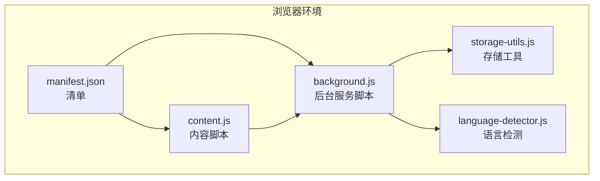
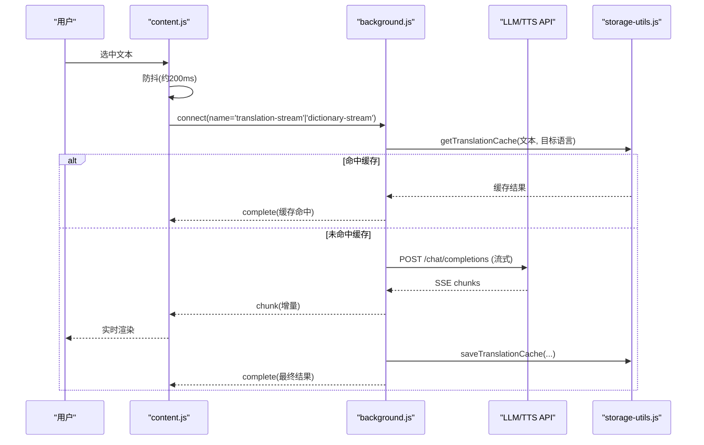
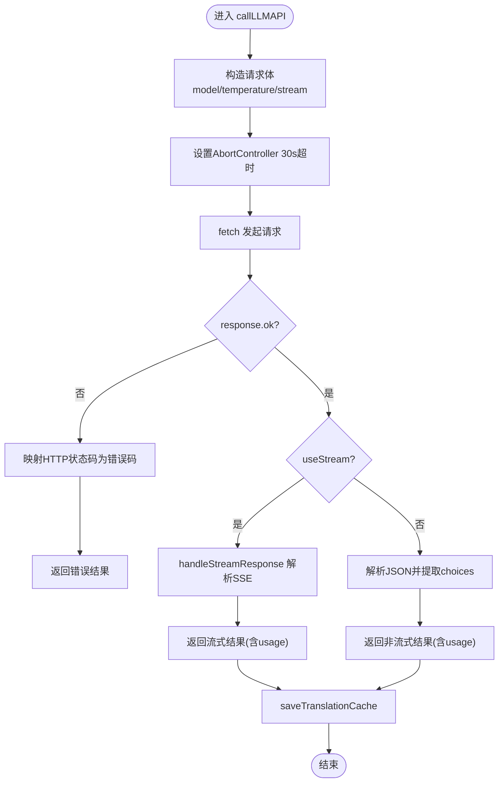
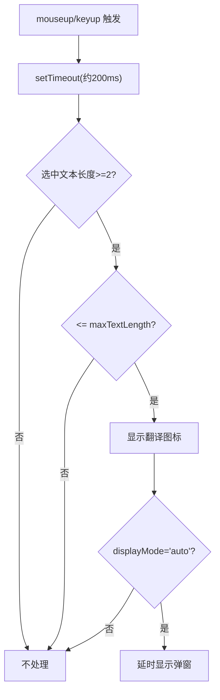
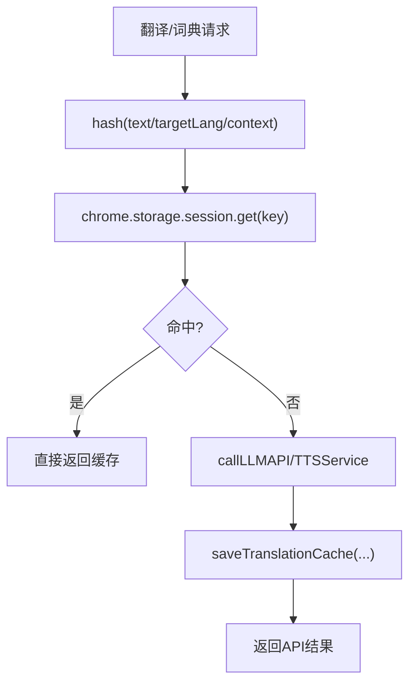
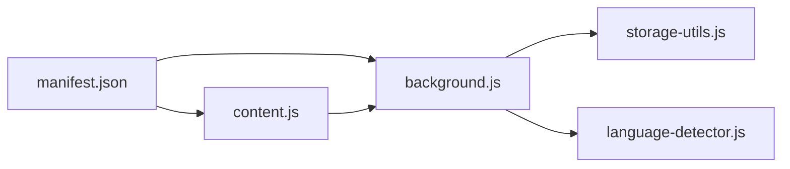

# 性能问题

<cite>
**本文引用的文件**
- [background.js](file://background.js)
- [content.js](file://content.js)
- [storage-utils.js](file://storage-utils.js)
- [manifest.json](file://manifest.json)
- [options.js](file://options.js)
- [language-detector.js](file://language-detector.js)
</cite>

## 目录
1. [简介](#简介)
2. [项目结构](#项目结构)
3. [核心组件](#核心组件)
4. [架构总览](#架构总览)
5. [详细组件分析](#详细组件分析)
6. [依赖关系分析](#依赖关系分析)
7. [性能考量](#性能考量)
8. [故障排查指南](#故障排查指南)
9. [结论](#结论)
10. [附录](#附录)

## 简介
本指南聚焦于“翻译速度慢”“响应延迟”等性能问题，结合代码实现，系统分析影响性能的关键因素（API响应时间、网络延迟、文本长度、缓存命中率），并解释 background.js 中请求超时设置与 content.js 中防抖机制的工作原理。同时提供优化建议与监控方法，帮助用户通过 Service Worker 日志与浏览器网络面板定位瓶颈。

## 项目结构
QuickTrans 采用 Manifest V3 架构，核心由三部分组成：
- Content Script：负责划词监听、弹窗展示与流式翻译/词典查询的前端交互
- Background（Service Worker）：负责与 LLM/TTS API 通信、缓存管理、错误处理与流式数据转发
- Options 页面：配置 API、TTS、用户偏好与缓存统计

图表来源
- [manifest.json](file://manifest.json#L1-L52)
- [content.js](file://content.js#L1-L120)
- [background.js](file://background.js#L1-L120)
- [storage-utils.js](file://storage-utils.js#L1-L120)
- [language-detector.js](file://language-detector.js#L1-L60)

章节来源
- [manifest.json](file://manifest.json#L1-L52)

## 核心组件
- 翻译服务（后台）：封装 LLM API 调用、流式处理、超时控制、错误分类与缓存写入
- 词典服务（后台）：基于 Port 的词典查询流式处理，支持上下文翻译
- 内容脚本（前台）：划词监听、防抖、弹窗渲染、流式接收与 UI 更新
- 存储工具：session 缓存、token 统计、用户偏好
- 语言检测：本地快速语言识别，减少不必要的 API 调用

章节来源
- [background.js](file://background.js#L46-L121)
- [content.js](file://content.js#L132-L181)
- [storage-utils.js](file://storage-utils.js#L356-L422)
- [language-detector.js](file://language-detector.js#L26-L141)

## 架构总览
整体流程：用户划词 → 内容脚本发起 Port 流式连接 → 后台 Service Worker 检查缓存 → 若未命中则调用 LLM API → 流式返回数据 → 前台逐步渲染 → 成功后写入缓存并更新 token 统计。

图表来源
- [content.js](file://content.js#L146-L181)
- [content.js](file://content.js#L615-L728)
- [background.js](file://background.js#L866-L983)
- [background.js](file://background.js#L211-L323)
- [storage-utils.js](file://storage-utils.js#L356-L422)

## 详细组件分析

### 背景服务（background.js）性能要点
- 请求超时：fetch 使用 AbortController，在 30 秒内未完成则主动中断，避免长时间挂起
- 错误分类：针对 401、429、500/503 等状态码返回明确错误码，便于前端快速提示与重试策略
- 流式处理：SSE 分块解析，增量回传，降低首字延迟
- 缓存写入：成功后写入 session 缓存，命中率提升显著
- Token 统计：若 API 返回 usage，写入本地统计，便于成本控制

图表来源
- [background.js](file://background.js#L211-L323)
- [background.js](file://background.js#L139-L201)
- [storage-utils.js](file://storage-utils.js#L356-L422)

章节来源
- [background.js](file://background.js#L211-L323)
- [background.js](file://background.js#L139-L201)
- [storage-utils.js](file://storage-utils.js#L356-L422)

### 内容脚本（content.js）性能要点
- 防抖机制：划词事件触发后延时约 200ms，合并频繁选择动作，减少不必要的翻译请求
- 最大文本长度：用户偏好 maxTextLength 控制单次翻译上限，避免超长文本导致延迟
- 流式渲染：首次收到 chunk 即清空加载动画，逐步追加内容，UI 响应更快
- 弹窗自适应：随内容增长动态调整位置与最大高度，避免溢出与重排

图表来源
- [content.js](file://content.js#L132-L181)
- [content.js](file://content.js#L182-L234)
- [options.js](file://options.js#L762-L785)

章节来源
- [content.js](file://content.js#L132-L181)
- [content.js](file://content.js#L182-L234)
- [options.js](file://options.js#L762-L785)

### 缓存与命中率
- 缓存类型：使用 chrome.storage.session，浏览器关闭后自动清空；命中即直接返回，避免网络往返
- 缓存键：对原文做哈希拼接目标语言；词典查询额外考虑上下文哈希
- 命中率优化：相同文本重复翻译、词典查询上下文一致时可显著提升命中率

图表来源
- [storage-utils.js](file://storage-utils.js#L356-L422)
- [background.js](file://background.js#L728-L744)
- [background.js](file://background.js#L890-L903)

章节来源
- [storage-utils.js](file://storage-utils.js#L356-L422)
- [background.js](file://background.js#L728-L744)
- [background.js](file://background.js#L890-L903)

### 语言检测与前置过滤
- 本地语言检测：基于 Unicode 范围与拉丁语族特征词，快速判断语言，避免源目标语言相同场景下的 API 调用
- 与偏好设置联动：displayMode、maxTextLength 等影响触发与渲染路径

章节来源
- [language-detector.js](file://language-detector.js#L26-L141)
- [content.js](file://content.js#L191-L203)
- [options.js](file://options.js#L733-L785)

## 依赖关系分析
- content.js 依赖 background.js 的 Port 连接与消息处理
- background.js 依赖 storage-utils.js 的缓存与统计，依赖 language-detector.js 的语言识别
- manifest.json 声明权限与脚本注入顺序

图表来源
- [manifest.json](file://manifest.json#L1-L52)
- [content.js](file://content.js#L1-L60)
- [background.js](file://background.js#L1-L20)
- [storage-utils.js](file://storage-utils.js#L1-L40)
- [language-detector.js](file://language-detector.js#L1-L40)

章节来源
- [manifest.json](file://manifest.json#L1-L52)

## 性能考量
- API 响应时间
  - 背景服务对 LLM API 的请求设置 30 秒超时，避免长时间等待；网络异常或服务端超时会返回明确错误码
  - 流式返回可显著降低首字延迟，UI 层逐字渲染
- 网络延迟
  - 30 秒超时与错误分类有助于快速失败与重试策略；建议选择就近可用的 API 服务端点
- 文本长度
  - content.js 通过 maxTextLength 限制单次翻译文本长度；options 页面提供 100–50000 的合法范围校验
- 缓存命中率
  - session 缓存命中可完全绕过网络；相同文本与上下文一致时命中率更高

章节来源
- [background.js](file://background.js#L211-L323)
- [content.js](file://content.js#L162-L167)
- [options.js](file://options.js#L762-L785)
- [storage-utils.js](file://storage-utils.js#L356-L422)

## 故障排查指南
- 如何识别“翻译速度慢”
  - 使用浏览器开发者工具 Network 面板观察请求耗时、重试次数与状态码
  - 查看 Service Worker 控制台日志，关注超时、速率限制、服务不可用等错误码
- 如何验证缓存效果
  - 在 Options 页面查看“缓存数量/占用空间”，确认 session 缓存是否被正确写入
- 常见错误与定位
  - 401：检查 API 密钥有效性
  - 429：调用频率超限，建议切换 API 或降低并发
  - 500/503：服务暂时不可用，稍后重试
  - TIMEOUT：网络不稳定或 API 延迟过高，建议更换服务端点或减少单次文本长度
- 建议操作步骤
  - 减少单次翻译文本量（maxTextLength 下限 100，上限 50000）
  - 启用缓存（默认已开启 session 缓存）
  - 选择响应更快的 API 服务端点
  - 避免频繁划词（利用防抖机制，减少重复请求）

章节来源
- [background.js](file://background.js#L247-L278)
- [background.js](file://background.js#L306-L323)
- [options.js](file://options.js#L833-L890)
- [options.js](file://options.js#L866-L890)

## 结论
通过合理的超时控制、流式处理、缓存与语言检测前置过滤，QuickTrans 已具备较好的性能基础。用户可通过优化文本长度、选择更优 API 端点、合理配置缓存与偏好设置，进一步降低翻译延迟与响应时间。配合浏览器网络面板与 Service Worker 日志，可快速定位瓶颈并采取针对性优化措施。

## 附录
- 关键实现参考路径
  - 请求超时与错误分类：[background.js](file://background.js#L211-L323)
  - 流式处理与增量渲染：[background.js](file://background.js#L139-L201)、[content.js](file://content.js#L615-L728)
  - 防抖机制与文本长度限制：[content.js](file://content.js#L146-L181)、[options.js](file://options.js#L762-L785)
  - 缓存读写与统计：[storage-utils.js](file://storage-utils.js#L356-L422)
  - 语言检测前置过滤：[language-detector.js](file://language-detector.js#L26-L141)