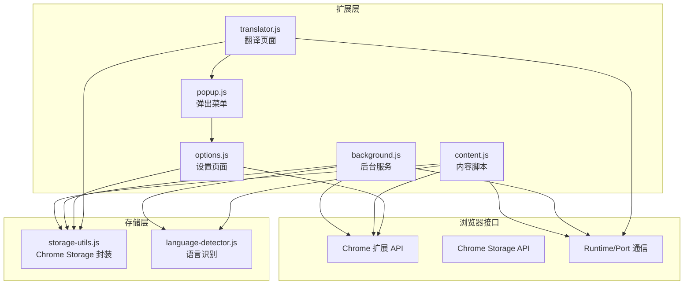
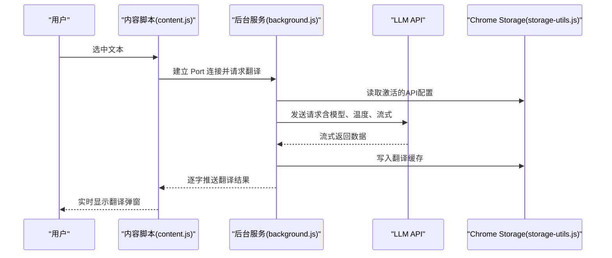
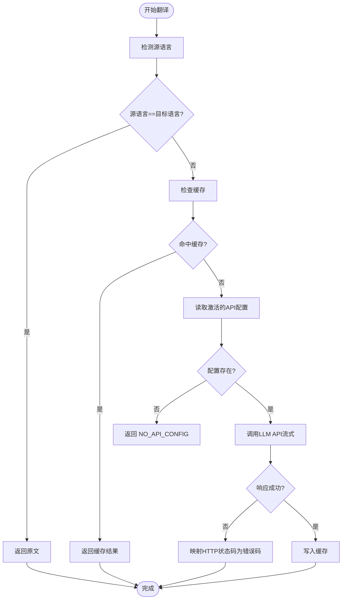
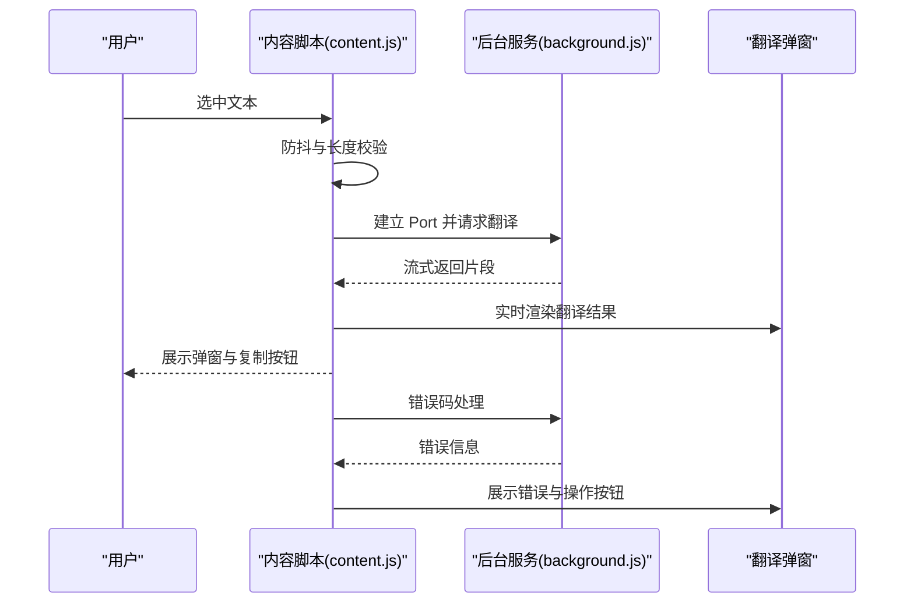
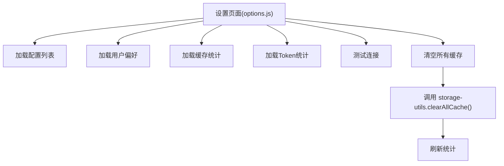
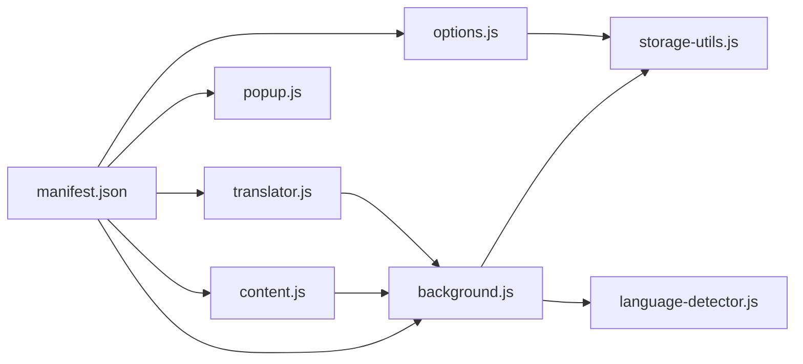

# 故障排除

<cite>
**本文引用的文件**
- [README.md](file://README.md)
- [INSTALL.md](file://INSTALL.md)
- [QUICKSTART.md](file://QUICKSTART.md)
- [manifest.json](file://manifest.json)
- [background.js](file://background.js)
- [content.js](file://content.js)
- [options.js](file://options.js)
- [storage-utils.js](file://storage-utils.js)
- [language-detector.js](file://language-detector.js)
- [popup.js](file://popup.js)
- [translator.js](file://translator.js)
</cite>

## 目录
1. [简介](#简介)
2. [项目结构](#项目结构)
3. [核心组件](#核心组件)
4. [架构总览](#架构总览)
5. [详细组件分析](#详细组件分析)
6. [依赖关系分析](#依赖关系分析)
7. [性能注意事项](#性能注意事项)
8. [故障排除指南](#故障排除指南)
9. [结论](#结论)

## 简介
本指南面向使用 QuickTrans（快译）Chrome 扩展的用户，系统化梳理常见问题与解决方案，覆盖“未配置API”“API密钥无效”“翻译速度慢”“特定网站无法使用”“缓存清理”“权限错误”“更新问题”等场景。通过结合代码实现与文档说明，帮助用户快速定位并解决问题。

## 项目结构
QuickTrans 是一个基于 Manifest V3 的 Chrome 扩展，主要由以下模块构成：
- 后台服务（background.js）：负责翻译请求、API调用、缓存与错误处理
- 内容脚本（content.js）：监听划词、显示翻译图标与弹窗、与后台建立流式连接
- 设置页面（options.js）：管理 API/TTS 配置、用户偏好、缓存统计与清理
- 存储工具（storage-utils.js）：封装 Chrome Storage API，提供配置、缓存、Token 统计
- 语言检测（language-detector.js）：本地语言识别，支持中、英、日、韩、法、德、西、俄、阿拉伯、葡、意、泰、越等
- 弹出菜单（popup.js）：提供打开翻译页面与设置入口
- 翻译页面（translator.js）：提供独立翻译界面，支持剪贴板读取、词典查询与流式翻译

图表来源
- [manifest.json](file://manifest.json#L1-L52)
- [background.js](file://background.js#L1-L120)
- [content.js](file://content.js#L1-L120)
- [options.js](file://options.js#L1-L120)
- [storage-utils.js](file://storage-utils.js#L1-L120)
- [language-detector.js](file://language-detector.js#L1-L60)
- [popup.js](file://popup.js#L1-L36)
- [translator.js](file://translator.js#L1-L80)

章节来源
- [manifest.json](file://manifest.json#L1-L52)
- [README.md](file://README.md#L120-L168)

## 核心组件
- 后台服务（background.js）
  - 翻译流程：语言检测 → 缓存命中 → API 请求（含流式与非流式）→ 缓存写入 → 返回结果
  - 错误处理：401/429/5xx 等状态码映射为明确错误码与提示
  - 超时控制：默认 30 秒
- 内容脚本（content.js）
  - 划词监听、图标与弹窗展示、与后台建立 Port 连接、流式接收翻译结果
  - 用户偏好：自动显示、最大文本长度、显示模式等
- 设置页面（options.js）
  - API/TTS 配置增删改查、激活切换、测试连接
  - 缓存统计与一键清空、Token 统计与重置
- 存储工具（storage-utils.js）
  - API/TTS 配置持久化、用户偏好同步、翻译缓存（session）、Token 统计
- 语言检测（language-detector.js）
  - 基于 Unicode 范围与拉丁语系特征词的本地识别
- 弹出菜单（popup.js）
  - 打开翻译页面与设置页面
- 翻译页面（translator.js）
  - 独立翻译界面，支持剪贴板读取、词典查询与流式翻译

章节来源
- [background.js](file://background.js#L58-L121)
- [content.js](file://content.js#L1-L120)
- [options.js](file://options.js#L1-L120)
- [storage-utils.js](file://storage-utils.js#L1-L120)
- [language-detector.js](file://language-detector.js#L1-L60)
- [popup.js](file://popup.js#L1-L36)
- [translator.js](file://translator.js#L1-L80)

## 架构总览
QuickTrans 采用“内容脚本 + 后台服务 + 设置页面”的典型扩展架构。内容脚本负责 UI 与事件，后台服务负责业务逻辑与网络请求，设置页面负责配置与统计。

图表来源
- [content.js](file://content.js#L618-L728)
- [background.js](file://background.js#L211-L305)
- [storage-utils.js](file://storage-utils.js#L356-L422)

章节来源
- [content.js](file://content.js#L618-L728)
- [background.js](file://background.js#L211-L305)
- [storage-utils.js](file://storage-utils.js#L356-L422)

## 详细组件分析

### 组件A：翻译流程与错误处理（后台服务）
- 关键点
  - 语言检测：若源语言与目标语言相同，直接返回原文
  - 缓存：相同文本+目标语言命中缓存，提升响应
  - API 调用：支持流式输出，包含 usage 统计
  - 错误映射：401→密钥无效；429→频率超限；5xx→服务不可用；超时→TIMEOUT；网络异常→NETWORK_ERROR
  - 超时：默认 30 秒
- 常见错误码与提示
  - NO_API_CONFIG：未配置API
  - INVALID_API_KEY：API密钥无效
  - RATE_LIMIT：API调用频率超限
  - SERVICE_UNAVAILABLE：API服务暂时不可用
  - TIMEOUT：请求超时
  - NETWORK_ERROR：网络错误
  - API_ERROR：其他API错误

图表来源
- [background.js](file://background.js#L58-L121)
- [background.js](file://background.js#L211-L305)
- [background.js](file://background.js#L247-L278)

章节来源
- [background.js](file://background.js#L58-L121)
- [background.js](file://background.js#L211-L305)
- [background.js](file://background.js#L247-L278)

### 组件B：内容脚本与弹窗交互
- 关键点
  - 防抖：200ms 防抖，避免频繁触发
  - 最大文本长度：受用户偏好限制
  - 自动显示：displayMode='auto' 时自动弹窗
  - 流式渲染：首次收到数据即清除加载动画，实时更新
  - 错误处理：根据 errorCode 展示“前往设置/重试/切换API”等操作
- 常见问题定位
  - 未配置API：弹窗显示“前往设置”
  - 频率超限/API错误：弹窗显示“重试/切换API”

图表来源
- [content.js](file://content.js#L132-L181)
- [content.js](file://content.js#L236-L391)
- [content.js](file://content.js#L618-L728)
- [content.js](file://content.js#L730-L777)

章节来源
- [content.js](file://content.js#L132-L181)
- [content.js](file://content.js#L236-L391)
- [content.js](file://content.js#L618-L728)
- [content.js](file://content.js#L730-L777)

### 组件C：设置页面与缓存管理
- 关键点
  - API/TTS 配置：增删改查、激活切换、测试连接
  - 缓存统计：session 存储、自动清理、容量提示
  - Token 统计：prompt/completion/total tokens 与请求次数
- 缓存清理
  - 设置页面提供“清空所有缓存”按钮，调用 storage-utils.clearAllCache
  - 也可通过 chrome://extensions/ 删除扩展数据

图表来源
- [options.js](file://options.js#L180-L243)
- [options.js](file://options.js#L851-L890)
- [storage-utils.js](file://storage-utils.js#L424-L442)

章节来源
- [options.js](file://options.js#L180-L243)
- [options.js](file://options.js#L851-L890)
- [storage-utils.js](file://storage-utils.js#L424-L442)

## 依赖关系分析
- 权限与注入
  - permissions/host_permissions：storage、activeTab、contextMenus、clipboardRead、host_permissions
  - content_scripts：注入 content.js 与 content.css，匹配所有页面
  - background：service_worker
- 模块耦合
  - content.js 与 background.js 通过 Port 通信
  - options.js 与 storage-utils.js 直接交互
  - background.js 依赖 storage-utils.js 与 language-detector.js

图表来源
- [manifest.json](file://manifest.json#L1-L52)
- [background.js](file://background.js#L1-L20)
- [content.js](file://content.js#L1-L40)
- [options.js](file://options.js#L1-L40)
- [storage-utils.js](file://storage-utils.js#L1-L40)
- [language-detector.js](file://language-detector.js#L1-L40)

章节来源
- [manifest.json](file://manifest.json#L1-L52)

## 性能注意事项
- 防抖与节流：内容脚本对划词事件使用 200ms 防抖，避免频繁触发
- 翻译缓存：相同文本+目标语言命中缓存，显著降低延迟
- 请求超时：默认 30 秒，避免长时间挂起
- 流式输出：后台与内容脚本均采用流式处理，首字响应更快
- 文本长度限制：受用户偏好 maxTextLength 控制，避免超长文本导致性能问题

章节来源
- [content.js](file://content.js#L132-L181)
- [storage-utils.js](file://storage-utils.js#L356-L422)
- [background.js](file://background.js#L211-L235)
- [options.js](file://options.js#L761-L785)

## 故障排除指南

### 1. 未配置API
- 现象
  - 翻译弹窗提示“未配置API”，或内容脚本弹窗显示“前往设置”
- 可能原因
  - 尚未添加任何翻译API配置
  - 已有配置但未激活
- 解决方案
  - 在设置页面添加新配置，填写配置名称、API端点、API密钥、模型与温度
  - 点击“测试连接”验证配置
  - 点击“激活”切换到该配置
  - 保存后重试翻译
- 参考路径
  - [README.md](file://README.md#L287-L290)
  - [INSTALL.md](file://INSTALL.md#L34-L52)
  - [QUICKSTART.md](file://QUICKSTART.md#L14-L27)
  - [content.js](file://content.js#L730-L777)

章节来源
- [README.md](file://README.md#L287-L290)
- [INSTALL.md](file://INSTALL.md#L34-L52)
- [QUICKSTART.md](file://QUICKSTART.md#L14-L27)
- [content.js](file://content.js#L730-L777)

### 2. API密钥无效
- 现象
  - 后台返回“API密钥无效，请检查配置”
- 可能原因
  - 密钥拼写错误、多余空格
  - 端点地址错误或不兼容
  - 账户余额不足或配额耗尽
  - 网络环境限制（如企业防火墙）
- 解决方案
  - 在设置页面核对密钥、端点与模型
  - 使用“测试连接”验证
  - 切换到其他可用的API配置
  - 检查网络连通性与代理设置
- 参考路径
  - [background.js](file://background.js#L247-L278)
  - [options.js](file://options.js#L403-L447)

章节来源
- [background.js](file://background.js#L247-L278)
- [options.js](file://options.js#L403-L447)

### 3. 翻译速度慢
- 现象
  - 等待时间较长
- 可能原因
  - API服务响应慢
  - 网络质量差
  - 翻译文本过长
  - 浏览器并发受限
- 解决方案
  - 切换到响应更快的API配置
  - 降低文本长度（受 maxTextLength 限制）
  - 检查网络状况，避免代理/防火墙干扰
  - 使用缓存：相同内容会命中缓存，后续更快
- 参考路径
  - [README.md](file://README.md#L299-L306)
  - [content.js](file://content.js#L132-L181)
  - [storage-utils.js](file://storage-utils.js#L356-L422)

章节来源
- [README.md](file://README.md#L299-L306)
- [content.js](file://content.js#L132-L181)
- [storage-utils.js](file://storage-utils.js#L356-L422)

### 4. 特定网站无法使用
- 现象
  - 在某些网站无法弹出翻译或功能异常
- 可能原因
  - 网站安全策略（如 CSP）限制内容脚本注入
  - DOM 加载时机差异导致监听不到选中事件
  - PDF/特殊页面鼠标事件不可用
- 解决方案
  - 在其他网站测试是否正常
  - 使用“右键菜单翻译”功能（内容脚本会记录鼠标位置）
  - 若为 PDF 等特殊页面，尝试在文本上右键选择“翻译”
  - 反馈 Issue 并附带网站链接
- 参考路径
  - [README.md](file://README.md#L307-L311)
  - [content.js](file://content.js#L92-L131)
  - [content.js](file://content.js#L132-L181)

章节来源
- [README.md](file://README.md#L307-L311)
- [content.js](file://content.js#L92-L131)
- [content.js](file://content.js#L132-L181)

### 5. 如何删除翻译缓存
- 方案一：设置页面一键清空
  - 在设置页面点击“清空所有缓存”，确认后执行
- 方案二：扩展数据清理
  - 打开 chrome://extensions/，找到 QuickTrans，点击“删除扩展数据”
- 方案三：开发者工具手动清理
  - 在开发者工具 Application → Storage 中清除 chrome.storage.local/session 中的缓存键
- 参考路径
  - [README.md](file://README.md#L311-L314)
  - [options.js](file://options.js#L865-L890)
  - [storage-utils.js](file://storage-utils.js#L424-L442)

章节来源
- [README.md](file://README.md#L311-L314)
- [options.js](file://options.js#L865-L890)
- [storage-utils.js](file://storage-utils.js#L424-L442)

### 6. 权限错误
- 现象
  - 设置页面无法保存配置、剪贴板读取失败、扩展图标不显示
- 可能原因
  - 权限未授予（storage、activeTab、contextMenus、clipboardRead）
  - host_permissions 未包含目标API端点
- 解决方案
  - 确认扩展已加载并开启“开发者模式”
  - 在扩展管理页面检查权限列表
  - 确保 API 端点为 http/https 地址
- 参考路径
  - [manifest.json](file://manifest.json#L1-L52)

章节来源
- [manifest.json](file://manifest.json#L1-L52)

### 7. 更新问题
- 现象
  - 更新后功能异常、配置丢失
- 可能原因
  - 配置字段兼容性变化
  - 缓存或 Token 统计异常
- 解决方案
  - 在设置页面重新添加/编辑配置
  - 使用“刷新统计/重置统计”修复 Token 统计
  - 清空缓存后重试
- 参考路径
  - [storage-utils.js](file://storage-utils.js#L1-L120)
  - [options.js](file://options.js#L893-L909)

章节来源
- [storage-utils.js](file://storage-utils.js#L1-L120)
- [options.js](file://options.js#L893-L909)

### 8. 其他常见问题
- 翻译弹窗无响应
  - 检查是否已配置API
  - 打开开发者工具查看 Console 与 Service Worker 日志
  - 在其他网页测试
- 插件图标不显示
  - 使用 icons/icon-generator.html 生成图标文件
- 加载插件时报错
  - 检查 manifest.json、icons 目录完整性与 JavaScript 语法
- 右键菜单翻译
  - 在 PDF 等特殊页面，鼠标事件可能不可用，需在文本上右键选择“翻译”

章节来源
- [INSTALL.md](file://INSTALL.md#L81-L109)
- [QUICKSTART.md](file://QUICKSTART.md#L100-L119)
- [content.js](file://content.js#L92-L131)

## 结论
通过以上系统化的故障排除指南，用户可依据“现象—原因—解决方案”的思路快速定位问题。建议在遇到问题时：
- 先确认 API 配置与激活状态
- 使用“测试连接”验证
- 检查网络与文本长度
- 利用设置页面的缓存与统计功能辅助诊断
- 必要时通过 chrome://extensions/ 或开发者工具进行清理与调试