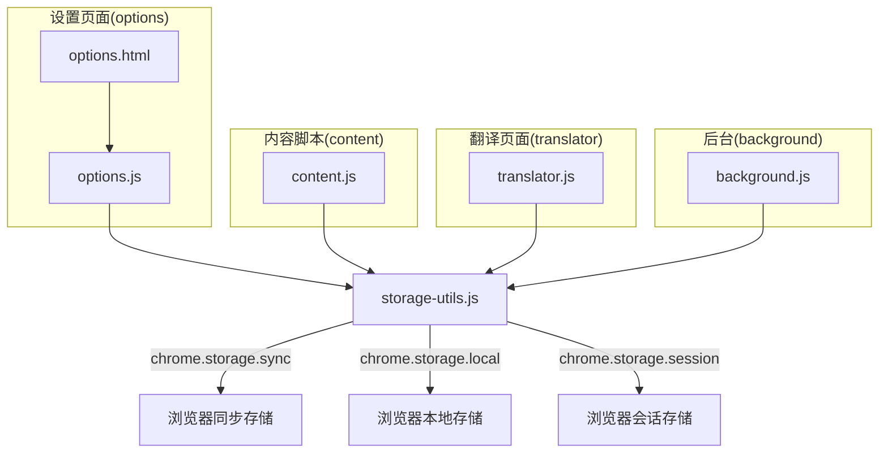
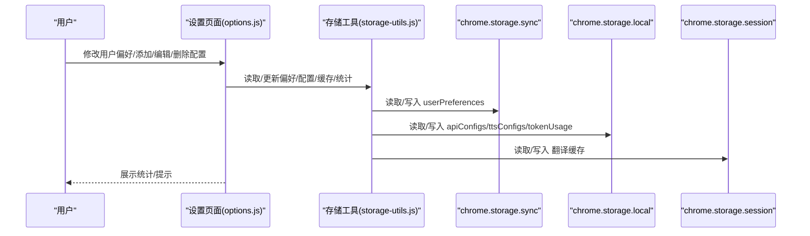
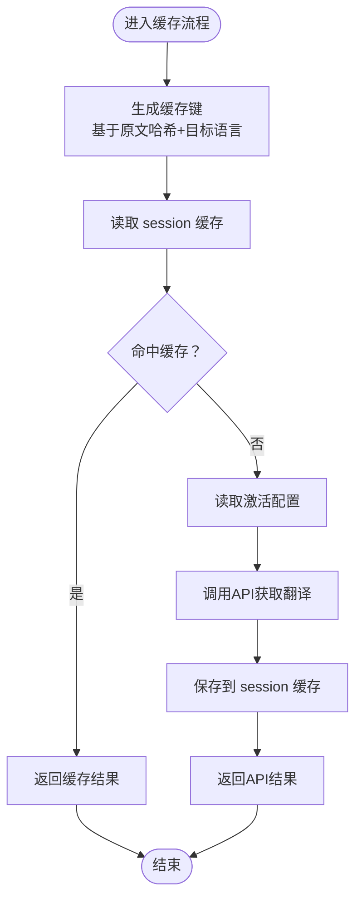
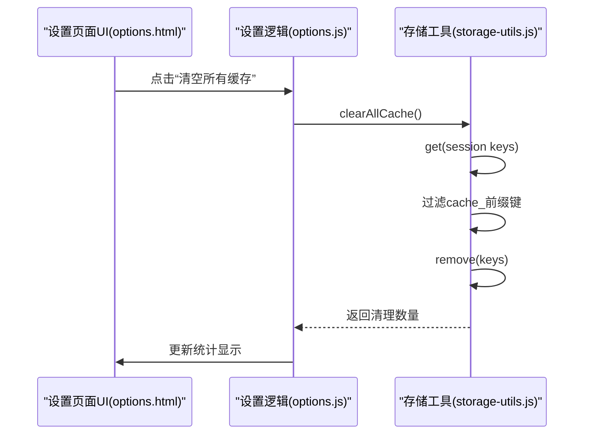
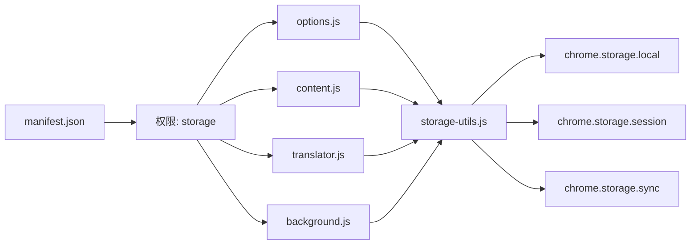

# 数据与缓存问题

<cite>
**本文引用的文件**
- [storage-utils.js](file://storage-utils.js)
- [background.js](file://background.js)
- [options.js](file://options.js)
- [options.html](file://options.html)
- [content.js](file://content.js)
- [translator.js](file://translator.js)
- [manifest.json](file://manifest.json)
</cite>

## 目录
1. [简介](#简介)
2. [项目结构](#项目结构)
3. [核心组件](#核心组件)
4. [架构总览](#架构总览)
5. [详细组件分析](#详细组件分析)
6. [依赖关系分析](#依赖关系分析)
7. [性能考量](#性能考量)
8. [故障排查指南](#故障排查指南)
9. [结论](#结论)
10. [附录](#附录)

## 简介
本指南聚焦于数据与缓存管理，围绕用户常遇到的问题：清除缓存、数据丢失、同步失败，系统性说明 storage-utils.js 如何使用 chrome.storage.local、chrome.storage.sync 和 chrome.storage.session 分别管理 API 配置/缓存与用户偏好；提供多种清除缓存的方法；解释同步机制与可能的冲突场景，并指导如何恢复或迁移数据。

## 项目结构
QuickTrans 采用 Manifest V3，核心数据存储分布如下：
- 用户偏好（lastTargetLanguage、displayMode、maxTextLength 等）：使用 chrome.storage.sync 存储，便于跨设备同步。
- API 配置（翻译与 TTS）：使用 chrome.storage.local 存储，仅本地持久化。
- 翻译缓存：使用 chrome.storage.session 存储，浏览器关闭后自动清空，无需手动维护。
- Token 使用统计：使用 chrome.storage.local 存储，本地持久化。

图表来源
- [storage-utils.js](file://storage-utils.js#L1-L517)
- [options.js](file://options.js#L1-L200)
- [options.html](file://options.html#L1-L120)
- [content.js](file://content.js#L1-L120)
- [translator.js](file://translator.js#L1-L120)
- [background.js](file://background.js#L1-L120)

章节来源
- [manifest.json](file://manifest.json#L1-L52)

## 核心组件
- storage-utils.js：统一的数据访问层，封装 API 配置、用户偏好、翻译缓存、Token 统计的读写与管理。
- options.js：设置页面逻辑，负责增删改查 API 配置、用户偏好、缓存统计与 Token 统计。
- content.js / translator.js：内容脚本与翻译页面，读取用户偏好并展示 UI。
- background.js：后台服务，执行翻译与词典查询，使用缓存与 Token 统计。

章节来源
- [storage-utils.js](file://storage-utils.js#L1-L517)
- [options.js](file://options.js#L1-L200)
- [content.js](file://content.js#L1-L120)
- [translator.js](file://translator.js#L1-L120)
- [background.js](file://background.js#L1-L120)

## 架构总览
数据流与存储位置概览：
- 用户偏好：设置页面读取/更新 chrome.storage.sync.userPreferences；内容脚本与翻译页面读取 chrome.storage.sync.userPreferences。
- API 配置：设置页面通过 storage-utils.js 读写 chrome.storage.local.apiConfigs/ttsConfigs；后台与内容脚本通过 storage-utils.js 读取。
- 翻译缓存：后台与内容脚本通过 storage-utils.js 读写 chrome.storage.session；缓存键由原文与目标语言派生。
- Token 统计：后台与设置页面通过 storage-utils.js 读写 chrome.storage.local.tokenUsage。

图表来源
- [options.js](file://options.js#L733-L882)
- [storage-utils.js](file://storage-utils.js#L1-L517)

## 详细组件分析

### 存储工具 storage-utils.js
- API 配置管理
  - 读取/保存/新增/更新/删除翻译与 TTS 配置，均使用 chrome.storage.local。
  - 激活配置时会将其他配置的激活状态置为 false，确保同一时间只有一个激活项。
  - 旧配置兼容：自动补全默认字段（如 temperature、provider 默认 qwen、model/voice/openai_* 默认值）。
- 用户偏好管理
  - 读取/保存/更新用户偏好，使用 chrome.storage.sync，便于跨设备同步。
  - 旧配置迁移：若存在 autoShowPopup 但无 displayMode，自动迁移到 displayMode。
- 翻译缓存管理
  - 使用 chrome.storage.session，键名由原文哈希与目标语言组合生成。
  - 自动清空：浏览器关闭后自动清空，无需手动维护。
  - 统计与清空：支持统计缓存数量与大小、清空所有缓存。
  - 异常处理：当 session 存储满时自动清理，保存缓存时捕获异常避免崩溃。
- Token 使用统计
  - 读取/更新/重置统计，使用 chrome.storage.local，仅本地持久化。

图表来源
- [storage-utils.js](file://storage-utils.js#L356-L442)
- [background.js](file://background.js#L58-L121)

章节来源
- [storage-utils.js](file://storage-utils.js#L1-L517)

### 设置页面 options.js 与 options.html
- API 配置
  - 列表渲染、激活/编辑/删除、测试连接、表单校验（必填、URL 格式、temperature 范围）。
  - 通过 storage-utils.js 读写 chrome.storage.local.apiConfigs/ttsConfigs。
- 用户偏好
  - 读取/更新 lastTargetLanguage、displayMode、maxTextLength；兼容旧配置 autoShowPopup。
- 缓存管理
  - 展示缓存数量、占用空间、存储类型（Session）、自动清空提示。
  - 刷新统计、清空所有缓存（调用 storage-utils.js.clearAllCache）。
- Token 统计
  - 展示总 Token 数、输入/输出 Token、调用次数、最后更新时间。
  - 刷新统计、重置统计（调用 storage-utils.js.resetTokenUsage）。

图表来源
- [options.js](file://options.js#L852-L882)
- [options.html](file://options.html#L388-L416)
- [storage-utils.js](file://storage-utils.js#L424-L442)

章节来源
- [options.js](file://options.js#L1-L200)
- [options.html](file://options.html#L1-L120)

### 内容脚本与翻译页面
- 用户偏好读取
  - content.js 与 translator.js 从 chrome.storage.sync.userPreferences 读取 lastTargetLanguage、displayMode、maxTextLength 等。
  - 对旧配置进行兼容处理（如 autoShowPopup -> displayMode）。
- 翻译与词典查询
  - 调用后台服务或使用缓存，最终通过 storage-utils.js 读写缓存与统计。

章节来源
- [content.js](file://content.js#L1-L120)
- [translator.js](file://translator.js#L1-L120)

### 后台服务 background.js
- 翻译与词典查询
  - 优先检查 session 缓存，命中则直接返回；否则读取激活配置并调用 API。
  - 成功后将翻译结果写入 session 缓存。
- Token 统计
  - 从 API 响应中提取 usage 并通过 storage-utils.js 更新本地统计。

章节来源
- [background.js](file://background.js#L58-L121)
- [storage-utils.js](file://storage-utils.js#L460-L510)

## 依赖关系分析
- 权限声明
  - manifest.json 声明 storage 权限，允许读写本地存储。
- 模块耦合
  - options.js、content.js、translator.js、background.js 通过 storage-utils.js 间接依赖 chrome.storage.*。
  - storage-utils.js 与 chrome.storage.* 直接交互，形成统一的数据访问层。

图表来源
- [manifest.json](file://manifest.json#L1-L52)
- [storage-utils.js](file://storage-utils.js#L1-L517)

章节来源
- [manifest.json](file://manifest.json#L1-L52)

## 性能考量
- session 缓存的优势
  - 自动清空：浏览器关闭后自动清空，避免长期占用空间。
  - 自动管理：Chrome 自动处理空间与过期，无需手动维护。
  - 命中即返：重复翻译相同内容时可显著降低延迟。
- 缓存容量
  - storage.session 约 10MB 限制，超出时 Chrome 会自动清理，保存缓存时已做异常捕获。
- Token 统计
  - 仅本地存储，不影响网络性能；适合监控用量与成本。

[本节为通用建议，不直接分析具体文件]

## 故障排查指南

### 清除缓存的方法
- 通过设置页面一键清空
  - 在设置页面点击“清空所有缓存”，内部调用 storage-utils.js.clearAllCache，移除所有以 cache_ 开头的 session 键。
- 通过开发者工具 Application 面板手动清除
  - 在浏览器开发者工具的 Application 面板中，找到“存储”下的“会话存储”或“存储”区域，手动删除以 cache_ 开头的键。
- 通过扩展管理界面操作
  - 在 chrome://extensions/ 中找到 QuickTrans，点击“清除缓存”或“重置数据”（若扩展提供该入口），以清除扩展相关的存储数据。
- 重启浏览器
  - 因为 session 缓存会在浏览器关闭后自动清空，重启浏览器可达到清空效果。

章节来源
- [options.js](file://options.js#L852-L882)
- [storage-utils.js](file://storage-utils.js#L424-L442)

### 数据丢失与恢复
- 用户偏好丢失
  - 若因扩展重装或浏览器迁移导致偏好丢失，可在设置页面重新配置；若之前已通过 chrome.storage.sync 同步，可在另一台设备上恢复。
- API 配置丢失
  - 由于存储在 chrome.storage.local，重装扩展或更换浏览器后会丢失。可通过备份或重新配置恢复。
- 翻译缓存丢失
  - session 缓存属于临时数据，浏览器关闭后自动清空，属于预期行为。若需要持久化缓存，需调整为本地存储策略（当前实现为 session）。
- Token 统计丢失
  - 本地统计仅在当前浏览器有效，重装或更换浏览器后会丢失。可通过再次使用插件产生新统计恢复。

章节来源
- [storage-utils.js](file://storage-utils.js#L356-L442)
- [options.js](file://options.js#L733-L882)

### 同步失败与冲突
- 同步机制
  - 用户偏好使用 chrome.storage.sync，理论上可跨设备同步；但实际受浏览器账户、网络状况、存储配额等因素影响。
- 可能的冲突场景
  - 多设备同时修改 userPreferences：可能出现部分字段覆盖或最终状态不确定。
  - 存储配额不足：当存储空间接近上限时，同步可能失败或被拒绝。
- 恢复与迁移
  - 若出现同步异常，可在设置页面重新保存偏好，或在另一台设备上确认同步状态。
  - 迁移数据：API 配置与 Token 统计存储在本地，可通过导出/导入（若扩展提供）或重新配置恢复。

章节来源
- [storage-utils.js](file://storage-utils.js#L310-L342)
- [content.js](file://content.js#L1-L120)
- [translator.js](file://translator.js#L1-L120)

### 常见问题定位
- 翻译结果未命中缓存
  - 检查原文与目标语言是否一致；确认 session 缓存未被浏览器自动清理。
- 设置页面无法保存配置
  - 检查必填字段、URL 格式与 temperature 范围；查看控制台错误信息。
- Token 统计不更新
  - 确认后台服务正确接收 API usage 并调用 storage-utils.js.updateTokenUsage。

章节来源
- [options.js](file://options.js#L344-L447)
- [background.js](file://background.js#L280-L323)
- [storage-utils.js](file://storage-utils.js#L460-L510)

## 结论
QuickTrans 通过分层存储策略实现了清晰的数据管理：用户偏好使用 sync 跨设备同步，API 配置与 Token 统计使用 local 本地持久化，翻译缓存使用 session 临时缓存并自动清空。设置页面提供了便捷的缓存统计与清空能力，结合扩展管理界面与开发者工具，用户可灵活应对“清除缓存”“数据丢失”“同步失败”等问题。建议在多设备使用时关注偏好同步状态，在需要持久化缓存时考虑调整存储策略。

[本节为总结，不直接分析具体文件]

## 附录

### 存储键与数据结构参考
- 用户偏好（chrome.storage.sync.userPreferences）
  - 字段：lastTargetLanguage、displayMode、maxTextLength 等；旧配置 autoShowPopup 会迁移为 displayMode。
- API 配置（chrome.storage.local.apiConfigs/ttsConfigs）
  - 字段：id、name、apiEndpoint、apiKey、model、temperature/provider、isActive、createdAt、updatedAt 等。
- 翻译缓存（chrome.storage.session）
  - 键：cache_{hash(text)}_{targetLang}
  - 值：翻译结果字符串
- Token 统计（chrome.storage.local.tokenUsage）
  - 字段：totalPromptTokens、totalCompletionTokens、totalTokens、requestCount、lastUpdated

章节来源
- [storage-utils.js](file://storage-utils.js#L1-L517)
- [options.js](file://options.js#L733-L882)