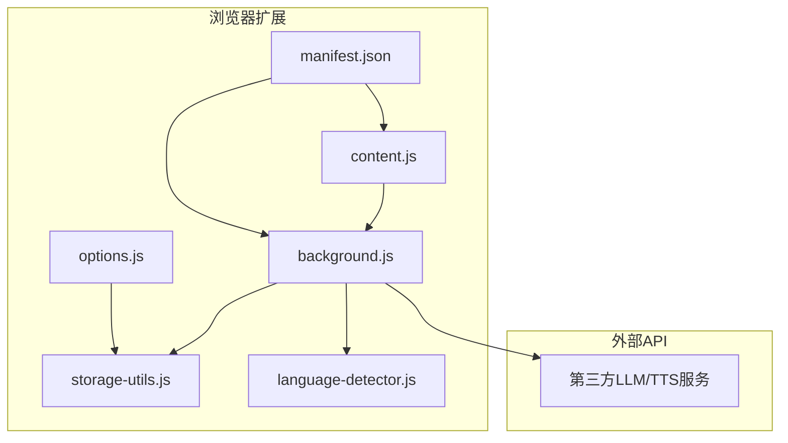
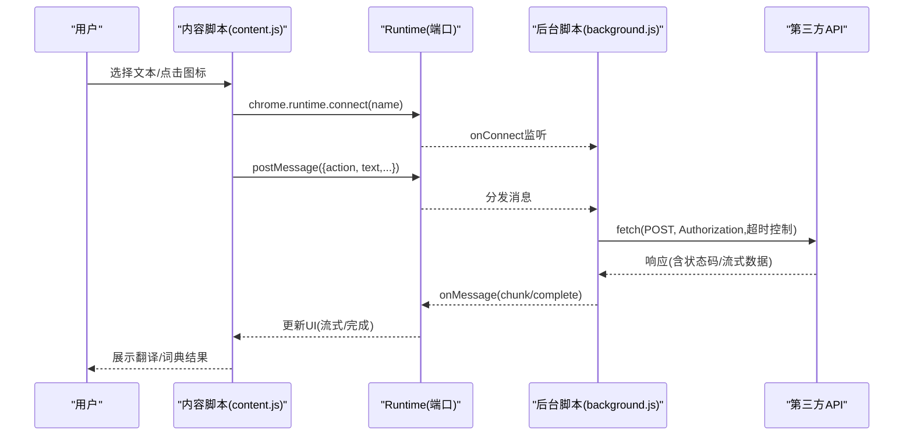
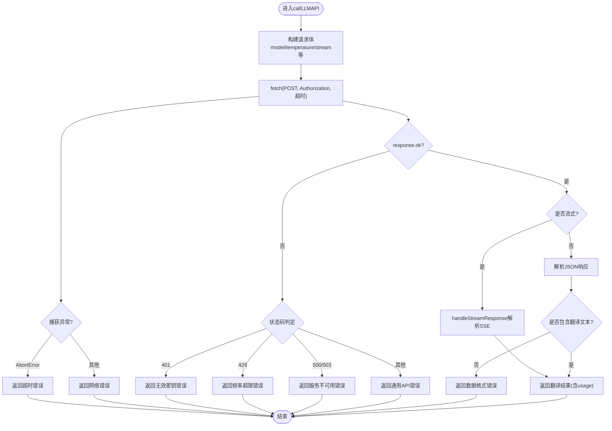
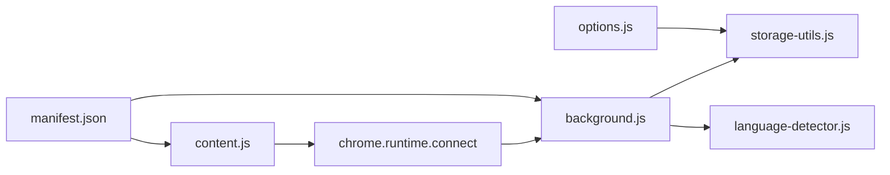

# 连接问题

<cite>
**本文引用的文件**
- [manifest.json](file://manifest.json)
- [background.js](file://background.js)
- [content.js](file://content.js)
- [options.js](file://options.js)
- [storage-utils.js](file://storage-utils.js)
- [language-detector.js](file://language-detector.js)
- [TRANSLATOR_IMPLEMENTATION_SUMMARY.md](file://TRANSLATOR_IMPLEMENTATION_SUMMARY.md)
</cite>

## 目录
1. [简介](#简介)
2. [项目结构](#项目结构)
3. [核心组件](#核心组件)
4. [架构总览](#架构总览)
5. [详细组件分析](#详细组件分析)
6. [依赖关系分析](#依赖关系分析)
7. [性能考量](#性能考量)
8. [故障排除指南](#故障排除指南)
9. [结论](#结论)

## 简介
本文件聚焦于“连接问题”故障排除，围绕用户在调用API时遇到的典型网络与权限问题展开，包括但不限于：网络连接失败、CORS错误、请求超时、权限被拒绝等。文档将结合manifest.json中host_permissions的配置要求，深入分析background.js中fetch请求的错误处理机制，并提供检查浏览器网络代理、防火墙设置、API服务可用性的实操步骤；同时指导用户如何通过开发者工具查看网络请求详情，定位连接失败的根本原因，并给出相应解决方案。

## 项目结构
QuickTrans为一个基于 Manifest V3 的浏览器扩展，主要由以下模块组成：
- manifest.json：声明权限、主机权限、后台脚本、内容脚本等
- background.js：后台服务脚本，负责翻译与TTS请求、错误处理、流式响应
- content.js：内容脚本，负责划词监听、弹窗展示、Port流式连接
- options.js：设置页脚本，负责API配置管理、测试连接
- storage-utils.js：存储工具，负责API配置、用户偏好、缓存、token统计
- language-detector.js：语言检测模块
- TRANSLATOR_IMPLEMENTATION_SUMMARY.md：实现摘要，包含错误处理与性能优化要点

图表来源
- [manifest.json](file://manifest.json#L1-L52)
- [background.js](file://background.js#L1-L120)
- [content.js](file://content.js#L1-L120)
- [options.js](file://options.js#L1-L120)
- [storage-utils.js](file://storage-utils.js#L1-L120)
- [language-detector.js](file://language-detector.js#L1-L60)

章节来源
- [manifest.json](file://manifest.json#L1-L52)
- [background.js](file://background.js#L1-L120)
- [content.js](file://content.js#L1-L120)
- [options.js](file://options.js#L1-L120)
- [storage-utils.js](file://storage-utils.js#L1-L120)
- [language-detector.js](file://language-detector.js#L1-L60)

## 核心组件
- 权限与主机权限
  - manifest.json中声明了permissions与host_permissions，允许访问任意http/https资源，为跨域请求提供基础能力。
- 后台服务脚本（background.js）
  - 负责翻译与TTS请求，封装fetch调用、超时控制、错误分类与返回码映射。
- 内容脚本（content.js）
  - 通过chrome.runtime.connect建立Port长连接，实现流式翻译与词典查询，避免传统XHR/CORS复杂场景。
- 设置页（options.js）
  - 管理API配置、测试连接、缓存与token统计，便于验证网络连通性与鉴权有效性。
- 存储工具（storage-utils.js）
  - 统一管理API配置、用户偏好、缓存与token统计，支撑错误恢复与性能优化。
- 语言检测（language-detector.js）
  - 本地语言识别，辅助UI与错误提示。

章节来源
- [manifest.json](file://manifest.json#L1-L52)
- [background.js](file://background.js#L200-L350)
- [content.js](file://content.js#L440-L560)
- [options.js](file://options.js#L400-L470)
- [storage-utils.js](file://storage-utils.js#L1-L120)
- [language-detector.js](file://language-detector.js#L1-L60)

## 架构总览
QuickTrans采用“内容脚本 + 后台服务脚本”的双层架构，通过Port长连接实现流式数据传输，降低跨域与CORS复杂度；后台脚本负责fetch请求与错误处理，设置页负责配置与测试。

图表来源
- [content.js](file://content.js#L440-L560)
- [background.js](file://background.js#L970-L1015)
- [background.js](file://background.js#L200-L350)

## 详细组件分析

### 组件A：manifest.json中的host_permissions与权限
- host_permissions
  - 项目声明了对http://*/*与https://*/*的主机权限，允许扩展在任意HTTP/HTTPS站点发起fetch请求，避免CORS跨域限制带来的常见错误。
- permissions
  - 包含storage、activeTab、contextMenus、clipboardRead等必要权限，满足扩展功能与最小权限原则。
- 影响
  - 正确配置host_permissions是解决“CORS错误”和“权限被拒绝”的前提条件之一；若未正确配置，即使API端点合法，也可能因权限不足导致请求失败。

章节来源
- [manifest.json](file://manifest.json#L1-L52)

### 组件B：background.js中的fetch请求与错误处理
- 超时控制
  - 使用AbortController与setTimeout在30秒内中断请求，避免长时间挂起。
- 错误分类与返回码映射
  - 401：API密钥无效
  - 429：调用频率超限
  - 500/503：服务暂时不可用
  - 其他：通用API错误
  - 网络异常：AbortError归类为超时，其他异常归类为网络错误
- 流式响应处理
  - SSE格式解析，逐块推送至内容脚本，实时更新UI；异常时返回标准错误对象，便于UI提示与重试策略。

图表来源
- [background.js](file://background.js#L200-L350)
- [background.js](file://background.js#L130-L200)

章节来源
- [background.js](file://background.js#L200-L350)
- [background.js](file://background.js#L130-L200)

### 组件C：content.js中的Port流式连接与错误提示
- Port连接
  - 使用chrome.runtime.connect(name)建立长连接，分别用于翻译与词典查询，避免CORS与跨域复杂性。
- 错误提示
  - 根据错误码提供“前往设置”、“重试”、“切换API”等操作建议，提升用户自助排障体验。
- 与后台协作
  - onMessage监听chunk/complete，实时更新UI；complete后断开连接，避免资源泄漏。

章节来源
- [content.js](file://content.js#L440-L560)
- [content.js](file://content.js#L614-L714)
- [content.js](file://content.js#L730-L777)

### 组件D：options.js中的API配置与测试
- 配置管理
  - 支持添加/编辑/删除/激活API配置，URL校验与温度范围校验，保障请求参数合法性。
- 测试连接
  - 通过chrome.runtime.sendMessage触发后台测试逻辑，返回测试结果，帮助用户确认网络与鉴权状态。

章节来源
- [options.js](file://options.js#L344-L401)
- [options.js](file://options.js#L404-L447)
- [background.js](file://background.js#L986-L1015)

### 组件E：storage-utils.js中的缓存与统计
- 缓存
  - 使用chrome.storage.session进行短期缓存，命中后直接返回，减少网络请求与超时风险。
- 统计
  - 提供缓存统计与token使用统计，辅助定位性能瓶颈与配额问题。

章节来源
- [storage-utils.js](file://storage-utils.js#L356-L422)
- [storage-utils.js](file://storage-utils.js#L459-L511)

## 依赖关系分析
- content.js依赖runtime.connect与后台脚本交互，后台脚本依赖storage-utils.js与language-detector.js。
- options.js依赖storage-utils.js进行配置持久化与统计展示。
- manifest.json决定网络与权限边界，直接影响fetch与跨域行为。

图表来源
- [content.js](file://content.js#L440-L560)
- [background.js](file://background.js#L970-L1015)
- [storage-utils.js](file://storage-utils.js#L1-L120)
- [language-detector.js](file://language-detector.js#L1-L60)
- [manifest.json](file://manifest.json#L1-L52)
- [options.js](file://options.js#L1-L120)

章节来源
- [content.js](file://content.js#L440-L560)
- [background.js](file://background.js#L970-L1015)
- [storage-utils.js](file://storage-utils.js#L1-L120)
- [language-detector.js](file://language-detector.js#L1-L60)
- [manifest.json](file://manifest.json#L1-L52)
- [options.js](file://options.js#L1-L120)

## 性能考量
- 流式输出：通过Port长连接与SSE解析，实现渐进式显示，降低首字延迟。
- 缓存机制：使用session storage进行短期缓存，命中后直接返回，显著降低网络请求次数。
- 超时控制：统一30秒超时，避免长时间阻塞UI。
- 语言检测：本地快速识别，减少不必要的网络往返。

章节来源
- [TRANSLATOR_IMPLEMENTATION_SUMMARY.md](file://TRANSLATOR_IMPLEMENTATION_SUMMARY.md#L196-L219)
- [storage-utils.js](file://storage-utils.js#L356-L422)
- [background.js](file://background.js#L130-L200)

## 故障排除指南

### 一、网络连接失败
- 现象
  - UI提示“网络错误，请检查连接”，或长时间无响应。
- 可能原因
  - 本地网络不稳定、DNS解析失败、代理/防火墙拦截。
- 排查步骤
  - 在浏览器扩展页面确认host_permissions已正确声明（见manifest.json）。
  - 在设置页测试API连接，验证端点与密钥是否有效。
  - 使用开发者工具Network面板观察请求状态码与响应体，确认是否出现ERR_*错误。
  - 检查系统代理/企业防火墙是否拦截API域名。
  - 尝试更换网络环境（如切换移动热点）验证问题是否与网络相关。
- 解决方案
  - 修复网络或代理配置；在设置页更新正确的API端点与密钥；必要时联系网络管理员放行API域名。

章节来源
- [manifest.json](file://manifest.json#L1-L52)
- [options.js](file://options.js#L404-L447)
- [background.js](file://background.js#L200-L350)

### 二、CORS错误
- 现象
  - 控制台出现CORS相关报错，请求被浏览器阻止。
- 可能原因
  - 未正确声明host_permissions，或请求目标不在允许范围内。
- 排查步骤
  - 确认manifest.json中包含http://*/*与https://*/*。
  - 在开发者工具Network面板查看CORS响应头与预检请求结果。
- 解决方案
  - 确保host_permissions覆盖目标API域名；如需更细粒度控制，可在开发阶段临时放宽权限进行验证。

章节来源
- [manifest.json](file://manifest.json#L1-L52)

### 三、请求超时
- 现象
  - UI提示“请求超时，请检查网络连接或稍后重试”。
- 可能原因
  - API响应慢、网络抖动、服务器负载高。
- 排查步骤
  - 观察Network面板中请求耗时与状态码；确认后台脚本的30秒超时是否触发。
  - 在设置页多次测试连接，评估API稳定性。
- 解决方案
  - 稍后再试；切换备用API；优化网络环境；必要时联系API提供商。

章节来源
- [background.js](file://background.js#L200-L350)
- [options.js](file://options.js#L404-L447)

### 四、权限被拒绝（401）
- 现象
  - UI提示“API密钥无效，请检查配置”。
- 可能原因
  - API密钥错误、未授权访问、账户欠费或配额耗尽。
- 排查步骤
  - 在设置页核对密钥与端点；使用测试连接功能验证。
  - 查看Network面板中401响应体，确认错误信息。
- 解决方案
  - 更新正确的API密钥；检查账户状态与配额；在设置页切换到其他API。

章节来源
- [background.js](file://background.js#L247-L278)
- [options.js](file://options.js#L404-L447)

### 五、请求频率超限（429）
- 现象
  - UI提示“API调用频率超限，请稍后重试或切换其他API”。
- 可能原因
  - 请求过于频繁，触发API限流。
- 排查步骤
  - 查看Network面板中429响应与Retry-After头（如提供）。
- 解决方案
  - 降低请求频率；等待冷却时间；切换到更高配额的API。

章节来源
- [background.js](file://background.js#L247-L278)

### 六、API服务暂时不可用（500/503）
- 现象
  - UI提示“API服务暂时不可用，请稍后重试”。
- 可能原因
  - 服务器维护或临时故障。
- 解决方案
  - 稍后再试；关注API官方状态页；在设置页切换备用API。

章节来源
- [background.js](file://background.js#L247-L278)

### 七、开发者工具使用与网络请求详情查看
- 打开方式
  - 在扩展页面右键“检查”或按F12打开开发者工具。
- 关注点
  - Network标签：筛选XHR/Fetch，查看请求URL、方法、状态码、响应头、响应体；特别关注CORS头与预检请求。
  - Console标签：查看错误堆栈与后台脚本打印的日志。
  - Application标签：查看Storage中的缓存与配置，确认API配置是否正确。
- 建议流程
  - 执行一次翻译/词典查询，复现问题。
  - 在Network中定位最近一次fetch请求，确认是否被拦截、是否返回4xx/5xx。
  - 根据状态码与错误提示，结合本指南对应章节进行处理。

章节来源
- [content.js](file://content.js#L440-L560)
- [background.js](file://background.js#L200-L350)

### 八、浏览器网络代理与防火墙设置检查
- 代理
  - 若使用企业代理或系统代理，确认代理规则未拦截API域名；尝试关闭代理或添加白名单。
- 防火墙
  - 检查本地防火墙策略，确保浏览器与扩展进程可访问目标API端点。
- DNS
  - 如遇DNS污染或解析异常，可尝试更换DNS服务器（如114.114.114.114、8.8.8.8）。

[本节为通用实践建议，不直接分析具体文件]

### 九、API服务可用性检查清单
- 在设置页使用“测试连接”功能，确认端点与密钥有效。
- 查看Network面板中请求是否返回预期状态码。
- 若为私有部署API，确认服务端CORS配置与鉴权策略。
- 关注API提供商的SLA与限流策略，合理规划请求节奏。

章节来源
- [options.js](file://options.js#L404-L447)
- [background.js](file://background.js#L200-L350)

## 结论
QuickTrans通过Manifest V3的host_permissions与Port长连接机制，有效降低了CORS与跨域带来的复杂性；后台脚本对fetch请求进行了完善的超时控制与错误分类，配合设置页的测试功能与缓存策略，能够帮助用户快速定位并解决网络与权限问题。建议在出现连接问题时，按照“权限确认—代理/防火墙检查—开发者工具诊断—API可用性验证”的顺序逐步排查，结合UI提示与错误码采取针对性措施，以获得最佳的排障体验。