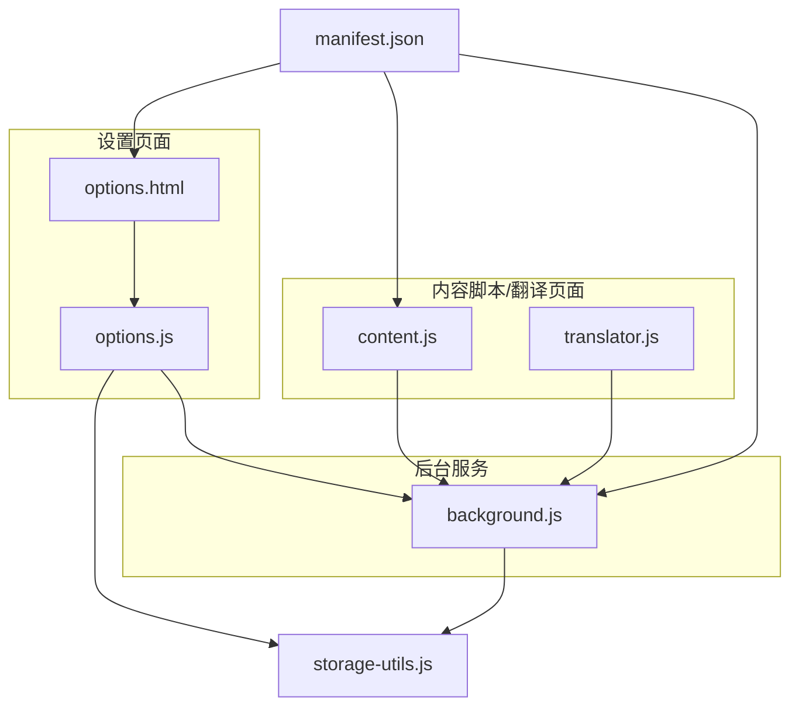
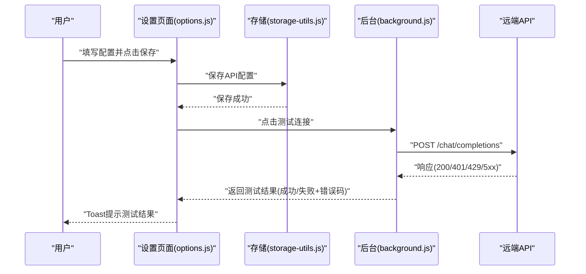
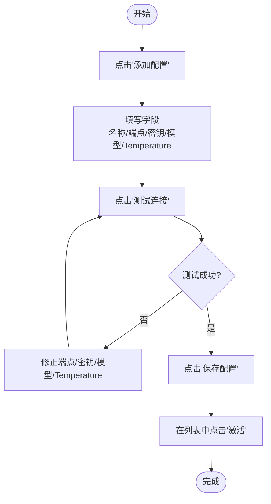
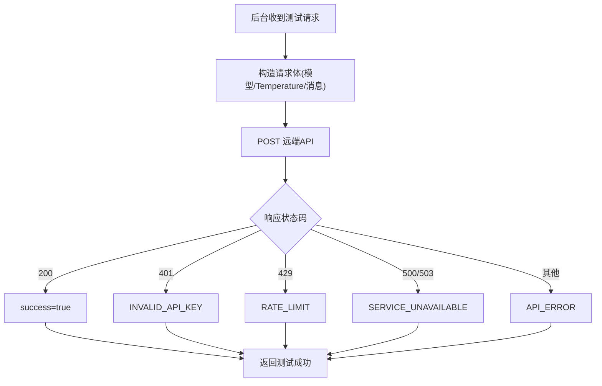
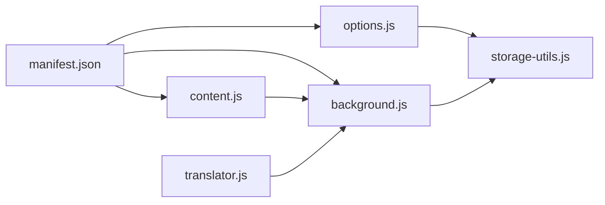

# 配置问题

<cite>
**本文引用的文件**
- [README.md](file://README.md)
- [QUICKSTART.md](file://QUICKSTART.md)
- [options.html](file://options.html)
- [options.js](file://options.js)
- [storage-utils.js](file://storage-utils.js)
- [background.js](file://background.js)
- [content.js](file://content.js)
- [translator.js](file://translator.js)
- [manifest.json](file://manifest.json)
</cite>

## 目录
1. [简介](#简介)
2. [项目结构](#项目结构)
3. [核心组件](#核心组件)
4. [架构总览](#架构总览)
5. [详细组件分析](#详细组件分析)
6. [依赖关系分析](#依赖关系分析)
7. [性能考量](#性能考量)
8. [故障排除指南](#故障排除指南)
9. [结论](#结论)
10. [附录](#附录)

## 简介
本指南聚焦于“API配置相关”的常见问题，系统化解析并提供可执行的排障路径，涵盖以下典型问题：
- 未配置API
- API密钥无效
- API端点错误
- 账户余额不足（实质为服务端401/429/5xx等错误）

同时，结合设置页面（options.js）的操作流程，提供从添加、编辑、激活、测试到保存的完整步骤说明，帮助用户准确完成配置并验证各字段（名称、端点、密钥、模型、Temperature）。

## 项目结构
QuickTrans为Chrome扩展，核心涉及设置页面、后台服务、内容脚本与翻译页面。与API配置直接相关的文件包括：
- 设置页面（options.html + options.js）：负责API配置的录入、校验、测试与保存
- 存储工具（storage-utils.js）：负责本地存储API配置、激活状态、偏好设置、缓存与Token统计
- 后台服务（background.js）：负责实际调用API、错误分类与返回、测试配置
- 内容脚本与翻译页面（content.js、translator.js）：负责展示错误信息与引导用户操作
- 权限清单（manifest.json）：声明storage、activeTab、host_permissions等权限

图表来源
- [options.html](file://options.html#L1-L120)
- [options.js](file://options.js#L1-L120)
- [storage-utils.js](file://storage-utils.js#L1-L60)
- [background.js](file://background.js#L1-L120)
- [content.js](file://content.js#L730-L770)
- [translator.js](file://translator.js#L770-L810)
- [manifest.json](file://manifest.json#L1-L30)

章节来源
- [options.html](file://options.html#L1-L120)
- [options.js](file://options.js#L1-L120)
- [storage-utils.js](file://storage-utils.js#L1-L60)
- [background.js](file://background.js#L1-L120)
- [content.js](file://content.js#L730-L770)
- [translator.js](file://translator.js#L770-L810)
- [manifest.json](file://manifest.json#L1-L30)

## 核心组件
- 设置页面（options.js + options.html）
  - 提供“添加/编辑/激活/删除”API配置的UI与交互
  - 表单字段：配置名称、API端点、API密钥、模型名称、Temperature
  - 支持“测试连接”，调用后台服务进行连通性验证
  - 保存配置后，自动设置激活项（若为首个配置）

- 存储工具（storage-utils.js）
  - 维护apiConfigs、ttsConfigs、userPreferences、tokenUsage、缓存等
  - 提供获取/添加/更新/删除/激活配置等方法
  - 自动兼容旧配置字段（如温度默认值）

- 后台服务（background.js）
  - 调用LLM API，封装请求体（模型、Temperature、消息、流式开关）
  - 对HTTP状态码进行分类：401（密钥无效）、429（频率限制）、5xx（服务不可用）
  - 提供测试配置接口，返回成功/失败及错误码

- 内容脚本/翻译页面（content.js、translator.js）
  - 根据错误码展示友好提示与操作按钮（前往设置、重试、切换API）
  - 与后台通过runtime消息通信

章节来源
- [options.html](file://options.html#L120-L220)
- [options.js](file://options.js#L340-L447)
- [storage-utils.js](file://storage-utils.js#L1-L120)
- [background.js](file://background.js#L210-L350)
- [content.js](file://content.js#L730-L770)
- [translator.js](file://translator.js#L770-L810)

## 架构总览
设置页面通过options.js与storage-utils.js交互，保存配置；后台服务通过background.js调用远端API并返回结果；内容脚本/翻译页面接收结果并展示错误提示。

图表来源
- [options.js](file://options.js#L340-L447)
- [storage-utils.js](file://storage-utils.js#L1-L120)
- [background.js](file://background.js#L210-L350)

## 详细组件分析

### 设置页面（options.js）与表单字段
- 字段说明
  - 配置名称：用于标识该配置
  - API端点：兼容OpenAI协议的Chat Completions端点
  - API密钥：Bearer认证所需
  - 模型名称：如gpt-4o-mini、gpt-4、claude-3-5-sonnet等
  - Temperature：0-2之间的数值，越低越稳定，越高越多样化

- 校验规则
  - 必填字段：名称、端点、密钥、模型
  - Temperature范围：0-2
  - 端点URL格式：需为合法URL
  - 保存时自动设置激活项（若为首个配置）

- 操作流程（添加/编辑/激活/测试/保存）
  1) 点击“添加配置”
  2) 填写字段并点击“测试连接”
  3) 若测试通过，点击“保存配置”
  4) 在配置卡片中点击“激活”切换当前使用配置

图表来源
- [options.html](file://options.html#L120-L220)
- [options.js](file://options.js#L340-L447)

章节来源
- [options.html](file://options.html#L120-L220)
- [options.js](file://options.js#L340-L447)

### 存储工具（storage-utils.js）
- API配置生命周期
  - 添加：生成ID、设置createdAt/updatedAt、必要字段默认值、自动激活首个配置
  - 更新：支持激活切换，自动将其他配置置为非激活
  - 删除：删除后若删除的是激活配置且仍有其他配置，则激活第一个
  - 获取：支持获取全部、激活项、统计缓存与Token使用

- Token统计与缓存
  - Token统计：累计prompt/completion/总Token数与请求次数
  - 缓存：使用chrome.storage.session，自动清理，适合首次翻译加速

章节来源
- [storage-utils.js](file://storage-utils.js#L1-L200)
- [storage-utils.js](file://storage-utils.js#L350-L517)

### 后台服务（background.js）与错误分类
- 调用链
  - 从options.js发起测试请求，后台通过chrome.runtime.sendMessage接收
  - 后台构造请求体（模型、Temperature、消息、stream开关），调用远端API
  - 根据HTTP状态码返回统一错误码与消息

- 错误码与含义
  - INVALID_API_KEY：401（密钥无效/鉴权失败）
  - RATE_LIMIT：429（频率限制/配额耗尽）
  - SERVICE_UNAVAILABLE：500/503（服务不可用）
  - TIMEOUT：请求超时（默认30秒）
  - NETWORK_ERROR：网络异常
  - API_ERROR：其他HTTP错误

图表来源
- [background.js](file://background.js#L210-L350)

章节来源
- [background.js](file://background.js#L210-L350)

### 内容脚本/翻译页面（content.js、translator.js）错误展示
- 错误码映射与引导
  - NO_API_CONFIG：引导用户前往设置页面添加/激活配置
  - RATE_LIMIT/API_ERROR：提供“重试”与“切换API”按钮
  - 其他错误：展示通用错误提示

章节来源
- [content.js](file://content.js#L730-L770)
- [translator.js](file://translator.js#L770-L810)

## 依赖关系分析
- 权限与主机权限
  - storage：本地持久化配置与偏好
  - activeTab：仅在用户触发时访问当前标签页
  - host_permissions：允许向API端点发起请求

- 模块耦合
  - options.js依赖storage-utils.js进行配置持久化
  - background.js依赖storage-utils.js获取激活配置并调用API
  - content.js/translator.js依赖runtime与后台通信，接收错误码并展示

图表来源
- [manifest.json](file://manifest.json#L1-L30)
- [options.js](file://options.js#L1-L120)
- [storage-utils.js](file://storage-utils.js#L1-L60)
- [background.js](file://background.js#L1-L120)
- [content.js](file://content.js#L730-L770)
- [translator.js](file://translator.js#L770-L810)

章节来源
- [manifest.json](file://manifest.json#L1-L30)
- [options.js](file://options.js#L1-L120)
- [storage-utils.js](file://storage-utils.js#L1-L60)
- [background.js](file://background.js#L1-L120)
- [content.js](file://content.js#L730-L770)
- [translator.js](file://translator.js#L770-L810)

## 性能考量
- 防抖与缓存：内容脚本监听选择事件时使用防抖，翻译结果缓存提升二次访问速度
- 请求超时：后台请求默认30秒超时，避免长时间阻塞
- 流式输出：默认启用流式，首字响应更快，体验更佳

章节来源
- [README.md](file://README.md#L240-L246)
- [background.js](file://background.js#L210-L235)

## 故障排除指南

### 一、未配置API
- 现象
  - 翻译失败，提示“未配置API”
  - 内容脚本/翻译页面展示“前往设置”按钮

- 识别方法
  - 后台返回错误码：NO_API_CONFIG
  - 设置页面为空状态或无激活配置

- 解决路径
  1) 打开设置页面（扩展选项）
  2) 点击“添加配置”，填写字段（名称、端点、密钥、模型、Temperature）
  3) 点击“测试连接”，确认通过
  4) 点击“保存配置”
  5) 在配置卡片中点击“激活”，切换为当前使用配置
  6) 返回页面再次尝试翻译

- 验证要点
  - 配置卡片显示“当前使用”徽章
  - Toast提示“已切换翻译API配置”

章节来源
- [background.js](file://background.js#L84-L92)
- [content.js](file://content.js#L739-L747)
- [translator.js](file://translator.js#L783-L789)
- [options.html](file://options.html#L60-L120)
- [options.js](file://options.js#L240-L280)

### 二、API密钥无效
- 现象
  - 翻译失败，提示“API密钥无效，请检查配置”
  - 后台返回错误码：INVALID_API_KEY（401）

- 识别方法
  - HTTP状态码401
  - 设置页面测试连接返回失败，错误消息包含“密钥无效”

- 解决路径
  1) 在设置页面打开“API密钥”可见性（眼睛图标）
  2) 复制密钥，核对是否包含多余空格或拼写错误
  3) 确认密钥所属账户可用（如OpenAI账户余额充足）
  4) 重新保存配置并测试连接
  5) 若仍失败，更换为其他API服务的密钥

- 验证要点
  - 测试连接显示“成功”
  - 后台返回success=true

章节来源
- [background.js](file://background.js#L253-L258)
- [options.js](file://options.js#L406-L447)

### 三、API端点错误
- 现象
  - 翻译失败，提示“API错误(状态码)”或“网络错误”
  - 后台返回错误码：API_ERROR或NETWORK_ERROR或TIMEOUT

- 识别方法
  - 端点URL格式不合法（非URL）
  - 端点不支持OpenAI协议或路径错误
  - 网络异常或超时

- 解决路径
  1) 在设置页面点击“测试连接”前，先校验端点格式
  2) 确认端点为兼容OpenAI Chat Completions的地址
  3) 检查网络连通性与代理设置
  4) 如使用代理或自建服务，确认服务端口与路径正确
  5) 重新保存并测试

- 验证要点
  - 表单校验提示“请输入有效的API端点地址”
  - 测试连接返回“成功”

章节来源
- [options.js](file://options.js#L360-L377)
- [background.js](file://background.js#L273-L278)
- [background.js](file://background.js#L306-L323)

### 四、账户余额不足（实质为429/5xx）
- 现象
  - 翻译失败，提示“API调用频率超限，请稍后重试或切换其他API”
  - 或提示“API服务暂时不可用，请稍后重试”

- 识别方法
  - HTTP状态码429（频率限制/配额耗尽）
  - HTTP状态码500/503（服务不可用）

- 解决路径
  1) 等待一段时间后重试（429）
  2) 切换到其他API配置（如OpenAI、Azure、国内代理）
  3) 检查服务端状态与配额情况
  4) 在设置页面“切换API”后重试

- 验证要点
  - “重试”按钮可用
  - “切换API”按钮可打开设置页面

章节来源
- [background.js](file://background.js#L259-L271)
- [content.js](file://content.js#L747-L758)
- [translator.js](file://translator.js#L789-L810)

### 五、Temperature范围错误
- 现象
  - 保存配置时报错“Temperature必须在 0-2 之间”

- 解决路径
  - 将Temperature调整为0-2之间的数值（支持小数）

章节来源
- [options.js](file://options.js#L364-L368)

### 六、未激活配置导致的“未配置API”
- 现象
  - 已有配置但未激活，翻译失败提示“未配置API”

- 解决路径
  - 在设置页面的配置卡片中点击“激活”，切换为当前使用配置

章节来源
- [storage-utils.js](file://storage-utils.js#L120-L144)
- [options.js](file://options.js#L248-L257)

### 七、测试连接流程与错误提示
- 流程
  1) 在表单填写端点、密钥、模型
  2) 点击“测试连接”
  3) 若失败，根据提示修正字段
  4) 成功后点击“保存配置”

- 错误提示
  - Toast提示测试结果（成功/失败+错误消息）
  - 失败时显示错误码，便于定位问题

章节来源
- [options.js](file://options.js#L406-L447)

## 结论
通过设置页面的表单校验、测试连接与存储工具的激活管理，QuickTrans实现了对API配置的闭环管理。结合后台服务的错误分类与前端的错误展示，用户可快速定位并修复“未配置API”“密钥无效”“端点错误”“余额/频率限制”等问题。建议在首次配置时严格遵循字段规范与测试流程，确保配置稳定可靠。

## 附录

### A. 设置页面操作步骤（文字版）
- 打开扩展选项页
- 点击“添加配置”
- 填写字段：配置名称、API端点、API密钥、模型、Temperature
- 点击“测试连接”，确认通过
- 点击“保存配置”
- 在配置卡片中点击“激活”
- 返回页面进行翻译测试

章节来源
- [QUICKSTART.md](file://QUICKSTART.md#L14-L27)
- [README.md](file://README.md#L61-L70)
- [options.html](file://options.html#L120-L220)
- [options.js](file://options.js#L340-L447)

### B. 常见错误码对照
- NO_API_CONFIG：未配置API
- INVALID_API_KEY：API密钥无效（401）
- RATE_LIMIT：API调用频率超限（429）
- SERVICE_UNAVAILABLE：服务暂时不可用（500/503）
- TIMEOUT：请求超时
- NETWORK_ERROR：网络错误
- API_ERROR：其他HTTP错误

章节来源
- [background.js](file://background.js#L253-L278)
- [background.js](file://background.js#L306-L323)
- [content.js](file://content.js#L739-L758)
- [translator.js](file://translator.js#L783-L810)