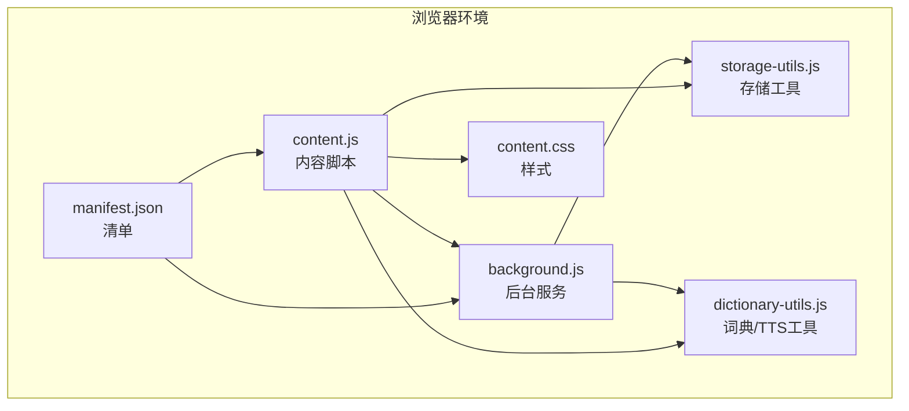
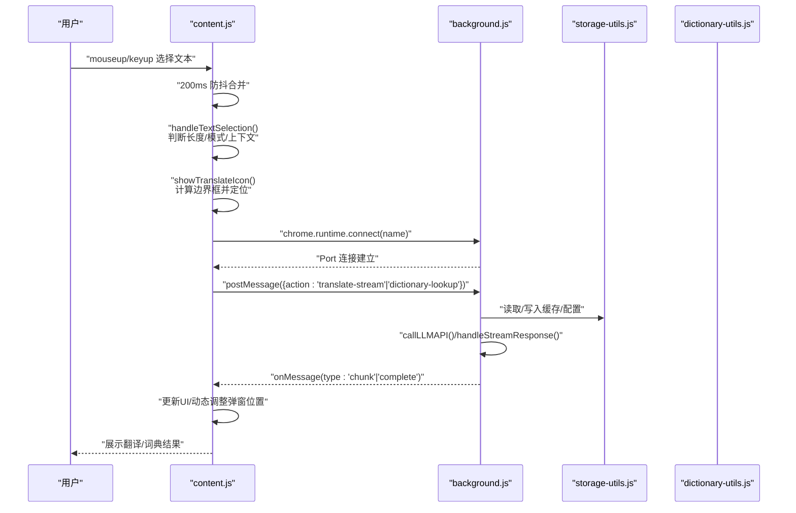
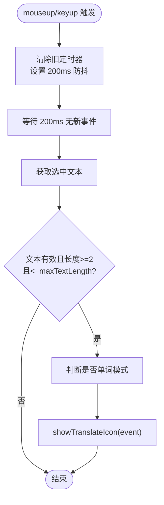
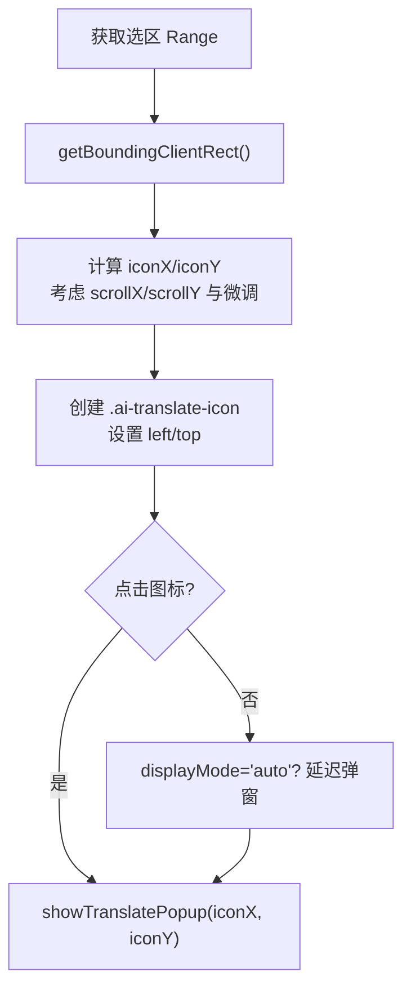
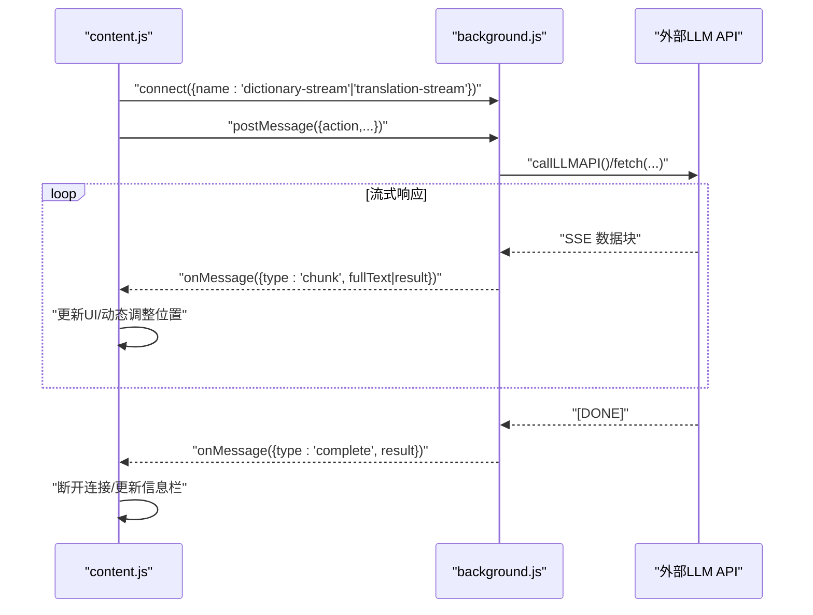
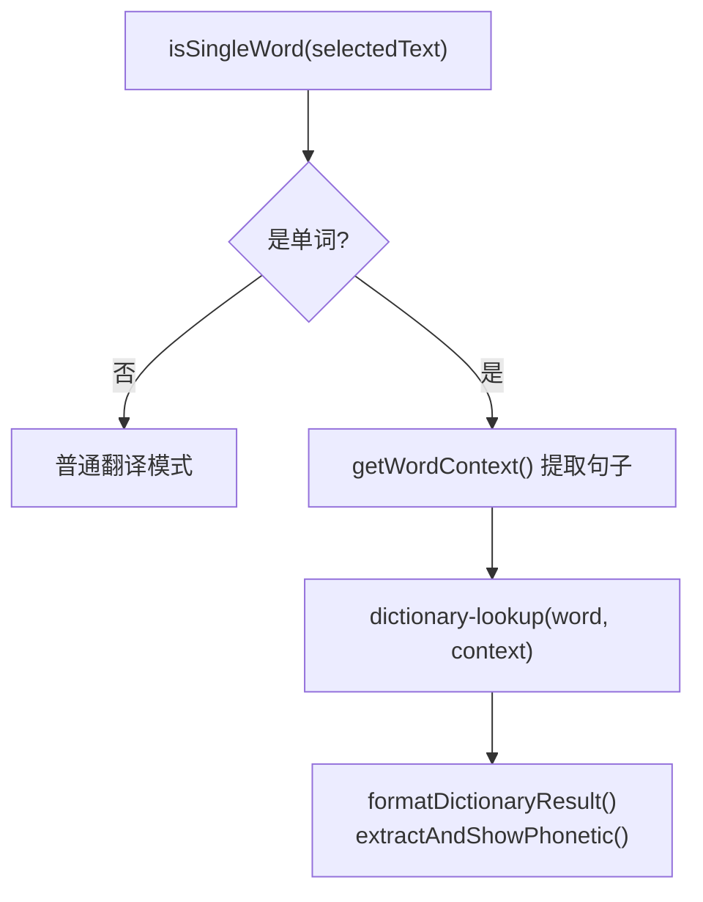
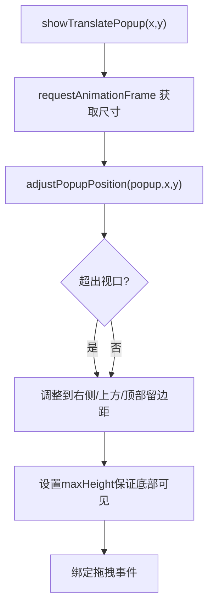
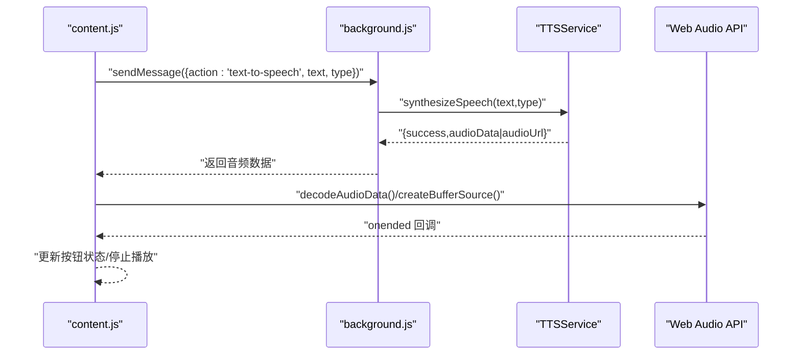
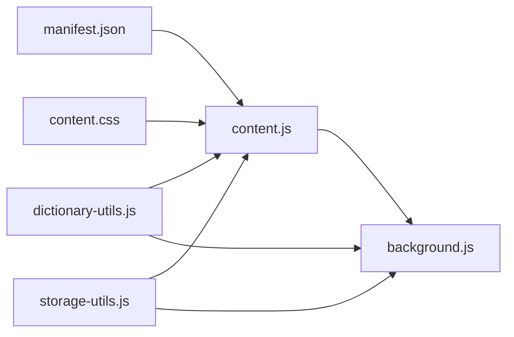

# 划词翻译功能

<cite>
**本文引用的文件**
- [content.js](file://content.js)
- [background.js](file://background.js)
- [manifest.json](file://manifest.json)
- [content.css](file://content.css)
- [dictionary-utils.js](file://dictionary-utils.js)
- [storage-utils.js](file://storage-utils.js)
</cite>

## 目录
1. [简介](#简介)
2. [项目结构](#项目结构)
3. [核心组件](#核心组件)
4. [架构总览](#架构总览)
5. [详细组件分析](#详细组件分析)
6. [依赖关系分析](#依赖关系分析)
7. [性能考量](#性能考量)
8. [故障排查指南](#故障排查指南)
9. [结论](#结论)
10. [附录](#附录)

## 简介
本文件围绕 QuickTrans 的“划词翻译”功能展开，聚焦 content.js 中通过鼠标抬起与键盘按键事件监听用户文本选择行为的实现机制，详解 200ms 防抖策略如何避免频繁触发；详述 showTranslateIcon 如何利用 getBoundingClientRect 获取选区边界框并精确定位翻译图标在选中文本右上角的计算逻辑；解释图标点击后如何通过 chrome.runtime.connect 建立长连接触发翻译流程；说明 displayMode 为 'auto' 时自动弹出翻译窗口的用户体验设计。同时，结合代码片段路径展示从文本选中到图标渲染的完整数据流，说明与 background.js 的通信协议，并提供性能优化建议与复杂 DOM 下的定位兼容性处理方案。

## 项目结构
QuickTrans 采用 Manifest V3，content.js 作为内容脚本注入页面，负责监听用户选择、渲染图标与弹窗、与后台交互；background.js 作为 Service Worker，负责翻译与 TTS 的实际调用与流式处理；manifest.json 声明权限与注入时机；content.css 提供样式；dictionary-utils.js 与 storage-utils.js 提供共享工具与存储能力。

图表来源
- [manifest.json](file://manifest.json#L1-L52)
- [content.js](file://content.js#L1-L120)
- [background.js](file://background.js#L1-L60)
- [content.css](file://content.css#L1-L60)
- [dictionary-utils.js](file://dictionary-utils.js#L1-L40)
- [storage-utils.js](file://storage-utils.js#L1-L40)

章节来源
- [manifest.json](file://manifest.json#L1-L52)
- [content.js](file://content.js#L1-L120)
- [background.js](file://background.js#L1-L60)
- [content.css](file://content.css#L1-L60)
- [dictionary-utils.js](file://dictionary-utils.js#L1-L40)
- [storage-utils.js](file://storage-utils.js#L1-L40)

## 核心组件
- 事件监听与防抖：在文档层面监听 mouseup 与 keyup，统一进入 handleTextSelection，并以 200ms 防抖合并高频触发。
- 图标渲染：通过 getBoundingClientRect 计算选区边界，创建并定位 .ai-translate-icon，点击后触发弹窗。
- 弹窗与流式翻译：通过 chrome.runtime.connect 建立长连接，使用 Port 接收流式数据，逐步更新 UI 并动态调整位置。
- 用户偏好与模式：displayMode 为 'auto' 时自动弹窗；支持词典模式与普通翻译模式。
- TTS 与音频播放：通过 sendMessage 触发后台 TTS，使用 Web Audio API 播放音频，支持多种格式与 PCM 转 WAV。
- 位置与兼容性：adjustPopupPosition 在视口内自适应，考虑滚动偏移与上下文变化，保证弹窗始终可见。

章节来源
- [content.js](file://content.js#L120-L240)
- [content.js](file://content.js#L236-L440)
- [content.js](file://content.js#L614-L728)
- [content.js](file://content.js#L834-L1072)
- [content.js](file://content.js#L1300-L1423)

## 架构总览
从用户选择到翻译完成的端到端流程如下：

图表来源
- [content.js](file://content.js#L132-L234)
- [content.js](file://content.js#L236-L440)
- [content.js](file://content.js#L614-L728)
- [background.js](file://background.js#L720-L820)
- [storage-utils.js](file://storage-utils.js#L356-L422)
- [dictionary-utils.js](file://dictionary-utils.js#L1-L40)

## 详细组件分析

### 事件监听与防抖机制
- 监听 mouseup 与 keyup，统一进入 handleTextSelection。
- 使用 setTimeout 清理与重置 debounceTimer，确保在 200ms 内多次触发仅执行一次。
- 防抖期间移除旧图标，避免重复渲染。
- 条件过滤：displayMode 为 'contextMenu' 时不处理划词，移除旧图标。
- 文本长度与目标长度限制：小于 2 或超过用户设置上限则不处理。

图表来源
- [content.js](file://content.js#L132-L181)
- [content.js](file://content.js#L183-L234)

章节来源
- [content.js](file://content.js#L132-L181)
- [content.js](file://content.js#L183-L234)

### 图标定位与自动弹窗逻辑
- 通过 window.getSelection().getRangeAt(0).getBoundingClientRect() 获取选区矩形。
- 计算图标位置：右上角 + 滚动偏移 + 微调间距，设置绝对定位。
- 点击图标时，showTranslatePopup(x,y) 以当前位置初始化弹窗。
- displayMode 为 'auto' 时，在图标显示后延迟约 500ms 若图标仍存在则自动弹窗，提升体验。

图表来源
- [content.js](file://content.js#L186-L234)
- [content.js](file://content.js#L236-L391)

章节来源
- [content.js](file://content.js#L186-L234)
- [content.js](file://content.js#L236-L391)

### 弹窗与流式翻译通信协议
- content.js 通过 chrome.runtime.connect 建立两个 Port：
  - dictionary-stream：用于词典查询，携带 {action:'dictionary-lookup', word, context}
  - translation-stream：用于翻译，携带 {action:'translate-stream', text, sourceLanguage, targetLanguage}
- background.js onConnect 监听并根据 name 分发处理：
  - dictionary-stream：构建词典提示词，调用 API，流式返回 chunk，完成时 complete
  - translation-stream：构建翻译提示词，调用 API，流式返回 chunk，完成时 complete
- content.js 在每次 chunk 到达时：
  - 清除首次加载动画
  - 实时更新结果区域
  - 动态调整弹窗位置（考虑内容增长与滚动）
- 完成后断开连接，更新底部信息栏（模型与 token 使用）

图表来源
- [content.js](file://content.js#L463-L565)
- [content.js](file://content.js#L635-L728)
- [background.js](file://background.js#L720-L820)
- [background.js](file://background.js#L139-L201)

章节来源
- [content.js](file://content.js#L463-L565)
- [content.js](file://content.js#L635-L728)
- [background.js](file://background.js#L720-L820)
- [background.js](file://background.js#L139-L201)

### 词典模式与上下文提取
- isSingleWord 通过 shared 工具判断是否为单词（支持复合词）。
- getWordContext 从选区文本节点提取包含单词的句子，必要时截取上下文并高亮单词。
- 词典查询时携带 word 与 context，后台据此构造提示词，返回释义、音标、上下文翻译等。

图表来源
- [content.js](file://content.js#L1401-L1415)
- [content.js](file://content.js#L1332-L1399)
- [content.js](file://content.js#L442-L565)
- [dictionary-utils.js](file://dictionary-utils.js#L1-L46)

章节来源
- [content.js](file://content.js#L1401-L1415)
- [content.js](file://content.js#L1332-L1399)
- [content.js](file://content.js#L442-L565)
- [dictionary-utils.js](file://dictionary-utils.js#L1-L46)

### 弹窗位置自适应与拖拽
- adjustPopupPosition 以视口为基准，考虑滚动偏移与边距，优先显示在选区右侧下方，若空间不足则尝试上方或顶部留边距。
- 动态计算最大高度，确保底部操作区可见。
- 支持拖拽：按下头部开始拖拽，移动时限制在视口范围内，释放时移除全局监听。

图表来源
- [content.js](file://content.js#L393-L440)
- [content.js](file://content.js#L1210-L1299)

章节来源
- [content.js](file://content.js#L393-L440)
- [content.js](file://content.js#L1210-L1299)

### TTS 与音频播放
- content.js 通过 sendMessage 触发后台 TTS，支持 word/sentence 两种类型。
- 后台 TTSService 根据 provider 调用不同 API，返回 Base64 音频数据。
- content.js 使用 Web Audio API 解码并播放，支持 mp3/wav/opus/aac/flac/pcm，PCM 自动转换为 WAV。
- 播放状态通过按钮类名与图标切换，支持停止与错误提示。

图表来源
- [content.js](file://content.js#L839-L1072)
- [background.js](file://background.js#L353-L511)
- [dictionary-utils.js](file://dictionary-utils.js#L80-L127)

章节来源
- [content.js](file://content.js#L839-L1072)
- [background.js](file://background.js#L353-L511)
- [dictionary-utils.js](file://dictionary-utils.js#L80-L127)

## 依赖关系分析
- content.js 依赖：
  - manifest.json：声明 content_scripts 注入时机与 CSS。
  - content.css：定义图标与弹窗样式。
  - dictionary-utils.js：共享的格式化、音标提取、PCM/WAV 转换、HTML 转义、单词判断。
  - storage-utils.js：用户偏好、API/TTS 配置、缓存与 token 统计。
- background.js 依赖：
  - storage-utils.js：读取/写入配置与缓存。
  - language-detector.js：语言检测（在导入脚本中使用）。
- 通信：
  - content.js 通过 runtime.sendMessage 与 runtime.connect 与 background.js 交互。
  - 通过 Port 进行流式数据传输，提高首字响应速度与用户体验。

图表来源
- [manifest.json](file://manifest.json#L19-L27)
- [content.js](file://content.js#L1-L120)
- [content.css](file://content.css#L1-L60)
- [dictionary-utils.js](file://dictionary-utils.js#L1-L40)
- [storage-utils.js](file://storage-utils.js#L1-L40)
- [background.js](file://background.js#L1-L20)

章节来源
- [manifest.json](file://manifest.json#L19-L27)
- [content.js](file://content.js#L1-L120)
- [content.css](file://content.css#L1-L60)
- [dictionary-utils.js](file://dictionary-utils.js#L1-L40)
- [storage-utils.js](file://storage-utils.js#L1-L40)
- [background.js](file://background.js#L1-L20)

## 性能考量
- 防抖与去抖：200ms 防抖显著降低事件风暴，减少 DOM 重建与网络请求次数。
- 流式渲染：Port + SSE 流式返回，边到边显，避免一次性渲染大文本造成的卡顿。
- 动态位置更新：每次 chunk 到达后通过 requestAnimationFrame 重新计算弹窗位置，避免内容增长导致溢出。
- 缓存策略：使用 chrome.storage.session 临时缓存翻译结果，浏览器关闭即清空，避免持久化占用。
- 音频解码：Web Audio API 解码，避免 CSP 限制；对 PCM 自动转换为 WAV，保证可播放性。
- 内存与资源回收：closePopup 清理拖拽监听、停止音频、移除弹窗与图标，避免内存泄漏。

章节来源
- [content.js](file://content.js#L146-L181)
- [content.js](file://content.js#L463-L565)
- [content.js](file://content.js#L635-L728)
- [content.js](file://content.js#L1300-L1322)
- [storage-utils.js](file://storage-utils.js#L356-L422)

## 故障排查指南
- 翻译失败：
  - 检查 API 配置是否有效（NO_API_CONFIG）。
  - 速率限制或服务不可用（RATE_LIMIT/SERVICE_UNAVAILABLE）。
  - 网络错误或超时（TIMEOUT/NETWORK_ERROR）。
  - 在弹窗错误区域提供“前往设置/重试/切换API”等操作。
- TTS 失败：
  - 检查 TTS 配置与提供商（qwen/openai）。
  - 音频格式检测失败或解码异常（PCM 需转换为 WAV）。
- 图标不显示：
  - 选中文本长度小于 2 或超过上限。
  - 源语言与目标语言相同，不显示图标。
  - displayMode 为 'contextMenu' 时不会显示图标。
- 弹窗位置异常：
  - 检查视口尺寸与滚动偏移，确认 adjustPopupPosition 的边界约束是否生效。
  - 复杂 DOM 下，建议在内容更新后再次触发 requestAnimationFrame 重新定位。

章节来源
- [content.js](file://content.js#L730-L777)
- [background.js](file://background.js#L203-L323)
- [content.js](file://content.js#L186-L234)
- [content.js](file://content.js#L393-L440)

## 结论
QuickTrans 的划词翻译功能通过事件防抖、精准定位、流式通信与弹窗自适应等机制，实现了流畅的用户体验。content.js 与 background.js 的职责清晰：前者专注 UI 与交互，后者专注业务与流式处理。配合 shared 工具与存储模块，系统具备良好的扩展性与稳定性。建议在复杂页面中持续关注位置更新与资源回收，以进一步提升性能与可靠性。

## 附录
- 通信协议要点：
  - Port 名称：dictionary-stream、translation-stream
  - 请求字段：dictionary-lookup(word, context)、translate-stream(text, sourceLanguage, targetLanguage)
  - 响应类型：chunk（实时增量）、complete（最终结果）
- 用户偏好：
  - lastTargetLanguage、autoShowPopup、displayMode、popupPosition、maxTextLength
- 样式与交互：
  - .ai-translate-icon、.ai-translate-popup、拖拽类名 dragging 等

章节来源
- [content.js](file://content.js#L463-L565)
- [content.js](file://content.js#L635-L728)
- [content.css](file://content.css#L1-L120)
- [storage-utils.js](file://storage-utils.js#L310-L342)