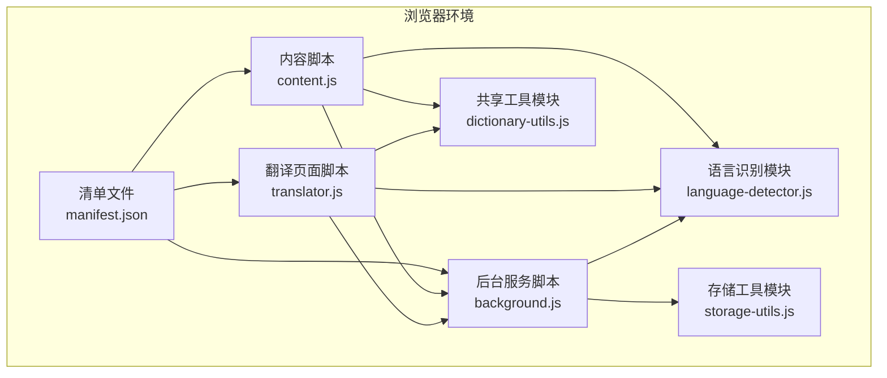
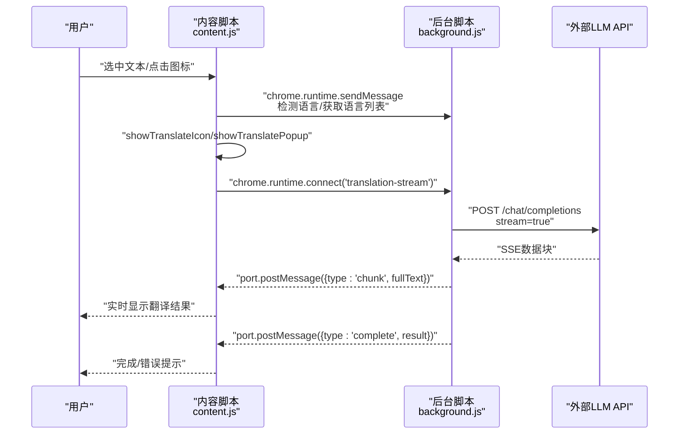
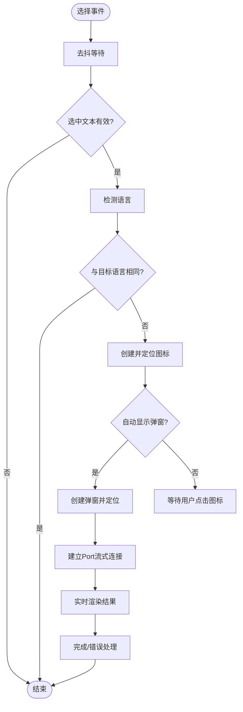
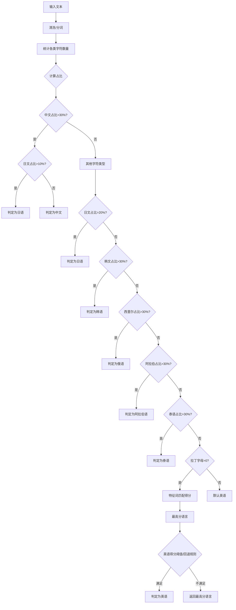
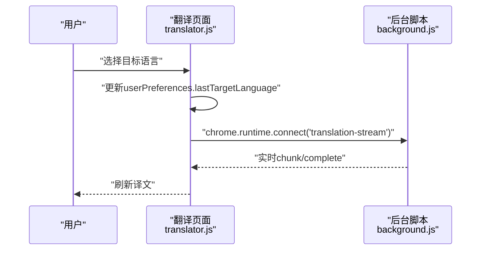
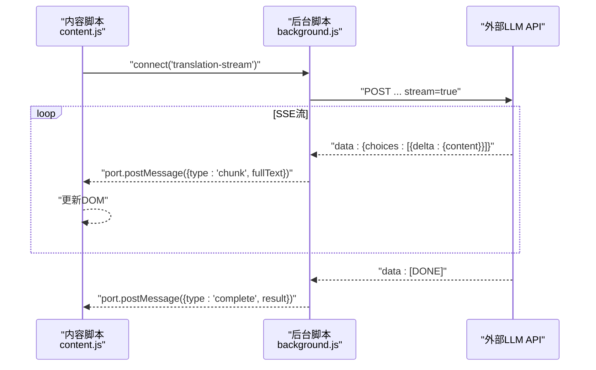
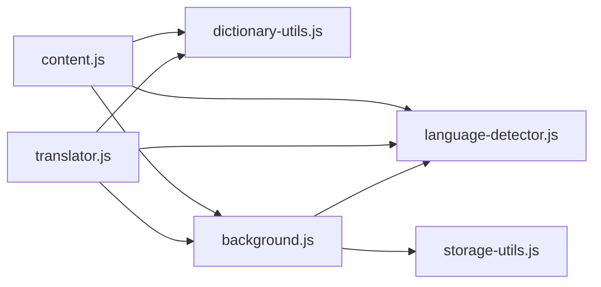

# 核心功能详解

<cite>
**本文引用的文件**
- [content.js](file://content.js)
- [language-detector.js](file://language-detector.js)
- [translator.js](file://translator.js)
- [background.js](file://background.js)
- [dictionary-utils.js](file://dictionary-utils.js)
- [storage-utils.js](file://storage-utils.js)
- [manifest.json](file://manifest.json)
</cite>

## 目录
1. [引言](#引言)
2. [项目结构](#项目结构)
3. [核心组件](#核心组件)
4. [架构总览](#架构总览)
5. [详细组件分析](#详细组件分析)
6. [依赖关系分析](#依赖关系分析)
7. [性能考量](#性能考量)
8. [故障排查指南](#故障排查指南)
9. [结论](#结论)

## 引言
本文件面向QuickTrans的核心功能，围绕“划词翻译”“语言自动识别”“目标语言实时切换”“流式输出体验”四大主题展开，结合代码路径与流程图，帮助开发者快速理解实现机制并进行二次开发。

## 项目结构
QuickTrans采用Manifest V3架构，核心由内容脚本、后台服务脚本、翻译页面脚本、语言识别模块、共享工具模块与存储工具模块组成。内容脚本负责页面级交互与弹窗；后台脚本负责API调用、流式处理与缓存；翻译页面脚本提供独立翻译界面；语言识别模块提供本地语言判定；共享工具模块提供词典格式化、TTS辅助能力；存储工具模块提供配置与缓存管理。

图表来源
- [manifest.json](file://manifest.json#L1-L52)
- [content.js](file://content.js#L1-L120)
- [translator.js](file://translator.js#L1-L120)
- [background.js](file://background.js#L1-L120)
- [language-detector.js](file://language-detector.js#L1-L60)
- [dictionary-utils.js](file://dictionary-utils.js#L1-L60)
- [storage-utils.js](file://storage-utils.js#L1-L60)

章节来源
- [manifest.json](file://manifest.json#L1-L52)

## 核心组件
- 划词翻译（内容脚本）：监听选择事件、防抖、图标定位与显示、消息触发翻译、弹窗拖拽与位置自适应、词典模式与TTS集成。
- 语言自动识别：基于Unicode范围与特征词的本地判定，覆盖13种语言。
- 目标语言实时切换：监听下拉框变化，更新用户偏好并重新发起翻译。
- 流式输出：通过Port长连接接收SSE数据块，渐进式渲染，提升首字响应与长文本体验。

章节来源
- [content.js](file://content.js#L132-L234)
- [language-detector.js](file://language-detector.js#L26-L141)
- [translator.js](file://translator.js#L391-L401)
- [background.js](file://background.js#L139-L201)

## 架构总览
QuickTrans在浏览器端通过内容脚本与后台脚本协作，翻译页面脚本提供独立入口。内容脚本与翻译页面脚本均通过Port建立长连接，后台脚本负责调用外部LLM API，按SSE流式返回增量内容，前端逐步渲染，同时维护缓存与用户偏好。

图表来源
- [content.js](file://content.js#L183-L234)
- [content.js](file://content.js#L236-L391)
- [background.js](file://background.js#L720-L984)
- [background.js](file://background.js#L139-L201)

## 详细组件分析

### 划词翻译：selectionchange事件监听、防抖、图标定位与显示、消息触发
- 事件监听与防抖
  - 监听mouseup/keyup事件，使用定时器对频繁选择进行去抖，避免重复图标与弹窗创建。
  - 选中文本长度小于阈值或超过用户配置上限时跳过处理。
- 图标定位与显示
  - 使用选区边界矩形计算图标位置，右上角偏移显示；若检测到语言与目标语言一致则不显示图标。
  - 点击图标触发弹窗显示，支持自动显示模式延迟展示。
- 弹窗与位置自适应
  - 弹窗先置于视口外隐藏，等待DOM更新后测量尺寸并调整位置，保证不越界；动态计算最大高度确保底部按钮可见。
  - 支持拖拽移动，拖拽过程实时更新弹窗位置并重算布局。
- 消息触发翻译
  - 通过chrome.runtime.sendMessage请求语言检测与语言列表；通过chrome.runtime.connect建立Port进行流式翻译。
  - 右键菜单翻译时，记录鼠标位置并在特殊页面使用视口中心作为备选位置。

图表来源
- [content.js](file://content.js#L132-L234)
- [content.js](file://content.js#L236-L391)
- [content.js](file://content.js#L393-L440)
- [content.js](file://content.js#L1200-L1322)

章节来源
- [content.js](file://content.js#L132-L234)
- [content.js](file://content.js#L236-L391)
- [content.js](file://content.js#L393-L440)
- [content.js](file://content.js#L1200-L1322)

### 语言自动识别：Unicode范围与特征词双策略
- Unicode范围识别
  - 统计中文、日文假名、韩文、西里尔字母、阿拉伯、泰语、拉丁字母等字符占比，设定阈值判断语言。
  - 中文与日文存在交叠（汉字），通过日文假名占比进一步区分。
- 拉丁字母语言细化
  - 对英语、法语、德语、西班牙语、葡萄牙语、意大利语分别构建特征词集合，统计命中得分，综合判定。
  - 英语得分阈值更高，避免误判；当非英语得分较低时回退为英语。
- 支持语言列表
  - 内置13种语言映射，提供名称查询与可用性校验。

图表来源
- [language-detector.js](file://language-detector.js#L26-L141)
- [language-detector.js](file://language-detector.js#L143-L227)

章节来源
- [language-detector.js](file://language-detector.js#L26-L141)
- [language-detector.js](file://language-detector.js#L143-L227)

### 目标语言实时切换：translator.js响应语言选择变化
- 事件绑定
  - 翻译页面中目标语言下拉框change事件绑定处理器。
- 偏好更新与重翻译
  - 更新lastTargetLanguage并持久化；随后重新发起翻译请求，实现即时切换。
- 内容脚本中的切换
  - 同步更新用户偏好并重新发起翻译，保持两端一致性。

图表来源
- [translator.js](file://translator.js#L391-L401)
- [content.js](file://content.js#L779-L791)

章节来源
- [translator.js](file://translator.js#L391-L401)
- [content.js](file://content.js#L779-L791)

### 流式输出（Streaming）：实现原理与体验优势
- 建立长连接
  - 内容脚本与翻译页面脚本均通过chrome.runtime.connect(name)建立Port，后台脚本在onConnect中监听对应名称。
- SSE数据解析
  - 后台脚本读取fetch响应体的reader，按行解析SSE数据，过滤掉[DONE]标记，提取choices.delta.content增量文本。
  - 支持stream_options包含usage统计，最终返回完整usage。
- 前端渐进渲染
  - 首次收到chunk时清除加载动画，实时拼接fullText并渲染；长文本滚动与弹窗尺寸自适应保证良好体验。
- 体验优势
  - 首字响应更快、长文本可中断可续、错误可重试、缓存命中可直接显示。

图表来源
- [content.js](file://content.js#L614-L728)
- [translator.js](file://translator.js#L218-L299)
- [background.js](file://background.js#L139-L201)
- [background.js](file://background.js#L720-L984)

章节来源
- [content.js](file://content.js#L614-L728)
- [translator.js](file://translator.js#L218-L299)
- [background.js](file://background.js#L139-L201)
- [background.js](file://background.js#L720-L984)

### 词典模式与上下文：单词识别、上下文提取、TTS与音标
- 单词识别
  - 通过DictionaryUtils.isSingleWord判断英文单词（含连字符/撇号的复合词）。
- 上下文提取
  - 内容脚本与翻译页面脚本均提供上下文提取逻辑，基于句子边界（.!?。！？或换行）截取，避免过长上下文。
- 词典查询与TTS
  - 词典查询同样走Port流式连接，支持上下文翻译；音标提取支持多种格式；TTS通过后台脚本合成并使用Web Audio API播放，绕过CSP限制。
- 音标与格式化
  - DictionaryUtils.formatDictionaryResult支持Markdown渲染，extractAndShowPhonetic提取音标并显示。

章节来源
- [content.js](file://content.js#L1332-L1399)
- [translator.js](file://translator.js#L439-L488)
- [dictionary-utils.js](file://dictionary-utils.js#L1-L77)
- [dictionary-utils.js](file://dictionary-utils.js#L190-L237)
- [translator.js](file://translator.js#L821-L1078)

## 依赖关系分析
- 内容脚本依赖
  - 语言识别模块：用于检测源语言与目标语言是否一致，决定是否显示图标与弹窗。
  - 共享工具模块：HTML转义、单词识别、音标提取、PCM转WAV等。
  - 后台脚本：提供语言检测、语言列表、流式翻译、TTS合成、缓存与统计。
- 翻译页面脚本依赖
  - 语言识别模块：加载语言选项与自动检测。
  - 共享工具模块：词典格式化、音标提取、HTML转义。
  - 后台脚本：流式翻译、TTS、剪贴板读取、用户偏好。
- 存储工具模块
  - API配置、TTS配置、用户偏好、翻译缓存、token统计等。

图表来源
- [content.js](file://content.js#L1-L120)
- [translator.js](file://translator.js#L1-L120)
- [background.js](file://background.js#L1-L120)
- [storage-utils.js](file://storage-utils.js#L1-L120)

章节来源
- [content.js](file://content.js#L1-L120)
- [translator.js](file://translator.js#L1-L120)
- [background.js](file://background.js#L1-L120)
- [storage-utils.js](file://storage-utils.js#L1-L120)

## 性能考量
- 流式渲染降低首字延迟，长文本渐进显示，避免一次性DOM更新带来的卡顿。
- 缓存策略：使用chrome.storage.session缓存翻译结果，浏览器关闭后自动清空，避免重复请求。
- 防抖与边界检测：减少不必要的图标与弹窗创建，避免越界重绘。
- 音频播放：使用Web Audio API解码与播放，避免传统Audio元素受CSP限制。

章节来源
- [storage-utils.js](file://storage-utils.js#L356-L422)
- [content.js](file://content.js#L132-L234)
- [translator.js](file://translator.js#L218-L299)

## 故障排查指南
- 无API配置
  - 后台脚本检测到未配置API时返回NO_API_CONFIG，前端显示“前往设置”按钮。
- 速率限制/服务不可用
  - 后台脚本根据HTTP状态码返回RATE_LIMIT/SERVICE_UNAVAILABLE，前端提供“重试/切换API”按钮。
- 网络超时/解析错误
  - 后台脚本设置30秒超时，异常时返回TIMEOUT/STREAM_ERROR等错误码，前端提示重试。
- 右键菜单翻译位置异常
  - 特殊页面无法获取鼠标位置时，使用视口中心作为备选位置；若仍失败，弹窗不会显示。

章节来源
- [background.js](file://background.js#L203-L323)
- [content.js](file://content.js#L730-L778)
- [translator.js](file://translator.js#L777-L820)

## 结论
QuickTrans通过内容脚本与后台脚本的协同，实现了高效、稳定的划词翻译体验。语言识别模块提供本地快速判定，目标语言切换与流式输出进一步提升了交互效率与用户体验。共享工具模块与存储模块保障了格式化、TTS与缓存的可复用性与可靠性。开发者可在现有基础上扩展更多语言、优化UI与交互，或接入更多API提供商。