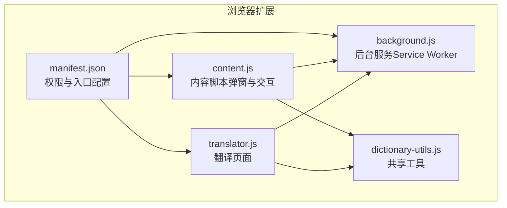
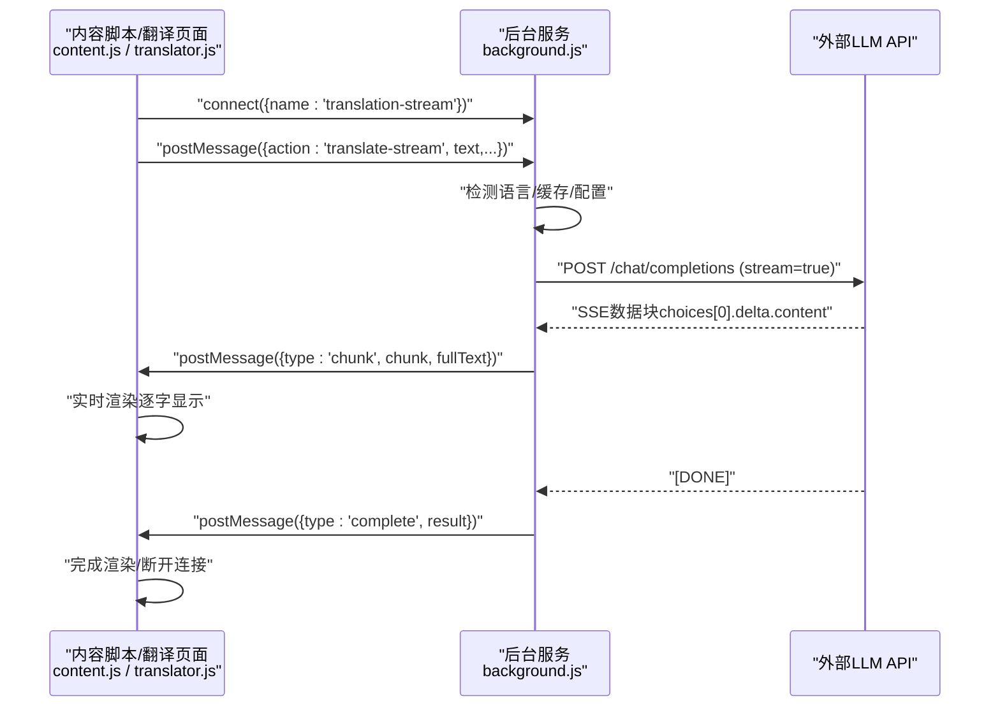
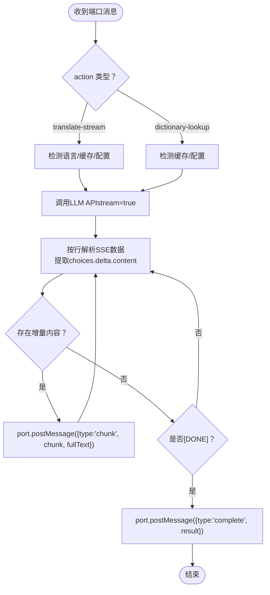
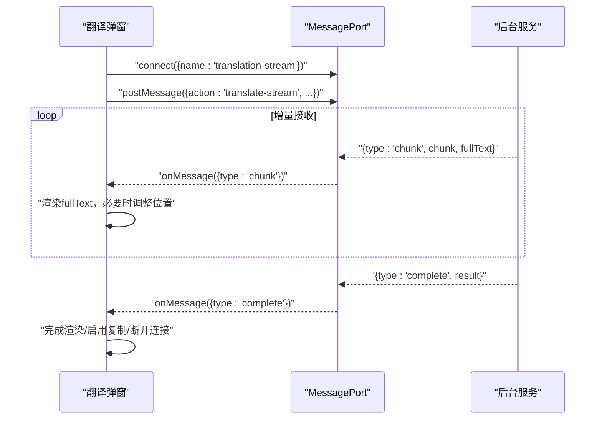
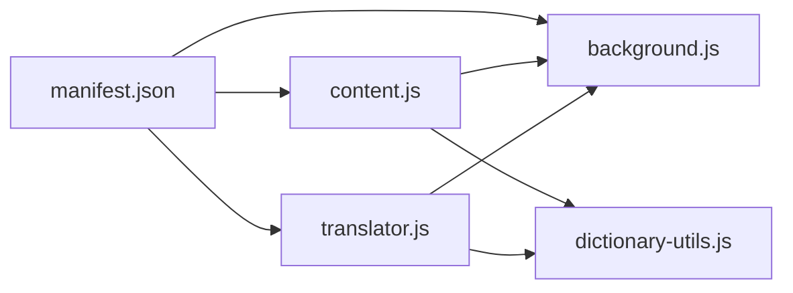

# 流式输出实现

<cite>
**本文引用的文件**
- [background.js](file://background.js)
- [content.js](file://content.js)
- [manifest.json](file://manifest.json)
- [dictionary-utils.js](file://dictionary-utils.js)
- [translator.js](file://translator.js)
</cite>

## 目录
1. [简介](#简介)
2. [项目结构](#项目结构)
3. [核心组件](#核心组件)
4. [架构总览](#架构总览)
5. [详细组件分析](#详细组件分析)
6. [依赖关系分析](#依赖关系分析)
7. [性能考量](#性能考量)
8. [故障排查指南](#故障排查指南)
9. [结论](#结论)
10. [附录](#附录)

## 简介
本文件系统性地文档化 QuickTrans 的流式输出技术架构，聚焦于 background.js 中通过 chrome.runtime.connect 建立的“translation-stream”和“dictionary-stream”长连接，解释如何利用 MessagePort 实现服务器发送事件（SSE）风格的增量更新；详述 content.js 中 onMessage 监听器对 {type: 'chunk'} 消息的处理流程，实现实时将 partial text 渲染到翻译弹窗，营造逐字显示的流畅体验。同时对比流式传输与传统请求-响应模式的性能优势（降低首字延迟、提升大文本翻译的感知速度），并总结流式协议设计要点（chunk 分块策略、错误恢复机制、complete 消息终结处理）、最佳实践（连接超时管理、内存优化）。

## 项目结构
QuickTrans 采用 Manifest V3 架构，核心由后台 Service Worker（background.js）承载翻译与词典流式处理，内容脚本（content.js）负责 UI 交互与弹窗渲染，翻译页面（translator.js）提供独立界面，dictionary-utils.js 提供共享工具方法。

图表来源
- [manifest.json](file://manifest.json#L1-L52)
- [background.js](file://background.js#L1-L120)
- [content.js](file://content.js#L1-L120)
- [translator.js](file://translator.js#L1-L120)
- [dictionary-utils.js](file://dictionary-utils.js#L1-L60)

章节来源
- [manifest.json](file://manifest.json#L1-L52)

## 核心组件
- 流式翻译服务（background.js）
  - 通过 onConnect 监听“translation-stream”和“dictionary-stream”端口，建立长连接。
  - 使用 fetch + ReadableStream Reader 实现 SSE 风格增量解析，回调 onChunk 将增量内容通过 port.postMessage({type:'chunk', ...}) 推送至前端。
  - 完成后发送 {type:'complete', result} 结束消息，携带缓存命中、usage 统计等信息。
- 内容脚本（content.js）
  - 在弹窗中建立 port 连接，监听 onMessage，处理 {type:'chunk'} 实时渲染，处理 {type:'complete'} 完成收尾与断开。
  - 支持词典模式与翻译模式，分别渲染词典释义与翻译结果。
- 翻译页面（translator.js）
  - 独立页面同样使用 port 进行流式翻译，逻辑与 content.js 一致。
- 共享工具（dictionary-utils.js）
  - 提供词典结果格式化、音标提取、音频格式检测与 PCM 转 WAV 等通用能力。

章节来源
- [background.js](file://background.js#L866-L984)
- [content.js](file://content.js#L442-L714)
- [translator.js](file://translator.js#L177-L288)
- [dictionary-utils.js](file://dictionary-utils.js#L1-L120)

## 架构总览
QuickTrans 的流式输出采用“后台 Service Worker + 内容脚本/页面”的双端协作模式：前端通过 chrome.runtime.connect 建立长连接，后台通过 fetch 流式读取 API 响应，按行解析 SSE 数据，逐块推送至前端，前端实时渲染，最终由 complete 消息收尾。

图表来源
- [content.js](file://content.js#L614-L714)
- [translator.js](file://translator.js#L177-L288)
- [background.js](file://background.js#L866-L984)

## 详细组件分析

### 后台 Service Worker（流式翻译与词典）
- 端口监听与路由
  - onConnect 监听两个端口名：dictionary-stream 与 translation-stream，分别进入词典查询与翻译处理分支。
- 翻译流式处理
  - 从存储获取活跃 API 配置，构造 system/user 提示词，调用 TranslationService.callLLMAPI 并传入 onChunk 回调。
  - onChunk 将增量内容与累积 fullText 通过 port.postMessage({type:'chunk', ...}) 推送。
  - 完成后发送 {type:'complete', result}，包含 success/cached/message/usage/model 等字段。
- 词典流式处理
  - 支持带上下文与不带上下文两种提示词模板，同样通过 onChunk 增量推送，完成时发送 {type:'complete', result}，其中包含 definition/contextTranslation。
- 错误处理
  - 捕获异常并发送 {type:'complete', result:{success:false, ...}}，保证前端能正确显示错误并断开连接。

图表来源
- [background.js](file://background.js#L866-L984)
- [background.js](file://background.js#L139-L201)

章节来源
- [background.js](file://background.js#L866-L984)
- [background.js](file://background.js#L139-L201)

### 内容脚本（弹窗与实时渲染）
- 弹窗初始化与位置调整
  - 根据 displayMode 自动显示或手动点击显示，动态计算弹窗尺寸并调整位置，避免超出视口。
- 流式翻译
  - 建立 port 连接，监听 onMessage：
    - {type:'chunk'}：首次收到时清空加载动画，实时更新 fullText 并渲染为 HTML（换行映射为  ），随后通过 requestAnimationFrame 重新调整弹窗位置。
    - {type:'complete'}：根据 result.success 渲染最终结果，启用复制按钮，显示模型与 token 使用信息，断开连接。
- 词典模式
  - 逻辑与翻译类似，但渲染格式化后的词典结果，支持音标提取与上下文翻译显示。

图表来源
- [content.js](file://content.js#L614-L714)
- [content.js](file://content.js#L442-L565)

章节来源
- [content.js](file://content.js#L442-L714)

### 翻译页面（独立窗口）
- 与内容脚本相同的流式处理流程：connect -> postMessage -> onMessage(chunk/complete) -> 渲染 -> 断开。
- 适用于批量翻译与更复杂的交互场景。

章节来源
- [translator.js](file://translator.js#L177-L288)

### 共享工具（词典结果格式化与音标提取）
- formatDictionaryResult：将 Markdown 风格的词典文本转换为 HTML，支持标题、加粗、斜体、行内代码、序号、列表等。
- extractAndShowPhonetic：从文本中提取音标并显示。
- 供 content.js 与 translator.js 复用。

章节来源
- [dictionary-utils.js](file://dictionary-utils.js#L1-L120)

## 依赖关系分析
- manifest.json
  - background.service_worker 指向 background.js。
  - content_scripts 注入 dictionary-utils.js 与 content.js，CSS 为 content.css。
- 模块间耦合
  - content.js/translator.js 依赖 background.js 的流式翻译与词典查询端口。
  - dictionary-utils.js 为 UI 层提供格式化与音标提取能力，被 content.js/translator.js 调用。
- 外部依赖
  - fetch + ReadableStream Reader 用于 SSE 风格增量读取。
  - chrome.runtime API 用于端口通信与消息传递。

图表来源
- [manifest.json](file://manifest.json#L1-L52)
- [content.js](file://content.js#L1-L120)
- [translator.js](file://translator.js#L1-L120)
- [dictionary-utils.js](file://dictionary-utils.js#L1-L60)
- [background.js](file://background.js#L1-L120)

章节来源
- [manifest.json](file://manifest.json#L1-L52)

## 性能考量
- 降低首字延迟
  - 流式传输使 API 首个 token 可立即到达，前端即时渲染，显著优于传统一次性响应。
- 提升大文本感知速度
  - 增量更新减少整体等待时间，用户感知更流畅。
- 连接超时与资源释放
  - fetch 请求设置 AbortController 超时（约 30 秒），异常时返回明确错误码，便于前端快速降级。
  - 完成或异常后及时断开 port，避免内存泄漏。
- 内存优化建议
  - 前端仅维护 fullText，避免重复拼接大字符串；必要时可考虑分片滚动更新。
  - 后端 onChunk 仅传递增量与累积文本，避免重复序列化。
  - 完成后清理定时器与事件监听，确保弹窗关闭时资源回收。

[本节为通用性能指导，不直接分析具体文件]

## 故障排查指南
- 常见错误类型与处理
  - 未配置 API：发送 {type:'complete', result:{success:false, errorCode:'NO_API_CONFIG'}}，前端显示“前往设置”按钮。
  - 频率限制/服务不可用：返回 RATE_LIMIT/SERVICE_UNAVAILABLE，前端提供“重试/切换API”按钮。
  - 网络超时/中断：返回 TIMEOUT，前端提示检查网络。
  - 翻译结果为空：返回 INVALID_RESPONSE，前端提示重试。
- 前端断开与重试
  - 完成后主动 port.disconnect()，避免资源占用。
  - 错误时提供重试按钮，重新发起翻译请求。
- 后端异常兜底
  - 捕获异常并发送 {type:'complete', result:{success:false, errorCode:'TRANSLATION_ERROR'}}，前端统一处理。

章节来源
- [background.js](file://background.js#L906-L917)
- [background.js](file://background.js#L970-L980)
- [content.js](file://content.js#L730-L777)
- [translator.js](file://translator.js#L273-L288)

## 结论
QuickTrans 的流式输出通过“后台 Service Worker + 内容脚本/页面”的协作，实现了 SSE 风格的增量推送与前端逐字渲染，显著降低了首字延迟并提升了大文本翻译的感知速度。协议设计清晰：chunk 增量、complete 终结、错误统一兜底；最佳实践涵盖超时控制与内存优化。该架构既满足划词翻译的即时反馈需求，也为独立翻译页面提供了稳定一致的体验。

[本节为总结性内容，不直接分析具体文件]

## 附录
- 流式协议要点
  - 增量分块：choices.delta.content 逐字推送，前端累积 fullText 并实时渲染。
  - 终结信号：SSE [DONE] 行后，后台发送 {type:'complete', result}。
  - 错误恢复：异常时发送 {type:'complete', result:{success:false, ...}}，前端提示与重试。
- 最佳实践清单
  - 前端：首次 chunk 清理加载动画；按需调整弹窗位置；完成/错误后断开连接。
  - 后端：统一 AbortController 超时；缓存命中优先；usage 统计随完成消息返回。
  - 共享：格式化与音标提取复用，保证 UI 一致性。

[本节为通用指导，不直接分析具体文件]