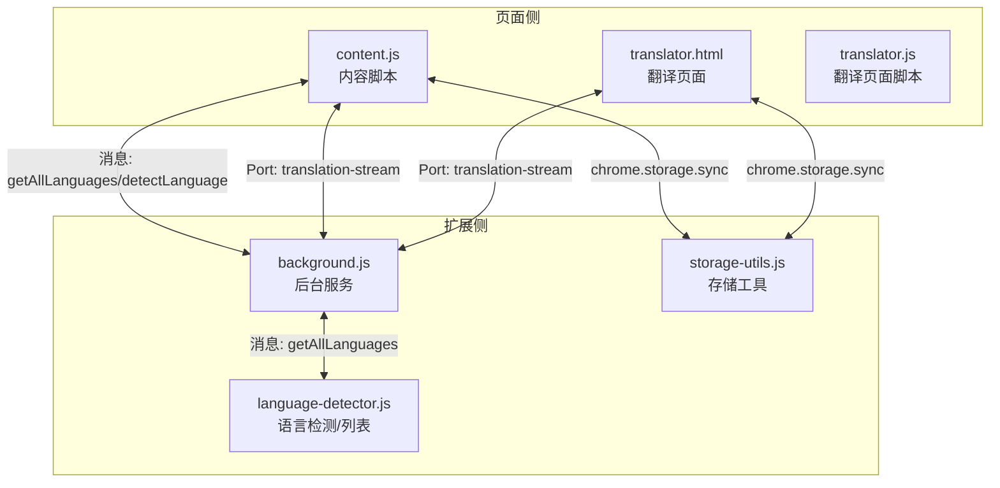
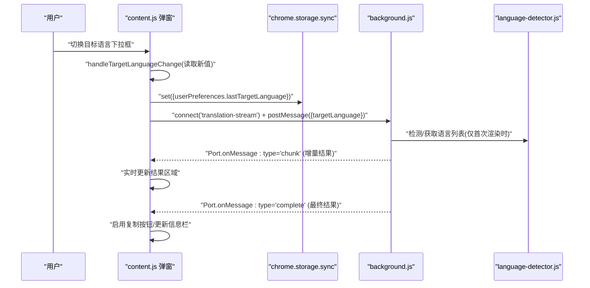
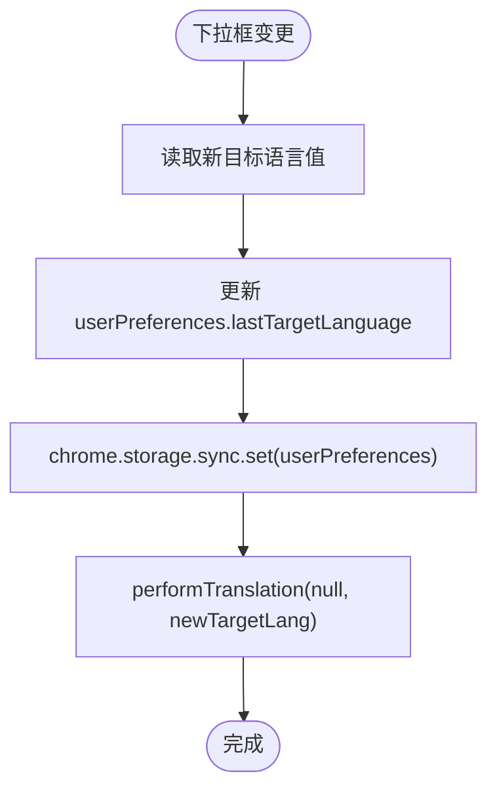
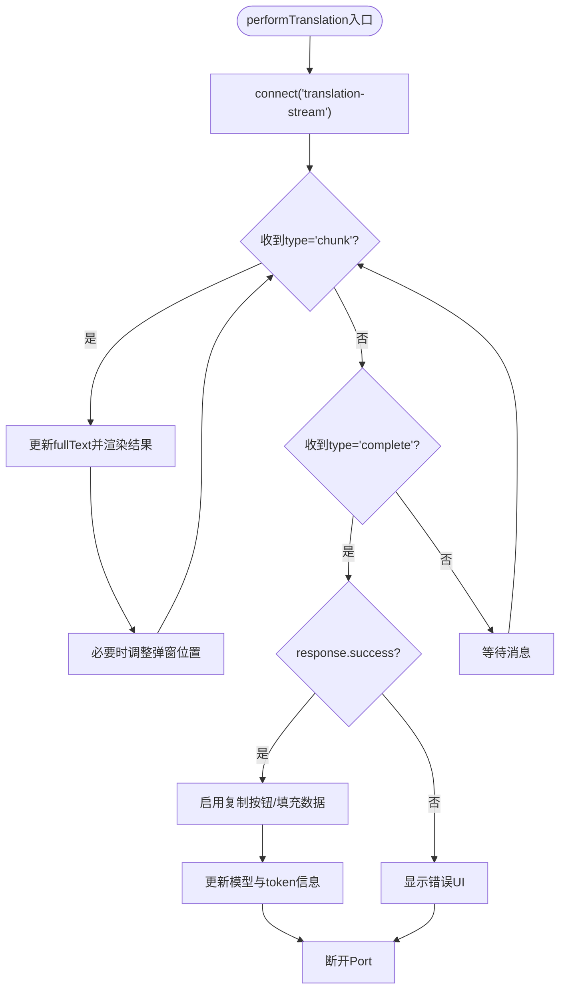
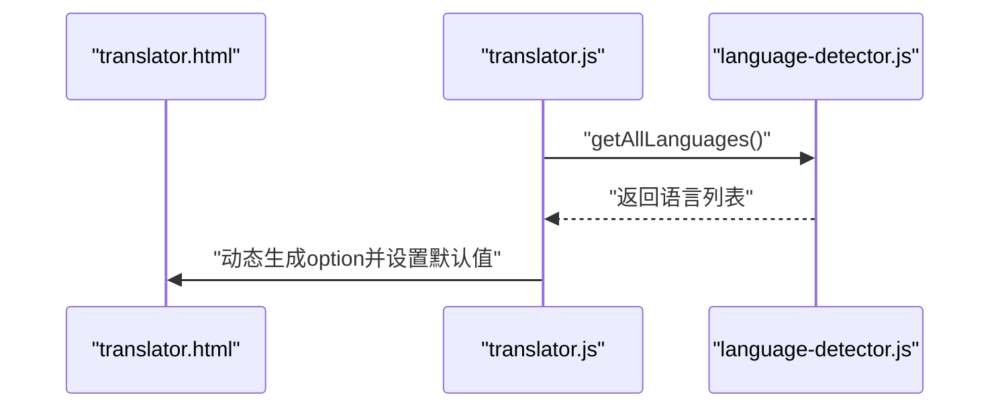
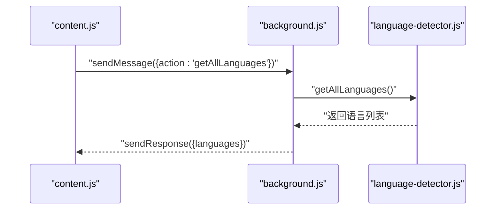
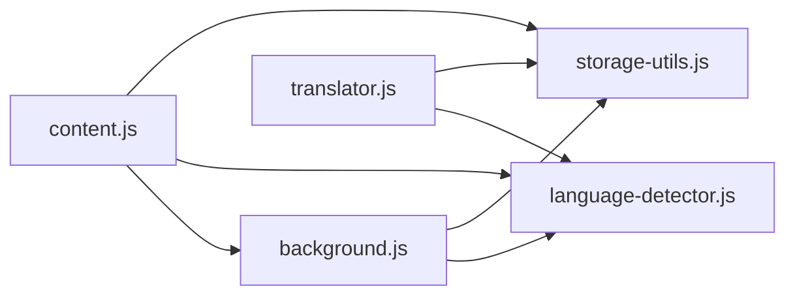

# 目标语言实时切换

<cite>
**本文引用的文件**
- [content.js](file://content.js)
- [translator.html](file://translator.html)
- [translator.js](file://translator.js)
- [background.js](file://background.js)
- [language-detector.js](file://language-detector.js)
- [storage-utils.js](file://storage-utils.js)
</cite>

## 目录
1. [简介](#简介)
2. [项目结构](#项目结构)
3. [核心组件](#核心组件)
4. [架构总览](#架构总览)
5. [详细组件分析](#详细组件分析)
6. [依赖关系分析](#依赖关系分析)
7. [性能考量](#性能考量)
8. [故障排查指南](#故障排查指南)
9. [结论](#结论)
10. [附录](#附录)

## 简介
本篇文档聚焦QuickTrans“目标语言实时切换”功能的实现原理，围绕content.js中的handleTargetLanguageChange事件处理器、performTranslation函数以及translator.html中select元素的动态渲染机制展开，系统阐述：
- 如何捕获下拉框变更事件，立即更新userPreferences.lastTargetLanguage并持久化到chrome.storage.sync；
- performTranslation如何基于新目标语言重新发起翻译请求，实现无缝结果替换；
- 语言选项列表的动态渲染（通过getAllLanguages消息获取支持语言）；
- 状态同步过程的时序关系（UI更新与API调用）；
- 并发请求处理策略（避免快速切换时的竞态条件）；
- 自定义语言列表的扩展开发指导。

## 项目结构
QuickTrans采用多页面脚本与后台服务Worker协同的架构：
- content.js：页面内容脚本，负责划词监听、弹窗显示与翻译交互；
- translator.html / translator.js：独立翻译页面，提供更完整的翻译体验；
- background.js：后台服务脚本，处理消息分发、翻译与TTS服务、缓存与统计；
- language-detector.js：语言识别与语言列表提供者；
- storage-utils.js：用户偏好与缓存等存储工具。

图表来源
- [content.js](file://content.js#L252-L261)
- [translator.js](file://translator.js#L280-L307)
- [background.js](file://background.js#L1017-L1022)
- [language-detector.js](file://language-detector.js#L244-L247)
- [storage-utils.js](file://storage-utils.js#L310-L342)

章节来源
- [content.js](file://content.js#L243-L391)
- [translator.html](file://translator.html#L21-L35)
- [translator.js](file://translator.js#L39-L112)
- [background.js](file://background.js#L1017-L1032)
- [language-detector.js](file://language-detector.js#L241-L247)
- [storage-utils.js](file://storage-utils.js#L310-L342)

## 核心组件
- content.js中的handleTargetLanguageChange：监听弹窗内目标语言下拉框变更，更新lastTargetLanguage并触发performTranslation。
- content.js中的performTranslation：建立Port长连接，接收流式翻译数据，实时更新UI，完成后再断开连接。
- translator.html中的select元素：在翻译页面中动态渲染语言选项，供用户选择目标语言。
- background.js中的消息监听：处理getAllLanguages、detectLanguage、翻译与TTS等请求。
- language-detector.js：提供getAllLanguages与语言检测能力。
- storage-utils.js：提供用户偏好读写与缓存管理。

章节来源
- [content.js](file://content.js#L779-L813)
- [content.js](file://content.js#L614-L728)
- [translator.html](file://translator.html#L21-L35)
- [translator.js](file://translator.js#L39-L112)
- [background.js](file://background.js#L1017-L1032)
- [language-detector.js](file://language-detector.js#L241-L247)
- [storage-utils.js](file://storage-utils.js#L310-L342)

## 架构总览
目标语言实时切换涉及“UI事件 -> 状态更新 -> API调用 -> 结果回传 -> UI替换”的闭环流程。content.js在弹窗中监听下拉框变更，立即更新用户偏好并发起翻译；background.js通过Port长连接返回流式结果，content.js实时渲染，形成无缝替换体验。

图表来源
- [content.js](file://content.js#L779-L813)
- [content.js](file://content.js#L614-L728)
- [background.js](file://background.js#L1017-L1032)
- [language-detector.js](file://language-detector.js#L241-L247)
- [storage-utils.js](file://storage-utils.js#L310-L342)

## 详细组件分析

### 1) 下拉框变更事件处理：handleTargetLanguageChange
- 事件绑定：在翻译模式下，content.js在showTranslatePopup中为#ai-translate-target-lang绑定change事件，回调即handleTargetLanguageChange。
- 状态更新：从事件对象读取新值，更新userPreferences.lastTargetLanguage。
- 持久化：调用chrome.storage.sync.set保存userPreferences。
- 触发重翻：立即调用performTranslation(null, newTargetLang)发起翻译请求。

图表来源
- [content.js](file://content.js#L779-L813)

章节来源
- [content.js](file://content.js#L386-L391)
- [content.js](file://content.js#L779-L813)
- [storage-utils.js](file://storage-utils.js#L310-L342)

### 2) 翻译函数：performTranslation
- 建立Port：connect('translation-stream')，监听onMessage。
- 流式渲染：收到type='chunk'时，清空加载动画并实时拼接fullText，更新结果区域，必要时调整弹窗位置。
- 完成处理：收到type='complete'时，若成功则启用复制按钮、填充翻译文本、更新模型与token信息、显示缓存提示；失败则显示错误UI。
- 断开连接：完成或异常后断开Port，避免资源泄漏。

图表来源
- [content.js](file://content.js#L614-L728)

章节来源
- [content.js](file://content.js#L614-L728)

### 3) 语言选项动态渲染：translator.html中的select
- DOM结构：翻译页面的控制面板包含源语言与目标语言两个select，目标语言select为空，由脚本动态填充。
- 渲染逻辑：translator.js在loadLanguageOptions中调用LanguageDetector.getAllLanguages()，遍历返回的语言列表生成option，设置默认值为userPreferences.lastTargetLanguage。

图表来源
- [translator.html](file://translator.html#L21-L35)
- [translator.js](file://translator.js#L96-L112)
- [language-detector.js](file://language-detector.js#L241-L247)

章节来源
- [translator.html](file://translator.html#L21-L35)
- [translator.js](file://translator.js#L96-L112)
- [language-detector.js](file://language-detector.js#L241-L247)

### 4) 语言列表获取：getAllLanguages消息
- content.js在弹窗首次渲染时，通过chrome.runtime.sendMessage({action:'getAllLanguages'})获取语言列表，用于填充翻译模式下的目标语言下拉框。
- background.js在onMessage中拦截action:'getAllLanguages'，调用LanguageDetector.getAllLanguages()返回给content.js。

图表来源
- [content.js](file://content.js#L252-L261)
- [background.js](file://background.js#L1017-L1022)
- [language-detector.js](file://language-detector.js#L241-L247)

章节来源
- [content.js](file://content.js#L252-L261)
- [background.js](file://background.js#L1017-L1022)
- [language-detector.js](file://language-detector.js#L241-L247)

### 5) 并发请求处理与竞态规避
- 竞态场景：用户快速切换多次，可能产生多个Port连接与消息流。
- 现状分析：content.js的performTranslation在每次发起新请求前，未显式取消前一个Port；但其内部通过onMessage监听并仅处理当前Port的chunk/complete消息，不会互相覆盖。
- 建议优化：
  - 在发起新请求前，断开旧Port（如存在currentPort或类似状态）；
  - 为每个请求分配唯一标识，仅处理对应标识的complete消息；
  - 在UI层禁用下拉框直到complete到达，避免重复触发。

章节来源
- [content.js](file://content.js#L614-L728)
- [content.js](file://content.js#L779-L813)

### 6) 状态同步与UI时序
- 用户在弹窗中切换目标语言 -> content.js更新userPreferences.lastTargetLanguage并持久化 -> content.js立即发起performTranslation -> background.js通过Port流式返回增量结果 -> content.js实时渲染 -> 完成后启用复制按钮并更新信息栏。
- 该流程确保用户在切换语言后能即时看到新语言的翻译结果，体验流畅。

章节来源
- [content.js](file://content.js#L779-L813)
- [content.js](file://content.js#L614-L728)
- [storage-utils.js](file://storage-utils.js#L310-L342)

### 7) 自定义语言列表扩展
- 扩展点：language-detector.js的languages字典与getAllLanguages方法。
- 实施步骤：
  - 在language-detector.js中新增语言条目（code/name/nativeName）；
  - 若需检测规则，可在detect或detectLatinLanguage中增加相应特征；
  - content.js与translator.js通过getAllLanguages自动获取最新列表，无需修改UI代码。
- 注意事项：
  - 保证code唯一且与API支持的目标语言代码一致；
  - 保持name/nativename符合预期显示；
  - 如需缓存键一致性，需评估对缓存的影响。

章节来源
- [language-detector.js](file://language-detector.js#L10-L24)
- [language-detector.js](file://language-detector.js#L241-L247)
- [content.js](file://content.js#L252-L261)
- [translator.js](file://translator.js#L96-L112)

## 依赖关系分析
- content.js依赖：
  - background.js（消息与Port通信）、language-detector.js（语言列表）、storage-utils.js（用户偏好）。
- translator.js依赖：
  - language-detector.js（语言列表）、storage-utils.js（用户偏好）。
- background.js依赖：
  - language-detector.js（语言列表）、storage-utils.js（缓存与统计）。

图表来源
- [content.js](file://content.js#L252-L261)
- [translator.js](file://translator.js#L96-L112)
- [background.js](file://background.js#L1017-L1032)
- [language-detector.js](file://language-detector.js#L241-L247)
- [storage-utils.js](file://storage-utils.js#L310-L342)

章节来源
- [content.js](file://content.js#L252-L261)
- [translator.js](file://translator.js#L96-L112)
- [background.js](file://background.js#L1017-L1032)
- [language-detector.js](file://language-detector.js#L241-L247)
- [storage-utils.js](file://storage-utils.js#L310-L342)

## 性能考量
- 流式渲染：通过Port的chunk增量推送，显著降低首字延迟，提升感知速度。
- 缓存利用：后台服务在翻译前检查缓存，命中则直接返回，减少网络与模型调用。
- UI自适应：结果区域随内容增长动态调整弹窗位置，避免溢出视口。
- 存储策略：用户偏好使用chrome.storage.sync，跨设备同步；翻译缓存使用chrome.storage.session，自动清理。

章节来源
- [content.js](file://content.js#L614-L728)
- [background.js](file://background.js#L46-L121)
- [storage-utils.js](file://storage-utils.js#L356-L422)

## 故障排查指南
- 无API配置：当返回NO_API_CONFIG时，错误UI提供“前往设置”按钮，引导用户配置API。
- 速率限制/服务不可用：返回RATE_LIMIT或SERVICE_UNAVAILABLE时，提供“重试”与“切换API”按钮。
- 网络/超时：返回NETWORK_ERROR或TIMEOUT时，提示检查网络或稍后重试。
- 重试机制：content.js在错误UI中绑定重试按钮，再次调用performTranslation。

章节来源
- [content.js](file://content.js#L730-L778)
- [background.js](file://background.js#L211-L323)

## 结论
QuickTrans通过“事件驱动的状态更新 + Port流式翻译 + 即时UI替换”的组合，实现了目标语言的实时切换与无缝体验。content.js的handleTargetLanguageChange与performTranslation紧密协作，配合background.js的Port长连接与language-detector.js的语言列表，形成了清晰、可扩展的实现路径。对于并发与竞态问题，建议在content.js中引入请求去重与端口管理，以进一步提升稳定性与性能。

## 附录
- 代码片段路径参考（不含具体代码内容）：
  - 下拉框变更事件处理器：[content.js](file://content.js#L779-L813)
  - 翻译函数实现：[content.js](file://content.js#L614-L728)
  - 语言列表获取消息处理：[background.js](file://background.js#L1017-L1022)
  - 语言列表动态渲染（翻译页面）：[translator.html](file://translator.html#L21-L35)、[translator.js](file://translator.js#L96-L112)
  - 用户偏好持久化：[storage-utils.js](file://storage-utils.js#L310-L342)