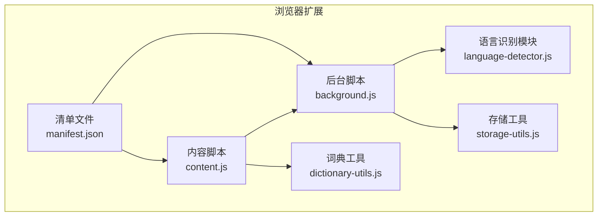
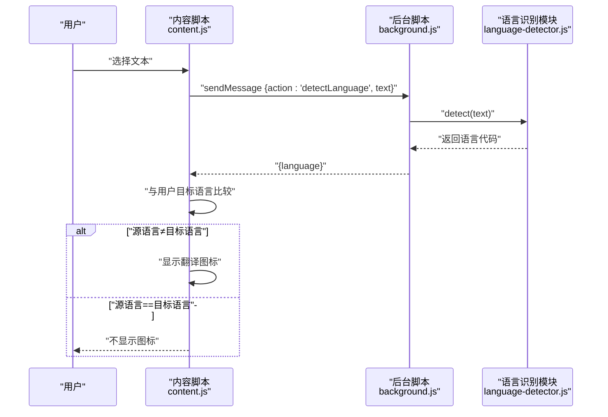
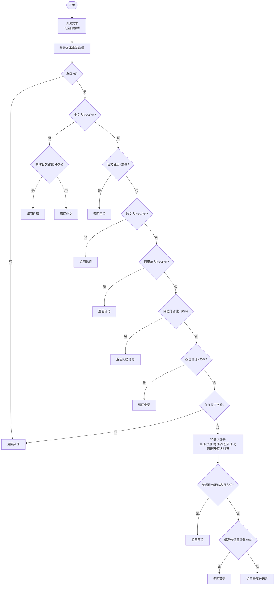
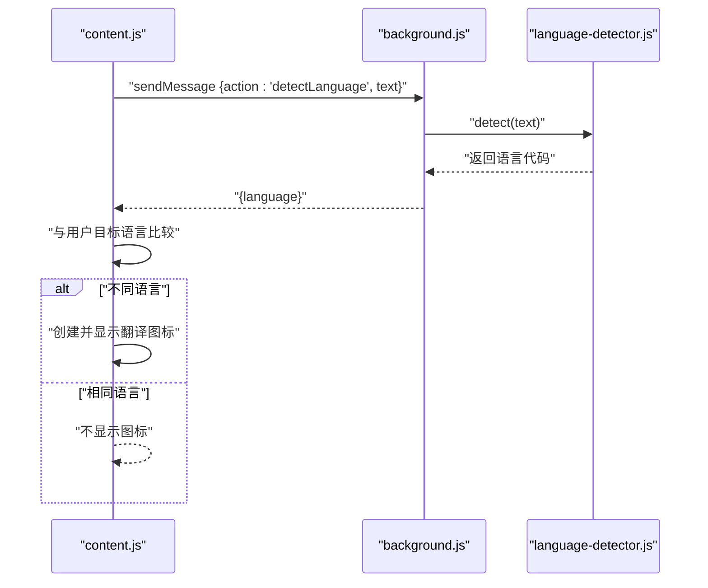
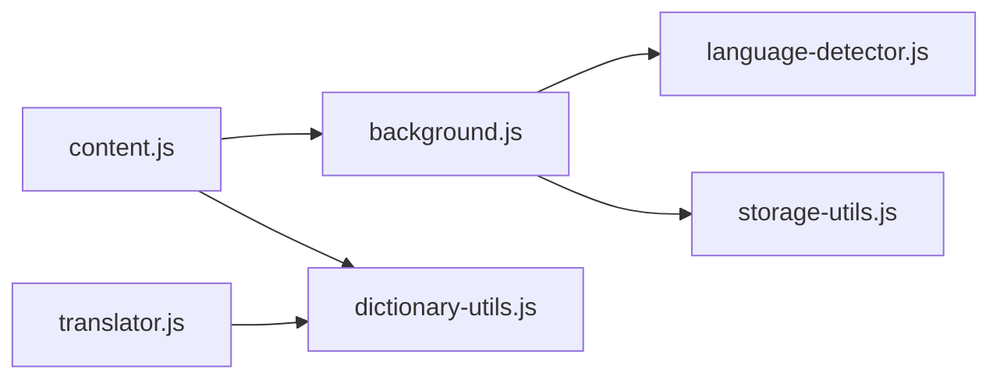

# 语言自动识别

<cite>
**本文引用的文件**
- [language-detector.js](file://language-detector.js)
- [content.js](file://content.js)
- [background.js](file://background.js)
- [manifest.json](file://manifest.json)
- [storage-utils.js](file://storage-utils.js)
- [dictionary-utils.js](file://dictionary-utils.js)
</cite>

## 目录
1. [简介](#简介)
2. [项目结构](#项目结构)
3. [核心组件](#核心组件)
4. [架构总览](#架构总览)
5. [详细组件分析](#详细组件分析)
6. [依赖关系分析](#依赖关系分析)
7. [性能考量](#性能考量)
8. [故障排除指南](#故障排除指南)
9. [结论](#结论)
10. [附录](#附录)

## 简介
本文件围绕 QuickTrans 的“语言自动识别”能力展开，基于 language-detector.js 的源码，系统阐述如何通过 Unicode 字符范围检测（如中文 CJK 统一汉字、日文平假名/片假名、韩文 Hangul 等）实现本地化语言判断；解释 13 种语言的正则表达式匹配优先级策略；描述 content.js 通过 chrome.runtime.sendMessage 向 background.js 请求语言检测的 IPC 通信流程；并说明如何依据检测结果智能决定是否显示翻译图标（避免源语言与目标语言相同时的冗余操作）。此外，提供混合语言文本（如中英混杂）的识别优化思路、特征词匹配算法对法语、德语等拉丁语系语言的补充识别机制，以及常见误判场景的故障排除建议。

## 项目结构
QuickTrans 采用 Manifest V3 结构，核心文件包括：
- language-detector.js：语言识别模块，负责基于 Unicode 范围与拉丁语系特征词进行语言判定
- content.js：内容脚本，负责划词监听、图标显示、IPC 通信与弹窗交互
- background.js：后台服务脚本，负责消息监听、语言检测、翻译与 TTS 服务
- manifest.json：声明权限、背景脚本、内容脚本与快捷键等
- storage-utils.js：存储与缓存工具，提供 API 配置、用户偏好、缓存与 token 统计
- dictionary-utils.js：词典与 TTS 共享工具，供 translator.js 与 content.js 复用

图表来源
- [manifest.json](file://manifest.json#L1-L52)
- [content.js](file://content.js#L1-L120)
- [background.js](file://background.js#L1-L40)
- [language-detector.js](file://language-detector.js#L1-L40)
- [storage-utils.js](file://storage-utils.js#L356-L422)
- [dictionary-utils.js](file://dictionary-utils.js#L1-L46)

章节来源
- [manifest.json](file://manifest.json#L1-L52)

## 核心组件
- 语言识别模块（language-detector.js）
  - 支持 13 种语言：中文、英语、日语、韩语、法语、德语、西班牙语、俄语、阿拉伯语、葡萄牙语、意大利语、泰语、越南语
  - 基于 Unicode 字符范围统计与阈值判断，辅以拉丁语系特征词得分排序
- 内容脚本（content.js）
  - 监听文本选择事件，调用 chrome.runtime.sendMessage 请求语言检测
  - 根据检测结果与用户目标语言对比，决定是否显示翻译图标
  - 通过 Port 建立流式连接进行词典/翻译查询
- 后台脚本（background.js）
  - 注册消息监听器，处理 detectLanguage、getAllLanguages、翻译与 TTS 请求
  - 调用 LanguageDetector.detect 进行语言识别
  - 使用 StorageUtils 管理缓存与 API 配置
- 存储工具（storage-utils.js）
  - 提供 session 缓存、用户偏好、API/TTS 配置管理
- 词典工具（dictionary-utils.js）
  - 提供词典结果 HTML 格式化与音标提取，供 content.js 与 translator.js 复用

章节来源
- [language-detector.js](file://language-detector.js#L10-L263)
- [content.js](file://content.js#L180-L240)
- [background.js](file://background.js#L1004-L1032)
- [storage-utils.js](file://storage-utils.js#L356-L422)
- [dictionary-utils.js](file://dictionary-utils.js#L1-L46)

## 架构总览
QuickTrans 的语言识别与 IPC 流程如下：
- content.js 在用户划词后，通过 chrome.runtime.sendMessage 触发 background.js 的 detectLanguage 处理
- background.js 调用 LanguageDetector.detect 对文本进行 Unicode 范围统计与拉丁语系特征词评分
- content.js 根据检测结果与用户目标语言比较，决定是否显示翻译图标
- content.js 通过 Port 建立流式连接，向 background.js 请求词典/翻译，实时接收增量结果

图表来源
- [content.js](file://content.js#L186-L205)
- [background.js](file://background.js#L1004-L1009)
- [language-detector.js](file://language-detector.js#L31-L141)

## 详细组件分析

### 语言识别模块（Unicode 范围与拉丁语系特征词）
- 支持语言列表与名称映射
- Unicode 字符分类统计
  - 中文：CJK 统一汉字、扩展 A、扩展 B 等范围
  - 日文：平假名与片假名范围
  - 韩文：Hangul 音节与兼容元音/辅音范围
  - 西里尔：俄语等使用西里尔字母
  - 阿拉伯：阿拉伯数字与扩展范围
  - 泰语：泰文字符范围
  - 拉丁字母：英法德西葡意等使用拉丁字母
- 语言判定优先级策略
  - 中文优先：当中文字符占比超过阈值时优先返回中文；若同时存在日文假名，可能返回日语
  - 日语：日文假名占比超过阈值时返回日语
  - 韩语：韩文字符占比超过阈值时返回韩语
  - 俄语/阿拉伯/泰语：分别以各自字符占比阈值判定
  - 拉丁字母语言：若存在拉丁字符，进入 detectLatinLanguage 分支
    - 英语：特征词计数达到一定阈值且与其他语言得分比值合理时返回英语
    - 法语/德语/西班牙语/葡萄牙语/意大利语：各自特征词集合计分，取最高分语言
    - 英语特殊处理：当英语得分足够高且不低于其他语言的一定比例时返回英语；否则若最高分语言得分过低则回退为英语
- 返回语言名称与支持性检查
  - 提供语言名称获取与支持性判断方法

图表来源
- [language-detector.js](file://language-detector.js#L31-L227)

章节来源
- [language-detector.js](file://language-detector.js#L10-L263)

### IPC 通信流程（content.js → background.js）
- content.js 在显示图标前，向 background.js 请求语言检测
- background.js 注册消息监听器，处理 detectLanguage 请求，调用 LanguageDetector.detect 并返回语言代码
- content.js 根据检测结果与用户目标语言比较，决定是否显示图标，避免源语言与目标语言相同导致的冗余操作

图表来源
- [content.js](file://content.js#L186-L205)
- [background.js](file://background.js#L1004-L1009)
- [language-detector.js](file://language-detector.js#L31-L141)

章节来源
- [content.js](file://content.js#L186-L205)
- [background.js](file://background.js#L1004-L1009)

### 智能图标显示策略
- content.js 在显示图标前，先通过 IPC 请求语言检测
- 若检测到的语言与用户最近目标语言相同，则不显示图标，避免重复翻译
- 若不同，则在选中文本右上角显示翻译图标，并可自动弹出翻译弹窗（取决于用户偏好）

章节来源
- [content.js](file://content.js#L186-L205)

### 混合语言文本识别优化（中英混杂）
- 现状：Unicode 范围统计与拉丁语系特征词评分共同作用，中文优先策略在中日混杂时可能偏向日语
- 优化建议
  - 引入“主导语言窗口”：对文本进行滑动窗口分析，统计各语言窗口内的字符占比，选择占比最大且持续时间较长的窗口作为主导语言
  - 引入“上下文增强”：在词典模式下，结合上下文句子的特征词得分，提升法语/德语等的识别稳定性
  - 引入“阈值自适应”：根据文本长度与字符分布动态调整阈值，避免短文本误判
  - 引入“规则兜底”：对明显属于某语言的固定片段（如日期、单位、标点）进行规则匹配，辅助 Unicode 统计

章节来源
- [language-detector.js](file://language-detector.js#L31-L227)
- [content.js](file://content.js#L132-L181)

### 特征词匹配算法（拉丁语系补充识别）
- 英语：高频虚词与短语（如 the, is, are, and, or, to, of, in, for, with, that, this, have, has, from, you, your, can, will）
- 法语：高频冠词与介词（如 le, la, les, des, une, est, sont, dans, avec, cette, mais, nous, vous, leur, été）
- 德语：高频词（der, die, das, den, dem, und, ist, sind, mit, für, nicht, auch, aber, werden, wurde）
- 西班牙语：高频词（el, los, las, del, una, está, son, con, por, para, que, pero, también, sido, hacer）
- 葡萄牙语：高频词（os, das, uma, está, são, com, para, mais, pelo, não, também, seu, seus, sua）
- 意大利语：高频词（il, lo, gli, della, delle, con, per, che, sono, anche, suo, sua, stati, essere）
- 评分策略：统计包含的特征词数量，取最高分语言；英语有额外阈值与比值约束，避免过度误判

章节来源
- [language-detector.js](file://language-detector.js#L149-L227)

## 依赖关系分析
- content.js 依赖 background.js 的 detectLanguage 与 getAllLanguages 接口
- background.js 依赖 language-detector.js 进行语言识别
- background.js 依赖 storage-utils.js 进行缓存与 API 配置管理
- content.js 与 translator.js 共用 dictionary-utils.js 的词典结果格式化与音标提取

图表来源
- [content.js](file://content.js#L1-L120)
- [background.js](file://background.js#L1-L40)
- [language-detector.js](file://language-detector.js#L1-L40)
- [storage-utils.js](file://storage-utils.js#L356-L422)
- [dictionary-utils.js](file://dictionary-utils.js#L1-L46)

章节来源
- [content.js](file://content.js#L1-L120)
- [background.js](file://background.js#L1-L40)
- [language-detector.js](file://language-detector.js#L1-L40)
- [storage-utils.js](file://storage-utils.js#L356-L422)
- [dictionary-utils.js](file://dictionary-utils.js#L1-L46)

## 性能考量
- 语言识别复杂度
  - Unicode 统计遍历：O(n)，n 为字符数，线性时间，适合大多数网页文本
  - 特征词评分：对每个语言的特征词集合进行包含判断，整体近似 O(n*L)，L 为特征词数量
- IPC 与 UI
  - content.js 使用防抖（200ms）处理文本选择事件，降低频繁检测
  - 语言检测在 IPC 前后均进行，避免不必要的图标创建
- 缓存与存储
  - 使用 session 缓存翻译结果，避免重复请求
  - 使用 chrome.storage.session 自动管理容量与生命周期，减少持久化负担

章节来源
- [content.js](file://content.js#L135-L181)
- [storage-utils.js](file://storage-utils.js#L356-L422)

## 故障排除指南
- 误判为日语（中日混杂）
  - 现象：中文文本被识别为日语
  - 原因：中文占比超过阈值，且同时存在日文假名
  - 处理：可考虑引入“主导语言窗口”与“上下文增强”，或提高中文阈值
- 误判为英语（拉丁语系混淆）
  - 现象：法语/德语/西班牙语等被误判为英语
  - 原因：英语特征词过于通用，且英语得分较高
  - 处理：提高非英语得分阈值，或增加法语/德语等语言的特征词权重
- 源语言与目标语言相同导致图标不显示
  - 现象：选中文本后不出现翻译图标
  - 原因：content.js 已做“同语言不显示”的保护
  - 处理：切换用户目标语言后再尝试
- IPC 通信异常
  - 现象：content.js 无法获取语言检测结果
  - 原因：background.js 未注册消息监听器或未导入 language-detector.js
  - 处理：确认 manifest.json 中 background.service_worker 与 importScripts 路径正确
- 缓存问题
  - 现象：翻译结果未更新
  - 原因：session 缓存命中
  - 处理：刷新页面或等待 session 缓存过期

章节来源
- [content.js](file://content.js#L186-L205)
- [background.js](file://background.js#L1004-L1009)
- [language-detector.js](file://language-detector.js#L31-L227)
- [manifest.json](file://manifest.json#L16-L18)

## 结论
QuickTrans 的语言自动识别以 Unicode 字符范围为基础，结合拉丁语系特征词评分，形成一套轻量、可扩展的本地化语言判断方案。通过 content.js 与 background.js 的 IPC 协作，实现了“智能图标显示”与“流式翻译体验”。对于混合语言文本，可通过窗口化分析、上下文增强与阈值自适应等手段进一步提升准确率。建议在后续版本中引入更精细的规则与统计模型，以应对更复杂的语言混合场景。

## 附录
- 13 种支持语言：中文、英语、日语、韩语、法语、德语、西班牙语、俄语、阿拉伯语、葡萄牙语、意大利语、泰语、越南语
- Unicode 范围覆盖：CJK 统一汉字、日文假名、韩文 Hangul、西里尔、阿拉伯、泰语、拉丁字母
- 特征词集合：英语、法语、德语、西班牙语、葡萄牙语、意大利语