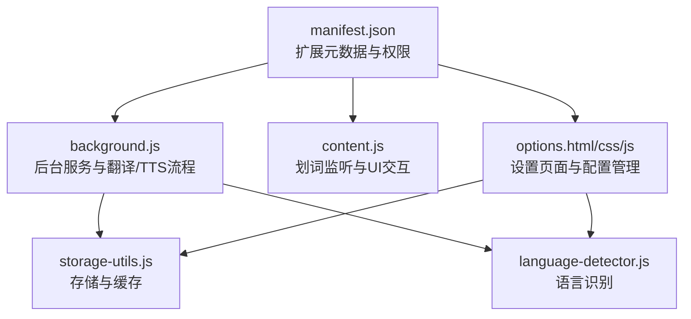
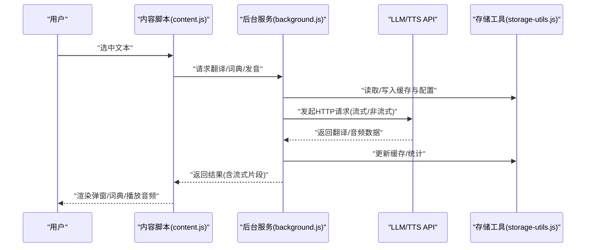
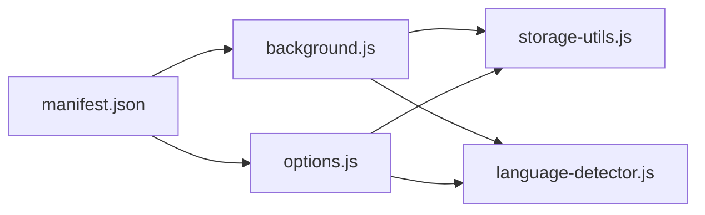

# 贡献与许可

<cite>
**本文引用的文件**
- [README.md](file://README.md)
- [PROJECT_SUMMARY.md](file://PROJECT_SUMMARY.md)
- [TRANSLATOR_TESTING_GUIDE.md](file://TRANSLATOR_TESTING_GUIDE.md)
- [TTS_TESTING_GUIDE.md](file://TTS_TESTING_GUIDE.md)
- [manifest.json](file://manifest.json)
- [background.js](file://background.js)
- [options.js](file://options.js)
</cite>

## 目录
1. [简介](#简介)
2. [项目结构](#项目结构)
3. [核心组件](#核心组件)
4. [架构总览](#架构总览)
5. [详细组件分析](#详细组件分析)
6. [依赖关系分析](#依赖关系分析)
7. [性能考量](#性能考量)
8. [故障排查指南](#故障排查指南)
9. [结论](#结论)
10. [附录](#附录)

## 简介
本节概述项目的贡献与许可政策，明确MIT许可证的适用范围与使用边界，并提供面向贡献者的协作流程与最佳实践，帮助社区成员高效参与项目迭代与维护。

## 项目结构
QuickTrans是一个基于Chrome扩展的划词翻译工具，核心由Manifest V3声明、后台服务脚本、内容脚本、设置页面与工具模块组成。项目文档齐全，覆盖安装、使用、开发、测试与实现总结等维度，便于贡献者快速上手。

图表来源
- [manifest.json](file://manifest.json#L1-L52)
- [background.js](file://background.js#L1-L120)
- [options.js](file://options.js#L100-L200)

章节来源
- [README.md](file://README.md#L120-L188)
- [PROJECT_SUMMARY.md](file://PROJECT_SUMMARY.md#L104-L126)

## 核心组件
- 扩展元数据与权限：通过manifest.json声明权限与主机权限，确保翻译与TTS功能所需的最小权限集。
- 后台服务：负责翻译与TTS请求的发起、流式响应处理、错误分类与缓存管理。
- 设置页面：提供API配置、TTS配置、偏好设置、缓存与Token统计管理。
- 工具模块：封装存储与缓存、语言识别等通用能力，支撑前后端协作。

章节来源
- [manifest.json](file://manifest.json#L1-L52)
- [background.js](file://background.js#L100-L200)
- [options.js](file://options.js#L100-L200)

## 架构总览
QuickTrans采用Manifest V3架构，内容脚本监听用户选择事件，后台服务统一处理翻译/TTS请求，设置页面集中管理配置与偏好，存储工具模块提供本地持久化与缓存。

图表来源
- [background.js](file://background.js#L200-L350)
- [options.js](file://options.js#L340-L450)

## 详细组件分析

### 贡献指南
- Fork与分支：建议从主分支派生功能分支，命名规范参考“feature/AmazingFeature”，便于追踪与评审。
- 提交与PR：提交前确保通过本地测试与代码风格检查；PR描述中包含变更动机、影响范围与测试要点。
- Issue提交：提交Issue时请附带环境信息（浏览器版本、操作系统）、复现步骤、期望行为与实际行为，必要时附带日志或截图。
- 社区协作：欢迎任何形式的贡献，包括但不限于功能增强、文档改进、Bug修复与测试用例补充。

章节来源
- [README.md](file://README.md#L331-L343)

### 许可证（MIT）
本项目采用MIT许可证，允许自由使用、修改与再分发，但需在软件副本中保留版权与许可声明。具体条款参见项目文档中的许可证说明。

章节来源
- [README.md](file://README.md#L345-L349)

### 贡献流程（Pull Request）
- 分支策略：基于功能分支进行迭代，避免直接在主分支提交。
- 提交流程：提交前运行测试与静态检查；PR标题简洁明确，正文包含变更摘要、相关Issue编号与测试结论。
- 评审与合并：维护者将对代码质量、兼容性与安全性进行评审，通过后方可合并。

章节来源
- [README.md](file://README.md#L331-L343)

### Issue 提交规范
- 环境信息：浏览器版本、操作系统、扩展版本。
- 复现步骤：清晰的操作顺序与触发条件。
- 期望与实际：明确指出预期结果与实际结果。
- 日志与截图：必要时附带控制台日志、网络请求详情或问题截图。

章节来源
- [TRANSLATOR_TESTING_GUIDE.md](file://TRANSLATOR_TESTING_GUIDE.md#L328-L341)
- [TTS_TESTING_GUIDE.md](file://TTS_TESTING_GUIDE.md#L110-L144)

### 贡献者致谢
项目感谢所有贡献者与用户的持续支持，欢迎在贡献后于致谢部分登记姓名或昵称，共同维护开放协作的良好生态。

章节来源
- [README.md](file://README.md#L351-L356)

## 依赖关系分析
- 权限与主机权限：manifest.json声明storage、activeTab、contextMenus、clipboardRead等权限，host_permissions允许向任意HTTPS站点发起请求。
- 后台服务依赖：background.js依赖storage-utils.js与language-detector.js，负责翻译/TTS请求、流式处理与错误分类。
- 设置页面依赖：options.js依赖storage-utils.js与language-detector.js，提供配置增删改查、测试连接、偏好设置与统计管理。

图表来源
- [manifest.json](file://manifest.json#L1-L52)
- [background.js](file://background.js#L1-L120)
- [options.js](file://options.js#L100-L200)

章节来源
- [manifest.json](file://manifest.json#L1-L52)
- [PROJECT_SUMMARY.md](file://PROJECT_SUMMARY.md#L140-L166)

## 性能考量
- 流式输出：后台服务支持SSE流式响应，提升首字到达时间与交互体验。
- 缓存机制：相同文本+目标语言的翻译结果缓存，显著降低重复请求与API成本。
- 超时与错误处理：统一30秒超时保护与错误码分类，保障稳定性与可观测性。
- 最小权限：仅申请必要权限，避免对用户隐私与系统性能造成额外负担。

章节来源
- [background.js](file://background.js#L132-L201)
- [background.js](file://background.js#L203-L323)
- [PROJECT_SUMMARY.md](file://PROJECT_SUMMARY.md#L52-L102)

## 故障排查指南
- 常见问题：未配置API、API密钥无效、翻译缓慢、部分网站不兼容等，均在文档中有明确排查步骤与建议。
- 调试方法：通过chrome://extensions查看Service Worker日志、开发者工具控制台与存储数据，定位问题根因。
- 测试用例：翻译页面与TTS功能均有系统化的测试清单与性能评估建议，便于回归验证。

章节来源
- [README.md](file://README.md#L285-L314)
- [TRANSLATOR_TESTING_GUIDE.md](file://TRANSLATOR_TESTING_GUIDE.md#L284-L341)
- [TTS_TESTING_GUIDE.md](file://TTS_TESTING_GUIDE.md#L1-L144)

## 结论
通过清晰的贡献流程、完善的测试体系与MIT许可证保障，QuickTrans致力于打造开放、协作、可持续发展的开源项目。我们鼓励社区成员积极贡献，共同提升用户体验与代码质量。

## 附录
- 贡献与许可遵循本文件所述规范，任何贡献均视为同意MIT许可证条款与社区协作约定。
- 对于重大变更，请在提交PR前与维护者沟通，确保方向一致与资源协调。