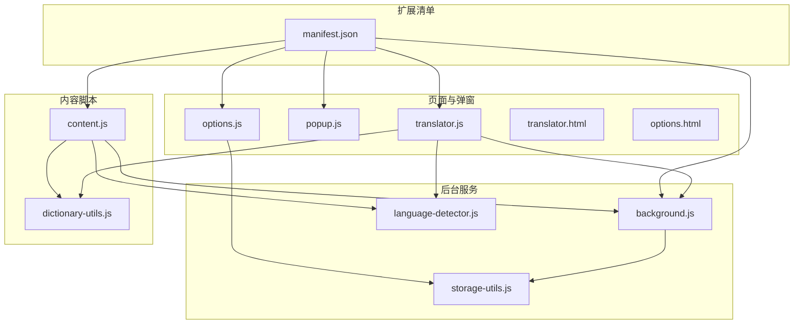
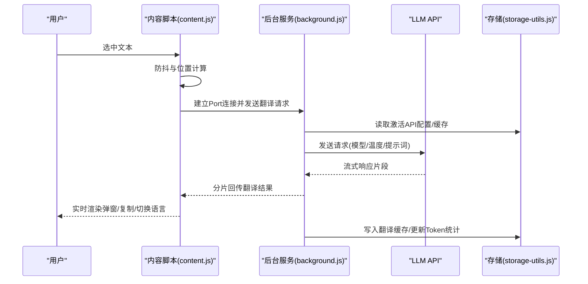
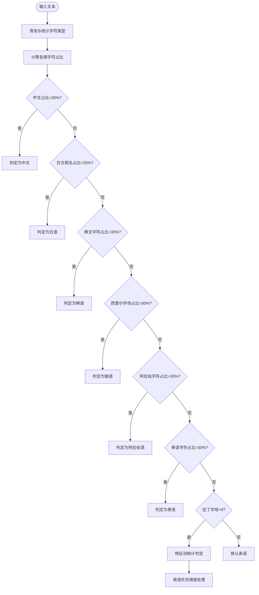
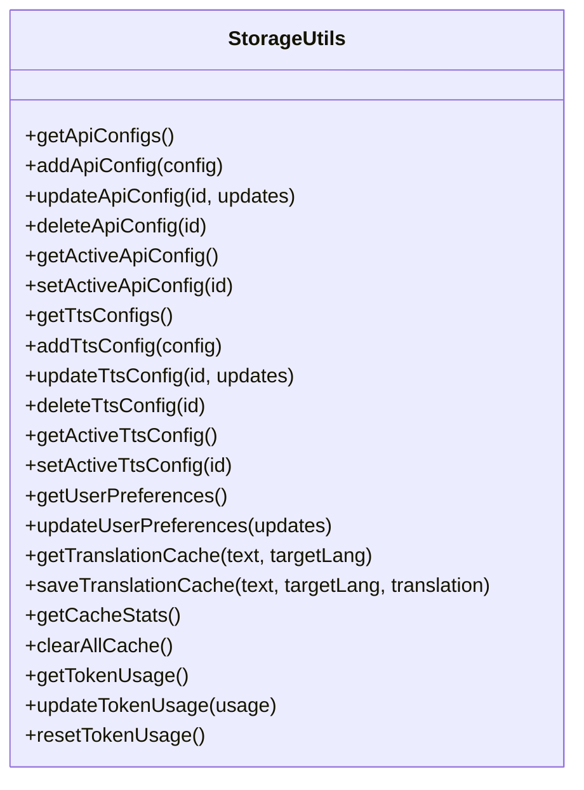
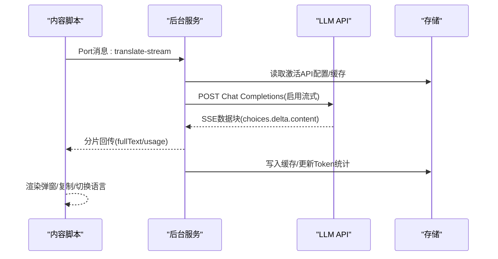
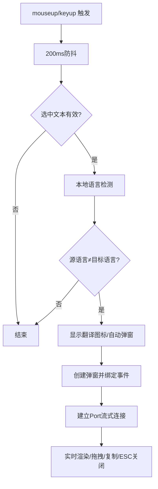
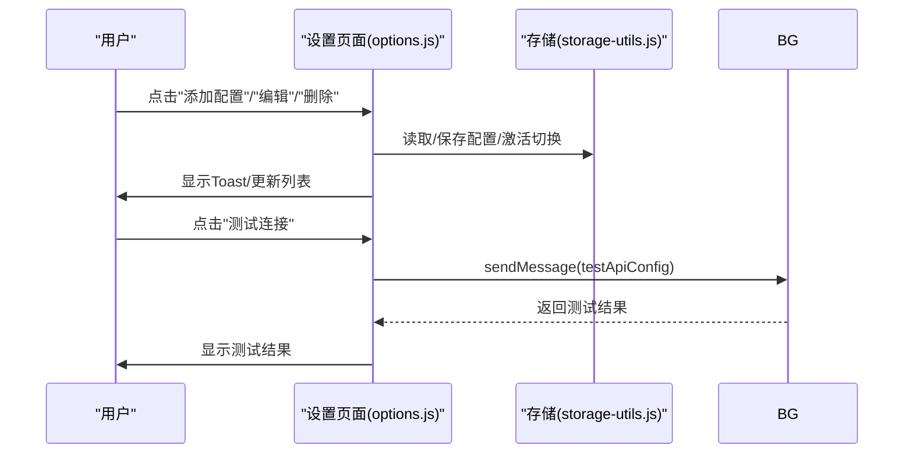
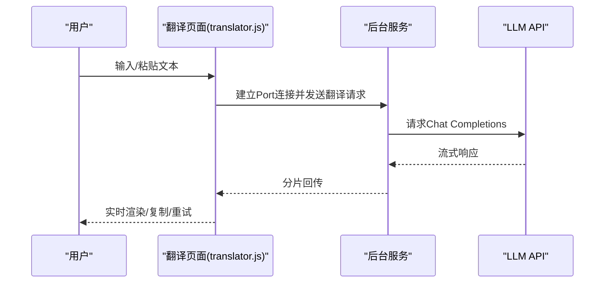
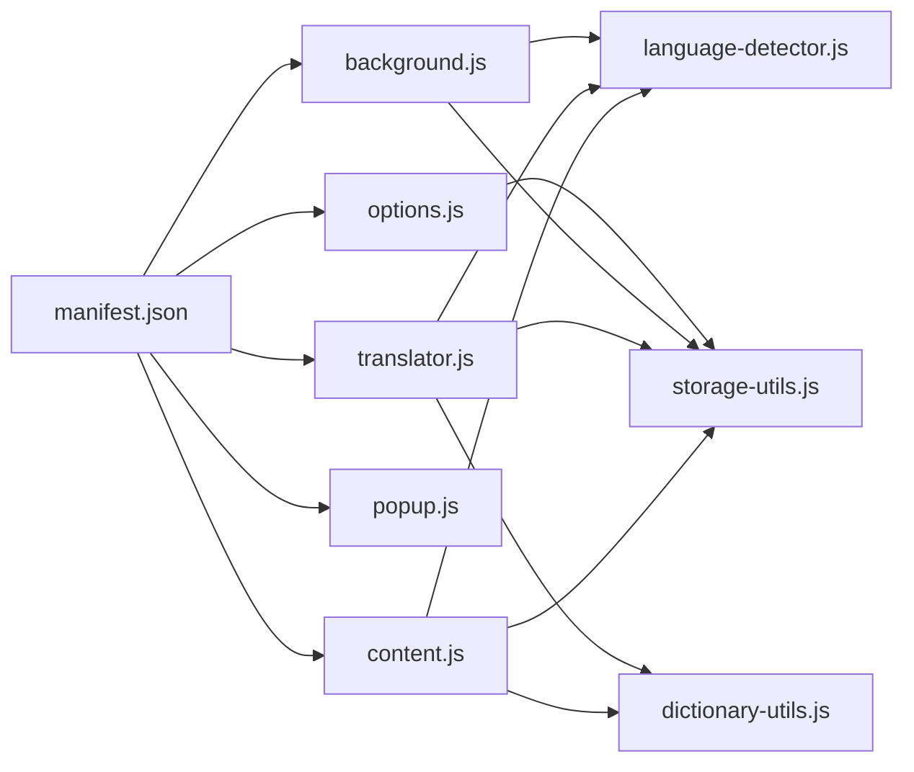

# 项目概述

<cite>
**本文引用的文件**
- [README.md](file://README.md)
- [QUICKSTART.md](file://QUICKSTART.md)
- [manifest.json](file://manifest.json)
- [background.js](file://background.js)
- [content.js](file://content.js)
- [options.js](file://options.js)
- [popup.js](file://popup.js)
- [translator.js](file://translator.js)
- [storage-utils.js](file://storage-utils.js)
- [language-detector.js](file://language-detector.js)
- [dictionary-utils.js](file://dictionary-utils.js)
- [translator.html](file://translator.html)
- [options.html](file://options.html)
</cite>

## 目录
1. [引言](#引言)
2. [项目结构](#项目结构)
3. [核心组件](#核心组件)
4. [架构总览](#架构总览)
5. [详细组件分析](#详细组件分析)
6. [依赖分析](#依赖分析)
7. [性能考量](#性能考量)
8. [故障排查指南](#故障排查指南)
9. [结论](#结论)
10. [附录](#附录)

## 引言
QuickTrans 是一款基于大语言模型的 Chrome 扩展，专注于“划词翻译”。其核心目标是在任意网页中，通过简单地选中文本，即可获得即时、高质量的翻译结果。项目面向两类主要用户群体：
- 开发者：需要在多语言环境下高效阅读与协作，追求稳定、可扩展的翻译能力。
- 多语言阅读者：日常浏览外语文本（如学术论文、技术博客、新闻资讯），希望获得快速、准确、易用的翻译体验。

项目的核心价值主张包括：
- 隐私保护：所有数据仅存储在本地浏览器，不上传云端。
- 高性能：采用流式输出、本地缓存与防抖机制，显著提升响应速度与体验。
- 易用性：自动语言识别、一键复制、多种显示模式、右键菜单触发等人性化设计。

## 项目结构
QuickTrans 采用典型的 Chrome 扩展多页面架构，围绕“内容脚本 + 后台服务 + 设置页面 + UI 弹窗”的职责划分组织代码。核心文件与职责如下：
- manifest.json：声明扩展清单、权限、后台脚本、内容脚本、图标与动作入口。
- background.js：后台服务，负责翻译请求、API 调用、缓存与流式处理。
- content.js：内容脚本，监听划词事件、显示翻译图标与弹窗、与后台通信。
- options.js：设置页面逻辑，管理 API/TTS 配置、用户偏好、缓存与 Token 统计。
- popup.js：扩展图标弹出菜单，提供打开翻译页面与设置页面的能力。
- translator.js：独立翻译页面逻辑，支持剪贴板读取、手动翻译、词典查询与 TTS。
- storage-utils.js：统一的数据存储工具，封装 Chrome Storage API 的读写与缓存管理。
- language-detector.js：本地语言识别模块，支持中、英、日、韩、法、德、西、俄、阿拉伯、葡、意、泰、越等语言。
- dictionary-utils.js：词典与 TTS 相关的通用工具，供 content.js 与 translator.js 复用。
- translator.html / options.html：翻译页面与设置页面的静态结构与样式入口。

图表来源
- [manifest.json](file://manifest.json#L1-L52)
- [background.js](file://background.js#L1-L120)
- [content.js](file://content.js#L1-L120)
- [options.js](file://options.js#L1-L120)
- [popup.js](file://popup.js#L1-L36)
- [translator.js](file://translator.js#L1-L120)
- [storage-utils.js](file://storage-utils.js#L1-L120)
- [language-detector.js](file://language-detector.js#L1-L60)
- [dictionary-utils.js](file://dictionary-utils.js#L1-L60)
- [translator.html](file://translator.html#L1-L40)
- [options.html](file://options.html#L1-L40)

章节来源
- [manifest.json](file://manifest.json#L1-L52)
- [README.md](file://README.md#L120-L168)

## 核心组件
- 语言识别模块（language-detector.js）：基于 Unicode 范围与拉丁字母特征词，实现本地快速语言检测，覆盖 13 种常用语言。
- 数据存储模块（storage-utils.js）：封装 Chrome Storage API，提供 API/TTS 配置、用户偏好、翻译缓存与 Token 统计的读写与管理。
- 后台服务模块（background.js）：负责翻译请求处理、调用 LLM API、流式响应处理、缓存命中与错误处理；同时提供词典查询与 TTS 服务。
- 内容脚本模块（content.js）：监听文本选择事件，显示翻译图标与弹窗，与后台建立长连接进行流式翻译，支持拖拽、复制、TTS 等交互。
- 设置页面（options.js + options.html）：管理多 API 配置、TTS 配置、用户偏好、缓存与 Token 统计，提供测试连接与可视化操作。
- 翻译页面（translator.js + translator.html）：支持手动输入翻译、剪贴板读取、词典查询、TTS 播放与一键复制。
- 弹出菜单（popup.js）：提供打开翻译页面与设置页面的入口。

章节来源
- [README.md](file://README.md#L140-L168)
- [storage-utils.js](file://storage-utils.js#L1-L120)
- [language-detector.js](file://language-detector.js#L1-L60)
- [background.js](file://background.js#L1-L120)
- [content.js](file://content.js#L1-L120)
- [options.js](file://options.js#L1-L120)
- [translator.js](file://translator.js#L1-L120)
- [popup.js](file://popup.js#L1-L36)

## 架构总览
QuickTrans 的运行时交互链路如下：
- 用户在网页中选中文本，content.js 捕获事件，显示翻译图标或自动弹窗。
- content.js 通过 Port 与 background.js 建立长连接，发送翻译请求。
- background.js 读取当前激活的 API 配置，构造提示词，调用 LLM API，接收流式响应并实时回传给 content.js。
- content.js 将翻译结果逐步渲染到弹窗，支持复制、切换语言、TTS 等操作。
- storage-utils.js 负责缓存与用户偏好持久化，language-detector.js 提供本地语言识别。

图表来源
- [content.js](file://content.js#L132-L234)
- [background.js](file://background.js#L203-L323)
- [storage-utils.js](file://storage-utils.js#L356-L422)

章节来源
- [content.js](file://content.js#L132-L234)
- [background.js](file://background.js#L203-L323)
- [storage-utils.js](file://storage-utils.js#L356-L422)

## 详细组件分析

### 语言识别模块（language-detector.js）
- 设计理念：在本地进行快速语言识别，避免网络依赖，降低延迟。
- 实现要点：
  - 基于 Unicode 范围识别中、日、韩、俄、阿拉伯、泰等文字。
  - 对拉丁字母语言（英、法、德、西、葡、意）通过特征词统计进行区分。
  - 提供语言名称映射与支持列表查询接口。
- 性能与复杂度：O(n) 字符扫描与常量级特征词匹配，适合高频调用。

图表来源
- [language-detector.js](file://language-detector.js#L26-L141)

章节来源
- [language-detector.js](file://language-detector.js#L1-L263)

### 数据存储模块（storage-utils.js）
- 设计理念：统一抽象 Chrome Storage API，提供配置、偏好、缓存与统计的读写能力。
- 关键能力：
  - API/TTS 配置的增删改查与激活切换。
  - 用户偏好（默认目标语言、显示模式、最大文本长度）的同步存储。
  - 翻译缓存（session）与缓存统计（数量、大小、类型）。
  - Token 使用统计（输入/输出/总计、请求次数、最后更新时间）。
- 性能与可靠性：使用 session 存储自动清理，避免长期占用；异常捕获保证稳定性。

图表来源
- [storage-utils.js](file://storage-utils.js#L1-L517)

章节来源
- [storage-utils.js](file://storage-utils.js#L1-L517)

### 后台服务模块（background.js）
- 设计理念：集中处理翻译与词典查询，统一错误处理与流式输出，提供缓存与 Token 统计。
- 关键流程：
  - 翻译服务：构建系统提示词与用户提示词，调用 LLM API，支持流式与非流式两种路径。
  - 流式处理：解析 SSE 数据块，增量回传，提取 usage 信息。
  - 词典查询：支持带上下文的单词释义，返回格式化结果与音标提取。
  - TTS 服务：支持通义千问与 OpenAI 兼容 TTS，统一流式音频数据处理与 Base64 合并。
  - 错误处理：针对 401、429、5xx、超时等场景返回明确错误码与提示。
- 性能与可靠性：30 秒请求超时、缓存命中、usage 统计、异常捕获。

图表来源
- [background.js](file://background.js#L132-L201)
- [background.js](file://background.js#L203-L323)
- [storage-utils.js](file://storage-utils.js#L356-L422)

章节来源
- [background.js](file://background.js#L1-L351)
- [storage-utils.js](file://storage-utils.js#L356-L422)

### 内容脚本模块（content.js）
- 设计理念：最小化对网页性能的影响，提供流畅的 UI 交互与流式翻译体验。
- 关键能力：
  - 防抖监听文本选择事件，显示翻译图标或自动弹窗。
  - 建立 Port 连接，实时渲染翻译结果，支持拖拽、复制、ESC 关闭。
  - 词典模式：识别单个英文单词，提取上下文，查询词典并展示音标与释义。
  - 用户偏好：默认目标语言、显示模式（自动/图标/右键菜单）、最大文本长度。
- 性能与可靠性：200ms 防抖、位置自适应、滚动与视口边界处理、错误提示与重试。

图表来源
- [content.js](file://content.js#L132-L234)
- [content.js](file://content.js#L236-L391)

章节来源
- [content.js](file://content.js#L1-L391)

### 设置页面（options.js + options.html）
- 设计理念：直观管理多 API/TTS 配置、用户偏好、缓存与 Token 统计。
- 关键能力：
  - API/TTS 配置的增删改查、激活切换、测试连接。
  - 用户偏好：默认目标语言、显示模式、最大文本长度。
  - 缓存管理：刷新统计、清空缓存（session）。
  - Token 统计：刷新与重置，显示输入/输出/总计与请求次数。
- 易用性：模态框表单、提示信息、Toast 提示、键盘 ESC 关闭。

图表来源
- [options.js](file://options.js#L1-L200)
- [storage-utils.js](file://storage-utils.js#L1-L120)

章节来源
- [options.js](file://options.js#L1-L200)
- [options.html](file://options.html#L1-L200)

### 翻译页面（translator.js + translator.html）
- 设计理念：提供独立的翻译工作台，支持手动输入、剪贴板读取、词典查询与 TTS。
- 关键能力：
  - 语言选择：源语言自动检测或手动选择，目标语言下拉。
  - 手动翻译：输入框、粘贴、清空、翻译、复制、重试、快捷键。
  - 词典查询：在输入框内选中英文单词，自动提取上下文并查询词典。
  - TTS：播放单词与句子发音（需配置 TTS API）。
- 性能与可靠性：与后台一致的流式渲染与错误处理，Token 统计展示。

图表来源
- [translator.js](file://translator.js#L178-L307)
- [translator.html](file://translator.html#L1-L100)

章节来源
- [translator.js](file://translator.js#L1-L307)
- [translator.html](file://translator.html#L1-L100)

### 弹出菜单（popup.js）
- 设计理念：简洁入口，快速打开翻译页面与设置页面。
- 关键能力：打开翻译页面、打开设置页面、窗口关闭。

章节来源
- [popup.js](file://popup.js#L1-L36)

## 依赖分析
- manifest.json 权限与入口：
  - 权限：storage、activeTab、contextMenus、clipboardRead。
  - 后台：service_worker。
  - 内容脚本：匹配所有页面，注入 dictionary-utils.js 与 content.js，CSS 为 content.css。
  - 选项页：options.html。
  - 图标与动作入口：默认图标与默认标题。
- 模块间依赖：
  - content.js 依赖 language-detector.js、dictionary-utils.js、storage-utils.js。
  - background.js 依赖 storage-utils.js、language-detector.js。
  - options.js 依赖 storage-utils.js、language-detector.js。
  - translator.js 依赖 language-detector.js、dictionary-utils.js、storage-utils.js。
  - popup.js 与页面无关，仅依赖扩展 API。

图表来源
- [manifest.json](file://manifest.json#L1-L52)
- [content.js](file://content.js#L1-L60)
- [background.js](file://background.js#L1-L20)
- [options.js](file://options.js#L1-L40)
- [translator.js](file://translator.js#L1-L40)
- [language-detector.js](file://language-detector.js#L1-L40)
- [dictionary-utils.js](file://dictionary-utils.js#L1-L40)
- [storage-utils.js](file://storage-utils.js#L1-L40)

章节来源
- [manifest.json](file://manifest.json#L1-L52)

## 性能考量
- 防抖与最小化注入：内容脚本 200ms 防抖，仅在 document_end 注入，减少对网页性能的影响。
- 流式输出：后台与内容脚本均采用流式处理，首字响应更快，体验如打字机般流畅。
- 缓存机制：使用 Chrome session 存储进行翻译缓存，相同内容自动命中，减少 API 调用。
- 请求超时：30 秒超时保护，避免长时间阻塞。
- 本地语言识别：避免网络请求，毫秒级响应。
- UI 适配：弹窗位置自适应视口边界，动态计算最大高度，保证交互可用性。

章节来源
- [README.md](file://README.md#L240-L246)
- [content.js](file://content.js#L132-L181)
- [background.js](file://background.js#L203-L323)
- [storage-utils.js](file://storage-utils.js#L356-L422)

## 故障排查指南
- 未配置 API：检查设置页面是否已添加并激活至少一个翻译 API 配置。
- API 密钥无效：确认密钥正确、账户余额充足、网络连接正常。
- 翻译速度慢：切换到响应更快的 API 服务，或检查网络质量。
- 某些网站无法使用：部分网站可能有安全策略或内容加载方式影响插件功能，可提交 Issue 反馈。
- 删除翻译缓存：可通过扩展管理页面删除扩展数据，或在开发者工具中清除 chrome.storage.local。

章节来源
- [README.md](file://README.md#L285-L314)

## 结论
QuickTrans 通过清晰的模块划分与稳健的技术实现，为用户提供了一个高性能、隐私友好、易用的划词翻译体验。其核心优势在于：
- 本地化语言识别与缓存，保障隐私与性能。
- 流式输出与防抖机制，带来即时反馈。
- 多 API/TTS 配置与用户偏好管理，满足多样化需求。
- 丰富的交互与可扩展性，适合开发者与多语言阅读者长期使用。

## 附录
- 快速开始：参考 QUICKSTART.md，三步完成安装与配置。
- 功能特性与技术架构：参考 README.md 的功能列表与技术架构章节。
- 实际使用场景示例：
  - 在英文网页上选中一段文本，等待 0.5 秒自动弹出翻译窗口，或点击紫色翻译图标触发。
  - 在翻译弹窗中切换目标语言，一键复制译文，或通过右键菜单触发翻译。
  - 在翻译页面中粘贴剪贴板内容，手动翻译并复制结果。
  - 在输入框内选中英文单词，查看词典释义与音标，并可播放 TTS。

章节来源
- [QUICKSTART.md](file://QUICKSTART.md#L1-L136)
- [README.md](file://README.md#L15-L118)
- [README.md](file://README.md#L190-L231)